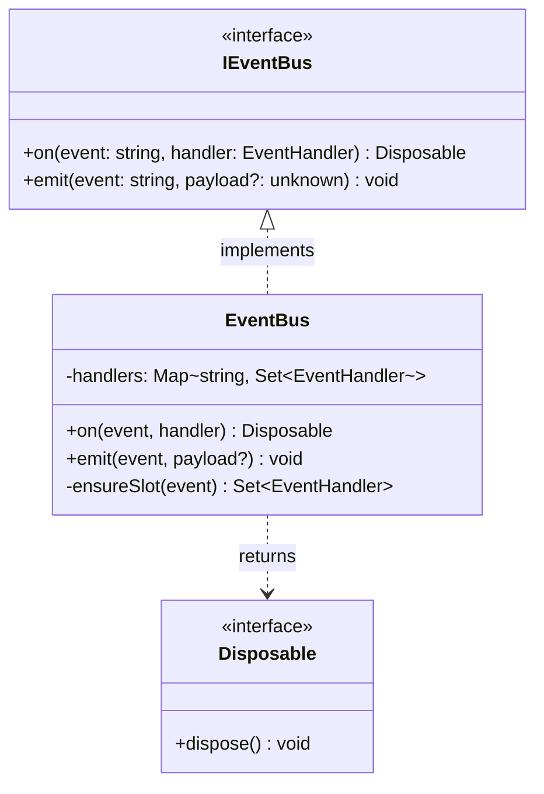
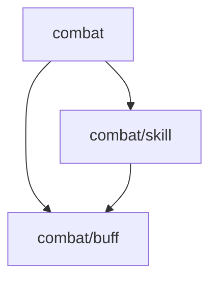

[English](MODULE-MD-EXAMPLE.md) | [中文](MODULE-MD-EXAMPLE.zh-CN.md)

# 附录：`module.md` 示例

`module.md` 是 `.dna/` 中唯一的必需文件。它将元数据（YAML frontmatter）与架构（markdown 正文）合并在一个文件中 — 与 `.claude/agents/<name>.md` 和 `.cbim/cbi/skills/<name>/skill.py` 形成统一的 `frontmatter + 正文` 模式。

## 叶子模块示例

````markdown
---
name: event-bus
owner: architect
description: 解耦的、类型安全的进程内事件分发
keywords: [event, pub-sub, decoupling]
dependencies: []
---

## 定位

解耦的、类型安全的进程内事件分发，用于跨模块通信。

## 类图



## 关键决策

- **接口优先**：消费方依赖 `IEventBus`，不直接依赖 `EventBus`，无需 mock 框架即可替换测试替身。
- **Disposable 返回值**：`on()` 返回 `Disposable` 而非要求调用 `off()`，防止忘记取消订阅导致的内存泄漏。
- **同步 emit**：Handler 设计为同步执行；异步副作用由 handler 自行管理，保持 bus 简单可预测。
````

## 父模块示例

父模块的正文只描述定位、子模块关系和跨子模块的涌现洞察 — 不写任何子模块的内部细节。

````markdown
---
name: combat
owner: architect
description: 战斗系统根模块
keywords: [combat, battle]
dependencies:
  - src/types
---

## 定位

所有战斗相关子系统的顶层容器。

## 子模块关系



- **skill** — 主动技能执行（施放、冷却、目标选取）
- **buff** — 被动状态效果（施加、持续、过期）

## 关键决策

- **skill 依赖 buff，反向禁止**：技能可以施加 buff，但 buff 不得触发技能 — 防止递归战斗循环。
````
