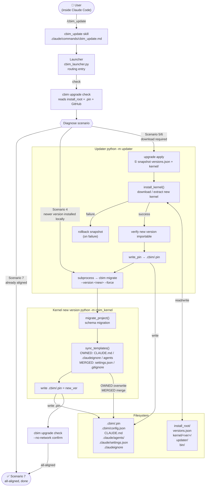

[English](UPDATE-FLOW.md) | [中文](UPDATE-FLOW.zh-CN.md)

# CBIM Update Flow

## Architecture Overview

CBIM updates span two independent dimensions, each owned by a different component:

| Dimension | Content | Owner |
|-----------|---------|-------|
| User-level kernel | `<install_root>/kernel/<ver>/` global program | **Updater** |
| Project-level config | `.cbim/`, `CLAUDE.md`, `.claude/`, `.claudeignore` | **New Kernel** (triggered by Updater) |

Users interact entirely within Claude Code — the update entry point is the `/cbim_update` skill.

---

## Complete Update Flow



---

## Two Key Paths

### Scenario 4 — Newer version already installed locally

```
cbim upgrade check → Scenario 4
    └─→ cbim migrate --version <new>
            ├─→ schema migration
            ├─→ sync project templates (OWNED/MERGED)
            └─→ write .cbim/.pin
```

Applies when: the user has manually installed a newer kernel but the project pin has not advanced.

### Scenario 5/6 — Download required from remote

```
cbim upgrade check → Scenario 5/6
    └─→ cbim upgrade apply --to <new>
            ├─→ snapshot (versions.json + kernel/<old>/)
            ├─→ install_kernel()  download and extract
            ├─→ verify
            ├─→ write_pin → .cbim/.pin
            └─→ cbim migrate --version <new> --force
                    ├─→ schema migration
                    ├─→ sync project templates
                    └─→ write .cbim/.pin
```

---

## Project Config File Strategies

`sync_templates()` applies one of four strategies to each project file:

| Strategy | Files | Rule |
|----------|-------|------|
| **OWNED** | `CLAUDE.md`, 4 built-in agent.md files | Full overwrite; kernel-owned, zero extension points |
| **MERGED** | `.claude/settings.json` (4 whitelisted keys), `.gitignore` | Key-level merge / append-only |
| **SEEDED** | `.cbim/config.json` | Written once at init, never touched again |
| **UNTOUCHED** | User agents, memory, commands, dna | Never written |

User-owned content (custom agents, `.claude/commands/`, `.dna/`) is protected by physical path separation — no special handling needed.

---

## Component Responsibility Boundaries

```
Launcher (PATH entry, zero deps, routing only)
     /                          \
  Updater                     Kernel
  cross-version ops            current-version runtime
  - download/install kernel     - CBIM business logic
  - write .cbim/.pin            - project template sync
  - schema migration            - agent dispatch
  - cbim pin / self-update      - memory writes
     \                          /
      on-disk contract
      versions.json · .cbim/.pin · kernel/<ver>/ · venv/
```

**Core principle:** Updater and Kernel are siblings, not parent-child. They communicate only through on-disk file contracts. All cross-version logic belongs to Updater; all within-version logic belongs to Kernel.

---

## Failure Handling

| Stage | Failure | Handling |
|-------|---------|----------|
| `install_kernel` | Download/extract fails | Auto-rollback snapshot, version reverted, retry cleanly |
| `sync_templates` | File write fails | Idempotent — re-run `cbim migrate` converges |
| `write_pin` | Extremely rare | Re-run `cbim migrate` converges |
| migrate overall | Structural failure | Backup tarball preserved; app is new, project still usable; re-run manually |
