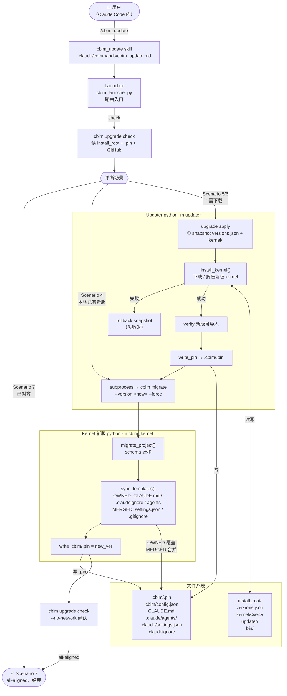

[English](UPDATE-FLOW.md) | [中文](UPDATE-FLOW.zh-CN.md)

# CBIM 更新闭环

## 架构概述

CBIM 的更新涉及两个独立维度，由不同组件负责：

| 维度 | 内容 | 负责方 |
|------|------|--------|
| 用户级 kernel | `<install_root>/kernel/<ver>/` 全局程序 | **Updater** |
| 项目级配置 | `.cbim/`、`CLAUDE.md`、`.claude/`、`.claudeignore` | **新版 Kernel**（经 Updater 触发） |

用户全程在 Claude Code 内交互，更新入口是 `/cbim_update` skill。

---

## 完整更新流程图



---

## 两条关键路径

### Scenario 4 — 本地已有新版，跳过下载

```
cbim upgrade check → Scenario 4
    └─→ cbim migrate --version <new>
            ├─→ schema 迁移
            ├─→ sync 项目模板（OWNED/MERGED）
            └─→ 写 .cbim/.pin
```

适用于：用户已手动安装新版 kernel，但项目 pin 未跟进。

### Scenario 5/6 — 需要从远端下载

```
cbim upgrade check → Scenario 5/6
    └─→ cbim upgrade apply --to <new>
            ├─→ snapshot（versions.json + kernel/<old>/）
            ├─→ install_kernel()  下载并解压
            ├─→ verify
            ├─→ write_pin → .cbim/.pin
            └─→ cbim migrate --version <new> --force
                    ├─→ schema 迁移
                    ├─→ sync 项目模板
                    └─→ 写 .cbim/.pin
```

---

## 项目配置文件策略

`sync_templates()` 对项目文件按四种策略处理：

| 策略 | 文件 | 规则 |
|------|------|------|
| **OWNED** | `CLAUDE.md`、内建 agent.md（4 个） | 整文件覆盖；kernel 完全所有，零扩展点 |
| **MERGED** | `.claude/settings.json`（4 个白名单键）、`.gitignore` | 键级合并 / 只追加缺失行 |
| **SEEDED** | `.cbim/config.json` | 初始化一次写入，之后永不触碰 |
| **UNTOUCHED** | 用户自定义 agent、memory、commands、dna | 永不写入 |

用户私有内容（自定义 agent、`.claude/commands/`、`.dna/`）通过物理路径分离得到保护，无需额外处理。

---

## 组件职责边界

```
Launcher（PATH 入口，零依赖，只做路由）
     /                          \
  Updater                     Kernel
  跨版本操作                   当前版本运行时
  - 下载/安装 kernel            - CBIM 业务逻辑
  - 写 .cbim/.pin               - 项目模板 sync
  - schema 迁移编排             - agent 调度
  - cbim pin / self-update      - memory 写入
     \                          /
      on-disk 契约
      versions.json · .cbim/.pin · kernel/<ver>/ · venv/
```

**核心原则：** Updater 与 Kernel 互为兄弟，不存在父子依赖。两者只通过 on-disk 文件契约通信，任何"跨版本"逻辑归 Updater，任何"当前版本内"逻辑归 Kernel。

---

## 失败处理

| 阶段 | 失败 | 处理 |
|------|------|------|
| `install_kernel` | 下载/解压失败 | 自动 rollback snapshot，版本回退，重试即可 |
| `sync_templates` | 文件写失败 | 幂等，重跑 `cbim migrate` 收敛 |
| `write_pin` | 极罕见 | 重跑 `cbim migrate` 收敛 |
| migrate 整体 | 结构性失败 | 保留 backup tarball，app 已新、项目仍可用，手动重跑 |
