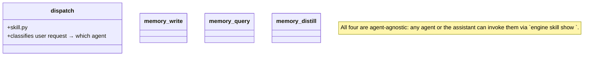

## Positioning

Cross-agent skills: `dispatch` (assistant's routing skill), `memory_write` / `memory_query` / `memory_distill` (memory ops invoked by the assistant on user request).

## Class Diagram

## Key Decisions

- **A skill lives here only if more than one agent (or the assistant + an agent) invokes it.** Single-agent skills live under that agent's directory. This boundary keeps the cross-agent surface small.
