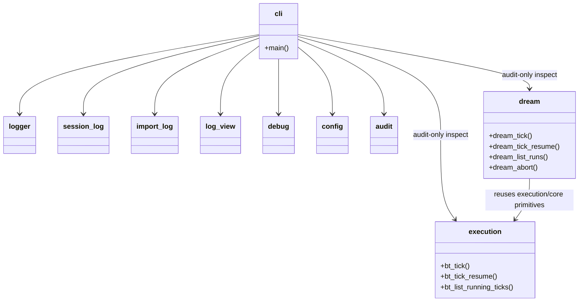

## Positioning

The kernel engine plays a **twin role**:

1. **Unified CLI dispatcher.** Single user-facing entry — `python -m engine <domain> [<command>] [args]`, invoked via the project's shim `.cbim/run`. `__main__.py` calls `engine.cli.main()`, which builds an argparse tree and dispatches each domain to the matching delegate.
2. **Home of the behavior-tree driver (`execution/`).** v2's core driver engine for the execution loop. Each user prompt triggers one `bt_tick`; the BT runner drives a global root node through yield/resume coroutines until `Done`. Exposed to the main agent as MCP tools (`bt_tick` / `bt_tick_resume`), not as a CLI sub-domain.

Engine contains zero business logic in either role. The CLI dispatcher parses arguments and routes; the BT driver runs the tree but defers every actual agent dispatch back to the main agent via `BtResult.Yield`. Every domain (CLI side) and every Action (BT side) delegates outward to the owning module.

## Sub-module Relationships

Note: `execution/` and `dream/` are NOT routed through `cli`. They are exposed to the main agent via the `mcp_server` container as MCP tools. The CLI dispatcher only inspects them for audit / debug purposes (e.g. listing `.cbim/scheduler/bt/<tick_id>/` and `.cbim/scheduler/dream/<run_id>/` directories); the loops themselves are driven by `bt_tick` / `bt_tick_resume` and `dream_tick` / `dream_tick_resume` MCP calls.

Dispatched domains (current surface, mirrors `engine/cli.py:main`):

- `memory` → `memory.cli` (create / add / query / delete / reindex / cleanup)
- `dna` → in-process handlers driving `cbi.resources.DNAModule` and `cbi._primitives.modules` (list / show / init / reindex / edit / write-doc[deprecated] / write-section[deprecated] / split)
- `agent` → in-process handlers driving `cbi.resources.Agent` (list / show / scaffold / archive / update / add-skill)
- `snapshot` → `cbi._primitives.snapshot.build_snapshot`
- `skill` → `cbi.resources.Skill` (list / show)
- `soul` → walks `cbi.agents.*.agent` modules
- `config` → `engine.config` (get / set / show on `.cbim/config.json`)
- `dashboard` → `dashboard.server.start_server`
- `preview` → `dashboard` (deprecated alias)
- `debug` → toggles `.cbim/.debug` flag (on / off / status)
- `log` → `engine.log_view` (show / tail per-session logs)
- `audit` → `engine.audit.cli` (run / index / memory / agents / dna / tree / list-checks — read-only drift checks across `.dna`, `.claude/agents`, `.cbim/memory`)
- `mcp` → `mcp_server.server.mcp.run()` (stdio)
- `init` → `project.init.init_project` (bootstrap cwd)
- `project sync` → `project.sync.sync_templates` (refresh templated files)

Hook events are NOT dispatched through this CLI — Claude Code invokes the in-process bridge scripts at `.claude/hooks/cbim_*.py` directly.

Internal cross-cutting modules: `logger` + `session_log` (per-session text logs), `call_log` + `import_log` (PreToolUse/PostToolUse + import telemetry), `log_view` (read-back surface for `log show` / `log tail`), `debug` (.debug flag toggle), `config` (config get/set/show), `audit` (drift checks).

Non-CLI sub-modules (driven through other surfaces):

- `execution/` — behavior-tree driver for the **execution loop** (user-driven root). Exposes `bt_tick(user_request, context=None)` / `bt_tick_resume(tick_id, dispatch_result)` / `bt_list_running_ticks()` as MCP tools (registered by `mcp_server`). The main agent calls `bt_tick` on each user prompt; the BT runner drives the global root node through yield/resume until `Done`. See `engine/execution/.dna/module.md` and `engine/execution/.dna/contract.md`. Persistence at `.cbim/scheduler/bt/<tick_id>/{bb.json, trace.jsonl, resume.json}`.
- `dream/` — behavior-tree driver for the **governance loop** (SessionStart-catchup-driven root, CBIM's second root, peer to `execution/`). Exposes `dream_tick(reason, run_id=None)` / `dream_tick_resume(run_id, dispatch_result)` / `dream_list_runs(limit=10)` / `dream_abort(run_id, reason)` as MCP tools. Triggered by SessionStart hook when ≥20 hours since last successful run. Drives three governance steps (memory / knowledge / capability) via `SequenceTolerant`; memory step calls `memory/` internal maintenance interfaces in-process (no LLM); knowledge / capability steps yield to dispatch Architect / HR in governance mode. Reuses `execution/core` primitives (Node ABC, Composite, Decorator, Runner, persistence, trace) but holds an independent root tree, independent blackboard schema (8 fields), independent trace, independent entry tools. Dependency direction is `dream → execution/core`; `execution` does NOT depend on `dream`. See `engine/dream/.dna/module.md` and `engine/dream/.dna/contract.md`. Persistence at `.cbim/scheduler/dream/<run_id>/{bb.json, trace.jsonl, resume.json, report.md, current.json, last_success.json, abandoned.json}` — physically isolated from `execution/`.

## Origin Context

Every CBIM operation that an LLM or human types is one CLI invocation. The kernel needs exactly one routing surface because:

1. **Single discoverability point.** `python -m engine --help` lists every available domain. No second binary, no second entry point.
2. **One logging seam.** Every invocation flows through `cli.main()`, so per-session call logging is uniform across all domains without each sub-engine reinventing the wheel.
3. **Domain isolation.** Each domain's real implementation lives in a sibling sub-module (`memory/`, `cbi/`, `mcp_server/`, etc.). Engine merely parses and dispatches. A domain can be refactored, removed, or added without touching the other domains.

`engine/` is also the home of `execution/` — the v2 behavior-tree driver. Why colocate the BT driver with the CLI dispatcher rather than make it a sibling top-level package? Two reasons:

1. **Shared cross-cutting infrastructure.** `execution/` reuses `engine.config` (audit / iteration thresholds), `engine.logger` (session-level signals; BT trace is separate), and the same project-root resolution machinery. Promoting BT to a sibling would force every cross-cutting access through an extra package boundary for zero design win.
2. **One "engine" mental model.** The kernel has one operational engine, with two faces: a synchronous CLI face (humans / scripts call `cbim ...`) and a coroutine-driven BT face (the main agent calls `bt_tick` via MCP). Both faces live under `engine/` because they share the same "router-with-no-business-logic" personality — neither owns business semantics; both delegate outward.

## Key Decisions

- **Thin dispatcher, no business logic.** Every domain handler is a few lines: parse args, call delegate, return exit code. Anything more substantial belongs in the delegate module. This keeps `engine/cli.py` legible and prevents it from accumulating cross-domain knowledge.
- **`dna` and `agent` handlers live inline in `engine/cli.py`.** Historically they delegated to `cbi/_primitives/cli.py`; that thin wrapper layer was deleted in P3 Wave 1. The handlers now drive `cbi.resources.{DNAModule, Agent}` directly. Reason: a one-level dispatch (engine → resource model) is cheaper to read and modify than two-level dispatch (engine → cbi/cli → resource model), and the resource model is the de-facto public API.
- **`init` targets `Path.cwd()`, NOT `project_root()`.** `project_root()` walks up to find an existing `.cbim/`, which is the wrong semantics for bootstrap and historically caused init to clobber a parent project when run from a non-project subdirectory. Bootstrap always targets cwd.
- **No `hook` subcommand.** Hook events are not dispatched through this CLI. Claude Code invokes the in-process bridge scripts at `.claude/hooks/cbim_*.py` directly; those scripts bootstrap `<project>/.cbim/kernel/` onto `sys.path` and call `memory.*` / `cbi.*` / `engine.*` in-process. The earlier `.cbim/run hook <event>` indirection and the `hooks/` sub-package were removed in Phase 6.
- **`init` does more than scaffold `.cbim/`.** Since Phase 3b, `init` also: (1) copies the 7 `cbim_*.py` hook scripts plus `_lib/` into `.claude/hooks/` with 0755 on the scripts; (2) writes the `hooks` section of `.claude/settings.json` to invoke those scripts directly; (3) extends `permissions.deny` to four entries (Write/Edit/Read on `.cbim/**`, plus `Bash(.cbim/run *)`); (4) appends missing kernel entries to `.claudeignore` (merge-only, never clobber); (5) verifies that `mcp` is importable from the managed venv (post-condition check; warn-only); (6) writes/merges `.mcp.json` at the project root with the `cbim` MCP server registration (Phase 7 split: previously `mcpServers.cbim` lived inside `.claude/settings.json`; it now lives in the project-root `.mcp.json` so Claude Code auto-discovers it, and the sync path drops any stale `mcpServers.cbim` from `.claude/settings.json` on upgrade); (7) builds and manages `.cbim/.venv/` — a project-local venv bootstrapped with the system `python3` — and installs the `mcp` SDK into it (Phase 8). The user's system Python is never modified; the `.cbim/run` shim invokes `.venv/bin/python` directly. Venv build is idempotent (skip if `import mcp` succeeds, repair if venv exists but mcp is missing, rebuild if venv is broken). Venv build failure is fatal with a clear hint about `python3-venv`; mcp install failure inside an otherwise-healthy venv is soft-fail (warn, keep going).
- **`preview` is a deprecated alias for `dashboard`.** Kept for one release cycle. Emits a stderr deprecation line and forwards to `cmd_dashboard`.
- **Debug flag is engine-scoped, not memory-scoped.** `.cbim/.debug` (a zero-byte file at the project root's `.cbim/` directory) gates the extra `[ENG]/[IMP]` log lines from `call_log` and `import_log`. Session-level signals (`[SESSION]/[USER]/[TOOL]/[RESULT]/[TURN]`) always log regardless of the flag.

- **`audit/` is embedded inside `engine/`, not a sibling package.** The CLI surface is one more `cbim ...` sub-domain and the threshold config lives in `.cbim/config.json` under the `audit` section — both already first-class engine responsibilities. Making audit a top-level sibling would require an extra cross-package import dance for zero boundary win. Reversible if non-CLI consumers ever appear.

## Non-Goals

- No `cbim_kernel.*` import paths. The kernel root is now the package root (after flatten); imports are `from engine ...`, `from memory ...`, `from cbi.resources ...`, never `from cbim_kernel.engine ...`.
- No `migrate` or `upgrade` subcommands. Project lifecycle = `init` + `project sync` only.
- No `pin` subcommand, no `versions.json` reader, no installer-side subprocess.

