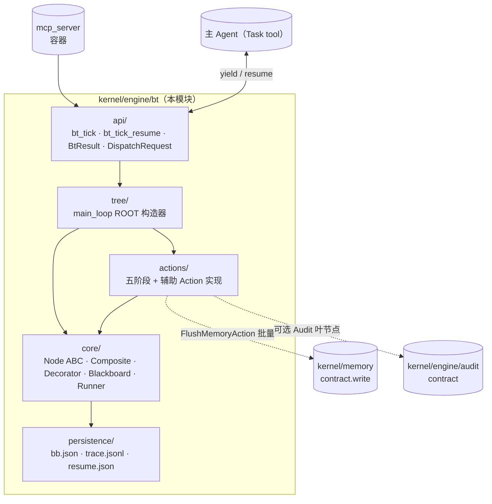

## Positioning

CBIM 执行任务循环的**驱动引擎**。每一次用户 prompt 触发一次全局根节点 tick，由树拓扑决定派谁、装饰器决定异常治理、黑板承载全部跨节点状态。主 agent 不再是"控制流 + 执行手"，退化为"具备 Task 工具的执行手"——控制流被抽到本模块。

**对应文档**：[`design/WORKFLOW-EXECUTION.zh-CN.md`](../../../../../design/WORKFLOW-EXECUTION.zh-CN.md)（执行循环语义、黑板字段、树拓扑、五阶段 Action 契约）、[`../README.md`](../README.md)（引擎实现规约）。本 .dna 不重复设计稿内容——只固化"对外是什么、对内由谁负责、谁也别想破窗"。

**它不是什么**：

| 误解 | 澄清 |
|------|------|
| 五角色子循环的一员 | 不是。本模块**驱动**所有五角色子循环（Coordinator / Architect / HR / Auditor / Work Agent），自身不参与任何业务循环。 |
| 一个调度器 / 计划器 | 不是。引擎不主动派发任何任务——所有"派谁"通过 `BtResult.Yield(dispatch_request)` 交还主 agent，由主 agent 的 Task tool 实际派出。引擎不持有可执行回调。 |
| 一个事件总线 | 不是。节点之间不通过事件通信，只通过黑板字段读写。引擎不 emit 跨进程事件。 |
| 跨 session 任务调度器 | 不是。一次 tick 的生命周期止于 `BtResult.Done` / `BtResult.Error`；孤儿 tick（主 agent 崩溃留下的 `bb_status=running`）默认归档不自动恢复。是否启用孤儿恢复由部署策略决定。 |
| 一个能改 v1 提示词流程的兼容层 | 不是。本引擎是 v2 范式的**唯一**驱动机制，与 v1 的 CLAUDE.md 自驱流程互斥；上线后 v1 提示词驱动废弃。 |

## Sub-module Relationships

**子模块关系**：

| 关系 | 方向 | 说明 |
|------|------|------|
| `tree` → `core` + `actions` | 静态拼装 | `tree/main_loop.py` 用 `Sequence(...)` `Decorator(...)` 拼出 `ROOT` 常量；不参与运行时 |
| `actions` → `core` | 实现 `Node` ABC | 每个 Action 是 `core.Node` 的一个子类，签名 `tick(bb) -> Status` |
| `core.Runner` → `persistence` | 节点退出时若 dirty 则落 `bb.json`；yield 时落 `resume.json`；每个 enter/exit/yield/resume 事件 append `trace.jsonl` | 持久化是 Runner 单点职责，其他节点不直接读写盘 |
| `api` → `tree` + `core` | 入口启动 / 恢复 | `bt_tick` 读 `ROOT` 启 Runner；`bt_tick_resume` 读盘后由 Runner 按 `runner_resume_path` 重建栈 |

**无循环依赖**——单向自顶向下：`api → tree → {core, actions} → persistence`。`actions` 与 `core` 同级（actions 实现 core 的 ABC，不形成环）。

**注：`bt/core` 同时被 `engine/dream/` 复用**——治理循环复用本模块的 Node ABC / Composite / Decorator / Runner / Blackboard / 持久化机制 / trace 文件格式，但持有独立根树、独立黑板、独立入口工具。依赖方向 `dream → bt/core`，**bt 不依赖 dream**（单向铁律）。`bt/` 模块本身只承载执行根树拓扑（`tree/main_loop.py`）；治理根树拓扑（DreamRoot）归 `engine/dream/tree/` 承载。

## Origin Context

CBIM v1 的执行循环是主 agent 在 CLAUDE.md 提示词内自驱：主 agent 同时是控制流（"现在该做什么"）与执行手（"用 Task tool 派谁"）。这导致：

- **控制逻辑不可静态审计**——必须读 prompt 才能知道决策路径；
- **异常处理散落各处**——"如果 X 则 Y"分散在每段提示词里；
- **恢复语义模糊**——一次任务的状态混在对话历史里，无法精确"从中断点继续"。

v2 把控制流抽到引擎，主 agent 退化为执行手。树拓扑可读、装饰器统一异常、状态全在黑板 + `.cbim/scheduler/bt/<tick_id>/`，与对话历史解耦。这就是本模块存在的全部理由。

**双根架构的引擎载体**：BT 引擎不止驱动一棵根树。CBIM 有两个根循环——执行循环（用户驱动，本模块的 `tree/main_loop.py`）和治理循环（SessionStart 补跑驱动，`engine/dream/tree/dream_root.py`）——都跑在本模块的 `core/` 之上。共享行为树引擎本体而黑板 / 根树 / trace / 入口工具各自独立，是 CBIM 双根架构的工程实现方式。

## Key Decisions

- **行为树是 v2 唯一的驱动机制。** 不是"可选优化"，不是"补丁"。本模块上线后，v1 的 CLAUDE.md 自驱流程废弃。控制流的产权从提示词收归到 `tree/main_loop.py`；主 agent 提示词只描述"如何忠实执行 Task tool 派出的子任务"。
- **黑板是跨节点状态的唯一容器。** 节点对象**不持有任何跨 tick 状态字段**——这是 design §2 铁律。节点对象在 Runner 视角是无状态可重建的；任何"在节点上加个 self.x"的写法都是破窗，会让恢复执行不可能正确。组合节点的"当前子节点指针"也必须落黑板（写入 `bb.runner_resume_path` 最后一段），组合节点对象不存。
- **黑板字段单写多读 + schema 校验。** design §2.1 的 17 字段每个都有唯一写者（Root / IntentAnalyze / Decompose / ArchGate / Dispatch / Aggregate / Converge / Respond / FlushMemory / Audit / 引擎自身）；其他节点只读。`bb.json` 落盘前 Runner 按 schema 校验，违规即 `BtResult.Error`。这是恢复正确性、可审计性、调试性的共同地基。
- **节点 Status 三态封死。** `Status = {SUCCESS, FAILURE, RUNNING}`。**不引入 INVALID 等第四态**——这类语义全部由装饰器（Catch / IterationGuard）转换为 SUCCESS/FAILURE/RUNNING 之一并写 `bb.interrupt_reason`。叶节点不抛业务异常；业务错误一律走 FAILURE + `bb` 状态字段。
- **RUNNING 跨 tick 恢复 = `bb.runner_resume_path` + 黑板状态字段。** Runner 落 `bb.json` + `resume.json`，下次 `bt_tick_resume` 读盘 → 按路径重建栈 → 通过 `on_resume(bb, payload)` 把 dispatch 结果交给路径末端的 Action → 继续 `tick(bb)`。重建出的是"中断前的同一棵活树"——这是节点无状态铁律的全部价值。
- **协程式 yield/resume 是 `bt_tick` 的唯一形态（L7 决议）。** 引擎不持有可执行回调、不主动派工。需要派 agent 时把 `DispatchRequest` 装进 `BtResult.Yield` 返回给主 agent，由主 agent 用 Claude Code Task tool 实际派出，结果通过 `bt_tick_resume(tick_id, dispatch_result)` 回交。**严禁引擎自派绕过 Task tool**——绕开会破坏 Claude Code 的会话/权限/计费模型。
- **Action 实现可用 LLM，但调度逻辑全程 PROG。** `IntentAnalyze` / `ConvergeJudge` / `Decompose` 内部允许调 LLM 做兜底/主决策；但树拓扑（tree/main_loop.py）、Composite/Decorator 行为、Runner 调度全是确定性 Python 代码，可静态审计、可单步重放。LLM 客户端通过 Action 构造器注入（不在模块级 import），便于测试用 `StubLLM` 替换。

## Non-Goals

- **不引入事件总线。** 节点之间只通过黑板通信，引擎不 emit 跨进程事件、不发布订阅、不广播。
- **不做 scheduler。** 本模块不持有"何时该跑什么"的判断——一次 tick 由用户 prompt 触发，结束于 Done/Error；跨 prompt 的任务编排不在本模块范围。
- **不做跨 session 持久化的任务调度。** `.cbim/scheduler/bt/<tick_id>/` 仅服务于"单次 tick 内的 yield/resume 恢复"。主 agent 崩溃后的孤儿 tick 默认归档不自动续跑；`bt_list_running_ticks()` 仅提供观测，不提供续跑承诺。
- **不主动派 Work Agent 绕过 Claude Code Task tool。** 任何 Action 需要派子 agent 一律通过 yield → 主 agent Task tool → resume 回路。引擎进程内**不**持有任何"直接调用其他 agent 的客户端"。
- **不暴露黑板直接写。** 黑板字段的写者由 design §2.1 表锁定；外部（包括主 agent、MCP 调用方、其他 engine 子模块）不能跨过 Action 直接写 bb。
- **不复用 engine.logger 的 session 日志通道做节点 trace。** 节点 trace 走自管 `trace.jsonl`（append-only，可重放）；session 级日志归 `engine.logger`，两套观测体系互不串扰。

## Outbound

- **kernel/memory（contract）** —— 仅 `FlushMemoryAction` 调 `memory_write`；其他 Action 严禁直接调记忆服务，只能往 `bb.memory_flush_queue` push。记忆故障被 `@Catch` 吞掉，不阻塞用户回复。
- **kernel/engine/audit（contract）** —— 可选叶节点 `AuditAction`。是否挂载由 `tree/main_loop.py` 根据 `bb.intent.kind` 决定（变体树由组合工厂返回，根仍唯一）；挂载时产出写 `bb.audit_report`。
- **mcp_server（反向，容器）** —— 不在本模块 dependencies 中；`mcp_server` 把 `api/bt_tick.py` 的两个函数注册为 MCP 工具，函数签名即工具签名。引擎不感知 MCP 容器存在。

依赖方向：`bt → memory.contract`、`bt → audit.contract`、`mcp_server → bt`。无环。
