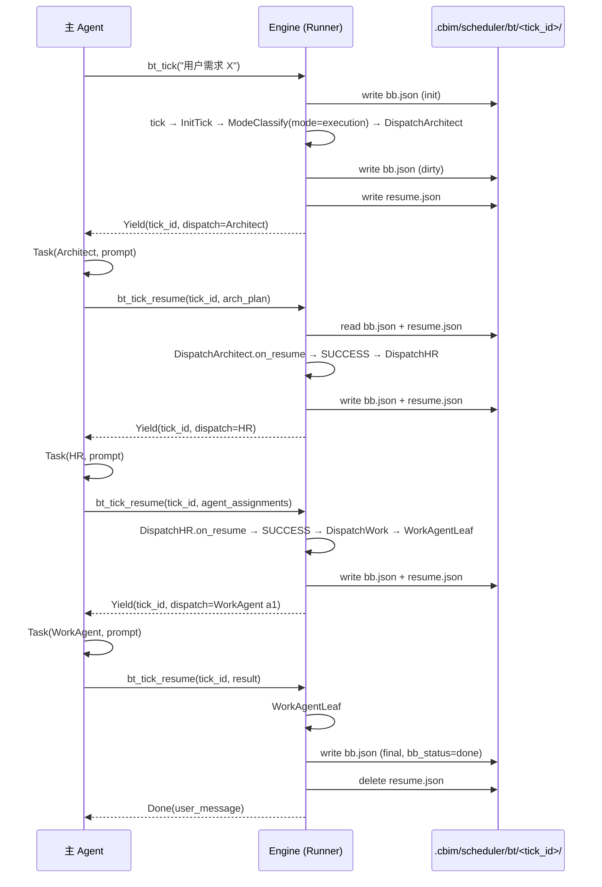

# CBIM 行为树引擎

> v2 核心驱动引擎的实现规约。给后续 `.dna/engine/bt/` 模块设计与编码实施的人看。
> 关联文档：[`WORKFLOW-EXECUTION.zh-CN.md`](./WORKFLOW-EXECUTION.zh-CN.md)（执行循环的语义与树拓扑）、[`LOOPS-OVERVIEW.zh-CN.md`](./LOOPS-OVERVIEW.zh-CN.md)（在 CBIM 全景中的位置）。

本文档**只讲"引擎怎么实现"**——树拓扑、阶段语义、黑板字段表请直接读 WORKFLOW-EXECUTION。两份文档不互抄。

---

## 1. 模块结构

```
kernel/engine/bt/                      # 行为树引擎根模块
├── .dna/                              # 模块知识（待 Architect 设计阶段产出）
├── core/
│   ├── node.py                        # Node ABC + Status 三态枚举
│   ├── composite.py                   # Sequence / Selector / Parallel / ModeBranch 组合节点
│   ├── decorator.py                   # Decorator ABC + 4 标准装饰器实现（Trace / Timeout / Retry / Catch）
│   ├── blackboard.py                  # Blackboard 类（schema v2，14 字段） + dirty 跟踪 + 序列化
│   └── runner.py                      # Runner：驱动遍历、yield/resume、快照/恢复
├── actions/                           # v3 Action 实现
│   ├── init_tick.py                   # 第一节点占位
│   ├── mode_classify.py               # 两模式分类：conversation / execution（规则 + LLM 兜底）
│   ├── direct_reply.py                # 对话模式直接回复
│   ├── dispatch_architect.py          # yield 派 Architect，回填 arch_plan
│   ├── dispatch_hr.py                 # yield 派 HR，回填 agent_assignments
│   ├── dispatch_work.py               # yield 派 Work Agent，含 WorkAgentLeaf
│   ├── respond.py
│   ├── flush_memory.py
│   ├── llm_hook.py                    # NullLLM 协议占位
│   └── llm_client.py                  # 真实 Anthropic 客户端（可选）
├── tree/
│   └── main_loop.py                   # Python 构造器拼装全局根节点
├── persistence/
│   ├── snapshot.py                    # bb.json 落盘与恢复
│   └── trace.py                       # trace.jsonl append-only writer
├── api/
│   ├── bt_tick.py                     # 顶层入口：bt_tick / bt_tick_resume
│   └── result.py                      # BtResult 三态 + DispatchRequest + Task schema
└── tests/                             # 见 §4
```

| 子模块 | 一句话职责 |
|--------|------------|
| `core/node.py` | 定义 Node 抽象基类与 `Status = {SUCCESS, FAILURE, RUNNING}` |
| `core/composite.py` | Sequence（短路 AND）、Selector（短路 OR）、Parallel（全跑后汇总）、ModeBranch（按 `bb.mode` 二路分流） |
| `core/decorator.py` | 装饰器基类 + Trace / Timeout / Retry / Catch 四个实现（v3 已移除 LoopUntilConverge / IterationGuard） |
| `core/blackboard.py` | 黑板的内存表示（schema v2，14 字段）、dirty 标记、序列化 / 反序列化 |
| `core/runner.py` | 树遍历引擎；处理 yield/resume；调度快照与 trace 写入 |
| `actions/*` | v3 Action 的 Python 实现，每个文件一个 Action 类 |
| `tree/main_loop.py` | Python 构造器：用 `Sequence(...)` `Decorator(...)` 拼出全局根，导出 `ROOT` 常量 |
| `persistence/snapshot.py` | `bb.json` 的原子写、读回、schema 版本号管理（`schema_version != 2` 视为孤立 tick 丢弃） |
| `persistence/trace.py` | `trace.jsonl` 的 append-only writer，含轮换/截断策略 |
| `api/bt_tick.py` | 暴露给 MCP 的两个工具入口；负责 tick_id 生成、resume 时的 runner 重建 |
| `api/result.py` | `BtResult` 联合类型、`DispatchRequest` 数据类、`Task` 数据类，跨进程传输的 schema |

---

## 2. 节点 ABC 与实现规约

### 统一签名

```python
class Status(Enum):
    SUCCESS = "success"
    FAILURE = "failure"
    RUNNING = "running"

class Node(ABC):
    name: str               # 唯一 ID（在树内），用于 trace 与 runner_resume_path

    @abstractmethod
    def tick(self, bb: Blackboard) -> Status: ...

    # 可选：节点在被 RUNNING 中断后恢复时调用
    def on_resume(self, bb: Blackboard, payload: Any) -> None: ...
```

- **唯一入口** `tick(bb)`。不接受任何其他参数；不返回任何业务数据（业务数据走 bb）。
- **三态 Status**。RUNNING 表示"这个节点还没跑完，请下一次 tick 再继续"——对于叶节点 Action，配合 yield 协议（§6）。
- **`on_resume`** 仅当 Action 用 yield 中断、需要把 dispatch 结果合并回内部状态时实现。多数 Action 直接读 `bb.subtask_results` 即可，不需要重写。

### 节点内部状态规则（铁律）

| 规则 | 说明 |
|------|------|
| 节点对象**不持有任何跨 tick 状态字段** | 所有跨 tick 状态必须写黑板。节点对象在 runner 视角是无状态可重建的。 |
| 节点对象**可持有 tick 内的临时变量** | 一次 `tick()` 调用内部的本地变量、循环计数等不算"状态"，函数返回即销毁。 |
| 组合节点的"当前子节点指针"也必须落黑板 | Sequence 跑到第 3 个子节点时 RUNNING 中断 → 把"当前 index=3"写 `bb.runner_resume_path` 的最后一段。组合节点对象不存这个值。 |

违反这一条会让"恢复执行"不可能正确——所以是设计阶段的强约束。

### Status 语义边界

| 返回 | 父节点应当 |
|------|-----------|
| SUCCESS | Sequence：进入下一个子节点；Selector：直接 SUCCESS 返回；Parallel：记录该分支成功 |
| FAILURE | Sequence：立即 FAILURE 返回；Selector：进入下一个备选；Parallel：按策略（默认任一失败即失败） |
| RUNNING | 整棵树立即把"当前位置"写 `bb.runner_resume_path`，引擎落快照、返回 `BtResult.Yield(...)` 给主 agent |

---

## 3. 持久化与 trace 格式

### 路径布局

```
.cbim/scheduler/bt/<tick_id>/
├── bb.json             # 黑板快照（每次 dirty 后节点退出时重写）
├── trace.jsonl         # 节点级 trace，append-only
└── resume.json         # 仅当 bb_status=running 时存在；含 runner_resume_path 与最后 yield 的 DispatchRequest
```

`<tick_id>` = UUID v4（短形式），由 `InitTick` 写入 `bb.tick_id`，同时也是这一组持久化文件的目录名。

### `bb.json` schema

```json
{
  "schema_version": 2,
  "tick_id": "...",
  "created_at": "2026-05-24T...",
  "updated_at": "...",
  "bb_status": "running | done | error",
  "fields": { /* WORKFLOW-EXECUTION §2.1 v3 14 字段表，None 字段省略 */ }
}
```

写入策略：**节点退出时若 bb 被标记 dirty 则重写整个 `bb.json`**（不是增量 diff——简化恢复路径，避免补丁堆栈）。写入用临时文件 + rename 保证原子性。

`schema_version` 不匹配（旧的 v1 快照、未来 v3+ 快照）时，`snapshot.read_bb()` log 一条 warning 并返回 `None`——孤立 tick 直接丢弃，避免引擎在不兼容 schema 上崩溃。

### `trace.jsonl` 条目

```json
{"ts":"...","node":"ArchGate","event":"enter","depth":3}
{"ts":"...","node":"ArchGate","event":"yield","dispatch":{"agent":"architect","prompt":"..."}}
{"ts":"...","node":"ArchGate","event":"resume","payload_summary":"ContextPack(modules=3)"}
{"ts":"...","node":"ArchGate","event":"exit","status":"success","duration_ms":1234}
```

事件类型：`enter | exit | yield | resume | retry | timeout | catch | trace_self_error`。每条带 `node` 名与时间戳；不存储完整 payload（只存 summary，避免 trace 文件爆炸），完整 payload 在 bb.json 里。

### `resume.json` 与 `runner_resume_path`

`runner_resume_path` 是节点名的列表，描述从根节点到 RUNNING 节点的完整路径：

```json
["Root", "GlobalTimeout", "RootSeq", "ModeBranch", "ExecutionSeq", "DispatchWork", "WorkAgentLeaf#a1"]
```

`#` 后缀用于 `DispatchWork` 内的 task 区分（task ID，对应 `bb.arch_plan[i].id`）。

`bt_tick_resume` 被调用时，runner：

1. 读 `bb.json` 还原黑板；
2. 按 `runner_resume_path` 重建调用栈（自顶向下重新构造每层 composite 节点的"当前 index"）；
3. 把 `dispatch_result` 通过 `on_resume(bb, payload)` 交给路径末端的 Action；
4. 从该 Action 继续 `tick(bb)` 调用。

恢复正确性的关键：节点无状态 + 路径完整 + bb 完整 = 重建出"中断前的同一棵活树"。这是 §2 铁律的全部价值所在。

---

## 4. 测试策略

| 层 | 测什么 | 怎么测 |
|----|--------|--------|
| **树拓扑测试** | `tree/main_loop.py` 拼出来的根节点结构是否符合 [`WORKFLOW-EXECUTION §3`](./WORKFLOW-EXECUTION.zh-CN.md#3-主循环行为树拓扑) | 遍历根节点，校验子节点序列、装饰器叠加顺序；输出与设计稿 mermaid 等价的结构断言 |
| **节点单测** | 每个 Action / Decorator / Composite 在给定 bb 输入下的输出 bb + 返回 Status | 构造 mock bb，用 stub 替换"调谁"（如 IntentAnalyze 的 LLM 调用换成 stub），断言：(1) Status 正确 (2) bb 写入字段符合 §2.1 写者表 |
| **装饰器叠加测试** | Trace > Timeout > Retry/Catch 的执行序与失败传播 | 用专门的 `AlwaysFailNode` / `SlowNode` / `FlakyNode` 三个测试 fixture，逐对验证装饰器组合行为 |
| **持久化往返测试** | bb.json 写盘后读回字段相等；resume 重建后栈结构正确 | 跑半棵树到 RUNNING，落盘，新进程读盘，断言 `bb` 与 `runner_resume_path` 完整 |
| **端到端 dry-run** | 整棵主循环在 mock 主 agent / mock Work Agent 下能跑完 | 提供一个 `FakeDispatcher` 模拟主 agent 的 Task 调用，把 `BtResult.Yield` 转成预设的 `DispatchResult`，整条用例从 `bt_tick(...)` 走到 `BtResult.Done(...)`；断言最终 `final_response` 与中间 trace 序列 |

### Mock Action 内部 LLM 的约定

v3 主拓扑里只有两个 Action 自己调 LLM：`ModeClassify`（rule miss 兜底）和 `DirectReply`（对话模式回复）。两者都必须把 LLM 客户端通过 **构造器注入**，而不是模块级 import。这样测试可以注入 `StubLLM` 返回固定值；生产代码注入真实 client。

```python
class ModeClassify(Node):
    def __init__(self, *, llm, name="ModeClassify"):
        self.name = name
        self._llm = llm or NullLLM()
    def tick(self, bb): ...
```

`NullLLM`（`actions/llm_hook.py`）是默认 stub：`classify_mode` 返 `"execution"`、`reply_conversation` 返一段 passthrough 文本，永不抛异常。测试 fixtures 集中在 `tests/fixtures/`，包含 `StubLLM`、`FakeDispatcher`、`AlwaysFailNode`、`SlowNode`、`FlakyNode` 等通用件。

---

## 5. 与 audit / memory / mcp_server 的边界

| 邻接模块 | 关系 | 实现细节 |
|----------|------|----------|
| **audit** | 可选叶节点。主循环默认不挂 Audit；某些"高风险变更"路由会把 Audit 节点插在 Aggregate 之后、Converge 之前 | Audit 节点本身就是一个 Action，按 §2 规约实现；产出写 `bb.audit_report`。是否挂 Audit 由 `tree/main_loop.py` 中根据 `bb.intent.kind` 决定（变体树由组合工厂返回，根仍唯一） |
| **memory** | 通过 `FlushMemoryAction` 批量调 `memory_write`。其他节点严禁直接调记忆服务——它们只能往 `bb.memory_flush_queue` push 条目 | 记忆故障被 `@Catch` 吞掉，不阻塞用户回复（详见 [`WORKFLOW-EXECUTION §4`](./WORKFLOW-EXECUTION.zh-CN.md#4-五阶段--五个-action-的契约)） |
| **mcp_server** | 暴露 `bt_tick` 与 `bt_tick_resume` 两个工具给主 agent | `api/bt_tick.py` 的两个函数直接注册为 MCP 工具，函数签名即工具签名（详见 §6） |

audit 与 memory 是**消费者/被消费者**关系，行为树引擎不依赖它们的内部实现，只依赖它们的契约（audit 返回报告、memory 接受写入）。mcp_server 是**容器**——它装载引擎、暴露入口，但不参与树的执行逻辑。

依赖方向：`bt` → `memory.contract`（调用方）、`bt` ← `mcp_server`（容器）、`bt` → `audit.contract`（可选调用方）。无环。

---

## 6. L7 协程式 yield/resume 协议细节

这是引擎对外的**核心契约**——主 agent 与引擎之间所有交互都通过这两个函数完成。

### 6.1 入口签名

```python
def bt_tick(user_request: str, context: dict | None = None) -> BtResult:
    """启动新 tick。生成 tick_id，初始化 bb，驱动到第一个 yield 或 Done。"""

def bt_tick_resume(tick_id: str, dispatch_result: dict) -> BtResult:
    """恢复指定 tick_id 的 RUNNING 树。读盘 → 重建栈 → on_resume → 继续驱动。"""
```

`context` 参数预留给未来扩展（如携带会话历史摘要、用户偏好）；v2 首版可忽略。

### 6.2 `BtResult` 三态

```python
@dataclass
class BtResult:
    kind: Literal["done", "yield", "error"]

    # kind == "done"
    user_message: str | None = None

    # kind == "yield"
    tick_id: str | None = None
    dispatch_request: DispatchRequest | None = None

    # kind == "error"
    error_code: str | None = None
    error_message: str | None = None
    interrupt_reason: str | None = None   # 与 bb.interrupt_reason 一致
```

| 状态 | 主 agent 收到时应做 |
|------|---------------------|
| `Done(user_message)` | 把 `user_message` 输出给用户；丢弃 `tick_id`，本逻辑 tick 结束 |
| `Yield(tick_id, dispatch_request)` | 按 `dispatch_request` 用 Task tool 派出对应 agent；拿到结果后调 `bt_tick_resume(tick_id, result)` |
| `Error(error_code, ...)` | 把 `error_message` 渲染给用户，并附 `interrupt_reason`（如果是软中断而非崩溃） |

### 6.3 `DispatchRequest` schema

```python
@dataclass
class DispatchRequest:
    agent_type: str          # "architect" | "auditor" | "work" | ...
    agent_file: str | None   # work agent 需要；架构师/审计员可为 None
    prompt: str              # 喂给 Task tool 的完整 prompt
    subtask_id: str | None   # WorkAgentLeaf 派工时携带，用于 resume 时定位 subtask_results[id]
    timeout_hint_s: int | None
```

主 agent 不解释 `prompt`，原样喂 Task tool；不修改 `agent_file`，按指定派；只负责把 Task 的返回结果作为 `dispatch_result` 原样回交。

### 6.4 多次 yield/resume 循环示意



对话通路更短——`ModeClassify` 把 `bb.mode` 写成 `"conversation"`，`ModeBranch` 直走 `DirectReply` 写 `final_response`，单次 tick 就 `Done`，从不 yield。

### 6.5 错误恢复与孤儿 tick

- **主 agent 崩溃后重启**：可通过列出 `.cbim/scheduler/bt/` 下 `bb_status=running` 的目录恢复未完成 tick；通常做法是丢弃孤儿 tick（归档目录，不自动恢复），下次 prompt 开新 tick。是否启用孤儿恢复由部署策略决定，引擎只提供 `bt_list_running_ticks()` 辅助 API。
- **resume 时 `tick_id` 不存在或非 running**：返回 `BtResult.Error(error_code="tick_not_found_or_done")`，由主 agent 决定是新开 tick 还是报错给用户。
- **resume 时 `dispatch_result` 格式不符**：返回 `BtResult.Error(error_code="dispatch_result_schema_mismatch")`；引擎不容错，依赖契约。

### 6.6 与 v1 的区别

v1 是主 agent 在 prompt 内自驱整个调度循环，相当于"主 agent 同时是控制流 + 执行手"。v2 协程式把控制流抽到引擎，主 agent 退化为"具备 Task 工具的执行手"。这一刀切之后：

- 控制逻辑（拓扑、装饰器、迭代上限）**可静态审计**——读 `tree/main_loop.py` 即可，不需要读 prompt。
- 异常处理统一在装饰器层——主 agent 不再需要在 prompt 里写"如果 X 则 Y"。
- 恢复语义清晰——一次 tick 的状态全在 `.cbim/scheduler/bt/<tick_id>/`，与主 agent 的对话历史解耦。
