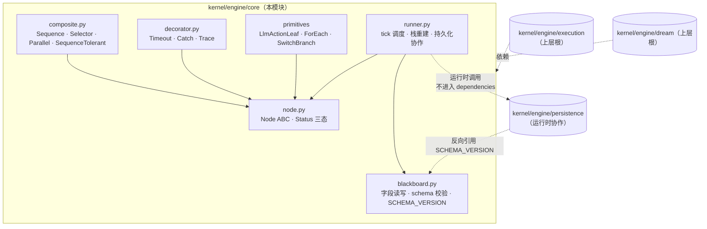

## Positioning

BT 引擎的**共享原语库**——Node ABC、Composite（Sequence / Selector / Parallel / SequenceTolerant）、Decorator（Timeout / Catch / Trace）、Runner、Blackboard，以及叶节点原语 `LlmActionLeaf`、控制流原语 `ForEach` / `SwitchBranch`。

`engine/core` 是 `engine/execution` 和 `engine/dream` 两根循环**共同依赖**的稳定底层，本身**不依赖任何上层模块**——它对"是用户驱动还是 scheduler 驱动"、"是执行循环还是治理循环"完全无感知。两根各自挂载自己的根树、自己的黑板、自己的入口工具，但跑在同一个 `engine/core` 上。

**对应文档**：[`design/WORKFLOW-EXECUTION.zh-CN.md`](../../../../../design/WORKFLOW-EXECUTION.zh-CN.md)、[`design/WORKFLOW-DREAM.zh-CN.md`](../../../../../design/WORKFLOW-DREAM.zh-CN.md) 中关于行为树原语的部分。

**它不是什么**：

| 误解 | 澄清 |
|------|------|
| `engine/execution` 的子模块 | 不是。`engine/core` 与 `engine/execution`、`engine/dream` 是**平级**关系——`core` 在下，两根在上，两根都依赖 `core`，`core` 不依赖任一根。 |
| 通用行为树框架 | 不是。`engine/core` 是 CBIM 自用的最小集合——只实现 CBIM 两根循环需要的原语，不追求与 py_trees / behaviour 等公开库 API 兼容。 |
| 业务节点的容器 | 不是。业务 Action（IntentAnalyze、Decompose、DispatchWork、MemHealthScan 等）一律归对应根模块的 `actions/` 子目录。`core` 只提供 ABC 与少量通用叶/组合/装饰原语。 |

## Sub-module Relationships

**子模块关系**：

| 关系 | 方向 | 说明 |
|------|------|------|
| Composite / Decorator / Primitives → Node | 实现 / 继承 | 都是 `Node` ABC 的子类，签名 `tick(bb) -> Status` |
| Runner → Node + Blackboard | 调度协作 | Runner 是唯一持有"如何 tick 一棵树并落盘"的对象；节点对象无状态可重建 |
| Runner ⋯→ persistence | 运行时协作 | 代码中 `import persistence`，但不在 frontmatter dependencies 中声明（避免与 persistence 反向引用 SCHEMA_VERSION 成环） |
| Execution / Dream → core | 单向依赖 | 两根都依赖 core；core 不反向依赖任何根 |

**静态依赖拓扑本模块为叶节点**——`engine/core` 不在 frontmatter 声明任何静态依赖。`persistence` 与 core 的双向交互被划入"运行时协作"类（后续重构推荐走构造器注入 snapshot/trace 函数途径彻底解耦）。

## Origin Context

CBIM v2 设计早期，行为树原语曾内嵌在 `engine/execution` 内。当治理循环（dream）登场时，发现两根需要共享同一套 Node ABC / Composite / Decorator / Runner / Blackboard——把它们留在 execution 内会导致 dream 反向 import execution，循环依赖立刻成立。

解决办法是把共享原语下沉到独立模块 `engine/core`，让 execution 与 dream 各自单向依赖 core，互不依赖。这就是本模块存在的全部理由——**共享原语 + 解环**。

**为什么也承载 `LlmActionLeaf` / `ForEach` / `SwitchBranch`**：这三个不是 "业务 Action"，而是"控制流 / 调用模式的通用原语"——任一根循环、任一子循环都可能用到。把它们放 core 而非各根的 actions/ 是因为：

- `LlmActionLeaf` 把"一次 LLM 调用 = 一次 tick"这条铁律下沉到原语层，让所有 LLM 节点天然遵循同一约定（构造时注入 client/prompt_builder/response_parser/output_field，tick 内无副作用之外的状态，自追踪 `llm_call_start` / `llm_call_end` / `parse_ok|fail` 三事件到 `bb.trace`）。
- `ForEach` 把"对 bb 列表字段逐项 tick 子树"这条模式下沉，让幂等恢复（bb 内存进度索引）只实现一次。
- `SwitchBranch` 把"根据 bb 字段值路由到对应子节点"这条模式下沉，让 match/case 式控制流不必每个业务侧重复发明。

## Key Decisions

- **Node 三态封死。** `Status = {SUCCESS, FAILURE, RUNNING}`，不引入第四态。第四态语义（INVALID / TIMEOUT / CATCH）由 Decorator 转换为三态之一并写 `bb.interrupt_reason`。
- **节点对象无状态。** 节点对象不持有任何跨 tick 字段——任何"在节点上加 self.x"的写法都是破窗。所有跨 tick 状态必须落黑板（包括 Composite 的"当前子节点指针"，写入 `bb.runner_resume_path` 最后一段）。这是 RUNNING 跨 tick 恢复可正确实现的全部前提。
- **黑板是跨节点状态的唯一容器。** 节点之间不通过事件、不通过回调、不通过共享对象引用通信，只通过黑板字段读写。Blackboard 自身负责 schema 校验与单写多读约束。
- **嵌套子树是引擎天然支持的组合方式。** BT 树的子节点可以是另一棵子树的根节点——`Composite` 接受任意 `Node` 实例作为子节点，递归 tick 即可。这条性质不需要任何特殊适配层，而是 ABC 设计的自然产物。execution / dream 两根的子循环（architect_execution、hr_execution、architect_governance、hr_governance）都通过"挂载子树根节点"实现，不再走描述器 + 主 agent 心智执行的间接路径。
- **`LlmActionLeaf` 是 LLM 调用的唯一原语。** LLM 调用只出现在 `LlmActionLeaf` 内，**不**出现在 Composite / Decorator / Runner 中。控制流永远是程序驱动的确定性 Python；LLM 只在叶节点的"语义判断 / 内容生成 / 结构化解析"环节出现。
- **`LlmActionLeaf` 一 tick 一 LLM 调用。** 每次 tick 恰好执行一次 LLM 调用——client、prompt_builder、response_parser、output_field 全部构造时注入；tick 本身除"调 LLM、解析、写 output_field、追加 trace"外无其他副作用。失败语义统一：调用失败 → FAILURE + `bb.interrupt_reason`；解析失败 → FAILURE + `bb.interrupt_reason`；成功 → SUCCESS。
- **`LlmActionLeaf` 自追踪三事件。** `llm_call_start` / `llm_call_end` / `parse_ok` 或 `parse_fail` 三个事件由叶节点自身写入 `bb.trace`，不依赖外部装饰器。trace 字段固定包含 prompt 摘要、响应摘要、解析结构、耗时——为审计 / 回放 / 调试提供统一观测面。
- **`ForEach` 幂等恢复靠 bb 进度索引。** ForEach 在 bb 内存当前迭代索引（如 `bb.for_each_progress[node_id]`），中断后 resume 从下一项继续，不重跑已完成项。子树本身需保证幂等性（这是子树作者的契约义务，ForEach 不强制检查）。
- **`SwitchBranch` 是控制流原语，不调 LLM。** 路由依据是 bb 字段的当前值（字符串 / 枚举），子节点表在构造时定死。要让 LLM 决定走哪条分支，应在 `SwitchBranch` 之前用 `LlmActionLeaf` 把决定写到 bb 字段——分支判断本身是确定性 Python。
- **每个 `LlmActionLeaf` 只负责一个语义步骤。** 单独 prompt、单独解析、单独 output_field。"在一次 LLM 调用里完成多个语义步骤"的描述器模式是破窗——会让审计与重试粒度同时塌陷。子循环的每一个步骤（如 architect_execution 的 intent_analyze / decompose / arch_gate）对应一个独立 `LlmActionLeaf`，挂在子树的相应位置。

## Non-Goals

- **不承载业务 Action。** 业务侧 Action（IntentAnalyze、Decompose、DispatchWork、MemHealthScan、CollectArchAdvice 等）归对应根模块的 `actions/` 子目录，不归 core。
- **不感知"用户驱动 / scheduler 驱动"。** core 对触发来源完全无感知；触发语义归各根的 `api/` 子目录。
- **不感知"执行根 / 治理根"。** core 不持有任何"如果是 execution 则 X，如果是 dream 则 Y"的分支。两根之间的差异由各自的 actions / tree / api 承载。
- **不暴露事件总线。** 节点之间只通过黑板通信；core 不 emit 跨进程事件、不广播。
- **不持有可执行回调。** Runner 不接受"调一下就能跑某个 Action"的函数引用；树拓扑在构造期静态拼装，运行期不动态注入节点。
- **不与 LLM 客户端 / 记忆服务 / MCP 任何具体后端绑定。** core 接受任意实现了既定接口的 LLM 客户端（通过 `LlmActionLeaf` 构造器注入），不 import 任何具体客户端实现。

## Outbound

- **kernel/engine/persistence（运行时协作，不在 frontmatter dependencies 中声明）** —— `Runner` 运行时调 `persistence.snapshot.write_bb` / `read_bb` / `write_resume` / `read_resume` 与 `persistence.trace.append_event`。路径前缀由调用方（execution / dream 的 api 层）注入。

**为什么不在 dependencies 声明**：`persistence/snapshot.py` 反向引用了 `engine.core.blackboard.SCHEMA_VERSION`，以使版本成为唯一权威源（persistence 不拥有 schema 权）。两边同时存在 import 关系会在模块拓扑层面构成环。架构上的解环原则：**core 不声明对 persistence 的静态依赖**，把 `persistence` 当作"运行时协作者"看待——与 LLM 客户端、memory 服务同列（均不进入 dependencies）。`Runner` 在实际代码中仍会 `from engine.persistence import snapshot, trace`，但在模块责任划分上表述为“persistence 是 core 的上层调用受体”。后续重构可进一步走“构造器注入 snapshot/trace 函数”路线彻底代码层解耦。

依赖方向（frontmatter 可静态审计部分）：`engine/execution → engine/core`、`engine/dream → engine/core`、`engine/persistence → engine/core`。core 本身不声明对上层任何模块的静态依赖。无环。

