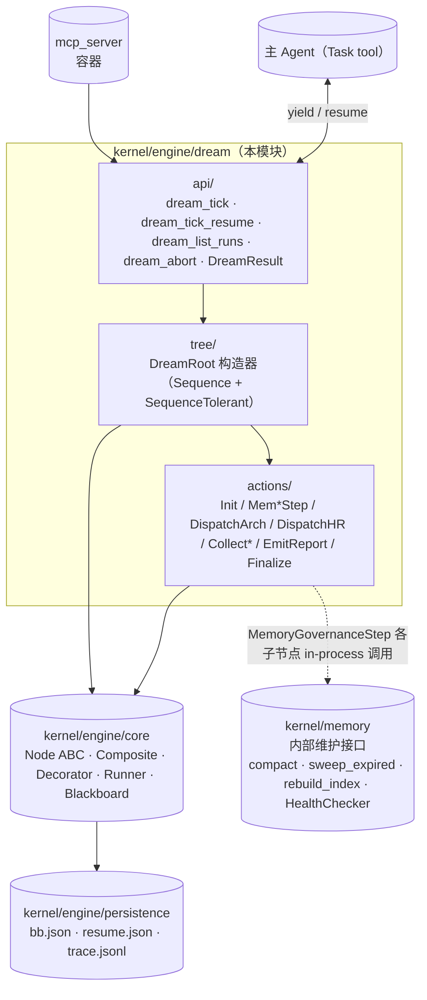

## Positioning

CBIM **第二个根循环**的驱动引擎，与执行循环（`engine/execution`）平级共存——不是其子循环、不是其装饰器、不是其插件。两根共享 `engine/core` 的 Node ABC / Composite / Decorator / Runner / 持久化 / trace 原语，但持有各自独立的根树拓扑（DreamRoot）、独立的黑板 schema（8 字段）、独立的 trace、独立的 MCP 入口工具。

**驱动者非参与者**：本模块**驱动**三个治理子循环（主 agent 记忆治理 / Architect 治理模式 / HR 治理模式），自身不参与任何业务循环、不与用户对话、不调 Work Agent、不调 Auditor。

**对应文档**：[`design/WORKFLOW-DREAM.zh-CN.md`](../../../../../design/WORKFLOW-DREAM.zh-CN.md)（治理循环语义、触发机制、树拓扑、黑板 schema、失败哲学）。本 .dna 不复述设计稿——只固化“对外是什么、对内由谁负责、谁也别想破窗”。

**它不是什么**：

| 误解 | 澄清 |
|------|------|
| `engine/execution` 的子模块 | 不是。是平级第二根，与 execution 共享 `engine/core` 但各持独立根树；两根互不依赖，都依赖 `engine/core`。 |
| cron / 定时器 | 不是。无内置时钟，仅在 SessionStart 检测“距上次成功 ≥ 20 小时”才补跑。 |
| 夜间常驻守护进程 | 不是。零后台进程；每次 tick 跑完即退，状态全在 `.cbim/scheduler/dream/`。 |
| 主动改代码 / 删模块的自动化机器人 | 不是。治理模式只做安全幂等动作（时间戳更新、记忆压缩、索引重建、归类建议）；危险动作（归档模块、招募 agent、改契约）只产建议落到 report.md。 |
| 阻塞用户的后台任务 | 不是。用户 prompt 立即让位——RUNNING 节点归档为“abandoned”，明天再跑。 |

## Sub-module Relationships

**子模块关系**：

| 关系 | 方向 | 说明 |
|------|------|------|
| `tree` → `engine/core` + `actions` | 静态拼装 | `tree/dream_root.py` 用 `Sequence(...)` `SequenceTolerant(...)` `@Trace @Timeout @Catch` 拼出 `DREAM_ROOT` 常量；不参与运行时 |
| `actions` → `engine/core` | 实现 `Node` ABC | 每个 Action 是 `engine.core.Node` 的子类，签名 `tick(bb) -> Status` |
| `api` → `tree` + `engine/core` + `kernel/engine/persistence` | 入口启动 / 恢复 | `dream_tick` 读 `DREAM_ROOT` 启 Runner；`dream_tick_resume` 调 `persistence.snapshot.read_bb / read_resume` 后由 Runner 按 `runner_resume_path` 重建栈 |
| 持久化 | **复用 kernel/engine/persistence** | 不自建持久化子模块。`engine/core/runner.py` 调 `persistence.snapshot` / `persistence.trace`，写入 `.cbim/scheduler/dream/<run_id>/`（路径前缀由 `api/dream_tick.py` 注入）；文件格式与执行循环一致，方便 dashboard / 调试工具复用 |
| `actions` → `memory`（内部维护接口） | in-process 调用 | 仅 `MemHealthScan` / `MemCompact` / `MemSweepExpired` / `MemRebuildIndex` 四个 Action 直接 Python 调用 `memory.HealthChecker.check()` / `memory.compact()` / `memory.sweep_expired()` / `memory.rebuild_index()`；不走 MCP |

**无循环依赖**——单向自顶向下：`api → tree → {engine/core, actions} → {kernel/engine/persistence, memory[内部维护接口]}`。`dream` 依赖 `engine/core` 和 `persistence`，不依赖 `execution`；`execution` 也不依赖 `dream`，两根平级、共享 `engine/core`。

## Origin Context

CBIM v1 把所有自维护逻辑（记忆压缩、孤立 `.dna/` 清理、闲置 agent 归档）塑进执行循环或提示词角落，结果是：

- **维护被强行塑进关键路径**——用户每次 prompt 都可能因为后台维护慢而被拖；
- **维护节奏不稳定**——执行循环触发频率高低决定维护频率，与维护实际需要的节奏脱节；
- **维护逻辑被切碎**——记忆压缩在记忆服务里、孤立模块清理在 architect 提示词里、agent 归档在 HR 提示词里，没有统一的“自维护通道”。

v2 把所有自维护抽到第二根循环，复用同一个 BT 引擎但独立黑板、独立 trace、独立入口。这就是本模块存在的全部理由。

**为什么和 execution 平级而非套在 execution 之下**：执行循环（用户驱动）和治理循环（scheduler 驱动）承载根本不同的驱动模型。强行合并会让黑板 schema 膨胀且语义混乱；独立两根 = 两份 trace、两份审计边界、清清楚楚。共享 `engine/core` 是因为行为树原语本身没有“用户驱动 / scheduler 驱动”之分；`engine/core` 是 execution 和 dream 共享的平级原语库，不隐含在任一根内部。

## Key Decisions

- **治理循环是 CBIM 第二个根循环，与执行循环平级共存。** 不是子循环、不是装饰器、不是插件。两根共享同一个行为树引擎本体（`engine/core`），但各持独立根树、独立黑板、独立 trace、独立入口工具。`engine/execution` 与 `engine/dream` 互不 import——两根平级、各自依赖 `engine/core`，单向依赖铁律。
- **SessionStart hook 触发，无定时器。** 唯一触发入口是 SessionStart hook 检测“距上次成功治理 ≥ 20 小时”（读 `.cbim/scheduler/dream/last_success.json`），满足则注入系统消息提示主 agent 启动 `dream_tick`。零后台常驻进程，无 cron / systemd 依赖。
- **三步严格串行（记忆 → 知识 → 能力），用 SequenceTolerant 容错。** 三步对共享资源（记忆写锁、`.dna/` 扫描 I/O）有竞争，串行天然规避竞态；夜间任务对延迟不敏感无需并发提速。SequenceTolerant 语义“顺序遍历 + 单步失败不打断后续”——任一步 FAILURE 不阻塞下一步，全 FAILURE 才整体 FAILURE，至少一步 SUCCESS 即整体 SUCCESS。
- **主 agent 直接执行记忆治理子循环（无 LLM，调记忆内部维护接口）。** `MemoryGovernanceStep` 各子节点（MemHealthScan / MemCompact / MemSweepExpired / MemRebuildIndex）是确定性 Python 流程，直接 in-process 调用 `memory.HealthChecker.check()` 等内部维护接口——**不走 MCP、不调 LLM、不 yield**。这是治理三步中唯一无需派工的步骤。
- **知识 / 能力治理 yield 派 Architect / HR 治理模式（与执行根 ArchGate/CallHR 复用 agent 文件，靠 prompt 模式区分）。** `DispatchArchGovern` / `DispatchHRGovern` 通过 `DreamResult.Yield(dispatch_request)` 让主 agent 用 Task tool 派出 Architect / HR，prompt 头部带 `## 治理模式` token；agent 文件本身与执行循环共用，治理 / 执行模式由 prompt 头部 token 决定。
- **用户 prompt 立即让位，治理 RUNNING 节点归档，明天再跑。** 治理跑到一半用户发来新 prompt，主 agent 立即响应用户，不调 `dream_tick_resume`。引擎在下次 SessionStart 检测到 `current.json` 仍是 running 且心跳超过 30 分钟无更新 → 标记 abandoned 归档；`last_success.json` 未更新 → 20 小时窗口仍成立 → 明天补跑。用户优先是单向硬规则。
- **失败容忍：单步失败不阻塞下一步；产物不回滚。** 治理动作设计为幂等且单调——要么成功推进，要么原样不动，不存在“半成功需要回滚”。`@Catch` 吞掉单步异常写入 `bb.step_results[step]=failure`，`@Timeout(10min)` 触发标记 timeout，全局 `@Timeout(30min)` 熔断后 EmitReport 仍执行（写部分报告）+ FinalizeDreamTick 仍执行（20 小时窗口正常滚动）。
- **治理模式自主权边界：安全动作可执行，危险动作只产建议。** 安全幂等动作（更新时间戳、补字段、记日志、记忆压缩、索引重建）治理模式可自主执行；不可逆 / 高影响动作（归档模块、招募 agent、改契约、删 `.dna/`）只能写进 `advice_pending` 落到 report.md，由用户下次会话决定是否采纳。
- **治理只做回头式重构，前向式造新归执行子循环。** Architect / HR 治理模式扫已有资产（`.dna/` 注册表、`.claude/agents/` 注册表）做裂变 / 归档 / 合并 / 依赖重组 / 漂移识别；“为满足当前任务而懒式创建新模块 / 招募新 agent”由执行根的 ArchGate / CallHR 节点触发，**不在治理循环范围**。这一刀切清楚后，治理模式才能稳定收敛，不会与执行模式抢工作。

## Non-Goals

- **不与用户对话。** 治理循环全程在后台运行，Done 不返回 `user_message`；摘要通过 `report.md` 落盘 + 下次 SessionStart 注入主 agent 上下文，被动呈现。
- **不抢占执行循环优先级。** 用户优先是单向硬规则——治理让位用户，用户不让位治理。无任何"治理跑完再响应用户"的语义。
- **不调 Work Agent / 不调 Auditor。** 治理管的是元结构（记忆 / 模块 / agent 注册表），不是业务执行。Work Agent / Auditor 是 Claude Code 提示词配置 agent，CBIM 不为它们设计任何循环（含治理）。
- **不引入夜间常驻守护进程。** 零后台进程、无 cron、无 systemd timer。每次 tick 跑完即退，状态全在 `.cbim/scheduler/dream/`。
- **不复用执行循环黑板。** 黑板 schema 完全独立（8 字段，与执行循环 18 字段无交集），持久化路径物理隔离（`.cbim/scheduler/dream/` vs `.cbim/scheduler/bt/`）。互相不读对方 bb。
- **治理记忆步骤不调 LLM。** `MemoryGovernanceStep` 全程确定性 Python 流程；任何"用 LLM 判断要不要压缩"的写法都是破窗。判断逻辑全在 `memory.HealthChecker` 的硬阈值里。
- **治理子循环不做"为当前任务造新模块 / 招新 agent"。** 这归执行子循环。治理只做回头式重构（裂变 / 归档 / 合并 / 重组）。

## Outbound

- **v1/kernel/engine/core（复用）** —— Node ABC / Composite / Decorator / Runner / Blackboard 全部复用。`dream/tree/` 构造的根树通过 `engine.core.Runner` 驱动；`dream/actions/` 继承 `engine.core.Node`。是本模块的核心 outbound。
- **v1/kernel/engine/persistence（共享持久化）** —— `engine/core/runner.py` 调 `persistence.snapshot.write_bb` / `write_resume` / `read_bb` / `read_resume`，调 `persistence.trace.append_event`。路径前缀由 `api/dream_tick.py` 注入为 `.cbim/scheduler/dream/<run_id>/`。与执行循环共用同一个持久化模块；磁盘路径隔离、调用者各自注入前缀。
- **v1/kernel/memory/compaction（内部维护接口）** —— `MemCompact` 节点直接 in-process 调用 `memory.compact()`；`MemSweepExpired` 调 `memory.sweep_expired()`；`MemRebuildIndex` 调 `memory.rebuild_index()`。这些是记忆服务的**内部维护接口**，专供治理循环使用，不对外暴露 MCP。
- **v1/kernel/memory/_facade（内部维护接口）** —— `MemHealthScan` 直接 in-process 调用 `memory.HealthChecker.check()`，返回候选堆积量、索引漂移、过期条目数等指标供后续子节点判断是否需执行 compact / sweep / rebuild。
- **mcp_server（反向，容器）** —— 不在本模块 dependencies 中；`mcp_server` 把 `api/dream_tick.py` 的 4 个函数注册为 MCP 工具，函数签名即工具签名。引擎不感知 MCP 容器存在。

依赖方向：`dream → engine/core`、`dream → kernel/engine/persistence`、`dream → memory.{compaction,_facade}`（内部维护接口）、`mcp_server → dream`。无环。
