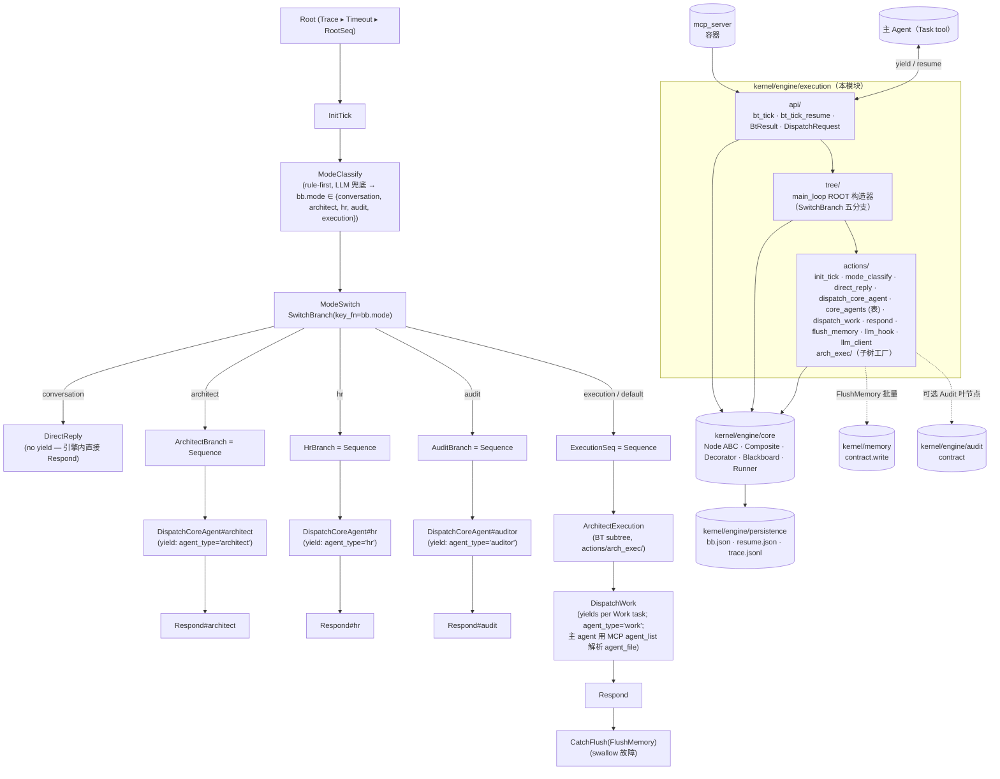

## Positioning

CBIM 执行任务循环的**驱动引擎**。每一次用户 prompt 触发一次全局根节点 tick，由树拓扑决定派谁、装饰器决定异常治理、黑板承载全部跨节点状态。主 agent 不再是"控制流 + 执行手"，退化为"具备 Task 工具的执行手"——控制流被抽到本模块。

**对应文档**：[`design/WORKFLOW-EXECUTION.zh-CN.md`](../../../../../design/WORKFLOW-EXECUTION.zh-CN.md)（执行循环语义、黑板字段、树拓扑、五阶段 Action 契约）、[`../README.md`](../README.md)（引擎实现规约）。本 .dna 不重复设计稿内容——只固化"对外是什么、对内由谁负责、谁也别想破窗"。

**它不是什么**：

| 误解 | 澄清 |
|------|------|
| 五角色子循环的一员 | 不是。本模块**驱动**所有五角色子循环（Coordinator / Architect / HR / Auditor / Work Agent），自身不参与任何业务循环。 |
| 一个调度器 / 计划器 | 不是。引擎不主动派发任何任务——所有"派谁"通过 `BtResult.Yield(dispatch_request)` 交还主 agent，由主 agent 的 Task tool 实际派出。引擎不持有可执行回调。 |
| 一个事件总线 | 不是。节点之间不通过事件通信，只通过黑板字段读写。引擎不 emit 跨进程事件。 |
| 跨 session 任务调度器 | 不是。一次 tick 的生命周期止于 `BtResult.Done` / `BtResult.Error`；孤儿 tick（主 agent 崩溃留下的 `bb_status=running`）默认归档不自动恢复。是否启用孤儿恢复由部署策略决定。 |
| 一个能改 v1 提示词流程的兼容层 | 不是。本引擎是 v2 范式的**唯一**驱动机制，与 v1 的 CLAUDE.md 自驱流程互斥；上线后 v1 提示词驱动废弃。 |

## Sub-module Relationships

**5 分支模式拓扑（v3.6 实装形态）**：根节点结构为 `Trace ▸ Timeout ▸ RootSeq`，`RootSeq = Sequence(InitTick → ModeClassify → ModeSwitch)`。`ModeClassify` 先按规则表分类（关键词命中即定型），命中失败时调 LLM 兜底（`NullLLM` 返回默认 `execution`）。随后 `ModeSwitch = SwitchBranch(key_fn=bb.mode)` 按 `bb.mode` 字段选择唯一一个子树执行。五个分支互斥、平级；`conversation` 完全不 yield，三个核心 agent 分支各 yield 一次，`execution` 分支按其内部 `DispatchWork` 派发的 Work 任务数 yield 多次。

| Mode | 子树 | 是否 yield | DispatchRequest.agent_type |
|------|------|------------|----------------------------|
| `conversation` | `DirectReply` | 否（引擎内直接 Respond） | — |
| `architect` | `ArchitectBranch = Sequence(DispatchCoreAgent#architect → Respond#architect)` | 是（一次） | `"architect"` |
| `hr` | `HrBranch = Sequence(DispatchCoreAgent#hr → Respond#hr)` | 是（一次） | `"hr"` |
| `audit` | `AuditBranch = Sequence(DispatchCoreAgent#auditor → Respond#audit)` | 是（一次） | `"auditor"` |
| `execution`（含 default 回退） | `ExecutionSeq = Sequence(ArchitectExecution → DispatchWork → Respond → CatchFlush(FlushMemory))` | 是（每个 Work 任务一次） | `"work"` |

**v3.6 重要变更：`HrExecution` 子树从 `ExecutionSeq` 中移除。** 执行链路从 `arch_exec → hr_exec → DispatchWork` 简化为 `arch_exec → DispatchWork`。理由：(a) 现有 Work Agent 集合短小（programmer / coder / tester …），LLM 能在 yield 时直接匹配，无需引擎内子树流转；(b) 真正的能力缺口治理是治理根 `hr_gov` 子循环的职责，不放在执行热路径上；(c) 链路过长使每条普通业务请求都跑一遍 hr_exec 的 Scan/Match/Decide，性价比低。**`hr` 分支与 `hr_gov` 治理子树保持不变**——`hr` mode 是用户显式 `招个 X agent` 的直答路径，`hr_gov` 是后台扫健康度，二者均不受此次裁剪影响。

**`DispatchWork` 的 agent_file 解析职责改由主 agent 承担**：架构师 `Assemble` 仍在 `arch_plan` 每个 task 上写 `required_capability`（枚举值见 `arch_exec/assemble.py::_VALID_CAPS`），但**不**写 `agent_file`。`WorkAgentLeaf.tick` yield 出的 `DispatchRequest` 携带 `agent_file=None` 与新增的 `required_capability` 字段；主 agent 据此调 MCP `agent_list` 匹配 `.claude/agents/*.md`，匹配不到则回退到默认 work agent `.claude/agents/programmer/programmer.md`。匹配逻辑由 CLAUDE.md 主 agent 提示词承载，不在引擎进程内。

**核心 agent 三分支共享的路径表**：`DispatchCoreAgent(agent_type=...)` 的 `agent_file` 由 `actions/core_agents.py::CORE_AGENT_FILES` 唯一来源解决——这是三大核心 agent → `.claude/agents/*.md` 路径映射的 SoT。三个分支结构同构，差异只在构造 `DispatchCoreAgent` 时传入的 `agent_type` 字符串与对应 `Respond` 节点名后缀。Work Agent 不在该表内——其 `.claude/agents/*.md` 选择由主 agent 在收到 yield 时即时匹配。

**子模块关系**：

| 关系 | 方向 | 说明 |
|------|------|------|
| `tree` → `engine/core` + `actions` | 静态拼装 | `tree/main_loop.py::build_root(llm)` 用 `Sequence(...)` `SwitchBranch(...)` `Trace(Timeout(...))` 拼出 `ROOT` 常量；不参与运行时调度 |
| `actions/arch_exec/` → `engine/core` + `actions/llm_hook` | 子树工厂 | `actions/arch_exec/` 暴露 `build_architect_execution_subtree(llm)` 工厂，由 `tree/main_loop.py` 调用并装入 `ExecutionSeq` 头部；子树全部在引擎进程内 tick，不产生 yield |
| `actions/*` 普通叶 → `engine/core` | 实现 `Node` ABC | 每个 Action 是 `engine.core.Node` 的一个子类，签名 `tick(bb) -> Status` |
| `api` → `tree` + `engine/core` + `kernel/engine/persistence` | 入口启动 / 恢复 | `bt_tick` 读 `ROOT` 启 `engine.core.Runner`；`bt_tick_resume` 调 `persistence.snapshot.read_bb / read_resume` 后由 Runner 按 `runner_resume_path` 重建栈；路径前缀注入为 `.cbim/scheduler/bt/<tick_id>/` |

**无循环依赖**——单向自顶向下：`api → tree → {engine/core, actions} → {kernel/engine/persistence, memory.contract, audit.contract}`。`actions` 与 `engine/core` 同级（actions 实现 `engine/core` 的 ABC，不形成环）。

**注：`engine/core` 是 execution 和 dream 共享的平级原语库**——不属于任一根内部。两根（`engine/execution` 与 `engine/dream`）都依赖 `engine/core` 的 Node ABC / Composite / Decorator / Runner / Blackboard，同时两根都依赖 `engine/persistence/` 的持久化与 trace 文件格式；但两根各持独立根树、独立黑板、独立入口工具。依赖方向 `execution → engine/core`、`dream → engine/core`，**execution 与 dream 互不依赖**（单向铁律）。`execution/` 模块本身只承载执行根树拓扑（`tree/main_loop.py`）与 mode 分发 Action 实现；治理根树拓扑（DreamRoot）归 `engine/dream/tree/` 承载；bb/resume/trace 文件 I/O 归 `engine/persistence/` 承载（两根共用同一个持久化模块，路径前缀由 api 层注入）。

## Origin Context

CBIM v1 的执行循环是主 agent 在 CLAUDE.md 提示词内自驱：主 agent 同时是控制流（"现在该做什么"）与执行手（"用 Task tool 派谁"）。这导致：

- **控制逻辑不可静态审计**——必须读 prompt 才能知道决策路径；
- **异常处理散落各处**——"如果 X 则 Y"分散在每段提示词里；
- **恢复语义模糊**——一次任务的状态混在对话历史里，无法精确"从中断点继续"。

v2 把控制流抽到引擎，主 agent 退化为执行手。树拓扑可读、装饰器统一异常、状态全在黑板 + `.cbim/scheduler/bt/<tick_id>/`，与对话历史解耦。这就是本模块存在的全部理由。

**双根架构的引擎载体**：BT 引擎不止驱动一棵根树。CBIM 有两个根循环——执行循环（用户驱动，本模块的 `tree/main_loop.py`）和治理循环（SessionStart 补跨驱动，`engine/dream/tree/dream_root.py`）——都跑在本模块的 `core/` 之上。共享行为树引擎本体而黑板 / 根树 / trace / 入口工具各自独立，是 CBIM 双根架构的工程实现方式。

## Key Decisions

- **行为树是 v2 唯一的驱动机制。** 不是“可选优化”，不是“补丁”。本模块上线后，v1 的 CLAUDE.md 自驱流程废弃。控制流的产权从提示词收归到 `tree/main_loop.py`；主 agent 提示词只描述“如何忠实执行 Task tool 派出的子任务”。
- **黑板是跨节点状态的唯一容器。** 节点对象**不持有任何跨 tick 状态字段**——这是 design §2 铁律。节点对象在 Runner 视角是无状态可重建的；任何“在节点上加个 self.x”的写法都是破窗，会让恢复执行不可能正确。组合节点的“当前子节点指针”也必须落黑板（写入 `bb.runner_resume_path` 最后一段），组合节点对象不存。
- **黑板字段单写多读 + schema 校验。** design §2.1 的 14 字段每个都有唯一写者（Root / ModeClassify / DispatchCoreAgent / DispatchWork / Respond / FlushMemory / Audit / 引擎自身）；其他节点只读。`bb.json` 落盘前 Runner 按 schema 校验，违规即 `BtResult.Error`。这是恢复正确性、可审计性、调试性的共同地基。`agent_assignments` 字段随 hr_exec 一同废弃，该字段从 blackboard FIELDS 中删除（schema_version 由 2 推进至 3）。
- **节点 Status 三态封死。** `Status = {SUCCESS, FAILURE, RUNNING}`。**不引入 INVALID 等第四态**——这类语义全部由装饰器（Catch / IterationGuard）转换为 SUCCESS/FAILURE/RUNNING 之一并写 `bb.interrupt_reason`。叶节点不抛业务异常；业务错误一律走 FAILURE + `bb` 状态字段。
- **RUNNING 跨 tick 恢复 = `bb.runner_resume_path` + 黑板状态字段。** Runner 落 `bb.json` + `resume.json`，下次 `bt_tick_resume` 读盘 → 按路径重建栈 → 通过 `on_resume(bb, payload)` 把 dispatch 结果交给路径末端的 Action → 继续 `tick(bb)`。重建出的是“中断前的同一棵活树”——这是节点无状态铁律的全部价值。
- **协程式 yield/resume 是 `bt_tick` 的唯一形态（L7 决议）。** 引擎不持有可执行回调、不主动派工。需要派 agent 时把 `DispatchRequest` 装进 `BtResult.Yield` 返回给主 agent，由主 agent 用 Claude Code Task tool 实际派出，结果通过 `bt_tick_resume(tick_id, dispatch_result)` 回交。**严禁引擎自派绕过 Task tool**——绕开会破坏 Claude Code 的会话/权限/计费模型。
- **Action 实现可用 LLM，但调度逻辑全程 PROG。** `arch_exec` 各节点内部允许调 LLM 做兜底/主决策；但树拓扑（tree/main_loop.py）、Composite/Decorator 行为、Runner 调度全是确定性 Python 代码，可静态审计、可单步重放。LLM 客户端通过 Action 构造器注入（不在模块级 import），便于测试用 `StubLLM` 替换。

### 子循环 = 真实 BT 子树（不再是 NodeSpec 描述器）

- **architect_execution 子循环现在是真实的 Python BT 子树**，挂载在 `ExecutionSeq` 头部（通过嵌套子树组合），不再是 NodeSpec 描述器交给主 agent 心智执行。子树由 `actions/arch_exec/__init__.py::build_architect_execution_subtree(llm)` 构建，其内部每个节点对应一次独立 LLM 调用（`LlmActionLeaf`）或一次确定性 Python 操作。**原 `hr_exec` 子树在 v3.6 中删除**——不再有该构造器；原 `actions/hr_exec/` 包、`loops/hr_execution.py` 身上的 `build_hr_execution_subtree` 重导出、`blackboard.FIELDS` 中的 `agent_assignments` 均同步下架。
- **每个子循环节点单独 prompt / 单独 parse / 单独 output_field**——禁止“一次 LLM 调用包揽子循环全程”的描述器模式。intent_analyze / decompose / arch_gate / scan / extract / worth / state_check / diff / create / validate / map_tasks / assemble 等节点各自一个叶，按 `engine/core` 的一 tick 一 LLM 调用铁律落实。
- **三个核心 agent 分支仍然各 yield 一次（适用到 architect / hr / audit 三 mode）**。这三个分支通过 `DispatchCoreAgent(agent_type=...)` 叶节点 yield——这是主 agent 用 Task tool 派三大核心 agent 的唯一路径。`hr` mode 的路径不受 v3.6 裁剪影响：该路径是“用户显式说招个 X agent”时的直接转交入口，与被删除的 hr_exec（执行中段能力匹配）是两回事。
- **`ExecutionSeq` 的 yield 在 `DispatchWork` 一节点**，Work Agent 仍需经 Claude Code Task tool 派出；一个 `ExecutionSeq` 执行可能产生多次 yield（子任务数个）。另外 `ExecutionSeq` 尾部的 `CatchFlush(FlushMemory)` 是唯一走记忆落盘的位点，其他四个分支不 flush memory。
- **`DispatchWork` 不再依赖 hr_exec 填 `agent_file`**。`WorkAgentLeaf` yield 出的 `DispatchRequest` 携带 `agent_file=None` 与 `required_capability`（从 arch_plan task 读取）；主 agent 收到 yield 后调 MCP `agent_list` 完成匹配，匹配不到回退到 `.claude/agents/programmer/programmer.md`。这把“能力 → agent_file”的查表职责从引擎进程外移到主 agent，避免为一条查表职责在引擎进程内拉一个 LLM 子树。
- **嵌套子树是 `engine/core` 天然支持的组合方式**。`Composite` 接受任意 `Node` 实例为子节点，子树根节点与普通叶节点对 Composite 等价；递归 tick 自然完成。execution 侧不引入任何“子树宿主”特殊适配层。
- **NodeSpec 描述器废弃为兼容垫片**。`loops/architect_execution.py` 中的 `NODE_SPECS` 保留供单元测试与旧版工具读取，**不再进入运行时调用路径**；真正的子循环执行由 `build_architect_execution_subtree(llm)` 工厂构建并装入根树。`loops/hr_execution.py` 随 hr_exec 子树一同删除（不保留描述器垃圾）。

### 5 分支模式拓扑 + 三大核心 agent 平级直派

- **根节点形态从 `Sequence(IntentAnalyze → Decompose → Dispatch ...)` 改为 `Trace ▸ Timeout ▸ Sequence(InitTick → ModeClassify → SwitchBranch(by bb.mode))`，五分支互斥。** 一次 tick 经 `ModeClassify` 定型 `bb.mode ∈ {conversation, architect, hr, audit, execution}`，SwitchBranch 据此选唯一子树执行。多阶段编排归子树内部（`ArchitectExecution` 子树装在 `ExecutionSeq` 头部）或归调用方循环（用户连续 prompt），引擎根树不承担。
- **Architect / HR / Auditor 是引擎一等公民，与 Work Agent 平级。** 引擎根树为这三类各开独立分支（`ArchitectBranch` / `HrBranch` / `AuditBranch`），每个分支以 `DispatchCoreAgent(agent_type=...)` 作为 yielding 叶独立产生 `agent_type` 字段不同的 yield。三个分支结构同构 `Sequence(DispatchCoreAgent#<type> → Respond#<type>)`，差异只在构造参数。它们**不**经 HR 中转匹配——HR 自身就是其中一个 mode，绕到 HR 内部去派 Architect / Auditor 是逻辑回环。
  - **理由 1（依赖方向）**：Architect / Auditor 是控制流层产物（架构治理、独立审计），HR 是能力管理层产物（Work Agent 生命周期）；让控制流依赖能力管理是反向。
  - **理由 2（启动期可用性）**：HR 模块自身未就绪时，Architect 与 Auditor 仍需可用——否则陷入“要先用 HR 才能拿到 Architect 来设计 HR”的鸡蛋循环。
  - **理由 3（C3 单向依赖）**：三大核心 agent 各自的 `.claude/agents/*.md` 路径由引擎直接持有——SoT 是 `actions/core_agents.py::CORE_AGENT_FILES`，`DispatchCoreAgent` 构造时查表填 `DispatchRequest.agent_file`；不经任何 agent 匹配过程。Work Agent 才需要主 agent 在 yield 时匹配，因为 Work Agent 集合是开放可扩展的。
- **三个核心 agent 分支只产生一次 yield，回 resume 后直接 Respond。** 不引入“一个 mode 多次 yield 循环逼近收敛”的形态——若任务确需多轮，由用户的下一次 prompt 触发新 tick（即新一次 SwitchBranch 决策）。`execution` mode 例外：`DispatchWork` 按子任务数 yield 多次，但仍是同一次 tick 内的顺序派发，不是收敛判断。这把“收敛判断”的产权交给用户与上层调用方，引擎只负责单跳派工 + 子任务顺序派发。
- **ModeClassify 是唯一的 routing 决策节点（规则优先 + LLM 兜底）。** 五分支各自的子树内部可再用 LLM 做内容生成（如 `Respond` 的 user_message 渲染、`arch_exec` 各叶的独立 LLM 调用），但“派谁”的决策只在 ModeClassify 这一个叶节点完成、写一次 `bb.mode`、之后再不改。这保证审计与重放只需检查一个分类输入 / 输出。规则优先序（见 `mode_classify.py`）：architect > hr > audit > execution-verb > conversation。

- **HR 职责边界与本引擎的分工（跨模块契约）。** 本引擎的 `execution` mode 的 `DispatchWork` 只负责按 `arch_plan` 的 `required_capability` yield；“能力 → `.claude/agents/*.md` agent_file”的读侧查表不由引擎进程承担，而是主 agent 收到 yield 后调 MCP `agent_list` 即时完成。HR 作为一个 CBIM 角色的职责是 Work Agent 生命周期的**写侧**（招募 / 训练 / 治理 / 能力画像），走两条独立路径：`hr` mode 的 `hr_request` 直答（用户显式“招个 X”）+ 治理根的 `hr_gov` 子循环（后台扫健康度）。反向响应“查表”的读侧职责不走 HR——详见 [`../../cbi/agents/.dna/module.md`](../../cbi/agents/.dna/module.md) 中 HR 负责能力画像与 agents 集合治理、不负责控制流上的“哪个 agent_file 能接什么活”。这是 C3 单向依赖的直接体现：控制流层（execution）不依赖能力管理层（HR）的运行时查表服务。

### v3.7 — ModeClassify 精度修复：执行意图优先 + 收紧核心 agent 触发词

- **精度优先序翻转**：从 v3.5/v3.6 的 `architect > hr > audit > execution-verb > conversation` 改为 v3.7 的 `architect-preempt > execution-verb > architect-request > hr-request > audit-request > conversation > LLM 兜底`。核心改动原则有三：(1) 执行动词率先短路，避免 "修审计模块的 bug / 重构招聘流程代码" 这类执行任务被核心 agent 主题词误抢；(2) 核心 agent 三表只匹配"显式请求该核心 agent"的短语（直呼角色名 + 派工动词、或元任务动词 + 角色专属产出），不再吃裸主题词；(3) `split/merge/deprecate (a) module` 与 `update .dna` 因语义上无 execution 落点，单独前置为 `_ARCHITECT_PREEMPT_PATTERNS` 预检层，优先于 execution 动词。Schema、契约、黑板字段、持久化均不动；唯一已知翻转的回归用例为 `test_mode_classify_architect_wins_over_execution_verb`。完整草案（问题表、五条策略、五张 pattern 表全文、新主循环顺序、回归用例、programmer 交付清单）见 [`design/MODE-CLASSIFY-V3.7.md`](../../../../../design/MODE-CLASSIFY-V3.7.md)。

## Non-Goals

- **不引入事件总线。** 节点之间只通过黑板通信，引擎不 emit 跨进程事件、不发布订阅、不广播。
- **不做 scheduler。** 本模块不持有"何时该跑什么"的判断——一次 tick 由用户 prompt 触发，结束于 Done/Error；跨 prompt 的任务编排不在本模块范围。
- **不做跨 session 持久化的任务调度。** `.cbim/scheduler/bt/<tick_id>/` 仅服务于"单次 tick 内的 yield/resume 恢复"。主 agent 崩溃后的孤儿 tick 默认归档不自动续跑；`bt_list_running_ticks()` 仅提供观测，不提供续跑承诺。
- **不主动派 Work Agent 绕过 Claude Code Task tool。** 任何 Action 需要派子 agent 一律通过 yield → 主 agent Task tool → resume 回路。引擎进程内**不**持有任何"直接调用其他 agent 的客户端"。
- **不暴露黑板直接写。** 黑板字段的写者由 design §2.1 表锁定；外部（包括主 agent、MCP 调用方、其他 engine 子模块）不能跨过 Action 直接写 bb。
- **不复用 engine.logger 的 session 日志通道做节点 trace。** 节点 trace 走自管 `trace.jsonl`（append-only，可重放）；session 级日志归 `engine.logger`，两套观测体系互不串扰。

- **不回退到"单次 LLM 调用包揽子循环全程"的描述器模式。** 子循环的每个节点必须拥有独立 prompt 与独立 parse；任何"为了节省 token / 升途设计重新把多个语义步骤填进一个 prompt"的重构提议被明确拒绝。审计 / 重试 / 调试粒度为以 LLM 调用为单位，这是不可赎回的约定。
- **不保留 NodeSpec 描述器产出路径。** `loops/architect_execution.py` / `loops/hr_execution.py` 中的 NodeSpec 仅作为兼容垫片；不再被引擎调度入口调用，下一个版本与 `compose_prompt` 辅助函数一同废弃。

### 5 分支拓扑边界锁定

- **不新增第 6 个 mode（特别是不加 `memory_query` mode）。** 记忆查询不构成根级控制流分支——它要么是某个 Action 内部对 `memory_query` MCP 的调用（如 `mode_classify` 检索历史辅助分类、`respond` 渲染时引用过往决议），要么是用户显式 prompt 触发的 `direct` mode 内回答。把"查记忆"拔到 mode 级别会让根树不可枚举闭合，破坏 SwitchBranch 的有限分支约束。任何"我们再加一个 mode"的提议都要先回答"为什么不能塞进现有 5 个之一"。
- **不把 Auditor 移到 HR 下管理。** Auditor 是引擎一等公民——独立 `.claude/agents/auditor/auditor.md`、独立 `DispatchAuditor` 子树、独立 `agent_type="auditor"` 的 yield。任何"让 HR 统一管所有 agent 包括 Auditor"的重构提议被明确拒绝：Auditor 的独立性是审计权威性的前提，受 HR 调度的审计员不再是独立审计员。Architect 同理。
- **不允许 mode 在一次 tick 内改写。** `ModeClassify` 写完 `bb.mode` 后字段封死；后续节点（含 resume 后重入的节点）只读不写。需要切换 mode 只能通过用户的下一次 prompt 触发新 tick。这保证 SwitchBranch 选择在一次 tick 内幂等，恢复时无需考虑"中途改道"。

- **不在执行热路径上做 agent 能力匹配。** `agent_file` 解析归主 agent 收到 `BtResult.Yield(agent_type=work)` 时调 MCP `agent_list` 完成（这是系统级查询能力，主 agent 即时调用）；HR 的真正职责在写侧——招（招募）/ 训（训练）/ 治（治理），通过 `hr` mode 的 `hr_request` 直答路径 + `hr_gov` 治理子循环两路径承载，与执行热路径的读侧能力查表彻底解耦。

## Outbound

- **kernel/engine/core（复用）** —— Node ABC / Composite / Decorator / Runner / Blackboard 全部依赖。`engine/core` 是 execution 和 dream 共享的平级行为树原语库，不属于任一根内部；两根各自依赖、互不依赖。
- **kernel/engine/persistence（共享持久化）** —— `engine.core.Runner` 调 `snapshot.write_bb` / `write_resume` / `read_bb` / `read_resume`，调 `trace.append_event`。路径前缀由 `api/bt_tick.py` 注入为 `.cbim/scheduler/bt/<tick_id>/`。与 `engine/dream` 共用同一个持久化模块，该模块本身不区分两根；磁盘路径隔离是调用方职责。
- **kernel/memory（contract）** —— 仅 `FlushMemoryAction` 调 `memory_write`；其他 Action 严禁直接调记忆服务，只能往 `bb.memory_flush_queue` push。记忆故障被 `@Catch` 吞掉，不阻塞用户回复。
- **kernel/engine/audit（contract）** —— 可选叶节点 `AuditAction`。是否挂载由 `tree/main_loop.py` 根据 `bb.intent.kind` 决定（变体树由组合工厂返回，根仍唯一）；挂载时产出写 `bb.audit_report`。
- **mcp_server（反向，容器）** —— 不在本模块 dependencies 中；`mcp_server` 把 `api/bt_tick.py` 的两个函数注册为 MCP 工具，函数签名即工具签名。引擎不感知 MCP 容器存在。

依赖方向：`execution → engine/core`、`execution → kernel/engine/persistence`、`execution → memory.contract`、`execution → audit.contract`、`mcp_server → execution`。无环。

