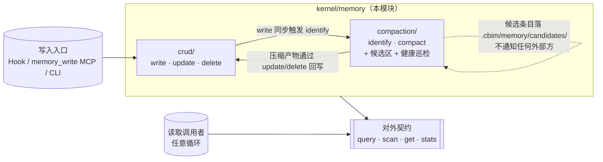

## Positioning

**项目本地的独立存储+查询服务**，类比一个嵌入式数据库。它有自己的内部生命周期（CRUD ↔ 压缩升级），对外只暴露 4 个**只读**接口（`query` / `scan` / `get` / `stats`）。

**它不是什么**：

| 误解 | 澄清 |
|------|------|
| 一条从原始到知识的单向晋升流水线 | 不是。CRUD 与压缩升级是**双向闭环**：写入会触发候选识别，候选区压缩后还可能反哺为新的低层条目。 |
| 由 Stop Hook 链式驱动的提炼到 `.dna/` 的链路 | 不是。Hook 只是众多写入来源之一，与显式 `memory_write`、压缩升级触发器地位等同。 |
| 一个"为四大循环服务"的子系统 | 不是。它是被动数据服务，与四大循环**平级**。循环消费它，但它不知道循环存在。 |
| 一定要"晋升到 `.dna/`"才算成功 | 不是。绝大多数记忆条目终其生命周期都不会进入 `.dna/`，这是常态而非失败。 |
| Session 恢复者 / 事件源 / 调度参与方 | 不是。本模块不感知会话生命周期、不 emit 事件、不参与任何调度决策。 |

## Sub-module Relationships

**子模块关系**：

| 关系 | 方向 | 说明 |
|------|------|------|
| `crud` → `compaction` | `write` 同步调用 `identify` | "Create 一体两步"的第 2 步；不通知外部 |
| `compaction` → `crud` | `compact` 通过 `update` / `delete` 回写 | 改盘的唯一入口在 `crud`；`compaction` 不持有文件写权限 |
| `compaction` ↔ `candidates/` | 独占工作区 | G3 决议：路径独立，不复用 `short/` / `medium/` |

**无循环依赖**——`crud` ↔ `compaction` 是**双向调用**，不是双向静态依赖：调用方向相反（一个同步、一个异步），且 `crud` 持有"接口定义权"（compaction 的 `identify` 由 crud 在 write 第 2 步触发），形成"identify 同步 / compact 自治"的清晰分工。静态依赖只有一条：`compaction → crud`。

## Key Decisions

- **被动数据层定位是铁律。** 本模块不参与业务调度、不主动通知任何方、不区分调用者身份（接口不接受 `agent_type` / `caller_role`）。同一查询条件，谁来查结果都一样。任何"为某循环优化视图"的需求由上层 ACL/Filter 包装实现，**不**在本模块内。这是 v3 设计稿 §3 契约硬约束与 §5 排除项 #3 的总和。
- **4 个对外接口稳定优先，签名在 `contract.md`。** `query` / `scan` / `get` / `stats` 全部进入本模块 `contract.md`，按公共契约级别管理：新增字段可向后兼容追加，删除/重命名需走 contract 变更流程。`stats` 不是临时调试接口——G4 决议明确将其与其余 3 个并列稳定化，audit / 健康度观测对它有长期依赖。
- **写入路径不在对外契约内。** 所有写入都通过 Hook / `memory_write` MCP / CLI **三条**明确入口进到 `crud/` 子模块，外部循环**不能**直接写记忆库。这是 v3 设计稿 §5 排除项 #4 的明文约束：开放写入会让循环绕过候选识别直写存储，导致 `index/` 与 `candidates/` 状态漂移。
- **与 `.dna/` 知识系统是同级独立系统。** 记忆条目可能被人工或 Architect **复制**到 `.dna/`，但这是知识侧的**导入**动作，不是本模块的"出口"。本模块对"晋升"无感知；`compaction/` 只生成候选条目并标记 `promote_candidate`，等知识循环来 `scan(filter="promote_candidate")` 自取。
- **子模块分工的稳定性等同对外契约。** `crud/` 持有所有改盘动作的入口，`compaction/` 持有所有压缩升级与候选区管理；两者职责零重叠。任何"在父模块写 SQL 直接读 short/"或"在父模块绕过 crud 写 medium/"的实现都是破窗。父模块只暴露 4 个只读接口的转发，**不**在父模块层放任何业务逻辑。

## Non-Goals

- **不是事件源。** 任何写入、压缩、候选识别都不 emit 事件、不调外部回调、不写跨模块日志（模块内部观测日志除外）。
- **不是调度参与方。** 不持有任何"何时该跑什么"的判断；`compact` 由 CLI / 定时 / 阈值独立触发，触发逻辑不在本模块。
- **不是 Session 恢复者。** Session 启停由 Hook 处理；Hook 通过 `crud/` 的写入接口把会话片段落盘，但本模块不知道"会话"这个概念。
- **不是知识系统。** 不评判一条条目是否"值得晋升"；只识别"形态上像候选"并打包，决断权在知识循环。
