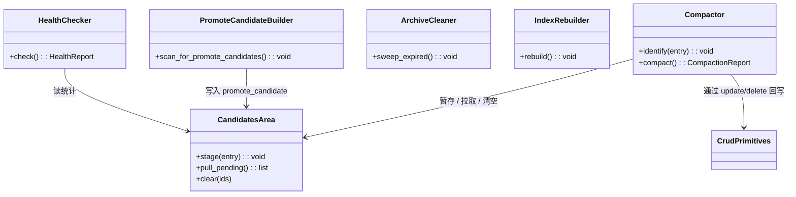

## Positioning

记忆服务的**压缩与升级层**：承载 5 个压缩升级操作（短→中蒸馏、提升候选生成、归档清理、索引重建、健康巡检），独占 `candidates/` 工作区。识别只产生候选不通知任何外部循环；所有改盘动作都通过 `crud/` 的 `update` / `delete` 回写。

## Class Diagram

## Key Decisions

- **`candidates/` 是本模块独占的工作区，路径独立。** v3 设计稿 G3 决议：候选区不是第三层存储，是压缩流程的工作区；物理上独立于 `short/` / `medium/`（位于 `.cbim/memory/candidates/`），不与任何存储层混路径。它的数据结构、生命周期、读写时机全部归本模块。外部只能通过父模块 `kernel/memory` 的 `scan(filter="promote_candidate")` 只读地拉候选清单。
- **提升候选只识别和打包，不通知。** 本模块识别出"值得被知识系统提升"的候选时，只把候选条目落进 `candidates/`（带 `promote_candidate` 标记），**不**调 Architect、**不**调 HR、**不** emit 任何事件、**不**唤醒任何外部循环。知识循环来 `scan(filter="promote_candidate")` 自取；自取后是否提升到 `.dna/` 是知识系统的事，与本模块无关。这是 v3 设计稿 G5 决议"提升候选只识别不通知"的实现承诺。
- **健康巡检逻辑归本模块，audit 只查 stats。** `HealthChecker` 在本模块内部实现容量、堆积、增长率等阈值判断；阈值穿透时只在巡检报告里说，不直接发告警。`audit` 模块如需做"记忆阈值越线"告警，只能通过父模块的 `stats()` 拉指标后自己判断——阈值知识不外溢。这是 v3 设计稿对 audit 边界的反向收窄。
- **本模块不持有任何文件写权限。** 所有改盘动作（合并 `short/` 条目、产出新 `medium/` 条目、删除被覆盖的原始条目、归档过期条目）都通过 `crud/` 的 `update` / `delete` 完成。本模块只在 `candidates/` 自己的工作区里做暂存；正式存储区的修改必须经 `crud/` 这一道闸门。
- **`identify` 被 `crud/` 同步调用；`compact` 独立触发。** `identify` 没有自己的触发时机，它是 `write` 一体两步里的第 2 步；本模块只负责"识别什么、怎么打包候选"。`compact` 才是本模块的自治动作，由 CLI / 定时 / 阈值独立触发——它不被任何写入路径拽动。这种"识别同步、压缩异步"的分离让写入路径保持轻量、压缩调度保持可控。
- **闭环自然收敛，无需外部判停。** `compact` 处理候选后回写的 `short/` / `medium/` 又会触发 `identify` 再次产生候选——形成内部闭环。但因为每次 `compact` 严格减少候选总数（合并、删除原始条目），闭环会自然收敛；本模块不需要外部回调或显式 stop 条件。

## Sub-module Relationships

无下级子模块。本模块是 leaf；横向上反向调用 `crud/` 的 `update` / `delete` 回写压缩产物，构成记忆服务内部的双向闭环。
