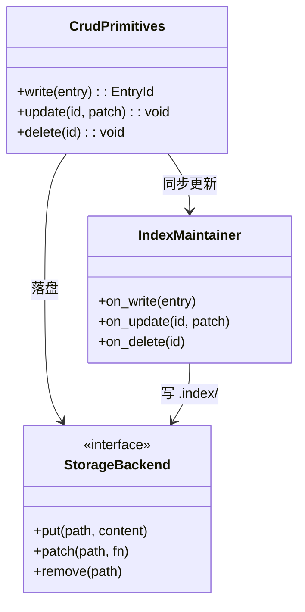

## Positioning

记忆服务的**写入与改删原语层**：承载 4 个 CRUD 原语（`write` / `update` / `delete` / 内部索引维护），是记忆服务内部所有"落盘 + 改盘"的唯一执行点。被 `compaction/` 反向调用以回写压缩产物；不暴露任何对外接口（对外的只读接口在父模块 `kernel/memory` 的 `contract.md`）。

## Class Diagram

## Key Decisions

- **Create 是"一体两步"的单一原语，不拆。** `write` 的对外语义就是一个原语；内部一定要按顺序完成两件事，且只在两件都完成后才返回成功：(1) 把新条目落盘到 `short/` 并同步更新 `index/`；(2) 调用 `compaction/` 的 `identify` 把命中压缩条件的候选复制到 `candidates/`。把这两步拆成两个 CRUD 原语会破坏"写入即识别"的同步语义，让上层有可能只跑前半步——这是 v3 设计稿 G5 决议明确禁止的。
- **`identify` 不通知外部，只是把候选状态写下来。** 第 2 步的副作用仅限于在 `candidates/` 落候选条目；不发起后续动作、不触发任何外部循环、不 emit 事件。后续 `compact` 由谁、何时跑，与 `write` 完全无关。该收窄由 `compaction/` 子模块承载；本模块只负责"调到、调对、调完"。
- **改盘的唯一入口在本模块。** 任何对 `short/` / `medium/` 的修改、任何 `index/` 的同步更新，都必须经 `crud/` 的三个原语；包括 `compaction/` 处理候选后产出的合并/覆盖结果，也必须通过 `update` / `delete` 回写——`compaction/` 不持有任何直接的文件写权限。
- **不持有对外接口。** 4 个对外只读接口（`query` / `scan` / `get` / `stats`）全部在父模块 `kernel/memory` 的 `contract.md` 内。`crud/` 是内部实现细节，**不**在父模块对外契约中出现；外部任何循环都不能直接调 `crud/`。写入侧的合法入口只有三条：Hook、`memory_write` MCP 工具、CLI——它们都先到父模块入口，再走入本模块。
- **`candidates/` 不归本模块管。** 候选区数据结构、识别逻辑、压缩流程在 `compaction/` 子模块；本模块只在 `write` 的第 2 步里调用 `compaction.identify(entry)`，把控制权交回去。这是 v3 设计稿 G3 决议（`candidates/` 独立路径）在子模块分工层面的体现。

## Sub-module Relationships

无下级子模块。本模块是 leaf；横向上被 `compaction/` 反向调用（回写压缩产物），构成记忆服务内部的双向闭环。

