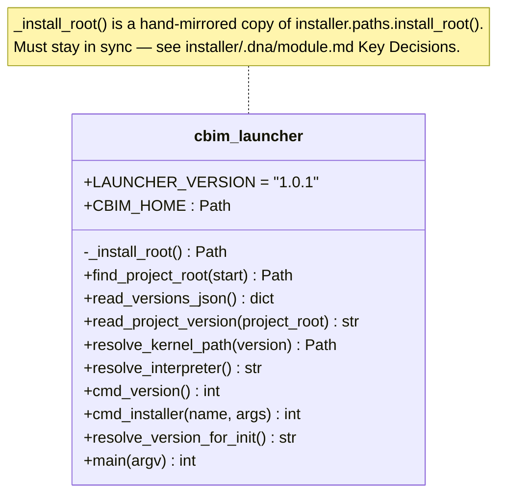

## Positioning

The `cbim` binary installed on `PATH`. Its sole job is to resolve which kernel version the current project pins to and exec that kernel's `__main__`. Must work across kernel upgrades without itself being upgraded. Depends only on the Python stdlib; never imports from `cbim_kernel` or `installer`.

## Class Diagram

## Key Decisions

- **Zero-dep launcher.** The launcher is the entry point — it cannot rely on `installer` or `cbim_kernel` being importable, because it runs *before* `PYTHONPATH` is set. So `_install_root()` is inlined (15 lines). Synchronizing this copy with `installer.paths.install_root()` is a hard rule called out in the installer module.
- **Walks up from cwd to find `.cbim/config.json`.** With a hard guard: never treats `~/` as a project root, even if `~/.cbim/config.json` exists (legacy install layout left some users with that file).
- **Routes a tiny allow-list of subcommands to the installer** (`install`, `upgrade`, `uninstall`, `use`, `versions`, `pin`). Everything else is forwarded to the kernel as-is. The launcher is stable; the kernel CLI is volatile.
- **`CBIM_KERNEL_OVERRIDE` dev hatch.** A developer can point at a kernel checkout to bypass version lookup. Used for self-hosted kernel development of this very repo.
- **`cbim upgrade` is routed to the installer**, not the kernel. The kernel-side `project.upgrade` module is invoked via `cbim upgrade check` / `cbim upgrade apply` — both of which the kernel handles as regular kernel subcommands once we add them. Open question for future: should `upgrade` go to installer or kernel? Current direction: keep `upgrade` in installer (it touches the install root), but `upgrade check` is a diagnostic that needs *both* sides — see `project/upgrade/.dna/`.

- **No activation primitive. No `cbim activate`, no sourceable script.** Running-shell PATH activation (the rustup `source $HOME/.cargo/env` pattern) is explicitly **out of scope**. Rationale: (1) shell activation requires sourcing a shell-specific script (`activate.sh` for bash/zsh, `activate.fish` for fish, `activate.ps1` for PowerShell) which couples the launcher to the parent shell — a coupling we deliberately do not want; the launcher is a *child process*, by definition unable to mutate its parent's environment, and pretending otherwise via cooperative sourcing leaks shell-detection logic into our module. (2) PATH placement is owned by `installer.bootstrap` and happens once at install time (Windows: `HKCU\Environment\Path`; POSIX: `~/.local/bin/cbim` symlink). After that, new shells pick it up automatically — the standard, predictable mechanism. (3) The cost of "the user must open a new terminal once after install" is one-time and well-understood; the cost of maintaining cross-shell activation scripts is permanent and high. The post-install message must explicitly state "Open a new terminal for 'cbim' to be available." so the user is not surprised. **Subcommand allow-list is therefore unchanged** by this decision: no `activate` is added to the installer-routed list, no `activate` is handled in the kernel.

- **Launcher content set is unchanged.** The launcher consists of exactly three files installed under `<install_root>/bin/`: `cbim_launcher.py` (the actual logic), `cbim` (POSIX shell shim that execs `python3 cbim_launcher.py "$@"`), and `cbim.cmd` (Windows batch shim that invokes `python cbim_launcher.py %*`). No `activate` script, no per-shell variant, no `cbim.ps1`. The POSIX `cbim` symlink at `~/.local/bin/cbim` (created by `installer.bootstrap`, not by the launcher itself) points at `<install_root>/bin/cbim`. **Separation of concerns:** the launcher *produces* the binary; the installer *places* it on PATH. These are owned by different modules and must not bleed into each other — if the launcher ever needed to know about `~/.local/bin/`, that would be a layering violation. (This boundary is the C3 rationale for why `installer.bootstrap.ensure_on_path` lives where it does, not in `bin/`.)
