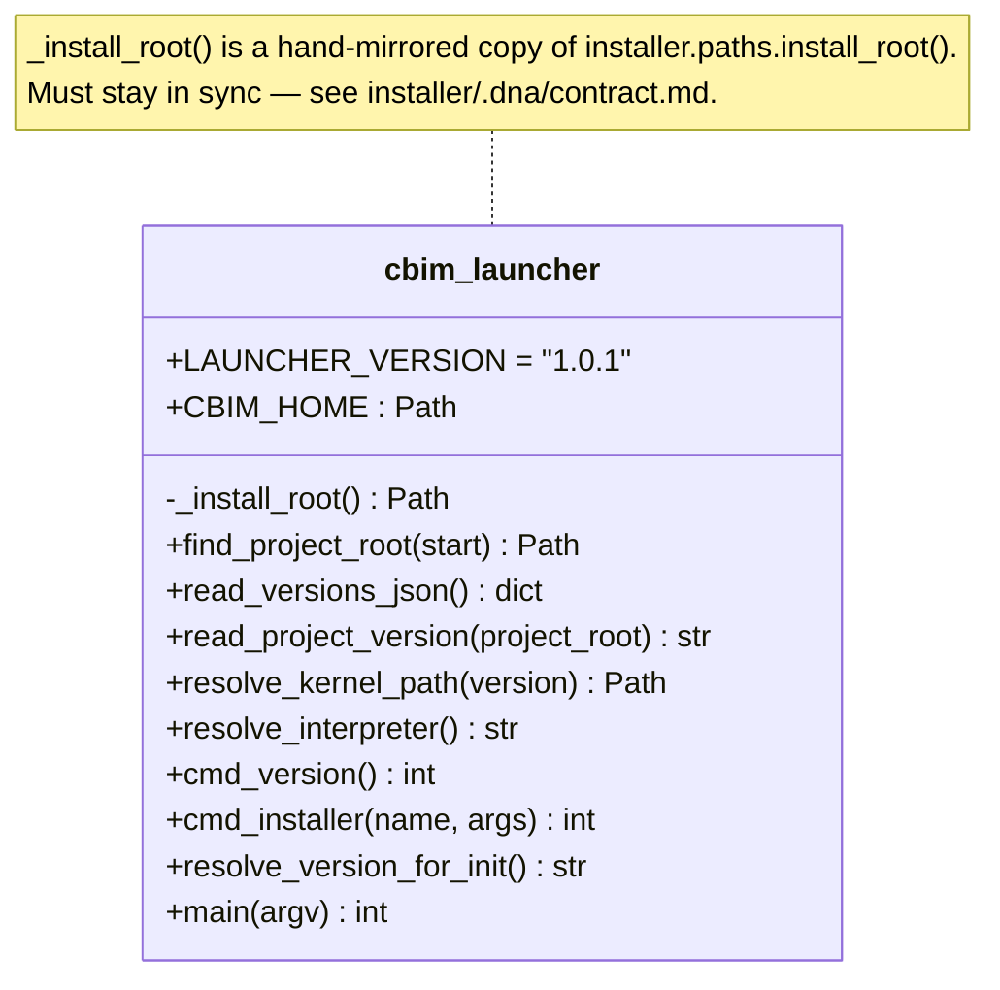

## Positioning

The `cbim` binary installed on `PATH`. Its sole job is to resolve which kernel version the current project pins to and exec that kernel's `__main__`. Must work across kernel upgrades without itself being upgraded. Depends only on the Python stdlib; never imports from `cbim_kernel` or `installer`.

## Class Diagram

## Key Decisions

- **Zero-dep launcher.** The launcher is the entry point — it cannot rely on `installer` or `cbim_kernel` being importable, because it runs *before* `PYTHONPATH` is set. So `_install_root()` is inlined (15 lines). Synchronizing this copy with `installer.paths.install_root()` is a hard rule called out in the installer contract.
- **Walks up from cwd to find `.cbim/config.json`.** With a hard guard: never treats `~/` as a project root, even if `~/.cbim/config.json` exists (legacy install layout left some users with that file).
- **Routes a tiny allow-list of subcommands to the installer** (`install`, `upgrade`, `uninstall`, `use`, `versions`, `pin`). Everything else is forwarded to the kernel as-is. The launcher is stable; the kernel CLI is volatile.
- **`CBIM_KERNEL_OVERRIDE` dev hatch.** A developer can point at a kernel checkout to bypass version lookup. Used for self-hosted kernel development of this very repo.
- **`cbim upgrade` is routed to the installer**, not the kernel. The kernel-side `project.upgrade` module is invoked via `cbim upgrade check` / `cbim upgrade apply` — both of which the kernel handles as regular kernel subcommands once we add them. Open question for future: should `upgrade` go to installer or kernel? Current direction: keep `upgrade` in installer (it touches the install root), but `upgrade check` is a diagnostic that needs *both* sides — see `project/upgrade/.dna/`.
