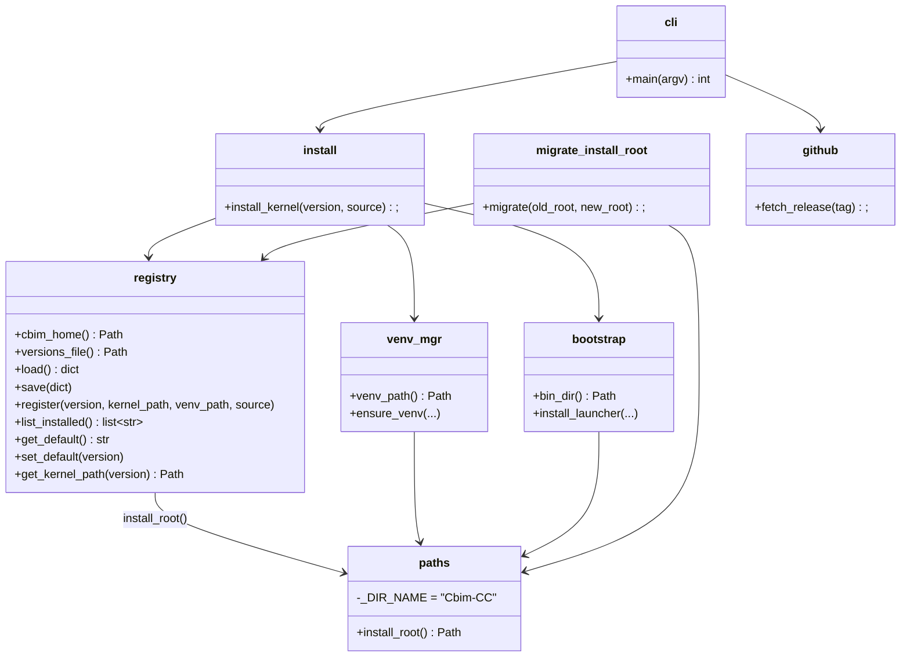

## Positioning

Owns the global Cbim-CC install root (`<install_root>/Cbim-CC/`): where it lives, which kernel versions are inside, which is default, the shared venv, and the on-disk versions registry. Never imports from `cbim_kernel`. Never knows anything about a particular project.

## Class Diagram

## Key Decisions

- **`paths.install_root()` is the single source of truth for "where is Cbim-CC installed".** All other modules (and the launcher, via an inlined copy) resolve through it. Resolution: `CBIM_INSTALL_ROOT` env > `%LOCALAPPDATA%\Cbim-CC` (Windows) > `$XDG_DATA_HOME/Cbim-CC` (POSIX). Hard-coding `Path.home() / ".cbim"` anywhere is a regression — the new layout intentionally moved off home.
- **Launcher inlines a copy of `install_root()`.** The launcher cannot import from `installer` (it must work before any package is on `sys.path`). The inlined copy at `v1/src/bin/cbim_launcher.py:_install_root()` MUST stay in sync with `paths.install_root()`. Comment in `paths.py` flags this contract.
- **`versions.json` is the single coupling point with the kernel.** Schema: `{active_default, installed: {ver: {installed_at, kernel_path, venv_path, source}}}`. All writes are atomic (temp + `os.replace` in the same dir). Anyone who wants to know "what kernels are installed?" reads this file — never the directory listing of `<install_root>/kernel/`.
- **Shared venv at `<install_root>/venv/`.** All kernel versions share one Python venv to avoid disk bloat. Upgrade is responsible for detecting when `requirements.txt` changed between kernel versions and rebuilding (or extending) the venv.
- **`migrate_install_root.py` exists for the one-time move from legacy `~/.cbim/` to the new XDG/LOCALAPPDATA root.** It is not part of the steady-state upgrade flow; the new `project.upgrade` module does *not* call it.
