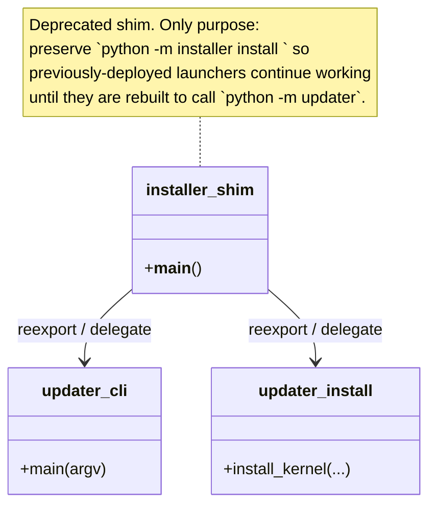

## Positioning

**This module is a deprecated reexport shim.** All real implementation has moved to `updater/` (see `v1/src/updater/.dna/module.md`). The `installer/` directory exists only to preserve the `python -m installer ...` subprocess entry point for one migration window, until every running launcher on disk has been rebuilt to invoke `python -m updater ...` instead.

Nothing new is added here. No new sub-modules, no new decisions, no new on-disk contracts. New work goes to `updater`.

## Class Diagram

## Key Decisions

### Why the shim exists at all

The launcher binary at `<install_root>/bin/cbim` and its source at `v1/src/bin/cbim_launcher.py` invoke updater via `python -m installer install <ver>` in `apply_flow` (kernel-side, pre-PR-7) and in some bootstrap paths. Renaming the Python package from `installer` to `updater` is a launcher-side change, but the launcher is the one piece on disk we cannot atomically swap during an upgrade — the running launcher started before the swap and will keep calling the old name for the lifetime of the apply operation.

The shim resolves this by accepting `python -m installer` invocations and forwarding them into `updater`. Once every supported launcher version on disk uses `python -m updater`, the shim is removed.

### Sole responsibility

The shim re-exports `updater.__main__`, `updater.cli`, and `updater.install.install_kernel` under the `installer.*` import path. It contains no logic of its own. Any bug found in install/upgrade/migrate behavior must be fixed in `updater`, not here.

### Removal criterion

The shim is removed when:
1. The launcher source (`v1/src/bin/cbim_launcher.py`) and all on-disk launchers have been rebuilt to invoke `python -m updater` directly.
2. `apply_flow.invoke_install` (now in `updater/upgrade/apply_flow.py`) is a direct in-process call to `install.install_kernel` and no longer uses the subprocess hop.
3. At least one full release cycle has passed where users upgrading via `cbim upgrade apply` from any supported prior version land on a launcher that uses `python -m updater`.

Until all three hold, the shim stays. Tracked as a follow-up to PR-7.

### What this module no longer documents

All install-pipeline design, PATH-placement rules, bootstrap responsibilities, migration roadmap, on-disk contract surface — moved to `updater/.dna/module.md`. Do not duplicate them here. If a reader lands on this file expecting design content, redirect them to `updater/`.
