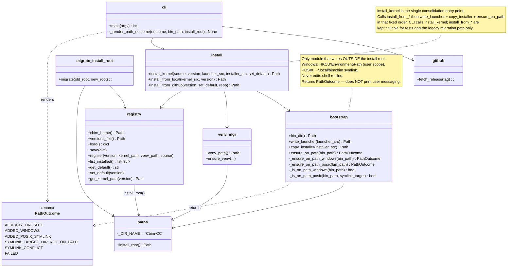

## Positioning

Owns the global Cbim-CC install root (`<install_root>/Cbim-CC/`): where it lives, which kernel versions are inside, which is default, the shared venv, and the on-disk versions registry. Also owns getting the launcher reachable on the user's `PATH` (the only writes the installer makes *outside* the install root). Never imports from `cbim_kernel`. Never knows anything about a particular project.

## Class Diagram



## Key Decisions

- **`paths.install_root()` is the single source of truth for "where is Cbim-CC installed".** All other modules (and the launcher, via an inlined copy) resolve through it. Resolution: `CBIM_INSTALL_ROOT` env > `%LOCALAPPDATA%\Cbim-CC` (Windows) > `$XDG_DATA_HOME/Cbim-CC` (POSIX). Hard-coding `Path.home() / ".cbim"` anywhere is a regression — the new layout intentionally moved off home.

- **Launcher inlines a copy of `install_root()`.** The launcher cannot import from `installer` (it must work before any package is on `sys.path`). The inlined copy at `v1/src/bin/cbim_launcher.py:_install_root()` MUST stay in sync with `paths.install_root()`. Comment in `paths.py` flags this contract.

- **`versions.json` is the single coupling point with the kernel.** Schema: `{active_default, installed: {ver: {installed_at, kernel_path, venv_path, source}}}`. All writes are atomic (temp + `os.replace` in the same dir). Anyone who wants to know "what kernels are installed?" reads this file — never the directory listing of `<install_root>/kernel/`.

- **Shared venv at `<install_root>/venv/`.** All kernel versions share one Python venv to avoid disk bloat. Upgrade is responsible for detecting when `requirements.txt` changed between kernel versions and rebuilding (or extending) the venv.

- **`migrate_install_root.py` exists for the one-time move from legacy `~/.cbim/` to the new XDG/LOCALAPPDATA root.** It is not part of the steady-state upgrade flow; the new `project.upgrade` module does *not* call it.

### Install Pipeline (call-site specification — closes audit F1/F2)

- **`install.install_kernel(...)` is the single consolidation entry point.** This function does not yet exist in `install.py`; introducing it is an **expected** part of this design, not optional. The implementer must add it before deleting the legacy rc-file code (next Key Decision). Its shape:

  ```python
  def install_kernel(
      source: Literal["local", "github"],
      version: Optional[str] = None,
      *,
      kernel_src: Optional[Path] = None,   # required when source == "local"
      launcher_src: Path,                  # path to v1/src/bin/cbim_launcher.py
      installer_src: Path,                 # path to v1/src/installer/
      set_default: bool = False,
      repo: Optional[str] = None,          # github only
  ) -> InstallResult: ...
  ```

  The return value is a small dataclass: `InstallResult(version, kernel_path, bin_dir, path_outcome: PathOutcome)`. The CLI uses `path_outcome` to render the user-facing message (see "PathOutcome enum" below).

- **Fixed call order inside `install_kernel`.** No reordering is acceptable; the order is load-bearing:

  1. `migrate_legacy_install_root()` — handle the one-time `~/.cbim/` move *before* any new write touches the new root.
  2. Dispatch to `install_from_local(kernel_src, version)` or `install_from_github(version, set_default, repo)` — places the kernel under `<install_root>/kernel/<version>/`, registers it, optionally sets default.
  3. `bootstrap.write_launcher(launcher_src)` — places launcher binaries inside `<install_root>/bin/`. Internal write. Idempotent (overwrites).
  4. `bootstrap.copy_installer(installer_src)` — places installer package inside `<install_root>/installer/`. Internal write. Idempotent (rmtree + copy).
  5. `bootstrap.ensure_on_path(bin_dir())` — the *only* step that writes outside `<install_root>/`. Returns a `PathOutcome`.
  6. Return `InstallResult(...)` to the caller (CLI), which renders user messaging.

  Steps 3-5 must run on every `install_kernel` invocation (not just first-time installs). They are idempotent and self-healing: a user who deletes `~/.local/bin/cbim` and reruns `cbim install` gets the symlink back without any special flag.

- **`install_from_local` and `install_from_github` keep their current signatures, but become package-internal helpers.** They are called from `install_kernel` and from `migrate_install_root`'s recovery path. The CLI (`_cmd_install`, `_cmd_upgrade`) calls `install_kernel`, never the `install_from_*` functions directly. Tests may continue to call `install_from_*` to exercise version-placement without triggering bootstrap.

- **CLI rewires to `install_kernel`.** `cli._cmd_install` and `cli._cmd_upgrade` must be updated to:
  1. Compute `launcher_src` and `installer_src` from the running installer's package location (the installer running on disk knows where the launcher source lives — typically `Path(installer.__file__).resolve().parent.parent / "bin" / "cbim_launcher.py"` and `Path(installer.__file__).resolve().parent`; the exact resolution is the implementer's call, but it MUST work both from the source checkout and from `<install_root>/installer/` after copy_installer has run).
  2. Call `install_kernel(source=..., ..., launcher_src=..., installer_src=...)`.
  3. Pass the returned `InstallResult.path_outcome` to `_render_path_outcome` for user messaging.

### Bootstrap responsibility (closes audit F8)

- **`bootstrap` owns two responsibilities, co-located deliberately.** Honest framing: bootstrap does *both* (a) internal writes that publish the launcher binaries inside `<install_root>/` (`write_launcher`, `copy_installer`) and (b) the single external write that publishes a PATH entry pointing at those binaries (`ensure_on_path`). These are conceptually separate but co-located because they form one install-time atomic action: "make `cbim` invocable". Splitting them into two sub-modules would force `install.install_kernel` to know the ordering between them (launcher files must exist before the symlink target is meaningful) — a constraint that is already self-evident when they live in one module. We accept the slight responsibility-overlap in `bootstrap` to keep that ordering invariant local. If a third external-write concern ever appears, revisit and split then.

- **PATH placement is the only external write.** Bootstrap is the *only* installer sub-module permitted to write outside `<install_root>/`. The only external write it performs is the PATH-placement primitive (Windows registry / POSIX symlink). If any future feature needs to touch anything else outside the install root, it must be added to `bootstrap` and called out here — not scattered across other sub-modules. This keeps "what the installer touches on a user's machine" auditable: install root + exactly one PATH-placement primitive per OS.

### Windows PATH placement

- **Scope:** user scope only (`HKCU\Environment\Path`). Never system scope, never `HKLM`. No UAC elevation prompt, no admin requirement.

- **Idempotency check (`_is_on_path_windows`):** read the current `Path` value from `HKEY_CURRENT_USER\Environment`; case-insensitive entry match against `<install_root>/bin` with trailing-backslash normalisation. If found, return `PathOutcome.ALREADY_ON_PATH` without writing. (Note: process-environment `os.environ["PATH"]` is **not** consulted on Windows — it is unreliable for "did we already add ourselves at the registry level".)

- **Write primitive:** `winreg.QueryValueEx` → mutate → `winreg.SetValueEx`. Preserve the existing value type: if the current registry value is `REG_EXPAND_SZ`, write back `REG_EXPAND_SZ`; if `REG_SZ`, write back `REG_SZ`. **We do NOT silently promote `REG_SZ` to `REG_EXPAND_SZ`** — that would change expansion semantics for other entries the user owns and is not our call to make. If the key is absent entirely, default to `REG_EXPAND_SZ`. The new entry we add (`<install_root>/bin`) contains no `%VAR%` placeholders, so it works identically under both types.

- **Propagation:** broadcast `WM_SETTINGCHANGE` with `lParam="Environment"` via `SendMessageTimeoutW` (timeout 5000ms, `SMTO_ABORTIFHUNG`). This causes Explorer and other GUI processes that listen for `WM_SETTINGCHANGE` to refresh their cached environment. **It does NOT update existing shell processes** (cmd, PowerShell, Windows Terminal tabs, VSCode integrated terminals, etc.) — those capture `PATH` at startup and never re-read the registry. Even *newly-spawned* processes only see the new PATH if their parent received and acted on the broadcast (Explorer-launched new windows: yes; new tab in an existing terminal: typically no). Existing shells must be restarted regardless. The post-install message (rendered by CLI) must say this plainly. Broadcast failure is swallowed silently — the registry write is what actually matters.

- **In-process patch:** the running installer's `os.environ["PATH"]` is patched so any immediately-following Python code in the same process can invoke `cbim` by name. The user's interactive shell is NOT affected — see the previous bullet.

- **Failure mode:** any `OSError`, `PermissionError`, or `winreg` exception during read/write returns `PathOutcome.FAILED` with the exception attached. The broadcast step never causes FAILED — broadcast failures are absorbed because the registry write already succeeded.

- **Footguns explicitly not handled (and why):**
  - **`REG_SZ` vs `REG_EXPAND_SZ` mismatch caused by third-party tools.** If some other tool rewrote the user's `Path` as `REG_SZ`, entries containing `%LOCALAPPDATA%`-style references stop expanding for new processes. We preserve the existing type rather than "fix" it — see the write-primitive decision above. The user's other tooling chose that type; touching it is out of scope for an installer.
  - **Concurrent installer runs racing on the registry key.** Two `cbim install` processes running simultaneously can interleave `QueryValueEx` / `SetValueEx`, losing one addition. We do not lock — the failure surface (one of two PATH additions is missing on next shell start) is recoverable by re-running `cbim install`, which is idempotent and self-healing per the install-pipeline decision. A registry mutex would add Windows-only complexity for a vanishingly rare scenario.
  - **PATH length limit (2047 chars for `REG_SZ`, 32767 for `REG_EXPAND_SZ`).** `SetValueEx` does not raise on truncation. We do not pre-check length. Rationale: the user has likely already hit other tools' breakage long before they hit ours, and adding one short path (`<install_root>/bin`, typically <100 chars) is unlikely to push them over the edge in a way that wasn't already imminent. If a future bug report surfaces this, add a pre-write length check then.

  All three of these surface to the user the same way: the registry write returns `PathOutcome.FAILED` (or succeeds-silently for the truncation case, which the next install run will self-heal), which the CLI renders with the manual-PATH fallback message.

### POSIX PATH placement

- **Scope:** `~/.local/bin/cbim` symlink only. Never writes to `~/.bashrc`, `~/.zshrc`, `~/.profile`, fish `conf.d/`, or any other rc-file. Never edits anything the user owns beyond creating `~/.local/bin/` if missing and placing one symlink inside it.

- **Idempotency check (`_is_on_path_posix(bin_path, symlink_target)`):** returns true iff **all three** hold: (1) `~/.local/bin/cbim` exists and is a symlink, (2) `os.readlink(...)` resolves to `<install_root>/bin/cbim` (the current install root, as just computed), AND (3) `~/.local/bin` is currently on `os.environ["PATH"]`. If any of the three is false, we treat it as "needs action" and fall through to the write primitive. Note this differs from the original Windows-shaped check in `bootstrap.py:230`, which compared `os.environ["PATH"]` entries against `bin_path` — on POSIX that check always returns False (because `<install_root>/bin` is not on PATH; only `~/.local/bin` is) and causes us to re-do work on every install. The new check is platform-specific in semantics, exposed as a separate function for clarity.

- **Write primitive:** `os.symlink(target=<install_root>/bin/cbim, link_name=~/.local/bin/cbim)`. With the following resolution rules for the three collision cases:

  - **(a) `~/.local/bin/cbim` does not exist:** create the parent if missing (`mkdir -p ~/.local/bin`), `os.symlink(...)`. Return `PathOutcome.ADDED_POSIX_SYMLINK` or `PathOutcome.SYMLINK_TARGET_DIR_NOT_ON_PATH` based on whether `~/.local/bin` is on `PATH`.

  - **(b) `~/.local/bin/cbim` exists and is a symlink:** `os.readlink(...)` to inspect. If it already points at the current `<install_root>/bin/cbim`, return `PathOutcome.ALREADY_ON_PATH` (the idempotency check above caught this — this branch is defensive). If it points at a *different* path (most commonly: a previous install root, e.g. user changed `CBIM_INSTALL_ROOT`), **overwrite unconditionally** via `os.unlink(...)` + `os.symlink(...)`. Policy: a symlink we own (it points into a `Cbim-CC` install) is ours to update; we do not check whether the previous target still exists. Rationale: stale symlinks are the most common upgrade-time failure mode; refusing to overwrite would leave users stuck pointing at deleted install roots.

  - **(c) `~/.local/bin/cbim` exists and is NOT a symlink (regular file, hardlink, directory, etc.):** **do not overwrite, do not raise.** Return `PathOutcome.SYMLINK_CONFLICT` with the conflicting path attached. The CLI renders an explicit message telling the user the path of the conflicting file and that they should `rm ~/.local/bin/cbim` themselves before re-running `cbim install`. Rationale: a non-symlink at that path was placed by someone else (system package, manual install, another tool) and removing it could break that other tool's installation in non-obvious ways. We surface the conflict and let the user decide.

- **Propagation:** none required. The symlink is immediately visible to any shell whose `PATH` already includes `~/.local/bin/`. New shells started after install pick it up automatically (the entry is in the shell's own startup files, not ours). Existing shells: if `~/.local/bin/` was already on their PATH, `cbim` becomes invokable immediately (no rehash needed on bash, but `hash -r` or new tab on zsh with autocompletion caches). If `~/.local/bin/` was NOT on their PATH, even restarting won't help until the user's rc-file is fixed — which is exactly the `SYMLINK_TARGET_DIR_NOT_ON_PATH` outcome.

- **In-process patch:** the running installer's `os.environ["PATH"]` is patched to prepend `~/.local/bin/` (not `<install_root>/bin`, to match the symlink-based access pattern). Same constraint as Windows: the user's interactive shell is not affected.

- **Failure mode:** any `OSError` during `mkdir`, `readlink`, `unlink`, or `symlink` returns `PathOutcome.FAILED` with the exception attached, *unless* the OSError is the regular-file collision in (c), which returns `SYMLINK_CONFLICT` instead.

- **Trade-off accepted:** environments where `~/.local/bin` is not on PATH (legacy macOS bash 3.2 `.bash_profile` without modification, exotic distros, minimal container images) will see the symlink created but `cbim` still not resolvable in their shell. This surfaces as `PathOutcome.SYMLINK_TARGET_DIR_NOT_ON_PATH`; the CLI renders the exact `export PATH=...` line for the user to paste. We prefer this friction over silently mutating files we don't own.

### Legacy rc-file code: delete, do not preserve (closes audit F3, F12)

- **The current POSIX rc-file edit code is to be removed in implementation.** Specifically:
  - `bootstrap._ensure_on_path_posix` (currently `bootstrap.py:167-205`) — entire function deleted; replaced by the symlink-based implementation specified above.
  - `bootstrap._write_sentinel_block` (currently `bootstrap.py:208-227`) — helper deleted along with its sole caller.
  - The sentinel strings `# >>> cbim launcher PATH >>>` / `# <<< cbim launcher PATH <<<` — no longer written by the installer; they remain in the source only inside the (separately tracked) cleanup migration.

  Do not preserve any of these as a fallback. The new design is symlink-or-nothing on POSIX.

- **Legacy rc-blocks left by previous installer versions are NOT auto-cleaned in this revision.** A user upgrading from a pre-symlink installer will have *both* the legacy rc-block (adding `<install_root>/bin` directly to PATH) *and* the new symlink (`~/.local/bin/cbim` → `<install_root>/bin/cbim`). **This is not harmless** — the previous module wording claiming it was harmless is retracted:

  - Both PATH entries resolve to the same `cbim` binary today, so `which cbim` works.
  - When the user later runs `cbim uninstall <version>` (or `cbim uninstall --all` once that exists), the install-root `bin/` may be removed, but neither the rc-block (`PATH=<install_root>/bin:$PATH`) nor the symlink (`~/.local/bin/cbim`) is currently cleaned up by uninstall. The user is then left with two stale PATH references pointing at deleted files.
  - The rc-block edits files the installer no longer owns/touches; users who manually `rm ~/.local/bin/cbim` will be surprised that `cbim` still resolves (via the rc-block-added path).

- **Uninstall cleanup is out of scope for this revision; tracked as follow-up.** When the uninstall flow is designed, it must specify: (1) does uninstall remove `~/.local/bin/cbim`? (yes, if the symlink points into the install root being removed); (2) does uninstall offer to clean legacy rc-blocks? (probably yes, with confirmation); (3) does uninstall remove the Windows `HKCU\Environment\Path` entry? (yes, with the same case-insensitive entry match used in the install-time idempotency check). All three are explicitly NOT addressed in this revision — the installer module today specifies install behavior only. A separate design pass on uninstall must reference this Key Decision and close out the three questions.

### Post-install user messaging — five outcomes (closes audit F9, F10)

- **`bootstrap.ensure_on_path` returns a `PathOutcome` enum; the CLI renders user messages.** State mutation (bootstrap) and presentation (CLI) are separated. Rationale: (a) testability — bootstrap can be unit-tested by asserting the returned enum, no stdout capture; (b) future JSON / GUI installer support — the CLI layer chooses the renderer; (c) symmetry — the five cases below map to five enum variants, no special-casing.

  The enum has exactly five variants, covering both platforms:

  | `PathOutcome` | Platform | Meaning | User message (rendered by CLI) |
  |---|---|---|---|
  | `ALREADY_ON_PATH` | both | Idempotency check passed; no action taken | `[cbim] {bin_path} is already on PATH.` |
  | `ADDED_WINDOWS` | Windows | Registry write succeeded; `WM_SETTINGCHANGE` broadcast (best effort) | `[cbim] Added {bin_path} to user PATH.` + `[cbim] Open a new terminal (or restart) for 'cbim' to be available — existing shells captured PATH at startup and will not see the change.` |
  | `ADDED_POSIX_SYMLINK` | POSIX | Symlink created; `~/.local/bin` IS on PATH | `[cbim] Symlinked {install_root}/bin/cbim -> ~/.local/bin/cbim.` + `[cbim] Open a new terminal for 'cbim' to be available.` |
  | `SYMLINK_TARGET_DIR_NOT_ON_PATH` | POSIX | Symlink created; `~/.local/bin` is NOT on PATH | `[cbim] Symlinked {install_root}/bin/cbim -> ~/.local/bin/cbim, but ~/.local/bin is not on your PATH.` + the exact one-line `export PATH="$HOME/.local/bin:$PATH"` snippet to append to the user's shell rc + `[cbim] Open a new terminal after editing.` |
  | `SYMLINK_CONFLICT` | POSIX | `~/.local/bin/cbim` exists as a non-symlink (regular file, dir, etc.) | `[cbim] Cannot create symlink: ~/.local/bin/cbim already exists and is not a symlink we own.` + `[cbim] Inspect with 'ls -l ~/.local/bin/cbim', then 'rm ~/.local/bin/cbim' and re-run 'cbim install' if it is safe to remove.` + the fallback (absolute path to launcher inside install root). |
  | `FAILED` | both | Any other exception during the write primitive | `[cbim] WARNING: could not update PATH automatically: {reason}` + the absolute launcher path so `cbim` is immediately runnable by full path, + the bin directory to add to PATH manually. |

  (The table has six rows but five variants of `PathOutcome` excluding `FAILED`; the count "five outcomes" refers to the non-failure cases plus FAILED, totalling six rows. The earlier "four cases" wording in the previous revision was wrong: it omitted both `SYMLINK_CONFLICT` and the POSIX-happy-path variant.)

- **Rendering lives in `cli._render_path_outcome(outcome, bin_path, install_root)`.** The CLI imports `PathOutcome` from `installer.bootstrap` and dispatches. No work agent should add prints to `bootstrap.py` after this revision — bootstrap is now pure state mutation. If a new caller (e.g. a future GUI installer) needs different rendering, it implements its own renderer over the same enum.

- **Running-shell activation (modifying the parent shell's PATH live, rustup-style `source activate.sh`) is explicitly out of scope.** See `bin/.dna/module.md` Key Decision on this.

- **`ensure_on_path` never raises.** All exceptions inside the write primitive are caught and converted to `PathOutcome.FAILED` (or `SYMLINK_CONFLICT` for the regular-file collision). The installer's contract with the user is "the install root is correctly populated"; PATH placement is best-effort on top of that. A failed PATH write must never cause `install_kernel` to fail — kernels can still be invoked via the absolute launcher path. This guarantee now protects the actual call site (`install_kernel` step 5), not an orphaned function.

- **`cbim version --json` is the stable machine-readable read surface for external consumers.** External callers needing installed-kernels / `active_default` / `install_root` (notably the kernel's `project.upgrade` module reading registry state) MUST go through the `cbim version --json` (alias: `cbim versions --json`) subcommand. This is the **only** supported machine-readable interface. Direct Python `import` of `installer.paths` or `installer.registry` by external packages (e.g. `cbim_kernel`) is **prohibited** — this preserves the unidirectional dependency rule "kernel never imports installer" and keeps the registry-read surface honest about its public contract. The JSON schema is **additive**: new fields may appear in future revisions; consumers MUST tolerate unknown keys without failing. Current schema shape:

  ```json
  {
    "install_root": "<absolute path>",
    "active_default": "<version string>",
    "installed": {
      "<version>": { "installed_at": "...", "kernel_path": "...", "venv_path": "...", "source": "..." }
    },
    "venv": { "path": "<absolute path>", "provisioned": true }
  }
  ```

  Field names and meanings already published here are **stable**; removals or rename require a contract version bump.
