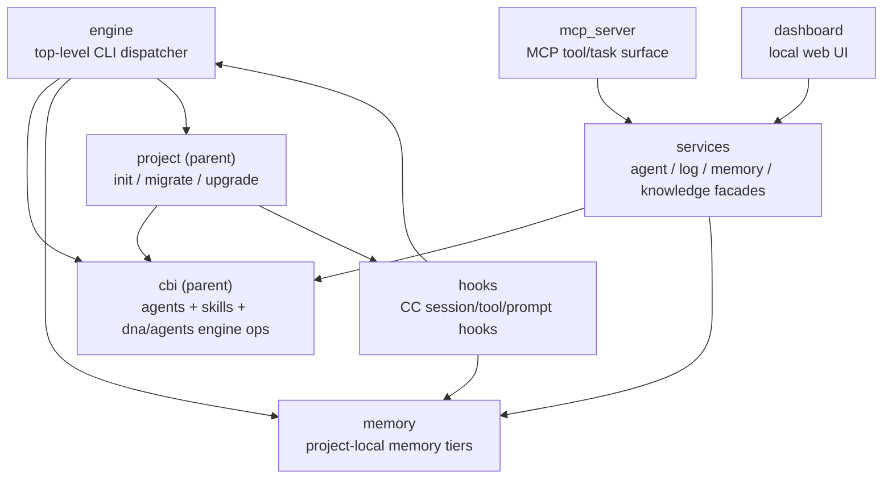

## Positioning

The Cbim-CC kernel Python package. One staged copy per pinned version lives under `<install_root>/kernel/<ver>/`. Provides every per-project subcommand (`cbim init`, `cbim memory ...`, `cbim dna ...`, etc.) and every Claude Code hook handler. Imports nothing from `installer/` or `bin/`.

## Sub-module Relationships

`context.py` (a single file at the package root) is shared infrastructure used by every sub-module to resolve `project_root()` / `cbim_dir()` / `kernel_root()`. It is intentionally module-level, not a sub-package — see Key Decisions.

## Origin Context

A kernel version is a self-contained code drop. Within that drop, responsibilities split along **who triggers them**:

- CLI commands (`engine`) — user-invoked once per command
- Hooks — Claude Code invoked, fire on lifecycle events
- Servers (`mcp_server`, `dashboard`) — long-lived processes
- Agent infrastructure (`cbi`) — read by `engine skill show` / `agent` and consumed at design time
- Memory — persistent store accessed by hooks + engine
- Project (`init` / `migrate` / `upgrade`) — bootstrap & lifecycle ops on `<cwd>/.cbim/`

Each trigger family becomes one sub-module so a change in (say) the MCP wire protocol doesn't ripple into the hook handlers.

## Key Decisions

- **`context.py` is a leaf file, not a sub-package.** Every other sub-module imports `from cbim_kernel.context import project_root, cbim_dir, kernel_root`. Promoting it to a package would invert the dependency graph (everyone would depend on a `context` sub-module that itself depends on nothing). Keeping it as a single file at the package root makes the "shared kernel concept" status structurally obvious.
- **`services/` exists so `mcp_server/` and `dashboard/` never reach into `cbi/` or `memory/` directly.** Both are surface-area-heavy and would otherwise pin the kernel internals as their public API.
- **`project/` is the only sub-module that mutates `.cbim/` on disk.** `init` creates it, `migrate` reshapes legacy layouts, `upgrade` (new) repins. Hooks/engine/cbi/memory only *read* `.cbim/`.
- **Upgrade lives under `project/`, not under `installer/`** (mirrored at the root level). The kernel-side `upgrade` module orchestrates "what should the user do?" diagnostics and delegates the actual install-root mutation to `installer` via subprocess — preserving the "kernel never imports installer" rule.
