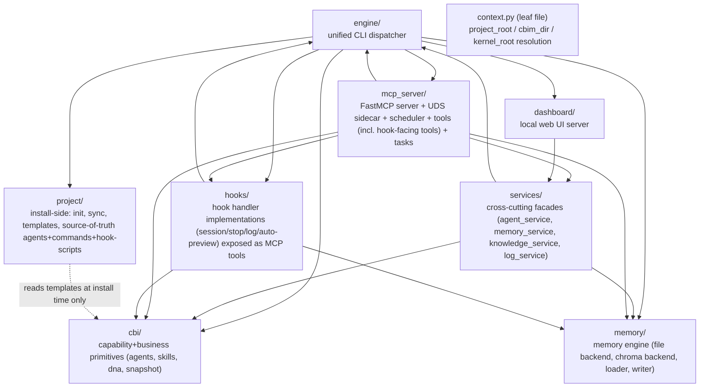

## Positioning

This module IS the CBIM kernel Python package — the single code drop that powers every per-project CBIM operation: CLI commands, Claude Code hook handlers, memory engine, dashboard server, MCP server, agent/skill primitives, and project bootstrap.

The whole package is installed verbatim under `<project>/.cbim/kernel/` by the `/cbim_install` slash command. There is exactly one install path (download tree + run `python -m engine init`) and exactly one runtime entry — the shim `.cbim/run` (POSIX) or `.cbim/run.cmd` (Windows), which sets `PYTHONPATH=<project>/.cbim/kernel` and execs `python -m engine "$@"`. No `cbim` binary on `PATH`. No global venv. No multi-version staging. No version pin.

## Sub-module Relationships

Dependency direction is strict and unidirectional. The stable bottom: `context.py` (a single leaf file, no sub-package), `cbi`, `memory`. Mid-tier: `services`, `project`, `hooks`. Top-tier (orchestrators): `engine`, `dashboard`, `mcp_server`. Nothing below imports anything above. `cbi` and `memory` import only from `context` and their own internals.

Loose kernel-root artefacts: `__init__.py` (exposes `__version__` read from `VERSION`), `VERSION` (single-line semver string), `requirements.txt` (runtime dependencies), `context.py` (shared root-resolution primitives).

## Origin Context

A CBIM "install" is just a directory tree. The user runs `/cbim_install` inside a project; that downloads this whole kernel package into `<project>/.cbim/kernel/` and runs `python -m engine init` once. Init writes the shim `.cbim/run`, installs the 4 agents under `.claude/agents/`, installs the 6 slash commands under `.claude/commands/`, installs the 7 thin-client hook scripts under `.claude/hooks/cbim_*.py` (snapshot copied from `project/hooks_scripts/` — these scripts are MCP UDS clients, not full hook handlers), merges hook + MCP config into `.claude/settings.json`, drops a `CLAUDE.md`, and appends `.cbim/` to `.gitignore` plus the `permissions.deny` entries that keep LLM tools out of `.cbim/`. From then on the user (and Claude Code) invoke the kernel only via the shim — and LLM-driven writes to `.dna/`, `.claude/agents/`, and `.cbim/memory/` go through the `cbim` MCP server, never through raw `Write`/`Edit`.

Sub-modules exist because each one corresponds to a distinct invocation trigger or audience:

- `engine/` — invoked once per CLI command (human-typed; LLM `Bash` is blocked from `.cbim/run *` by `permissions.deny`)
- `hooks/` — handler logic for Claude Code lifecycle events; surfaced as MCP tools (`snapshot_for_session_start`, `cc_status_set`, ...) and called by the thin clients installed under `.claude/hooks/cbim_*.py`. The thin clients are UDS clients, not stand-alone hook handlers; the actual work runs inside the long-lived `mcp_server` process.
- `dashboard/`, `mcp_server/` — long-lived servers spawned on demand. `mcp_server` is the single in-process owner of governance state during a session — every LLM write and every hook callback funnels through it.
- `cbi/` — read at design time by agents (resources: Agent / Skill / DNAModule / Memory)
- `memory/` — persistent store accessed by hooks and by the engine on user request
- `project/` — touched only at install / init / `project sync`; no runtime role. Source of truth for the agents, commands, hook scripts, templates, and `permissions.deny` entries that get snapshotted into the user's project.
- `services/` — façade layer so `mcp_server` and `dashboard` never reach into `cbi`/`memory` internals directly
- `context.py` — shared infrastructure imported by everyone for path resolution

One trigger family per sub-module. A change in (say) the MCP wire protocol stays inside `mcp_server`; a change in the hook contract stays inside `hooks` (and is exposed to thin clients via MCP tools).

## Key Decisions

- **Single runtime entry: the shim `.cbim/run` → `python -m engine`.** No `cbim` binary on `PATH`, no global venv, no installer/updater. The kernel lives at exactly one location per project (`<project>/.cbim/kernel/`) and is invoked exactly one way. Uninstall = `rm -rf .cbim/ .claude/agents/{architect,auditor,hr,programmer}/ .claude/commands/cbim_*.md .claude/hooks/cbim_*.py`. Refresh = re-run `/cbim_install` (idempotent).
- **`context.py` is a leaf file, not a sub-package.** Every sub-module imports `from context import project_root, cbim_dir, kernel_root`. Promoting it to a package would invert the dependency graph (everyone would depend on a `context` sub-module that itself depends on nothing). Keeping it as one file at the kernel root makes its "shared kernel primitive" status structurally obvious.
- **`services/` exists so `mcp_server/` and `dashboard/` never reach into `cbi/` or `memory/` directly.** Both servers are surface-area-heavy; without the façade layer they would pin kernel internals as their public API.
- **`project/` is the only sub-module that mutates the user's filesystem outside `.cbim/`.** Init writes `.claude/agents/`, `.claude/commands/`, `.claude/hooks/cbim_*.py`, `.claude/settings.json` (hooks + mcpServers + permissions.deny), `CLAUDE.md`, `.gitignore`, `.claudeignore`. Every other sub-module reads or writes inside `.cbim/` only.
- **MCP is the single LLM write path.** All LLM-initiated writes to `.dna/`, `.claude/agents/`, and `.cbim/memory/` flow through `mcp_server/` (`dna_*`, `agent_*`, `memory_*` tools). The CLI (`engine`) remains for human use and for `init`/`sync`; LLM `Bash` is denied `.cbim/run *` via `permissions.deny`. This gives one process (the long-lived `mcp_server`) the single source of in-memory state — no stale caches across CLI subprocesses.
- **Hooks are thin MCP clients, not in-tree handlers.** The 7 hook scripts installed at `.claude/hooks/cbim_*.py` open a UDS connection to the running `mcp_server` and call hook-specific MCP tools. The kernel-side `hooks/` package holds the handler logic; `mcp_server/tools/` exposes it. This keeps hook subprocesses out of `.cbim/` (they neither read nor write it) and reuses the same governance pipeline as LLM-initiated writes.
- **`.cbim/` is invisible to LLM tools.** `permissions.deny` blocks `Read(.cbim/**)` and `Bash(.cbim/run *)`; `.claudeignore` hides it from indexing. The sole sanctioned LLM-facing interaction is the `mcpServers.cbim` registration (a framework-level invocation, not an LLM tool call). Humans retain full filesystem access for debugging.
- **Sub-package vs leaf file is a deliberate axis.** `context.py` is a file because it has zero internal structure to encapsulate. Every other sub-module is a package because it has at least two collaborators that benefit from a shared boundary.

## Non-Goals

- No installer, updater, upgrade flow, migrate command, version pin, `versions.json`, `.cbim/.pin`, or `cbim_kernel.context` legacy import path.
- No `bin/` directory, no `cbim` launcher script on PATH, no global venv at `~/.cbim/`.
- No multi-version kernel staging. Each project carries its own kernel copy at `<project>/.cbim/kernel/`. To "upgrade", re-run `/cbim_install`.

