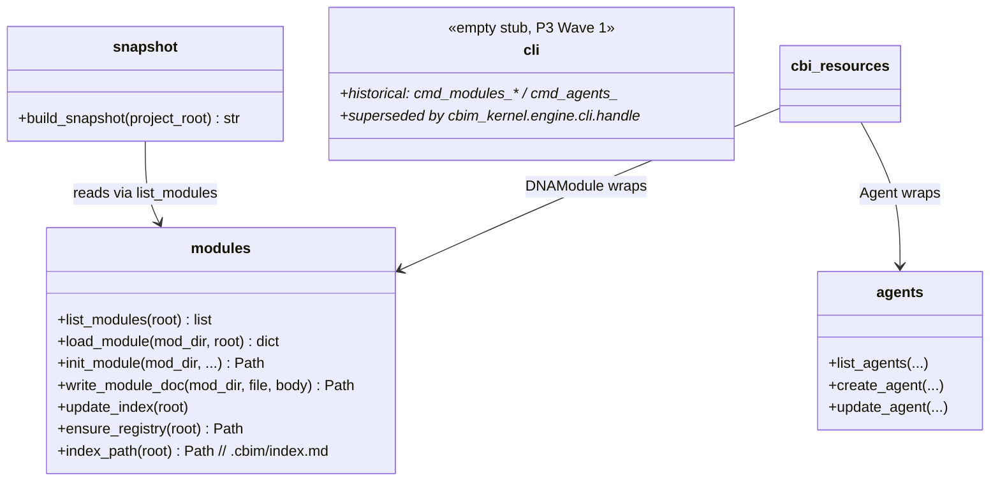

## Positioning

CBI internal primitives: dna (module CRUD, index, write-doc, reindex), agents (agent file CRUD), snapshot (project knowledge snapshot for LLM context). The single low-level write surface for `.dna/` and `.claude/agents/`. **Internal — external callers must go through `cbim_kernel.cbi.resources`.**

## Class Diagram

All `cmd_*` handlers previously hosted here were deleted in P3 Wave 1. The top-level `cbim_kernel/engine/cli.py` now dispatches directly to `cbi.resources.{DNAModule, Agent}` through private `_handle_dna_*` / `_handle_agent_*` functions. Frontmatter parsing duplicates inside `modules.py` / `agents.py` (`_parse_frontmatter` / `_strip_frontmatter` / `_parse_yaml_block`) were removed in the same wave; both files now import the single source of truth from `cbim_kernel.services._fm`.

## Key Decisions

- **Module registry is `.cbim/index.md`, not the project-root `.dna/`.** Decouples the framework-managed fast-path registry from the optional project-root module document. `.cbim/` is the framework (not a business module), so it has no `.dna/` and no `module.md`; the registry sits directly at `.cbim/index.md` with no redundant wrapper layer.
- **`dna init` requires the registry to exist.** It does not auto-bootstrap. Registry creation is the responsibility of `dna reindex` (which creates an empty registry on a clean repo via `_write_index → ensure_registry`) or `cbim init`. *Architect note: this means architects working on a fresh kernel checkout must run `dna reindex` once before any `dna init`.*
- **`dna edit` is the unified write surface; `write-doc` / `write-section` are deprecated aliases.** Since P3, all edits route through `cbim dna edit --target {frontmatter | body | section | contract | contract-section | workflow}`, implemented by `_handle_dna_edit` over `DNAModule` and its sub-objects (`.frontmatter` / `.body` / `.contract` / `.workflows`). Frontmatter is always preserved verbatim; `.save()` is atomic. Direct file edits remain banned by the Kernel-Only Writes rule.
- **Dependency direction is strictly unidirectional.** `cbim_kernel/engine/cli → cbi/resources → cbi/_primitives → services/_fm`. `cbi/_primitives` must not import `cbi/resources`; the resource layer wraps the primitives, never the other way round.
- **Package name `_primitives` uses the underscore-prefix convention for internal-use packages.** External callers (work agents, hooks, MCP, dashboard) must go through `cbim_kernel.cbi.resources` for the rich object model, or `cbim_kernel.services.*` for the read-mostly facade. P3 Wave 2 renamed `cbi/engine` → `cbi/_primitives` to make this boundary explicit.

