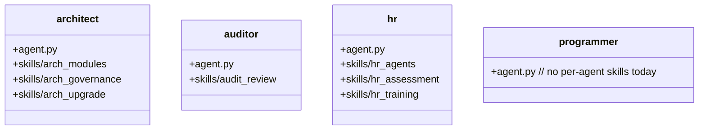

## Positioning

The four built-in CBIM agent definitions (system prompts + behavior + skill registry): **architect**, **auditor**, **hr**, **programmer**. Each agent's `agent.py` is the canonical definition; per-agent `skills/` hold the runtime knowledge they invoke via `engine skill show`.

## Class Diagram

## Key Decisions

- **Agent skills are co-located under the agent's own directory.** A skill that only ever runs in the architect's context (e.g. `arch_modules`) belongs to the architect, not to the cross-agent `cbi.skills` package.
- **`agent.py` files are deployed as `.claude/agents/<name>.md`** by `project.init` / `project.migrate` via templates under `project.agents/`. The Python file here is the *source of truth*; the `.md` files in projects are the *rendered deployment*.
