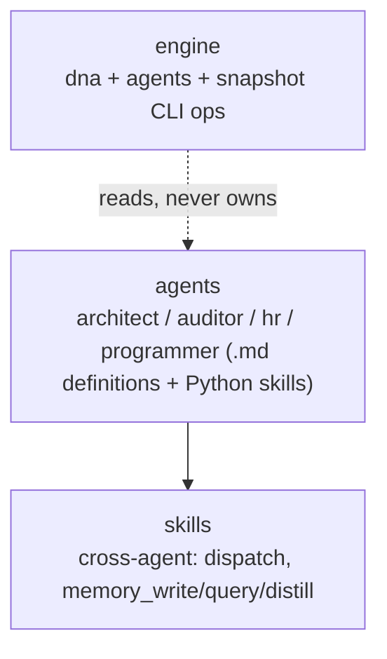

## Positioning

Cbim Cognitive Infrastructure — the agent layer of CBIM. Provides the four built-in agents (architect, auditor, hr, programmer), their skills, and the engine ops (`dna`, `agents`) that govern architecture knowledge and agent file lifecycle.

## Sub-module Relationships

## Origin Context

CBIM agents need three things to function: (1) their identity/system-prompt definition (`agents/`), (2) skills they invoke at runtime (both per-agent skills under `agents/<x>/skills/` and cross-agent skills under `skills/`), and (3) governance over the artifacts they produce (`.dna/` modules — managed by `engine/`).

## Key Decisions

- **Per-agent skills live under the agent's own directory.** Skills that belong to one agent only (e.g. `architect.arch_modules`) are under `agents/architect/skills/arch_modules/`. Cross-agent skills (`memory_write` etc.) live under `skills/`. This co-location makes agent ownership obvious.
- **`engine/` is the only sub-module the kernel CLI dispatches to.** It exposes `cli.cmd_modules_*` (dna ops) and `cli.cmd_agents_*` (agent file ops). `agents/` and `skills/` are read-only resources, not CLI handlers.
