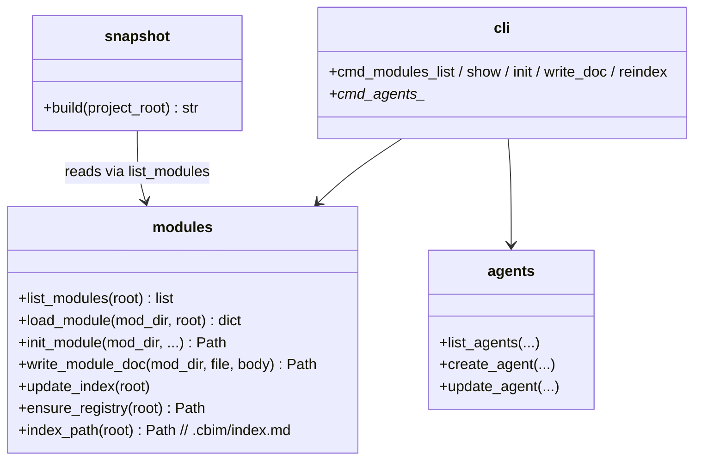

## Positioning

CBI engine ops: dna (module CRUD, index, write-doc, reindex), agents (agent file CRUD), snapshot (project knowledge snapshot for LLM context). The single write surface for `.dna/` and `.claude/agents/`.

## Class Diagram

## Key Decisions

- **Module registry is `.cbim/index.md`, not the project-root `.dna/`.** Decouples the framework-managed fast-path registry from the optional project-root module document. `.cbim/` is the framework (not a business module), so it has no `.dna/` and no `module.md`; the registry sits directly at `.cbim/index.md` with no redundant wrapper layer.
- **`dna init` requires the registry to exist.** It does not auto-bootstrap. Registry creation is the responsibility of `dna reindex` (which creates an empty registry on a clean repo via `_write_index → ensure_registry`) or `cbim init`. *Architect note: this means architects working on a fresh kernel checkout must run `dna reindex` once before any `dna init` — discovered while bootstrapping this repo's own `.dna/`.*
- **`write-doc` preserves frontmatter, replaces body only.** Atomic write. This is the LLM-safe surface for editing `module.md` / `contract.md` — direct file edits are banned by the Kernel-Only Writes rule.
