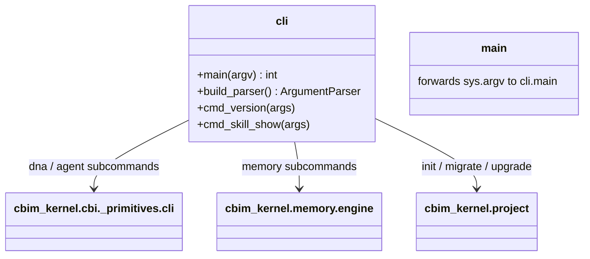

## Positioning

Top-level kernel CLI dispatcher. Receives `python -m cbim_kernel <cmd> <args>` from the launcher and routes to the appropriate sub-engine (`cbi._primitives.cli` for dna/agent/skill, `memory.engine` for memory, `project` for init/migrate/upgrade) or to a built-in (logs, debug, version).

## Class Diagram

## Key Decisions

- **Thin dispatcher only — no business logic lives here.** All real work delegates to sub-engines. This keeps `engine/cli.py` legible and prevents it from accumulating cross-domain knowledge.
- **`skill show` is the discovery surface for the CBI agents.** Agent prompts reference skill IDs (`architect.arch_modules`, etc.) and the engine returns the skill content; this is how knowledge ships to LLM context.

