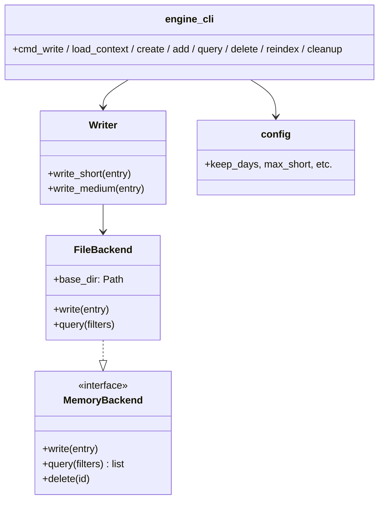

## Positioning

Project-local memory subsystem. Three tiers (short / medium / archive) under `.cbim/memory/store/`. File-based backend today; pluggable via `MemoryBackend` ABC.

## Class Diagram

## Key Decisions

- **`.cbim/memory/store/` is the canonical home.** Claude Code's built-in `~/.claude/projects/.../memory/` is explicitly disabled in CBIM projects (called out in the deployed `CLAUDE.md`).
- **File backend is intentionally chosen over SQLite/etc.** Markdown files are human-inspectable, git-friendly, and trivially merged. Performance is not a concern at the scale of one developer's memory.
