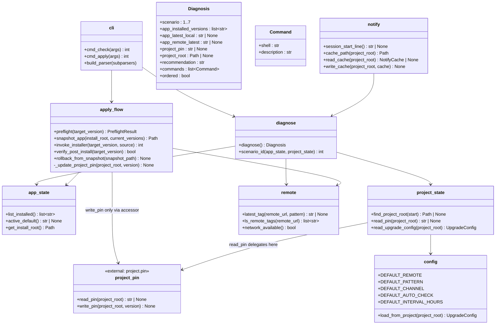

## Positioning

> **Status: PENDING MIGRATION → updater.**
>
> This sub-package is currently located at `cbim_kernel/project/upgrade/` but is architecturally mis-placed: it performs **cross-version operations** (replacing the app-side install, repointing project pins, diagnosing version state across the install/pin axes), and per the root-level rule "updater owns all cross-version operations", it belongs inside the updater module (current on-disk name: `installer`).
>
> See root `.dna/module.md` Key Decision "Sibling split, not parent-child" and `v1/src/installer/.dna/module.md` "Migration Roadmap: Becoming Updater" for the target architecture.
>
> **No code changes are required here yet** — this document describes both (a) the current contract, preserved verbatim across the move, and (b) the per-component target home after migration.

`cbim upgrade` — a holistic version-state inspector and app-side install repointer. `check` diagnoses the joint state of the global app install and the per-project pin and prints exact next-step commands. `apply` upgrades the app-side install in place. Project-side schema migration is delegated to `cbim migrate`; rollback is internal-only and automatic on failure.

## Class Diagram

`project_state.read_pin` and `apply_flow._update_project_pin` are thin shims — both delegate to the `project.pin` module (see `project/.dna/module.md` "Key Decisions"). Upgrade never reads or writes `.cbim/.pin` directly. Reading `config.json` for `cbim_version` is removed entirely; that key no longer exists.

## Key Decisions

### 7-scenario diagnostic matrix

`check` MUST classify the joint state into one of the following scenarios and emit the corresponding recommendation + ordered commands. This matrix is the externally-visible contract of the module — see `contract.md`.

| # | App (Cbim-CC install) | Project (`.cbim/`)                          | Scenario name              | Recommended commands (in order)                                                            |
|---|------------------------|---------------------------------------------|----------------------------|---------------------------------------------------------------------------------------------|
| 1 | not installed          | not initialized                             | `cold-start`               | `python install.py` (or download installer), then `cbim init` inside the target project dir |
| 2 | installed, current     | not initialized                             | `app-ready-project-new`    | `cbim init` (run in project dir)                                                            |
| 3 | installed, outdated    | not initialized                             | `app-stale-project-new`    | `cbim upgrade apply --to <latest>`, then `cbim init`                                        |
| 4 | installed, current     | pinned to an older installed version        | `project-stale-vs-app`     | EITHER `cbim migrate --version <app-current>` (recommended) OR explicit `cbim pin <X>`      |
| 5 | installed, outdated    | pinned older than app, app older than remote| `both-stale`               | `cbim upgrade apply --to <remote-latest>`, then `cbim migrate --version <remote-latest>`    |
| 6 | installed, outdated    | pin equals current app version              | `app-stale-project-aligned`| `cbim upgrade apply --to <remote-latest>`; project pin stays at `<X>` unless the user opts to also migrate |
| 7 | installed, current     | pin equals app current                      | `all-aligned`              | (nothing to do; print "All aligned at version <X>.")                                        |

Each row, when emitted, includes:
- A one-line **state description** ("App is at 1.2.3 (latest local), project pins 1.2.0, remote latest is 1.2.3.")
- The exact **commands** in execution order
- An **order flag** — `ordered=true` for #3 and #5 (must run sequentially) — to suppress parallel-execution hints by the assistant

### Module-level decisions

- **Subprocess to installer, never import.** `apply_flow.invoke_installer` shells out to `python -m installer install <ver>` (resolved via `<install_root>/installer/`). This keeps the root-level "kernel never imports installer" rule intact even though upgrade orchestrates an install-root mutation.
- **Snapshot + automatic rollback are internal-only.** Before `apply` overwrites `<install_root>/installer/`, `<install_root>/bin/`, and stages a new kernel under `<install_root>/kernel/<new-ver>/`, it captures a tar snapshot of those paths. On any failure (network mid-download, checksum mismatch, post-install verification failure), the snapshot is restored automatically. There is NO `cbim upgrade rollback` subcommand — users only ever see success or "rolled back to <prev-ver> due to <reason>". (Decision #5.)
- **CLAUDE.md is always overwritten on a kernel upgrade; snapshot is the safety net.** No 3-way merge attempt. User customizations to CLAUDE.md are not preserved; users are expected to keep custom prompt content in their own project-side files. (Decision #4.)
- **Default `upgrade.remote` is hard-coded in the template** to `https://github.com/nan023062/cbim.git`. (Decision #3.) Users can override per-project in `.cbim/config.json`.
- **`upgrade.auto_check` is true by default**, with a 24-hour interval. The notifier in `hooks.load_memory` reads `notify.cache_path(project_root)`; if older than the interval, it runs a fresh `diagnose` in a fire-and-forget subprocess and updates the cache. The user-visible cost is at most one stdout line per session start when an update is available.
- **Network failures are silent on `check` and fatal on `apply`.** `check` degrades gracefully (omits the `app_remote_latest` field; scenarios 5/6 may fall back to 4/7 if remote is unreachable, with a "remote unreachable" note). `apply` refuses to proceed without network confirmation of the target's existence.
- **Version-incompatibility preflight.** Before `apply`, `apply_flow.preflight` checks whether jumping from current pin to target requires a schema migration in `.cbim/`. If so, it refuses and instructs the user to run `cbim migrate --version <ver>` first. The upgrade module never touches `.cbim/` directly — except via the pin accessor when bumping the pin after a successful migrate handoff (see next item).
- **Pin reads and writes go through `project.pin`, not raw JSON access.** `project_state.read_pin(project_root)` is a thin wrapper that delegates to `project.pin.read_pin()`, which reads `<project_root>/.cbim/.pin` (plain text, single-line version string with trailing newline). Likewise, any project-side pin mutation (e.g. `apply_flow._update_project_pin()` when the user opts to bump the project pin after an app-side upgrade in scenario #4) MUST go through `project.pin.write_pin(project_root, version)`. The upgrade module never reads `cbim_version` from `config.json` and never opens `.cbim/.pin` directly. Rationale: the pin file is owned by `project.pin`; allowing upgrade to touch it inline would create two write paths for one file — the exact split-brain we eliminated by extracting `.pin` in the first place. **Iron rule, non-negotiable.**
- **Only the app side is upgraded by this module.** Project-side schema migration belongs to `project.migrate`; the user invokes it explicitly. This is a hard split: `upgrade.apply` mutates `<install_root>/`; `migrate` mutates `<cwd>/.cbim/`. No flag combines them — they remain two steps, surfaced as two commands.
- **Diagnosis is pure and side-effect-free.** `diagnose.diagnose()` returns a `Diagnosis` value; CLI / notifier / future MCP tool all share it. Testability and reuse hinge on this.

## Migration Plan: Per-Component Target Home

Each component in this sub-package has a target home post-migration. The contract surface (the 7-scenario matrix, `Diagnosis` / `Command` value shapes, CLI argument grammar, `notify` session-line behaviour) is **unchanged** by the move; only the import edges and the subprocess hop change.

| Component (today) | Path today | Target home (post-migration) | Change |
|---|---|---|---|
| `cli.py` (cmd_check, cmd_apply, build_parser) | `cbim_kernel/project/upgrade/cli.py` | `installer/upgrade/cli.py` (or merged into `installer.cli`) | Becomes an installer-side subcommand. CLI grammar unchanged. |
| `diagnose.py`, `Diagnosis`, `Command` | `cbim_kernel/project/upgrade/diagnose.py` | `installer/upgrade/diagnose.py` | Move as-is. 7-scenario matrix preserved verbatim. |
| `app_state.py` | `cbim_kernel/project/upgrade/app_state.py` | **fold into `installer.registry`** | Today this is a thin wrapper around the installer's registry, reached via the `cbim version --json` boundary. Post-migration, the boundary disappears — `app_state` just becomes direct calls into `registry`. |
| `project_state.py` | `cbim_kernel/project/upgrade/project_state.py` | `installer/upgrade/project_state.py` | Stays its own file. `read_pin` becomes an updater-side inlined helper (see "Pin accessor mechanism (resolved)" below) — no cross-module import. |
| `apply_flow.py` (preflight, snapshot_app, invoke_installer, verify_post_install, rollback_from_snapshot, _update_project_pin) | `cbim_kernel/project/upgrade/apply_flow.py` | `installer/upgrade/apply_flow.py` | **`invoke_installer` collapses to a direct import** of `installer.install.install_kernel(...)`. The subprocess hop (`python -m installer install <ver>`) was a workaround for the "kernel never imports installer" rule; once both live in updater, the workaround is gone. Snapshot/rollback unchanged. |
| `remote.py` (latest_tag, ls_remote_tags, network_available) | `cbim_kernel/project/upgrade/remote.py` | `installer/upgrade/remote.py` | Move as-is. |
| `notify.py` (session_start_line, cache_path, read_cache, write_cache) | `cbim_kernel/project/upgrade/notify.py` | **stays in kernel** (`cbim_kernel/hooks/upgrade_notify.py` or similar) | `notify.session_start_line` is called by `hooks.load_memory` at every Claude Code session start. The notifier is a kernel-side **read** of updater state (it reads the cached diagnosis); the actual `diagnose` call it triggers becomes a subprocess to `cbim upgrade check --json` (or similar). This is the one piece that does NOT move with the rest — it is a hook-tier concern. |
| `config.py` (DEFAULT_REMOTE, DEFAULT_PATTERN, load_from_project) | `cbim_kernel/project/upgrade/config.py` | `installer/upgrade/config.py` | Move as-is. `load_from_project` continues to read `<project_root>/.cbim/config.json` — read-only from updater's perspective. |
| **pin accessor** (`project.pin.read_pin`, `project.pin.write_pin`) | `cbim_kernel/project/pin.py` | **`write_pin` → updater (sole writer); `read_pin` inlined in each consumer (launcher / updater / kernel)** | **Resolved.** `write_pin` moves to updater as the single canonical writer. `read_pin` is NOT shared — launcher, updater, and kernel each inline their own ~5-line reader against the frozen plain-text format. Kernel-side `project/pin.py` after migration: delete `write_pin`; `read_pin` either deleted (callers inlined) or kept as a kernel-internal helper with no external importers. See "Pin accessor mechanism (resolved)" below. |

### Pin accessor mechanism (resolved)

**Decision: split by R/W axis. `write_pin` moves to updater; `read_pin` is inlined per consumer.** The previously-deferred choice between Option A (whole accessor moves) and Option B (kernel-owned + subprocess) is rejected in favour of a third path that is cleaner than either:

- **`write_pin` → updater.** Writing the pin is cross-version by definition (records the result of `migrate` or `upgrade.apply`). The sole canonical writer lives in updater. Kernel deletes its `project.pin.write_pin` after the migration. Kernel's `init` (which today writes the initial pin at project bootstrap) routes that one-shot write through updater's writer — either by direct import (if `init` is willing to depend on updater at bootstrap time) or by relocating the initial-pin-write into updater's project-bootstrap surface during the migration task. Either way, **one writer per file** stands and lives in updater.
- **`read_pin` → inlined in each consumer.** The pin format is frozen — plain text, single line, trailing `\n` — and is treated as a tiny stable on-disk contract, not shared code. Launcher, updater, and kernel each inline their own ~5-line `read_pin`. No module imports a `read_pin` from another. Rationale: the format is locked (readers cannot mutate), the surface is trivial, and forcing a shared module would re-create a cross-package dependency edge purely to deduplicate five lines. The duplication is intentional and bounded.
- **Kernel-side cleanup post-migration.** `cbim_kernel/project/pin.py`: delete `write_pin`. For `read_pin`, either delete it (inlining it into the kernel's own callers) or keep it as a kernel-internal helper that no external package imports — implementer's choice during migration. No external import of kernel's `read_pin` survives the migration.

This resolution is reflected in the root `.dna/module.md` Key Decision "Project lifecycle responsibilities split by the version axis; pin accessor split by R/W", and in `v1/src/installer/.dna/module.md` On-Disk Contract Surface table (owner: updater; readers: launcher / updater / kernel, each inlined). **The iron rule "one writer per file" is preserved and now has a single named home: updater.**

### Why `notify` stays in kernel

`notify.session_start_line()` is invoked by `cbim_kernel/hooks/load_memory.py` at every Claude Code session start. It's a kernel-tier read of cached updater state — fast, side-effect-free, must never block. Pulling it into updater would force every session start to subprocess into updater just to read a cache file, which is the wrong layering. The cache file (path under `<project_root>/.cbim/cache/` or similar) becomes an on-disk contract between updater (writes the cache when `cbim upgrade check` runs) and kernel hooks (reads the cache at session start).
