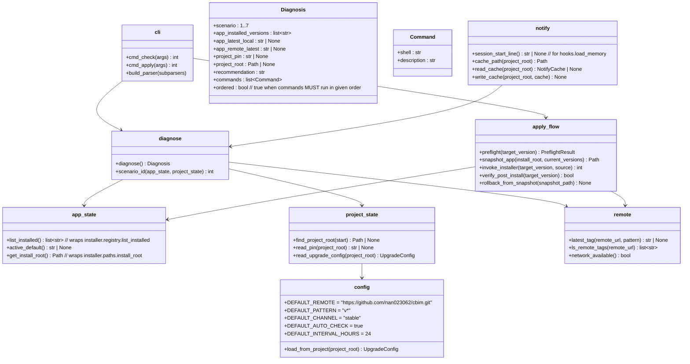

## Positioning

`cbim upgrade` — a holistic version-state inspector and app-side install repointer. `check` diagnoses the joint state of the global app install and the per-project pin and prints exact next-step commands. `apply` upgrades the app-side install in place. Project-side schema migration is delegated to `cbim migrate`; rollback is internal-only and automatic on failure.

## Class Diagram

## Key Decisions

### 7-scenario diagnostic matrix

`check` MUST classify the joint state into one of the following scenarios and emit the corresponding recommendation + ordered commands. This matrix is the externally-visible contract of the module — see `contract.md`.

| # | App (Cbim-CC install) | Project (`.cbim/`)                          | Scenario name              | Recommended commands (in order)                                                            |
|---|------------------------|---------------------------------------------|----------------------------|---------------------------------------------------------------------------------------------|
| 1 | not installed          | not initialized                             | `cold-start`               | `python install.py` (or download installer), then `cbim init` inside the target project dir |
| 2 | installed, current     | not initialized                             | `app-ready-project-new`    | `cbim init` (run in project dir)                                                            |
| 3 | installed, outdated    | not initialized                             | `app-stale-project-new`    | `cbim upgrade apply --to <latest>`, then `cbim init`                                        |
| 4 | installed, current     | pinned to an older installed version        | `project-stale-vs-app`     | EITHER `cbim migrate --version <app-current>` (recommended) OR explicit `cbim pin <X>`      |
| 5 | installed, outdated    | pinned older than app, app older than remote| `both-stale`               | `cbim upgrade apply --to <remote-latest>`, then `cbim migrate --version <remote-latest>`    |
| 6 | installed, outdated    | pin equals current app version              | `app-stale-project-aligned`| `cbim upgrade apply --to <remote-latest>`; project pin stays at `<X>` unless the user opts to also migrate |
| 7 | installed, current     | pin equals app current                      | `all-aligned`              | (nothing to do; print "All aligned at version <X>.")                                        |

Each row, when emitted, includes:
- A one-line **state description** ("App is at 1.2.3 (latest local), project pins 1.2.0, remote latest is 1.2.3.")
- The exact **commands** in execution order
- An **order flag** — `ordered=true` for #3 and #5 (must run sequentially) — to suppress parallel-execution hints by the assistant

### Module-level decisions

- **Subprocess to installer, never import.** `apply_flow.invoke_installer` shells out to `python -m installer install <ver>` (resolved via `<install_root>/installer/`). This keeps the root-level "kernel never imports installer" rule intact even though upgrade orchestrates an install-root mutation.
- **Snapshot + automatic rollback are internal-only.** Before `apply` overwrites `<install_root>/installer/`, `<install_root>/bin/`, and stages a new kernel under `<install_root>/kernel/<new-ver>/`, it captures a tar snapshot of those paths. On any failure (network mid-download, checksum mismatch, post-install verification failure), the snapshot is restored automatically. There is NO `cbim upgrade rollback` subcommand — users only ever see success or "rolled back to <prev-ver> due to <reason>". (Decision #5.)
- **CLAUDE.md is always overwritten on a kernel upgrade; snapshot is the safety net.** No 3-way merge attempt. User customizations to CLAUDE.md are not preserved; users are expected to keep custom prompt content in their own project-side files. (Decision #4.)
- **Default `upgrade.remote` is hard-coded in the template** to `https://github.com/nan023062/cbim.git`. (Decision #3.) Users can override per-project in `.cbim/config.json`.
- **`upgrade.auto_check` is true by default**, with a 24-hour interval. The notifier in `hooks.load_memory` reads `notify.cache_path(project_root)`; if older than the interval, it runs a fresh `diagnose` in a fire-and-forget subprocess and updates the cache. The user-visible cost is at most one stdout line per session start when an update is available.
- **Network failures are silent on `check` and fatal on `apply`.** `check` degrades gracefully (omits the `app_remote_latest` field; scenarios 5/6 may fall back to 4/7 if remote is unreachable, with a "remote unreachable" note). `apply` refuses to proceed without network confirmation of the target's existence.
- **Version-incompatibility preflight.** Before `apply`, `apply_flow.preflight` checks whether jumping from current pin to target requires a schema migration in `.cbim/`. If so, it refuses and instructs the user to run `cbim migrate --version <ver>` first. The upgrade module never touches `.cbim/` directly.
- **Only the app side is upgraded by this module.** Project-side schema migration belongs to `project.migrate`; the user invokes it explicitly. This is a hard split: `upgrade.apply` mutates `<install_root>/`; `migrate` mutates `<cwd>/.cbim/`. No flag combines them — they remain two steps, surfaced as two commands.
- **Diagnosis is pure and side-effect-free.** `diagnose.diagnose()` returns a `Diagnosis` value; CLI / notifier / future MCP tool all share it. Testability and reuse hinge on this.
