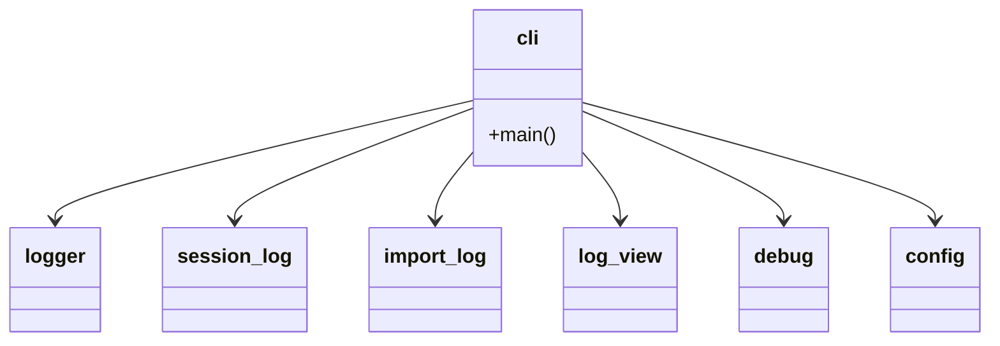

## Positioning

The unified CLI dispatcher for the kernel. Single user-facing entry — `python -m engine <domain> [<command>] [args]`, invoked via the project's shim `.cbim/run`. `__main__.py` calls `engine.cli.main()`, which builds an argparse tree and dispatches each domain to the matching delegate.

Engine contains zero business logic. It is a router: parse arguments, resolve config, dispatch, log, return. Every domain delegates outward to a sub-engine that owns the actual work.

## Sub-module Relationships

Dispatched domains (current surface, mirrors `engine/cli.py:main`):

- `memory` → `memory.engine.cli` (create / add / query / delete / reindex / cleanup)
- `dna` → in-process handlers driving `cbi.resources.DNAModule` and `cbi._primitives.modules` (list / show / init / reindex / edit / write-doc[deprecated] / write-section[deprecated] / split)
- `agent` → in-process handlers driving `cbi.resources.Agent` (list / show / scaffold / archive / update / add-skill)
- `snapshot` → `cbi._primitives.snapshot.build_snapshot`
- `skill` → `cbi.resources.Skill` (list / show)
- `soul` → walks `cbi.agents.*.agent` modules
- `config` → `engine.config` (get / set / show on `.cbim/config.json`)
- `dashboard` → `dashboard.server.start_server`
- `preview` → `dashboard` (deprecated alias)
- `debug` → toggles `.cbim/.debug` flag (on / off / status)
- `log` → `engine.log_view` (show / tail per-session logs)
- `mcp` → `mcp_server.server.mcp.run()` (stdio)
- `init` → `project.init.init_project` (bootstrap cwd)
- `project sync` → `project.sync.sync_templates` (refresh templated files)

Hook events are NOT dispatched through this CLI — Claude Code invokes the in-process bridge scripts at `.claude/hooks/cbim_*.py` directly.

Internal cross-cutting modules: `logger` + `session_log` (per-session text logs), `call_log` + `import_log` (PreToolUse/PostToolUse + import telemetry), `log_view` (read-back surface for `log show` / `log tail`), `debug` (.debug flag toggle), `config` (config get/set/show).

## Origin Context

Every CBIM operation that an LLM or human types is one CLI invocation. The kernel needs exactly one routing surface because:

1. **Single discoverability point.** `python -m engine --help` lists every available domain. No second binary, no second entry point.
2. **One logging seam.** Every invocation flows through `cli.main()`, so per-session call logging is uniform across all domains without each sub-engine reinventing the wheel.
3. **Domain isolation.** Each domain's real implementation lives in a sibling sub-module (`memory/`, `cbi/`, `mcp_server/`, etc.). Engine merely parses and dispatches. A domain can be refactored, removed, or added without touching the other domains.

## Key Decisions

- **Thin dispatcher, no business logic.** Every domain handler is a few lines: parse args, call delegate, return exit code. Anything more substantial belongs in the delegate module. This keeps `engine/cli.py` legible and prevents it from accumulating cross-domain knowledge.
- **`dna` and `agent` handlers live inline in `engine/cli.py`.** Historically they delegated to `cbi/_primitives/cli.py`; that thin wrapper layer was deleted in P3 Wave 1. The handlers now drive `cbi.resources.{DNAModule, Agent}` directly. Reason: a one-level dispatch (engine → resource model) is cheaper to read and modify than two-level dispatch (engine → cbi/cli → resource model), and the resource model is the de-facto public API.
- **`init` targets `Path.cwd()`, NOT `project_root()`.** `project_root()` walks up to find an existing `.cbim/`, which is the wrong semantics for bootstrap and historically caused init to clobber a parent project when run from a non-project subdirectory. Bootstrap always targets cwd.
- **No `hook` subcommand.** Hook events are not dispatched through this CLI. Claude Code invokes the in-process bridge scripts at `.claude/hooks/cbim_*.py` directly; those scripts bootstrap `<project>/.cbim/kernel/` onto `sys.path` and call `memory.*` / `cbi.*` / `engine.*` in-process. The earlier `.cbim/run hook <event>` indirection and the `hooks/` sub-package were removed in Phase 6.
- **`init` does more than scaffold `.cbim/`.** Since Phase 3b, `init` also: (1) copies the 7 `cbim_*.py` hook scripts plus `_lib/` into `.claude/hooks/` with 0755 on the scripts; (2) writes the `hooks` section of `.claude/settings.json` to invoke those scripts directly; (3) extends `permissions.deny` to four entries (Write/Edit/Read on `.cbim/**`, plus `Bash(.cbim/run *)`); (4) appends missing kernel entries to `.claudeignore` (merge-only, never clobber); (5) probes the install-time Python for the `mcp` SDK and prints an informational note when missing (soft dependency — required only if the LLM intends to call governance tools over MCP; hooks work without it); (6) writes/merges `.mcp.json` at the project root with the `cbim` MCP server registration (Phase 7 split: previously `mcpServers.cbim` lived inside `.claude/settings.json`; it now lives in the project-root `.mcp.json` so Claude Code auto-discovers it, and the sync path drops any stale `mcpServers.cbim` from `.claude/settings.json` on upgrade).
- **`preview` is a deprecated alias for `dashboard`.** Kept for one release cycle. Emits a stderr deprecation line and forwards to `cmd_dashboard`.
- **Debug flag is engine-scoped, not memory-scoped.** `.cbim/.debug` (a zero-byte file at the project root's `.cbim/` directory) gates the extra `[ENG]/[IMP]` log lines from `call_log` and `import_log`. Session-level signals (`[SESSION]/[USER]/[TOOL]/[RESULT]/[TURN]`) always log regardless of the flag.

## Non-Goals

- No `cbim_kernel.*` import paths. The kernel root is now the package root (after flatten); imports are `from engine ...`, `from memory.engine ...`, `from cbi.resources ...`, never `from cbim_kernel.engine ...`.
- No `migrate` or `upgrade` subcommands. Project lifecycle = `init` + `project sync` only.
- No `pin` subcommand, no `versions.json` reader, no installer-side subprocess.

