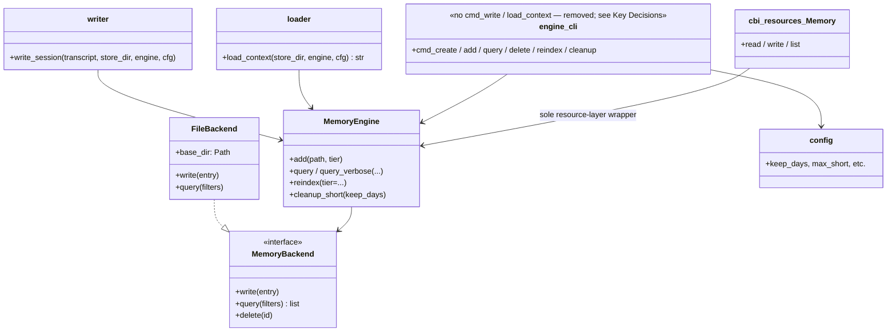

## Positioning

Project-local memory subsystem. Three tiers (short / medium / archive) live directly under `.cbim/memory/` (flat layout: `.cbim/memory/short/`, `.cbim/memory/medium/`, `.cbim/memory/archive/`). File-based backend today; pluggable via `MemoryBackend` ABC.

## Class Diagram

## Key Decisions

- **`.cbim/memory/` is the canonical home (flat layout).** Three tier directories — `short/`, `medium/`, `archive/` — sit directly under `.cbim/memory/`; there is no intermediate `store/` wrapper. Claude Code's built-in `~/.claude/projects/.../memory/` is explicitly disabled in CBIM projects (called out in the deployed `CLAUDE.md`).
- **File backend is intentionally chosen over SQLite/etc.** Markdown files are human-inspectable, git-friendly, and trivially merged. Performance is not a concern at the scale of one developer's memory. `ChromaBackend` is available as an optional drop-in (same `MemoryBackend` ABC) for vector-search experimentation; the default stays file-based.
- **Hook-facing entry points are exposed as Python functions, not CLI subcommands.** The former `cbim memory write-session` / `load-context` / `preview` subcommands were removed in P3 — the SessionStart / Stop hooks now import `memory.engine.writer.write_session` and `memory.engine.loader.load_context` in-process. Treat those two functions as the stable hook contract; `engine_cli` retains only the human/agent-facing commands (`create / add / query / delete / reindex / cleanup`).
- **MCP and other callers reach memory through `cbi.resources.Memory`, not `MemoryEngine` / `FileBackend` directly.** Layer-0 (MCP server) holds zero direct references to engine internals; this preserves the unidirectional dependency: caller → `cbi.resources.Memory` → `memory.engine` primitives → `services/_fm`.

