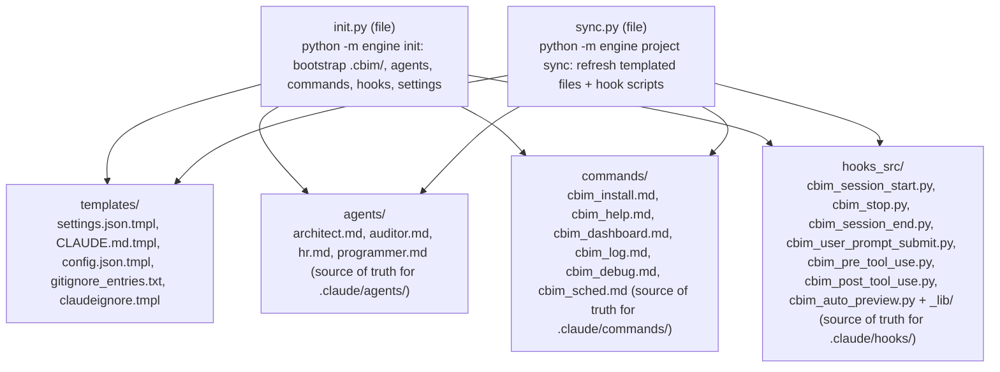

## Positioning

The install side of the kernel. Owns everything that prepares a project to use CBIM: writes `.cbim/run` shims, drops `.cbim/config.json`, installs the 4 source-of-truth agents into `.claude/agents/`, installs the 6 source-of-truth slash commands into `.claude/commands/`, merges hook + MCP wiring into `.claude/settings.json`, drops `CLAUDE.md`, and appends `.cbim/` to `.gitignore`.

Not runtime. Not memory. Not hooks. Once init is done, `project/` plays no role in normal operation — it re-engages only when the user runs `cbim project sync` to refresh the kernel-managed templated files.

## Sub-module Relationships

`init.py` and `sync.py` are siblings; neither imports the other. They share `templates/`, `agents/`, `commands/`, and `hooks_src/` as read-only source data — `init` writes them at bootstrap, `sync` refreshes them later.

Four resource subdirectories, each playing the same role (source-of-truth for a kernel-managed slice of the user's workspace):

- `templates/` — text templates dropped at `.cbim/config.json`, `CLAUDE.md`, `.claude/settings.json`, `.claudeignore`, and patched into `.gitignore`.
- `agents/` — the 4 built-in agent Markdown files copied to `.claude/agents/<name>/<name>.md`.
- `commands/` — the 6 built-in slash command Markdown files copied to `.claude/commands/cbim_*.md`.
- `hooks_src/` — the 7 thin-client hook scripts (`cbim_*.py`, executable, stdlib-only + `_lib/`) copied to `.claude/hooks/` with 0755 on the scripts. The hook scripts speak MCP over UDS to `.cbim/run mcp`; settings.json points Claude Code's hook events directly at these files (no more `.cbim/run hook ...` indirection). The companion `_lib/` package (`paths.py` / `mcp_client.py` / `event_io.py` / `__init__.py`) is the stdlib-only MCP client library the scripts import — copied alongside the scripts as a sibling directory under `.claude/hooks/`.

No other sub-packages exist here; everything `project/` does decomposes into "copy one of these four directories into the user's workspace".

## Origin Context

A CBIM project's filesystem footprint is fixed and small:

- `.cbim/run` + `.cbim/run.cmd` — the shim that execs `python -m engine` with `PYTHONPATH=<project>/.cbim/kernel`
- `.cbim/kernel/` — the kernel code drop (downloaded by `/cbim_install`, not written by this module)
- `.cbim/config.json` — project-local config
- `.cbim/memory/` — memory store (created on first write, not by init)
- `.cbim/logs/` — session logs (created on first hook fire)
- `.claude/agents/{architect,auditor,hr,programmer}/<name>.md` — agent definitions
- `.claude/commands/cbim_*.md` — slash commands
- `.claude/settings.json` — hook + MCP server wiring (merged, never clobbered)
- `CLAUDE.md` — coordinator prompt
- `.gitignore` — `.cbim/` appended

Two trigger events write this layout: first-use bootstrap (`init`) and explicit template refresh (`project sync`). One sub-file per trigger. Both read the same `templates/` + `agents/` + `commands/` directories — the *shape* of a CBIM project is one design; the *trigger* for materializing it differs.

## Key Decisions

- **There is exactly one install path: `/cbim_install` slash command → download kernel → `python -m engine init`.** No installer subprocess, no multi-version staging, no version pin file, no migrate command, no upgrade command. To "upgrade" the kernel, the user re-runs `/cbim_install`. To refresh templated files (agents, settings, CLAUDE.md), the user runs `cbim project sync`. Two operations, both idempotent.
- **Init is idempotent; `--force` overwrites templated files.** Re-running init on an already-initialized project is a no-op for non-template files (run shims, config.json) and a content refresh for templated files only when `--force` is set. The shim files (`.cbim/run` / `.cbim/run.cmd`) bake the absolute `PYTHONPATH` at init time; if the project is moved on disk, re-run init to re-bake.
- **`.claude/settings.json` is merged, never clobbered.** Init reads the user's existing `settings.json` (if any), merges in CBIM's hook entries and the `mcpServer.cbim` block, and writes back. Pre-existing user keys survive.
- **`project/` reads `cbi/` only via templates (no Python import).** The 4 agent markdowns under `agents/` are static copies — derived once at release time from the agent souls under `cbi/agents/<name>/agent.py`, then shipped as plain Markdown. `init.py` and `sync.py` never `import cbi`. This keeps install-side concerns decoupled from the capability/business primitive package.
- **`project/` does not depend on `engine`, `hooks`, `memory`, `services`, or `mcp_server`.** Init is callable as a library (`project.init.init_project(target)`) without touching any of those. The reverse direction is also forbidden — `cbi`, `memory`, etc. never import `project`.
- **Source-of-truth agent and command Markdown lives here, under `agents/` and `commands/`.** These directories are not "documentation" — they are the canonical copies the kernel ships. Init copies them verbatim into the user's `.claude/` tree. Edits to user-side files (`.claude/agents/architect/architect.md` etc.) get overwritten on the next `cbim project sync`; a warning is printed when `cbim agent update` targets one of the kernel-managed names.

## Non-Goals

- No `migrate.py`, no `upgrade/` sub-package, no `pin.py`, no `.cbim/.pin` accessor, no `versions.json` reader.
- No installer subprocess. No multi-version kernel staging under `<install_root>/kernel/<ver>/`.
- No diagnostic 7-scenario matrix. There are no scenarios — install is binary (the kernel is either present at `.cbim/kernel/` or it isn't).

