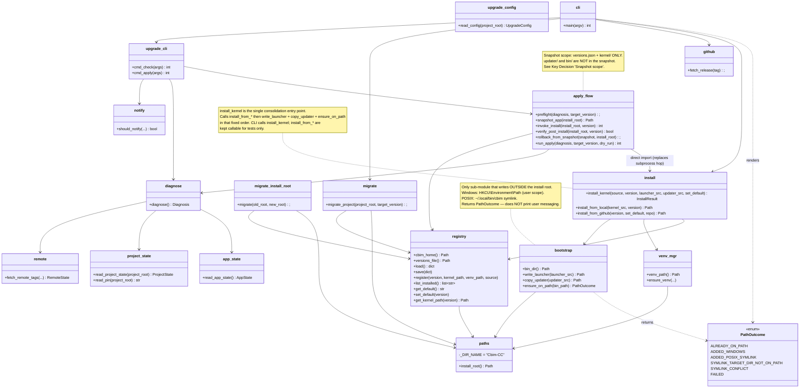

## Positioning

`updater` owns **all cross-version operations** for Cbim-CC: install, upgrade, schema migration, version registry, shared venv, launcher placement, and PATH publication. It owns the global install root (`<install_root>/Cbim-CC/`): where it lives, which kernel versions are inside, which is default, the shared venv, the on-disk versions registry, and getting the `cbim` launcher reachable on the user's `PATH` (the only write this module makes *outside* the install root).

**Never imports from `cbim_kernel`.** May invoke a staged kernel via subprocess for post-install verification only. Never knows anything about a particular project's runtime state beyond `<project_root>/.cbim/.pin` (read via updater's own inlined `read_pin`).

The `installer/` directory on disk is a **deprecated reexport shim** kept only to preserve the `python -m installer ...` subprocess entry point during the migration window; the real implementation lives here. See `installer/.dna/module.md` for the shim's contract.

## Class Diagram



## Key Decisions

### Module identity and migration window

- **`updater` is the canonical module.** `installer/` on disk is a deprecated reexport shim (see `installer/.dna/module.md`). New code, new tests, and all documentation reference `updater`. The shim exists only so the running launcher's `python -m installer install <ver>` subprocess invocation keeps working until the launcher is rebuilt to call `python -m updater install <ver>`.
- **`<install_root>/installer/` on disk becomes `<install_root>/updater/`.** The first run after the rename detects and renames the on-disk directory (or copy + remove) before any new write. The bootstrap helper that publishes the package is renamed `copy_installer` -> `copy_updater`; its responsibility is unchanged.
- **Python package rename: `installer` -> `updater`.** Callers updated: the launcher's subprocess dispatch (`v1/src/bin/cbim_launcher.py`), CLI entry points, and the (now-direct) call site in `apply_flow`.

### Sub-module composition after PR-7

`updater` is the umbrella for what was previously split across `installer/` (install-time concerns) and `cbim_kernel/project/upgrade/` + `cbim_kernel/project/migrate.py` (cross-version concerns). All of them are cross-version by nature; co-locating them removes the subprocess hop between `apply_flow` and `install` (the single biggest structural simplification of PR-7) and centralizes the "who writes `<install_root>/` and `.cbim/.pin`" answer.

Peer sub-modules at this level:
- `paths`, `registry`, `venv_mgr`, `bootstrap`, `install`, `migrate_install_root`, `github`, `cli` — install-time core (unchanged from the former installer)
- `migrate` — project-side schema migration, formerly `cbim_kernel/project/migrate.py`
- `upgrade/` — `cli`, `diagnose`, `app_state`, `project_state`, `apply_flow`, `remote`, `notify`, `config`. Formerly `cbim_kernel/project/upgrade/`. Internal design preserved verbatim — the 7-scenario diagnostic matrix is the external contract and is unaffected by the move.

`init` (bootstrap-at-current-version, no version transition) **stays in kernel** — it is the counter-example that defines the boundary: no "from version" -> not cross-version -> not updater's concern.

### `paths.install_root()` is the single source of truth

All sub-modules (and the launcher, via an inlined copy) resolve `<install_root>` through `paths.install_root()`. Resolution order: `CBIM_INSTALL_ROOT` env > `%LOCALAPPDATA%\Cbim-CC` (Windows) > `$XDG_DATA_HOME/Cbim-CC` (POSIX). Hard-coding `Path.home() / ".cbim"` anywhere is a regression — the layout intentionally moved off home.

The launcher cannot import from `updater` (it must work before any package is on `sys.path`); the inlined copy at `v1/src/bin/cbim_launcher.py:_install_root()` MUST stay in sync with `paths.install_root()`. Comment in `paths.py` flags this contract.

### `versions.json` is the single coupling point with the kernel

Schema: `{active_default, installed: {ver: {installed_at, kernel_path, venv_path, source}}}`. All writes are atomic (temp + `os.replace` in the same dir). Anyone who wants to know "what kernels are installed?" reads this file — never the directory listing of `<install_root>/kernel/`.

External callers (notably kernel-side code that needs the registry view) MUST go through `cbim version --json` (alias `cbim versions --json`) — direct Python `import` of `updater.paths` or `updater.registry` by external packages is prohibited. This preserves the unidirectional rule "kernel never imports updater". The JSON schema is additive; consumers tolerate unknown keys.

### Shared venv

`<install_root>/venv/` is shared across all kernel versions to avoid disk bloat. `upgrade.apply_flow` is responsible for detecting when `requirements.txt` changes between kernel versions and rebuilding (or extending) the venv before flipping `active_default`.

### Install pipeline (call-site specification)

`install.install_kernel(...)` is the single consolidation entry point. Signature:

```python
def install_kernel(
    source: Literal["local", "github"],
    version: Optional[str] = None,
    *,
    kernel_src: Optional[Path] = None,   # required when source == "local"
    launcher_src: Path,                  # path to v1/src/bin/cbim_launcher.py
    updater_src: Path,                   # path to v1/src/updater/
    set_default: bool = False,
    repo: Optional[str] = None,          # github only
) -> InstallResult: ...
```

Return type: `InstallResult(version, kernel_path, bin_dir, path_outcome: PathOutcome)`. The CLI uses `path_outcome` to render user messaging.

**Fixed call order inside `install_kernel`** (load-bearing, no reordering acceptable):
1. `migrate_legacy_install_root()` — handle the one-time `~/.cbim/` move *before* any new write touches the new root.
2. Dispatch to `install_from_local(kernel_src, version)` or `install_from_github(version, set_default, repo)` — places the kernel under `<install_root>/kernel/<version>/`, registers it, optionally sets default.
3. `bootstrap.write_launcher(launcher_src)` — places launcher binaries inside `<install_root>/bin/`. Internal write. Idempotent (overwrites).
4. `bootstrap.copy_updater(updater_src)` — places updater package inside `<install_root>/updater/`. Internal write. Idempotent (rmtree + copy).
5. `bootstrap.ensure_on_path(bin_dir())` — the *only* step that writes outside `<install_root>/`. Returns a `PathOutcome`.
6. Return `InstallResult(...)` to the caller (CLI), which renders user messaging.

Steps 3–5 must run on every invocation (not just first-time installs). They are idempotent and self-healing: a user who deletes `~/.local/bin/cbim` and reruns `cbim install` gets the symlink back without any special flag.

`install_from_local` and `install_from_github` keep their current signatures but become package-internal helpers. CLI and `apply_flow` call `install_kernel`, never `install_from_*` directly. Tests may call `install_from_*` to exercise version-placement without bootstrap.

**`apply_flow` now imports `install.install_kernel` directly** — the subprocess hop (`python -m installer install <ver>`) is replaced by a direct in-process call. This is the single biggest structural simplification of PR-7. The legacy subprocess path is preserved only inside the `installer/` shim for the launcher's benefit until the launcher is rebuilt.

### Snapshot scope (closes PR-7 blocker 2)

`apply_flow.snapshot_app` snapshots **exactly two things**: `<install_root>/versions.json` + `<install_root>/kernel/`. **`updater/`, `bin/`, and `venv/` are NOT in the snapshot.** Rationale:

- **`updater/` self-update is out of band.** Updater self-update follows the two-stage flow (stage new updater, swap on next process boot) — it never relies on `apply_flow`'s in-process snapshot/rollback, because a snapshot of the updater taken by the updater itself cannot be rolled back from the same process after the updater has been swapped. Including `updater/` in the snapshot would be a false promise.
- **`bin/` is rebuilt from updater on every `install_kernel` invocation.** It is a derived artifact (idempotent `write_launcher` overwrite). A roll-back of `bin/` would only briefly restore it before the next install regenerates it. The user's recourse if `bin/` is bad is `cbim install <prev-version>`, which rewrites `bin/` from the older updater's launcher source — and this is exactly the steady-state recovery path we want.
- **`venv/` is shared and large.** Snapshotting `venv/` would balloon snapshot tarballs by hundreds of MB. The venv is rebuildable from any installed kernel's `requirements.txt`; the upgrade flow already handles venv changes explicitly.
- **`versions.json` is the only piece of mutable state truly owned by `apply_flow`'s critical section.** Restoring it restores "which kernel is active", which is the whole point of rollback.
- **`kernel/<ver>/` directories are append-only during apply.** Snapshotting them lets rollback prune the newly-staged `kernel/<new-ver>/` while keeping the previously-installed ones intact. (Strictly, since adds are isolated by version directory, the snapshot need only remember which directories existed pre-apply — but a full tar is simpler and the cost is bounded.)

**The exit-code contract is unchanged.** Exit 4 still means "apply failed mid-flight, rolled back". The rollback now only restores `versions.json` + `kernel/`; if the user's `bin/` or `updater/` got corrupted by an unrelated cause during apply, recovery is `cbim install <prev-version>` (which is itself idempotent and self-healing). Document this in the upgrade `contract.md` when the migration lands.

### Pin write contract

`<project_root>/.cbim/.pin` has **exactly one writer**: updater. All write sites — `migrate.migrate_project`, `upgrade.apply_flow._update_project_pin`, and the post-init bootstrap write currently in kernel's `init` — funnel through a single updater-side `write_pin(project_root, version)` accessor.

Multiple readers are permitted; each reader **inlines** its own `read_pin` (the format is frozen: plain text, single line, trailing `\n`). The launcher, the kernel, and updater each inline their own three-line read. The format is a tiny stable on-disk contract, not a shared module — no cross-package read import.

Kernel's `init` no longer writes the pin directly; it invokes updater's `write_pin` via subprocess (`cbim --write-pin <project> <version>`) or, equivalently, calls into updater's CLI. The constraint is **one writer per file**; the mechanism is the implementer's call.

### Bootstrap responsibility

`bootstrap` owns two responsibilities, co-located deliberately: (a) internal writes that publish launcher binaries inside `<install_root>/` (`write_launcher`, `copy_updater`) and (b) the single external write that publishes a PATH entry pointing at those binaries (`ensure_on_path`). They form one install-time atomic action — "make `cbim` invocable" — and splitting them would force `install.install_kernel` to know the ordering between them (launcher files must exist before the symlink target is meaningful). We accept the slight overlap to keep that ordering invariant local.

PATH placement is the **only external write** in all of updater. If any future feature needs to touch anything else outside the install root, it must be added to `bootstrap` and called out here.

### Windows PATH placement

- **Scope:** user scope only (`HKCU\Environment\Path`). Never system scope, never `HKLM`. No UAC elevation prompt.
- **Idempotency check (`_is_on_path_windows`):** read current `Path` from `HKEY_CURRENT_USER\Environment`; case-insensitive entry match against `<install_root>/bin` with trailing-backslash normalisation. If found, return `PathOutcome.ALREADY_ON_PATH` without writing.
- **Write primitive:** `winreg.QueryValueEx` -> mutate -> `winreg.SetValueEx`. Preserve existing value type (`REG_SZ` stays `REG_SZ`; `REG_EXPAND_SZ` stays `REG_EXPAND_SZ`). We do NOT silently promote `REG_SZ` to `REG_EXPAND_SZ`. If the key is absent, default to `REG_EXPAND_SZ`. The new entry contains no `%VAR%` placeholders, so it works under both types.
- **Propagation:** broadcast `WM_SETTINGCHANGE` with `lParam="Environment"` via `SendMessageTimeoutW` (timeout 5000ms, `SMTO_ABORTIFHUNG`). Existing shells must be restarted regardless. Broadcast failure is swallowed silently — the registry write is what matters.
- **In-process patch:** the running updater's `os.environ["PATH"]` is patched so immediately-following Python code can invoke `cbim` by name. The user's interactive shell is NOT affected.
- **Failure mode:** any `OSError`, `PermissionError`, or `winreg` exception during read/write returns `PathOutcome.FAILED` with the exception attached. Broadcast failures never cause FAILED.
- **Footguns explicitly not handled:** third-party `REG_SZ` vs `REG_EXPAND_SZ` mismatches; concurrent installer-run races on the registry key; PATH length limits. All three surface as `PathOutcome.FAILED` (or succeed-silently for truncation, which the next install self-heals).

### POSIX PATH placement

- **Scope:** `~/.local/bin/cbim` symlink only. Never writes to `~/.bashrc`, `~/.zshrc`, `~/.profile`, fish `conf.d/`, or any rc-file.
- **Idempotency check (`_is_on_path_posix(bin_path, symlink_target)`):** returns true iff all three hold: (1) `~/.local/bin/cbim` exists and is a symlink, (2) `os.readlink(...)` resolves to `<install_root>/bin/cbim`, AND (3) `~/.local/bin` is currently on `os.environ["PATH"]`. If any is false, fall through to the write primitive.
- **Write primitive:** `os.symlink(target=<install_root>/bin/cbim, link_name=~/.local/bin/cbim)`. Collision rules:
  - **(a) does not exist:** create parent if missing (`mkdir -p ~/.local/bin`), `os.symlink(...)`. Return `ADDED_POSIX_SYMLINK` or `SYMLINK_TARGET_DIR_NOT_ON_PATH` based on whether `~/.local/bin` is on `PATH`.
  - **(b) exists, is a symlink:** if it points at the current `<install_root>/bin/cbim`, return `ALREADY_ON_PATH`. Otherwise (most commonly: previous install root) **overwrite unconditionally** via `os.unlink(...)` + `os.symlink(...)`. Stale symlinks are the most common upgrade-time failure mode.
  - **(c) exists, NOT a symlink:** do not overwrite, do not raise. Return `SYMLINK_CONFLICT` with the conflicting path attached. CLI tells the user to `rm ~/.local/bin/cbim` and re-run `cbim install`.
- **Propagation:** none required. New shells pick it up automatically.
- **In-process patch:** the running updater's `os.environ["PATH"]` is patched to prepend `~/.local/bin/`. The user's interactive shell is not affected.
- **Failure mode:** any `OSError` during `mkdir`, `readlink`, `unlink`, or `symlink` returns `FAILED` with the exception attached, *unless* it's the regular-file collision in (c) which returns `SYMLINK_CONFLICT`.
- **Trade-off:** environments where `~/.local/bin` is not on PATH (legacy macOS bash 3.2 `.bash_profile`, exotic distros, minimal container images) see the symlink created but `cbim` still not resolvable. This surfaces as `SYMLINK_TARGET_DIR_NOT_ON_PATH`; the CLI renders the exact `export PATH=...` line for the user.

### Legacy rc-file code: deleted, not preserved

- Old `_ensure_on_path_posix` and `_write_sentinel_block` are deleted entirely. New design is symlink-or-nothing on POSIX.
- Legacy rc-blocks left by previous installer versions are NOT auto-cleaned in this revision. Users upgrading from pre-symlink installers will have both a legacy rc-block and the new symlink; both resolve to the same `cbim` binary today, but uninstall will leave stale references. Uninstall cleanup is out of scope here; tracked as follow-up. When the uninstall flow is designed, it must specify: (1) does uninstall remove `~/.local/bin/cbim`? (yes, if it points into the removed install root); (2) does uninstall offer to clean legacy rc-blocks? (probably yes, with confirmation); (3) does uninstall remove the Windows `HKCU\Environment\Path` entry? (yes, with the same case-insensitive entry match used at install time).

### Post-install user messaging — six rows, six PathOutcome variants

`bootstrap.ensure_on_path` returns a `PathOutcome` enum; the CLI renders user messages. State mutation (bootstrap) and presentation (CLI) are separated for testability, future JSON/GUI installer support, and symmetry.

| `PathOutcome` | Platform | Meaning | User message (rendered by CLI) |
|---|---|---|---|
| `ALREADY_ON_PATH` | both | Idempotency check passed; no action taken | `[cbim] {bin_path} is already on PATH.` |
| `ADDED_WINDOWS` | Windows | Registry write succeeded; `WM_SETTINGCHANGE` broadcast (best effort) | `[cbim] Added {bin_path} to user PATH.` + reminder to open a new terminal. |
| `ADDED_POSIX_SYMLINK` | POSIX | Symlink created; `~/.local/bin` IS on PATH | `[cbim] Symlinked {install_root}/bin/cbim -> ~/.local/bin/cbim.` + reminder to open a new terminal. |
| `SYMLINK_TARGET_DIR_NOT_ON_PATH` | POSIX | Symlink created; `~/.local/bin` NOT on PATH | Symlinked message + exact `export PATH="$HOME/.local/bin:$PATH"` snippet + reminder. |
| `SYMLINK_CONFLICT` | POSIX | `~/.local/bin/cbim` exists as a non-symlink | Conflict message + `ls -l` / `rm` instructions + absolute fallback path. |
| `FAILED` | both | Any other exception during the write primitive | `[cbim] WARNING: could not update PATH automatically: {reason}` + absolute launcher path + bin directory to add manually. |

Rendering lives in `cli._render_path_outcome(outcome, bin_path, install_root)`. CLI imports `PathOutcome` from `updater.bootstrap`. No work agent adds prints to `bootstrap.py` after this revision — bootstrap is pure state mutation.

Running-shell activation (modifying the parent shell's PATH live, rustup-style `source activate.sh`) is explicitly out of scope.

`ensure_on_path` never raises. All exceptions inside the write primitive are caught and converted to `PathOutcome.FAILED` (or `SYMLINK_CONFLICT` for regular-file collision). A failed PATH write must never cause `install_kernel` to fail — kernels can still be invoked via the absolute launcher path.

## On-Disk Contract Surface

All cross-module coupling is on-disk and inspectable. Updater never imports `cbim_kernel`; kernel never imports `updater`. Full list of on-disk contracts updater owns (writes) or reads:

| Path | Owner (writes) | Readers | Format | Notes |
|------|---------------|---------|--------|-------|
| `<install_root>/` | updater | updater, launcher | directory | Resolution: `CBIM_INSTALL_ROOT` env > `%LOCALAPPDATA%\Cbim-CC` (Windows) > `$XDG_DATA_HOME/Cbim-CC` (POSIX). |
| `<install_root>/versions.json` | updater (`registry`) | updater, kernel via `cbim version --json`, launcher | JSON, atomic write (temp + `os.replace`) | Schema: `{active_default, installed: {ver: {installed_at, kernel_path, venv_path, source}}}`. Additive; consumers tolerate unknown keys. **In apply_flow snapshot.** |
| `<install_root>/kernel/<ver>/` | updater (`install`) | launcher (execs), updater (`apply_flow` stages here) | directory tree | One subtree per installed kernel version. **In apply_flow snapshot.** |
| `<install_root>/updater/` (formerly `installer/`) | updater (`bootstrap.copy_updater`) | launcher (subprocess for install/upgrade/migrate/version subcommands) | Python package | Idempotent rmtree + copy on every `install_kernel` call. **NOT in apply_flow snapshot — self-update is two-stage out of band.** |
| `<install_root>/bin/` | updater (`bootstrap.write_launcher`) | OS PATH lookup | launcher binaries | Idempotent overwrite on every `install_kernel` call. **NOT in apply_flow snapshot — derived artifact, rebuilt by next install.** |
| `<install_root>/venv/` | updater (`venv_mgr`) | all kernel versions (shared) | Python venv | Shared across kernel versions; rebuilt/extended by upgrade when `requirements.txt` changes. **NOT in apply_flow snapshot — too large, rebuildable.** |
| Windows: `HKCU\Environment\Path` entry | updater (`bootstrap.ensure_on_path`) | OS | registry user-scope | Only write outside `<install_root>/`. Idempotent via case-insensitive entry match. |
| POSIX: `~/.local/bin/cbim` symlink | updater (`bootstrap.ensure_on_path`) | OS | symlink -> `<install_root>/bin/cbim` | Only write outside `<install_root>/`. |
| `<project_root>/.cbim/.pin` | **updater** (sole `write_pin`) | launcher, updater, kernel — **each inlines its own `read_pin`** | plain text, single line, trailing `\n` | One writer per file (updater); multiple readers permitted, each inlined. Format frozen. Iron rule. |
| `<project_root>/.cbim/config.json` | kernel (`init`, templates), user edits | kernel (services), updater (`upgrade.config` reads upgrade-related keys) | JSON | Updater is read-only on this file. |

**Read-only kernel-state surfaces consumed by updater** (no Python imports across the boundary):
- `cbim version --json` (alias `cbim versions --json`) — machine-readable read surface for installed kernels, active default, install root. Updater calls this only for diagnostics that need to round-trip through the kernel's view; for primary reads, updater uses its own `registry` module (it owns the file).
- `<project_root>/.cbim/.pin` — plain-text read via updater's own inlined `read_pin`. Format frozen (single line + `\n`); no cross-module import.
