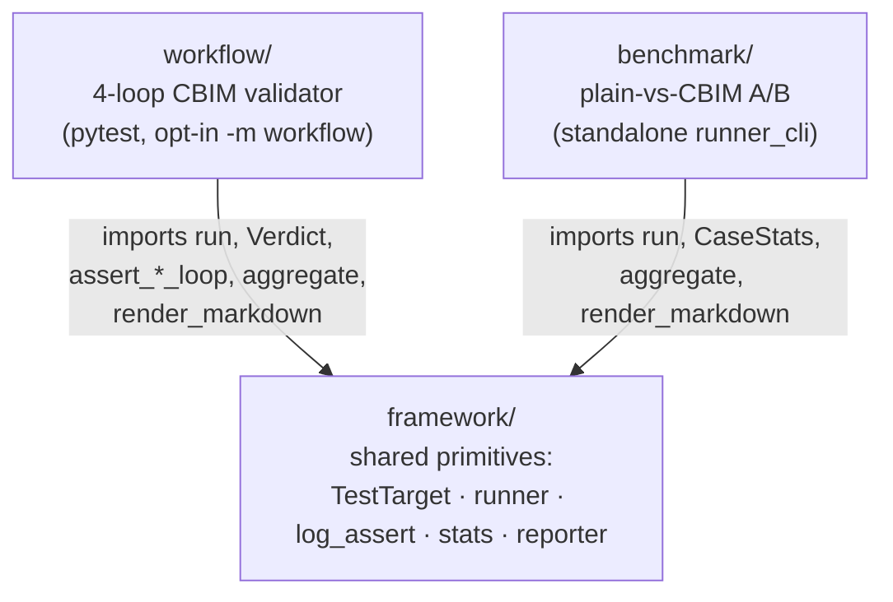

## Positioning

Aggregates the **automated test harness** that exercises the CC kernel + CBIM workflow end-to-end. Three children divide the harness by *driver shape* and *what is asserted*: a shared primitives layer (`framework`), a pytest-driven four-loop architecture validator (`workflow`), and a standalone plain-vs-CBIM A/B comparator (`benchmark`).

This directory **also** carries a flat collection of top-level pytest files (`test_dna_*.py`, `smoke_phase*.py`, `conftest.py`) that exercise the kernel CLI directly — those are ad-hoc kernel regression tests, not part of the harness architecture, and intentionally not modularized.

**What this module is.** The architectural envelope for the three harness children: their common purpose, their dependency direction, and the meta-decisions (stdlib-only, subprocess-driven, always-render-report) that bind them.

**What this module is not.** Not an implementation. Not a test runner itself. Not responsible for the top-level kernel pytest files.

## Sub-module Relationships

**Dependency direction.** `framework` is the stable side; `workflow` and `benchmark` are the volatile sides. Both children import from `framework`; `framework` knows nothing about either consumer. No back-edges. No sibling-to-sibling links — `workflow` and `benchmark` never reference each other.

**Composition vs aggregation.** The parent **composes** `framework` (without it the other two cannot function) and **aggregates** `workflow` + `benchmark` (each is independently runnable; either can be deleted without breaking the other).

## Key Decisions

- **Stdlib + pytest only.** No third-party test deps. `subprocess`, `time`, `json`, `re`, `dataclass`, plus pytest. Rationale: the harness must run in any CI without environment drift; richer libraries don't pay for themselves at this scale.

- **subprocess against `claude -p`, not in-process.** Each test case shells out to the real CLI. Rationale: the kernel is consumed via subprocess in production; mocking the model surface defeats the point of an end-to-end harness.

- **Always render a report.** Hard timeout, per-task try/except, shell `set -uo pipefail`, log/token parsing all best-effort. Any case can fail noisily, but `aggregate` + `render_markdown` always run. Rationale: a partial report is more useful than a crashed run with no artifacts.

- **Three-way split, not two.** Could have collapsed `framework` into either consumer; chose to extract because both consumers need the same primitives and the volatility profiles differ (framework rarely changes; the two consumers evolve with their own questions).

- **Top-level pytest files are not modularized.** The `test_dna_*.py` / `smoke_phase*.py` at `v1/tests/`'s top level are ad-hoc kernel regression tests that pre-date this harness layer. Not a module; not part of `framework`/`workflow`/`benchmark`. Re-homing them is a future cleanup, out of scope here.

## Origin Context

The CC kernel ships as a `.cbim/` drop-in and is meant to be exercised end-to-end against a real `claude -p` subprocess — not unit-mocked. Two distinct questions emerged from that constraint:

1. **Does the four-loop CBIM workflow (Architect / Execution / HR / Memory) actually fire as designed?** Needs structured session-log assertions on real runs.
2. **Does CBIM beat a plain-Claude baseline on representative tasks?** Needs A/B mode flipping (CBIM enabled vs `.cbim/` removed) on a fixed fixture.

These two questions have **incompatible drivers**: (1) wants pytest's discovery + opt-in markers + fixture finalizers; (2) wants a free-form A/B orchestrator with task auto-discovery and a single CLI entry. Forcing both into one driver bloats both. Forcing them into separate copies of the runner/log/report code duplicates ~500 lines. The resolution: extract the runner / log-assert / stats / reporter primitives into `framework`, give each question its own driver as a sibling leaf.

## Non-Goals

- Not a unit test framework. The three children are integration / end-to-end harnesses against a real `claude` subprocess; pure-logic unit tests for kernel modules live elsewhere (top-level `test_dna_*.py` and per-module pytest files inside the kernel tree).
- Not a CI orchestrator. Each child exposes a `run-bench.sh` (or pytest invocation); wiring them into CI is the consumer's problem.
- Not in charge of the toy fixture project under `benchmark/fixture/` — that fixture's design and lifecycle belong to the `benchmark` child.
- Not a place to add a 4th sibling that re-uses framework. New questions about CC kernel behavior should first be checked against `workflow` and `benchmark`; only a genuinely incompatible driver shape justifies a new leaf.
