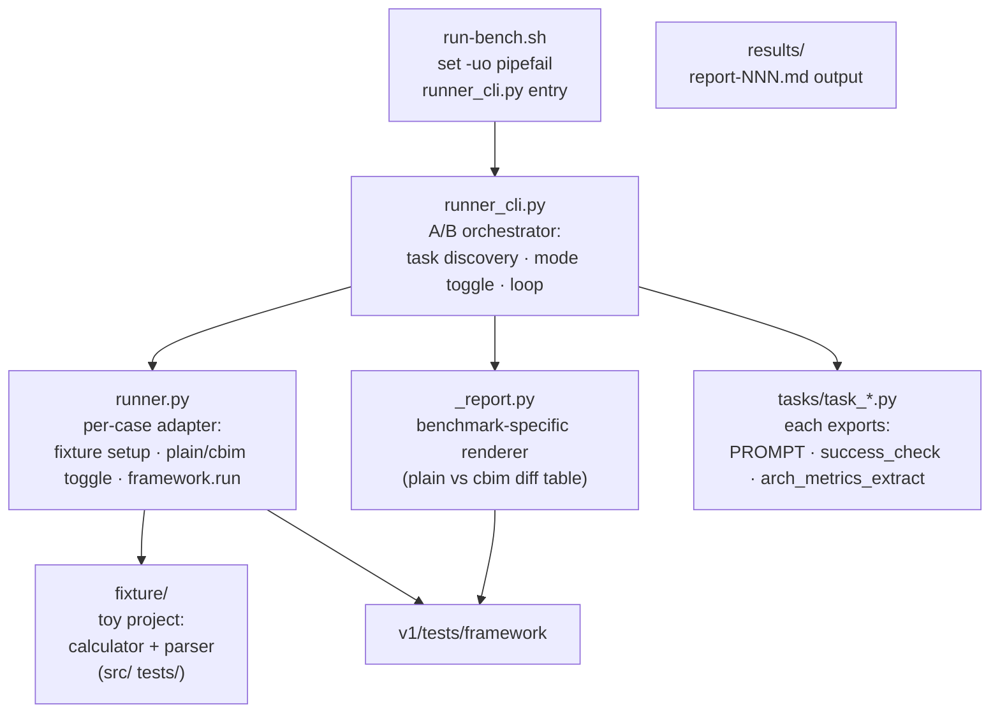

## Positioning

**Plain-vs-CBIM A/B benchmark.** For each task, runs the prompt twice against the same toy fixture project:

- **plain mode** — `.cbim/` removed from the fixture; baseline `claude -p` behavior.
- **cbim mode** — `.cbim/` present; full kernel + agents + memory active.

Then compares the two `Result`s on:

- success (per-task `success_check(result) -> bool`)
- wall time
- token usage
- architecture metrics (per-task `arch_metrics_extract(result) -> dict`: agent dispatches, knowledge reads, memory writes, ...)

5 tasks today × 2 modes = 10 invocations per run. Tasks live under `tasks/` and are auto-discovered.

**Driver.** Standalone `runner_cli.py`, no pytest. Invoked via `./run-bench.sh`.

**What this module is not.** Not a workflow validator (does not assert on loop firing). Not a unit-test suite. Not generalized — bound to the fixed `fixture/` toy project (calculator + parser).

## Class Diagram

```mermaid
classDiagram
    %% classes, interfaces, key method signatures, relationships
```

## Key Decisions

- **Standalone driver, not pytest.** A/B orchestration needs explicit mode-toggle and paired-run logic that pytest's parameterization fits awkwardly. Rationale: `runner_cli.py` reads cleaner than a `@pytest.mark.parametrize` cross-product, and the report shape (plain-vs-cbim diff table) wants a custom renderer anyway.

- **Fixture is fixed, not parameterized.** `fixture/` = one calculator + one parser, in `src/` and `tests/`. Rationale: A/B comparison is only meaningful when *exactly* the same starting state goes through both arms; varying the fixture would confound mode-effect with fixture-effect.

- **Task auto-discovery via `tasks/task_*.py`.** Each task module exports `PROMPT: str`, `success_check: Callable[[Result], bool]`, `arch_metrics_extract: Callable[[Result], dict]`. Rationale: adding a task is a one-file drop; no central registry to update.

- **Per-task `success_check`, not a global one.** "Did this task succeed" depends on the task — e.g., a refactor task checks that tests pass; a doc task checks that a markdown file appeared. Rationale: success is task-shaped; pretending otherwise produces meaningless aggregate scores.

- **`arch_metrics_extract` is per-task too, but read the session log uniformly.** Each task pulls the metrics it cares about from `Result.session_log`. Rationale: architecture metrics (agent dispatches, knowledge reads, ...) are universal, but which ones matter for a given task differs.

- **Mode toggle is `rm -rf .cbim/`, not a feature flag.** Plain mode literally deletes the kernel from the fixture copy before running. Rationale: the cleanest definition of "no CBIM" is "no `.cbim/` on disk"; anything subtler invites accidental partial-CBIM states.

- **Benchmark-specific report renderer (`_report.py`).** The default `framework.render_markdown` writes a flat case table; benchmark needs a paired plain-vs-cbim diff table. Rationale: report shape is consumer-specific; framework stays generic.

- **No retry, no warm-up.** Each (task, mode) runs once. Rationale: variance reporting is honest; hiding it via retries or warm-ups would inflate apparent CBIM benefit.

## Sub-module Relationships



`runner_cli` is the orchestrator: discovers tasks, iterates plain × cbim, calls `runner` per case, hands aggregated results to `_report`. `runner` does the per-case fixture prep (copy fixture to tempdir, conditionally strip `.cbim/`) before delegating to `framework.run`. No back-edges.

## Non-Goals

- Not a workflow validator — does not assert on which loop fired. That's `workflow`'s job.
- Not a unit-test suite. The fixture is exercised end-to-end through `claude -p`; `fixture/tests/` is the *target's* test suite (used by `success_check` for some tasks), not this module's.
- Not pytest-driven. Adding `@pytest.mark.benchmark` and folding into pytest would dissolve the parent's "two questions, two drivers" decomposition.
- Not generalized to arbitrary projects. Bound to `fixture/`. A "benchmark this real project" mode is out of scope; the right shape would be a separate sibling.
- Does not own `framework/` primitives. Renderer here is benchmark-specific; cross-cutting changes go in `framework`.
- Not statistically rigorous. Single-shot per (task, mode). Not designed to detect small effects; designed to surface large mode differences.
