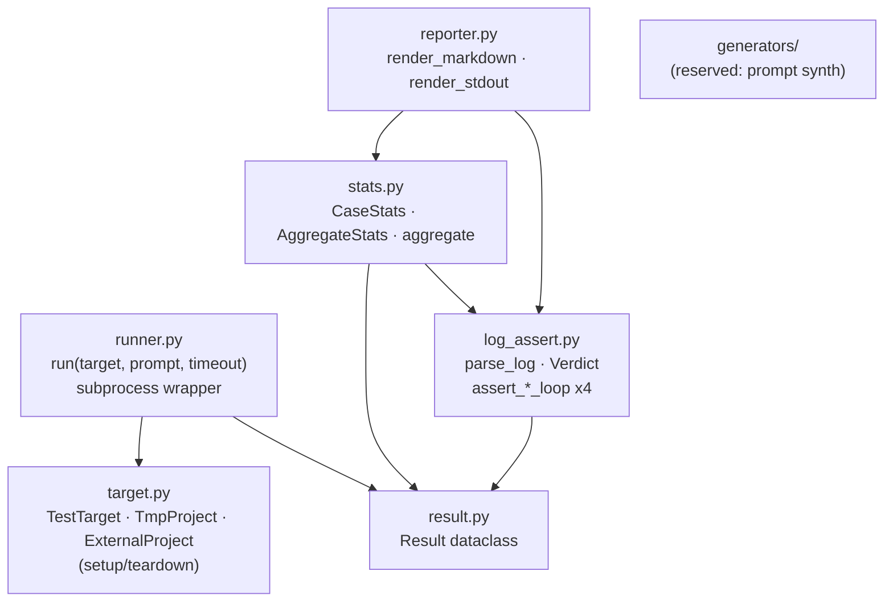
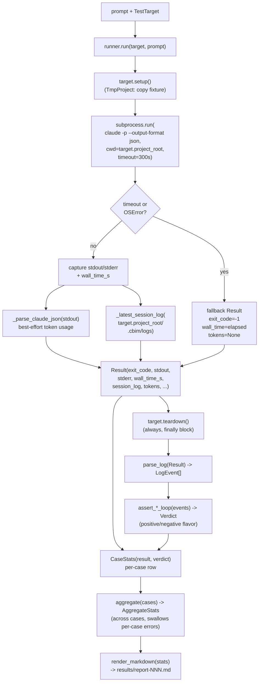

## Positioning

The shared primitives layer. Provides everything a test driver needs to invoke `claude -p` against a target project, parse what came back, and turn it into a report — but is **not itself** a driver.

Public surface (re-exported from `framework/__init__.py`):

- `TestTarget` / `TmpProject` / `ExternalProject` — target abstraction; setup/teardown lifecycle.
- `Result` — dataclass capturing one subprocess invocation (exit code, stdout/stderr, wall time, session log, token counts).
- `run(target, prompt, timeout)` — the single subprocess entry point.
- `Verdict` + `parse_log` + `assert_execution_loop` / `assert_architect_loop` / `assert_hr_loop` / `assert_memory_loop` — session-log → structured verdict.
- `CaseStats` / `AggregateStats` / `aggregate` — per-case + cross-case statistics.
- `render_markdown` / `render_markdown_single` / `render_stdout` — report writers.

**What this module is not.** Not a driver — it has no test discovery, no A/B orchestration, no CLI entry. Not opinionated about whether a consumer uses pytest. Not aware of either consumer's prompt set.

## Class Diagram

```mermaid
classDiagram
    %% classes, interfaces, key method signatures, relationships
```

## Key Decisions

- **Single public entry `run(target, prompt, timeout=300)`.** Consumers never reach for `subprocess` directly. Rationale: token parsing, log capture, timeout, and target lifecycle all live behind this one boundary so a flag change (e.g., switching `claude` invocation shape) is a one-file edit.

- **`Result` is plain data.** A frozen-ish dataclass with no methods, no I/O. Rationale: assertions, stats, and reporter all read it; nobody should be able to mutate or hide state inside it.

- **Token parsing is best-effort, contract-free.** `_parse_claude_json` tries several plausible key names and silently falls back to `(None, None)`. Rationale: `claude -p --output-format json` is not part of CBIM's contract; pinning to a specific shape would couple the harness to an external CLI's internal versioning.

- **Session log is read from disk, not piped.** The kernel writes `.cbim/logs/session_*.log` independently of stdout; `runner` reads the newest file post-hoc. Rationale: stdout is the model's transcript; the session log is the kernel's structured event stream. They are two channels and must stay separate.

- **TestTarget is an abstraction, not an inheritance hierarchy crutch.** `TmpProject` (copy fixture to tempdir, teardown wipes) and `ExternalProject` (run against an existing path, teardown is a no-op) are the only concretions today. Rationale: the consumer should not care which it got.

- **`render_markdown_single` exists alongside `render_markdown`.** Single-case rendering is needed by pytest fixtures that emit one report per test; aggregate rendering is needed by the A/B driver. Both call into the same writers.

- **`generators/` is reserved, not empty by accident.** Held for future prompt-synthesis primitives; currently exposes nothing through `__init__.py`. Don't import from it yet.

## Sub-module Relationships



Internal dependencies form a strict DAG: `target`/`result` are leaves; `runner` and `log_assert` sit on top; `stats` aggregates them; `reporter` renders the aggregate. No back-edges. `generators/` is a reserved namespace for future prompt-synthesis primitives and currently exposes nothing.

## Runflow Diagram



**Robustness invariants on this flow:**
- Hard subprocess `timeout=300s`; on hit, `Result.exit_code = -1`, downstream still runs.
- `_parse_claude_json` returns `(None, None)` on any JSONDecodeError or shape mismatch — tokens stay `None`, never raise.
- `_latest_session_log` returns `None` if `.cbim/logs/` doesn't exist; `log_text=""` on miss.
- `target.teardown()` runs in a `finally`, even on subprocess crash.
- Driver-level wrappers (in `workflow` / `benchmark`) wrap each case in `try/except`; `aggregate` and `render_markdown` are unconditionally called at the end. **The report is always written**, even when half the cases died.

## Non-Goals

- Does not discover or schedule tests. That's pytest's job (in `workflow`) or `runner_cli`'s job (in `benchmark`).
- Does not own prompts. Prompt sets live with their consumer (`workflow/prompts/`, `benchmark/tasks/`).
- Does not own the toy fixture. `benchmark/fixture/` is benchmark's.
- Does not depend on either consumer; consumers depend on it. Adding any `from ..workflow` or `from ..benchmark` import here is a circular dependency and forbidden.
- Does not retry on subprocess failure. A failed case is reported as failed; retry policy (if ever needed) is the driver's call.
- Does not pin `claude -p --output-format json` shape — token parsing is best-effort precisely to avoid this coupling.
