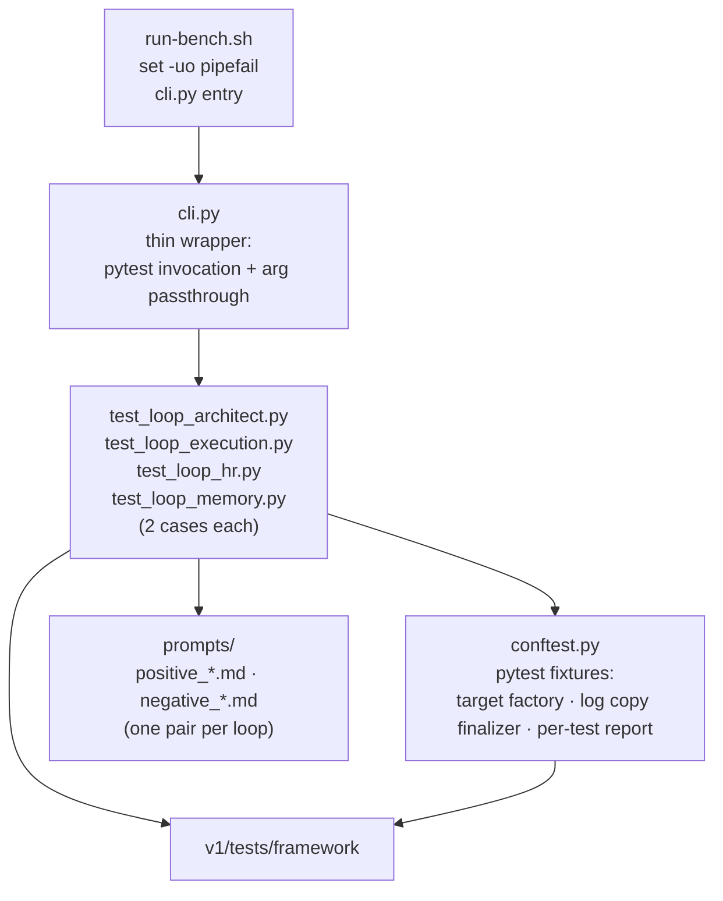

## Positioning

**Validates the four CBIM workflow loops fire as designed**, by running structured prompts against a real `claude -p` subprocess and asserting on the captured session log. Each loop is checked in two flavors:

- **positive** — prompt that should make the loop fire; assert the expected events occurred.
- **negative** — prompt that should *not* trigger the loop; assert it did *not* fire (no false positives).

8 cases total = 4 loops × 2 flavors. The four loops:

| Loop | What is checked |
|------|-----------------|
| Architect 必经门 | Architect runs before any requirement-type Work Agent dispatch |
| Execution 回环 | `NEEDS_ARCH_DECISION:` from a Work Agent re-routes to Architect |
| HR | Agent recruitment / matching pathway |
| Memory | `.cbim/memory/` write/query routing |

**Driver.** pytest, opt-in via `-m workflow`. Each case is a `test_*` function in `test_loop_*.py`. Fixture finalizer copies the session log into `results/` for the report.

**What this module is not.** Not a unit-test suite. Not a benchmark (no A/B comparison, no timing metric as primary axis).

## Class Diagram

```mermaid
classDiagram
    %% classes, interfaces, key method signatures, relationships
```

## Key Decisions

- **pytest, not a custom driver.** Each case is a `test_*` function. Rationale: discovery, parameterization, fixtures, and CI integration are free; nothing here needs more than that.

- **Opt-in via `-m workflow` marker.** These cases shell out to `claude -p` and take real wall time + tokens; they must not run in the default pytest collection. Rationale: protects normal `pytest` runs from accidentally burning model budget.

- **Two flavors per loop: positive + negative.** A loop that fires on everything is as broken as a loop that never fires. Negative cases catch over-eager routing. Rationale: false-positive coverage is non-negotiable for behavioral assertions.

- **Session log copy happens in fixture finalizer, not in the test body.** A failed assertion still triggers the finalizer; the log is captured for the report regardless. Rationale: report must always render.

- **One report per test, plus an aggregate.** `render_markdown_single` from framework writes per-case; `render_markdown` writes the cross-case summary. Rationale: debuggers want one file per failing case; humans skimming want one summary.

- **Prompts are markdown files, not inline strings.** `prompts/positive_architect.md` etc. live on disk and are loaded by the fixture. Rationale: prompts are content, not code; editing them shouldn't touch Python.

- **`cli.py` is a thin pytest wrapper, not a re-implementation.** It exists so `run-bench.sh` has a single Python entry to call with `set -uo pipefail` safety. Rationale: shell-level robustness without duplicating pytest's CLI.

## Sub-module Relationships



`tests` (8 functions) consume prompts + framework primitives via fixtures provided by `conftest`. `cli.py` + `run-bench.sh` are entry shells. No back-edges to framework.

## Non-Goals

- Not an A/B comparator — does not run a plain-Claude baseline. That's `benchmark`'s job.
- Not a place to add unit tests for kernel internals. Top-level `test_dna_*.py` is the (legacy) home for those.
- Not driven by `runner_cli` — that script belongs to `benchmark`. Mixing drivers across siblings would dissolve the parent's "two questions, two drivers" decomposition.
- Does not own `framework/` primitives. Bug fixes to runner / log parsing / aggregation live in `framework`, not here.
- Does not run in the default `pytest` collection — `-m workflow` is required. Removing the marker is a regression.
