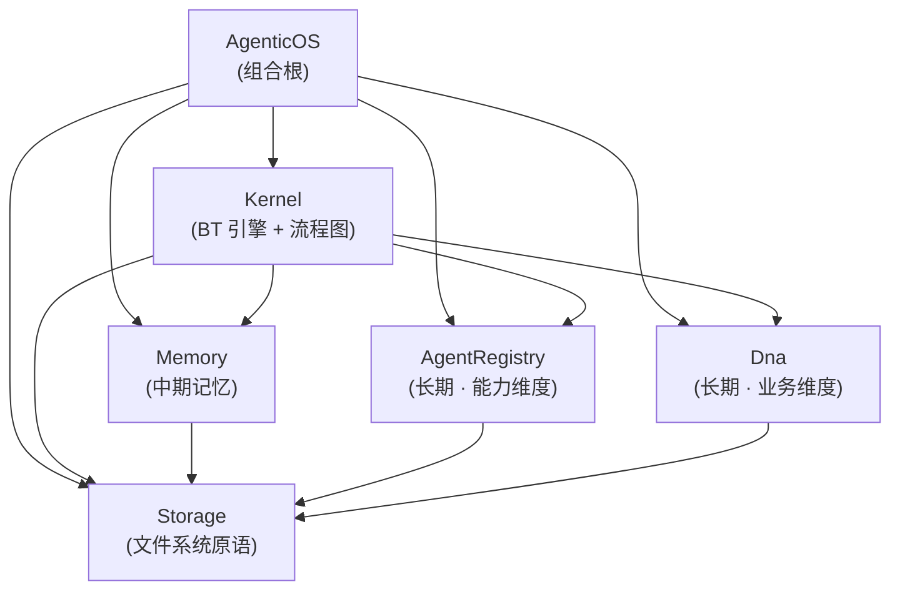

## Positioning

CBIM Agent OS 的 Unity 原生 C# 实现。在拓扑上对齐 `v1/kernel/` 的 Python 内核——同一套工作流图，但完全跑在 Unity 进程内：无 Python 子进程、无 MCP 往返。目标只有一个——**工作流稳定**：`design/LOOPS-OVERVIEW.zh-CN.md` 描述的 7 张流程图，无论由 Python 内核驱动还是由本 C# 移植驱动，都跑出同一个形状。

本模块是组合根，自身**不承载任何业务逻辑**——只做装配。所有逻辑落到五个子模块：`Storage` / `Memory` / `AgentRegistry` / `Dna` / `Kernel`。

## Children

| 子模块 | 一句话职责 | 层级 | 稳定性 |
|--------|-----------|------|--------|
| `Storage/` | 文件系统原语——原子写、JSON 快照、append-only trace 日志 | IO 边界 | 最稳定（底层） |
| `Memory/` | 中期记忆被动存储——distill 后的事实条目；读 / 写 / 扫描 / 查询 / 统计 / 维护 | 记忆层 | 稳定 |
| `AgentRegistry/` | 长期记忆 · 能力维度——组织架构图谱（agent 能力 / 角色 / 关系）被动存储 | 记忆层 | 稳定 |
| `Dna/` | 长期记忆 · 业务维度——模块知识图谱（`.dna/` 模块树 + 依赖图）被动存储 | 记忆层 | 稳定 |
| `Kernel/` | BT 引擎（Node / Composite / Decorator / Blackboard / Runner）+ 执行根与治理根流程图 | 驱动层 | 易变（顶层） |
| `AgenticOS.cs` | 组合根门面——Unity 场景调用的唯一入口 | 门面 | 仅门面 |

## Three-Layer Memory · 模块划分

本子树里有**三个记忆层模块**，一个中期 + 两个长期，职责不交叠：

| 记忆层 | 归属模块 | 负责什么 |
|---------|----------|----------|
| 中期记忆 | `Memory/` | session 压缩 / distill 后的事实条目（`MemoryEntry`） |
| 长期 · 能力 | `AgentRegistry/` | 组织架构图谱：agent 定义、能力、角色、关系 |
| 长期 · 业务 | `Dna/` | 模块知识图谱：`.dna/` 模块树与依赖图 |

短期记忆（会话 transcript）**不在本子树以内**——属于 Unity 场景的 LLM host 适配层，仅存于进程内对象。三层记忆架构的完整权威定义见 `Memory/.dna/module.md`，本处仅列出本子树内的归属。

## Child Relationships

依赖方向单调：`AgenticOS → Kernel → {Memory, AgentRegistry, Dna} → Storage`，无任何反向边。三个记忆层模块（Memory / AgentRegistry / Dna）互不依赖——是同级、并行、背面背的三张被动存储，任何一者引用另外两个都是架构侵犯。这与 Python 内核的稳定性分层（engine → {memory, cbi/agents, cbi/_primitives/dna} → 原语）同构，是本移植的**铁律**——任何引入 `Storage → Memory`、`Memory → AgentRegistry`、`Dna → Memory` 这类反向或同级边的改动一律拒绝。

## Origin Context

Python 内核以独立进程运行，与 Claude Code 之间通过 MCP 协议通信。这套形态搬到 Unity 内极其脆弱：子进程生命周期、MCP 传输层、JSON 序列化在 Unity 运行时都会变成隐患——Editor 域重载、AOT 平台、IL2CPP、移动端挂起。原生 C# 移植直接坑缩这层边界：Unity 脚本直调 `AgenticOS.Tick(prompt)`，BT 引擎在进程内 tick，持久化经 Storage 层落到 `Application.persistentDataPath`。

原本只发三个子模块（Storage / Memory / Kernel），与 Python 内核当年的切法同构。本轮拆出 **AgentRegistry / Dna** 两个独立模块的动机：「长期记忆」是与「中期记忆」同级的事物，是描述组织 / 业务结构的稳定知识，不能被隐含在 Memory 中。三张图（事实图 / 能力图 / 模块图）各自有独立 schema、独立查询表面、独立落地路径——任何一个肿胀为「通用记忆」都会出现隐式多态与 schema 脩杂。

五段切分与 Python 内核（`v1/kernel/engine/`、`v1/kernel/memory/`、`v1/kernel/cbi/agents/`、`v1/kernel/cbi/_primitives/dna/`、零散文件 IO）对齐。保持同一边界意味着 `design/WORKFLOW-*.zh-CN.md` 这批设计稿对两个实现都适用，不需要做翻译适配。

## Emergent Insights（跨子模块视角）

1. **记忆服务是被动数据层，不是 actor。** 这一条同时适用于三个记忆模块：Memory / AgentRegistry / Dna 都没有循环、没有定时器、不发通知；CRUD / 治理子循环都属于 Kernel，记忆模块只负责响应调用。这条铁律决定了 asmdef 依赖图——这三个模块**不准**引用 Kernel、也不准互相引用。详见 `design/WORKFLOW-MEMORY.zh-CN.md` §"记忆服务边界"。
2. **Storage 是唯一的 IO 边界。** Kernel 写黑板快照走 Storage，三个记忆模块写条目 / agent / 模块文档都走 Storage，其他任何模块都不直接碰文件系统。这意味着平台移植（移动端沙盒、WebGL IndexedDB）只动 Storage 一处。
3. **三张记忆图各自独立，不脱同一个 `MemoryEntry`。** 中期记忆的 `MemoryEntry`、能力维度的 `AgentRecord`、业务维度的 `DnaModule` 是三套互不兼容的 schema。任何「用 `MemoryEntry.kind == 'agent'` 记 agent」或「用 `MemoryEntry.kind == 'module'` 记模块」的设计都会被架构层面拒绝——隐式多态是记忆与治理边界被抹去的首要忁兆。
4. **AgenticOS 是 Unity 侧的唯一公共门面。** Unity 场景 / MonoBehaviour **不**直接看见 `Kernel.Runner` / `Memory.Service` / `AgentRegistry.Service` / `Dna.Service` / `Storage.FileBackend`——只调 `AgenticOS.Tick(prompt) → BtResult`。这是顶层 C1（开闭原则）的落点。

## Implementation Sequence（知识 → 代码）

六个模块按稳定性分层**自底向上**交付——每一层的测试都能在它的消费方落地前先跑通：

1. Storage 原语（原子写、JSON 序列化助手）
2. Memory 被动存储（基于 Storage 的 CRUD，中期记忆条目）
3. AgentRegistry 被动存储（基于 Storage 的只读门面，能力图谱）
4. Dna 被动存储（基于 Storage 的只读门面，业务图谱）
5. Kernel BT 原语（Node / Status / Blackboard / 组合节点 / 装饰器 / Runner）
6. Kernel 执行根树拓扑（对齐 `main_loop.py`）
7. Kernel 记忆 CRUD 子循环（对齐 `loops/memory_crud.py`），接上 Memory / AgentRegistry / Dna
8. AgenticOS 门面——单一入口 `Tick(string userRequest) → BtResult`

装饰器 / Runner / 持久化属于原语之上的高层，第 5 步只发原语子集；带快照与 resume 的完整 Runner 属于第 6 步范围。AgentRegistry / Dna 在本轮只发被动读侧，写侧（从 Python 同步或人工编辑后重载）不在本切片范围。

## Non-Goals（本次移植）

- **不在引擎内嵌 LLM 客户端**——与 Python 内核 PR-D 之后的形态一致。LLM 调用走进程外，由 Unity 场景的 host 适配层负责接哪个 transport。
- **不引入 MCP 服务端**——原生移植用直调方法替代 MCP 往返。如果未来某个场景确需把 C# 引擎暴露给外部 LLM，那是另一个独立的适配模块，不归 Kernel 管。
- **本次切片不包含治理循环（`dream_tick`）**——只发执行根；治理根作为对等流程图后续按 `WORKFLOW-DREAM.zh-CN.md` 接入。
- **AgentRegistry / Dna 不发写侧 API**——只读门面。Unity 侧的能力图 / 模块图写操作仍走 Python 侧的 `agent_*` / `dna_*` MCP 工具，Unity 侧 reindex 拉取最新快照。后续是否发写侧取决于 Unity 本地双向编辑需求是否出现。
