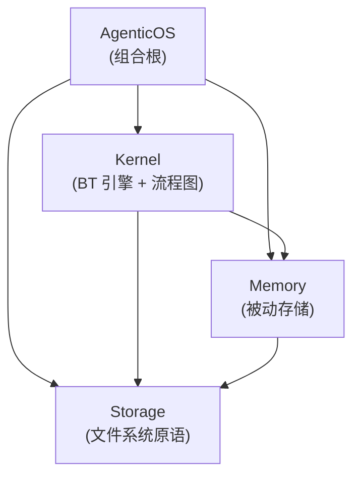

## Positioning

CBIM Agent OS 的 Unity 原生 C# 实现。在拓扑上对齐 `v1/kernel/` 的 Python 内核——同一套工作流图，但完全跑在 Unity 进程内：无 Python 子进程、无 MCP 往返。目标只有一个——**工作流稳定**：`design/LOOPS-OVERVIEW.zh-CN.md` 描述的 7 张流程图，无论由 Python 内核驱动还是由本 C# 移植驱动，都跑出同一个形状。

本模块是组合根，自身**不承载任何业务逻辑**——只做装配。所有逻辑落到三个子模块：`Storage` / `Memory` / `Kernel`。

## Children

| 子模块 | 一句话职责 | 稳定性 |
|--------|-----------|--------|
| `Storage/` | 文件系统原语——原子写、JSON 快照、append-only trace 日志 | 最稳定（底层） |
| `Memory/` | 被动记忆存储——读 / 写 / 扫描 / 查询 / 统计 / 维护 | 稳定 |
| `Kernel/` | BT 引擎（Node / Composite / Decorator / Blackboard / Runner）+ 执行根与治理根流程图 | 易变（顶层） |
| `AgenticOS.cs` | 组合根门面——Unity 场景调用的唯一入口 | 仅门面 |

## Child Relationships

依赖方向单调：`AgenticOS → Kernel → Memory → Storage`，无任何反向边。这与 Python 内核的稳定性分层（engine → memory → 原语）同构，是本移植的**铁律**——任何引入 `Storage → Memory` 或 `Memory → Kernel` 的改动一律拒绝。

## Origin Context

Python 内核以独立进程运行，与 Claude Code 之间通过 MCP 协议通信。这套形态搬到 Unity 内极其脆弱：子进程生命周期、MCP 传输层、JSON 序列化在 Unity 运行时都会变成隐患——Editor 域重载、AOT 平台、IL2CPP、移动端挂起。原生 C# 移植直接坍缩这层边界：Unity 脚本直调 `AgenticOS.Tick(prompt)`，BT 引擎在进程内 tick，持久化经 Storage 层落到 `Application.persistentDataPath`。

三段切分（Storage / Memory / Kernel）与 Python 内核当年的切法（`v1/kernel/engine/`、`v1/kernel/memory/`、零散文件 IO）**是同一刀**。保持同一边界意味着 `design/WORKFLOW-*.zh-CN.md` 这批设计稿对两个实现都适用，不需要做翻译适配。

## Emergent Insights（跨子模块视角）

1. **记忆服务是被动数据层，不是 actor。** 见 `design/WORKFLOW-MEMORY.zh-CN.md` §"记忆服务边界"。Memory 没有循环、没有定时器、不发通知；CRUD 子循环属于 Kernel，Memory 只负责响应调用。这条铁律决定了 asmdef 依赖图——Memory **不准**引用 Kernel。
2. **Storage 是唯一的 IO 边界。** Kernel 写黑板快照走 Storage，Memory 写条目走 Storage，其他任何模块都不直接碰文件系统。这意味着平台移植（移动端沙盒、WebGL IndexedDB）只动 Storage 一处。
3. **AgenticOS 是 Unity 侧的唯一公共门面。** Unity 场景 / MonoBehaviour **不**直接看见 `Kernel.Runner` / `Memory.Service` / `Storage.FileBackend`——只调 `AgenticOS.Tick(prompt) → BtResult`。这是顶层 C1（开闭原则）的落点。

## Implementation Sequence（知识 → 代码）

四个模块按稳定性分层**自底向上**交付——每一层的测试都能在它的消费方落地前先跑通：

1. Storage 原语（原子写、JSON 序列化助手）
2. Memory 被动存储（基于 Storage 的 CRUD）
3. Kernel BT 原语（Node / Status / Blackboard / 组合节点 / 装饰器 / Runner）
4. Kernel 执行根树拓扑（对齐 `main_loop.py`）
5. Kernel 记忆 CRUD 子循环（对齐 `loops/memory_crud.py`），接上 Memory
6. AgenticOS 门面——单一入口 `Tick(string userRequest) → BtResult`

装饰器 / Runner / 持久化属于原语之上的高层，第 3 步只发原语子集；带快照与 resume 的完整 Runner 属于第 4 步范围。

## Non-Goals（本次移植）

- **不在引擎内嵌 LLM 客户端**——与 Python 内核 PR-D 之后的形态一致。LLM 调用走进程外，由 Unity 场景的 host 适配层负责接哪个 transport。
- **不引入 MCP 服务端**——原生移植用直调方法替代 MCP 往返。如果未来某个场景确需把 C# 引擎暴露给外部 LLM，那是另一个独立的适配模块，不归 Kernel 管。
- **本次切片不包含治理循环（`dream_tick`）**——只发执行根；治理根作为对等流程图后续按 `WORKFLOW-DREAM.zh-CN.md` 接入。
