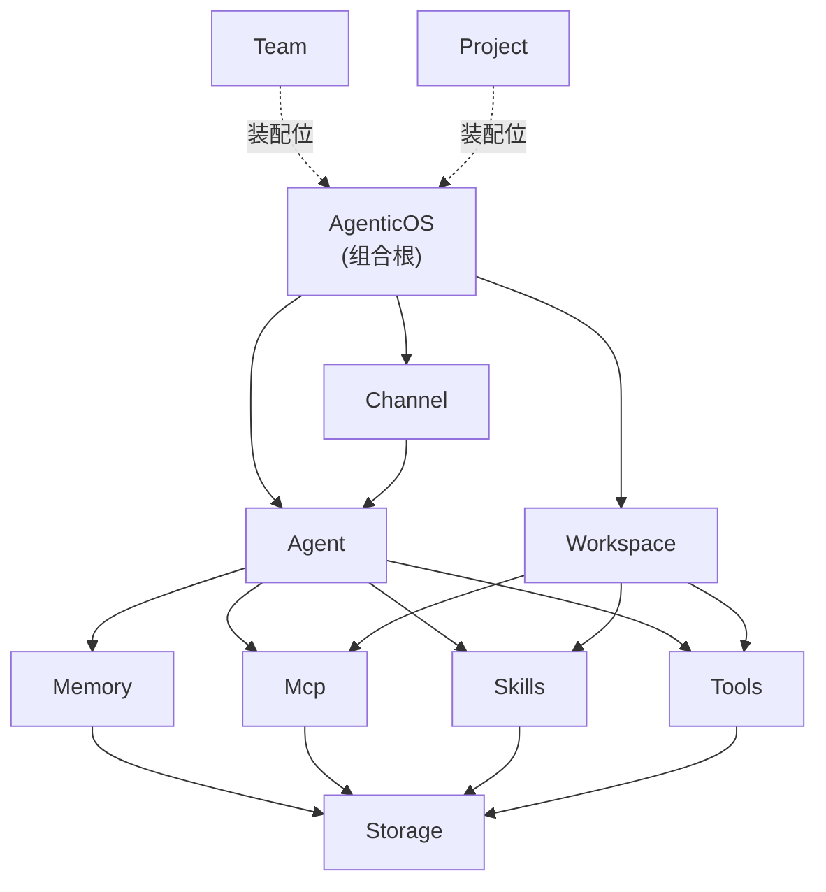

## 定位

CBIM 是 v2 项目里的 Agent OS：把"会话入口、Agent 装配、业务工作区、共享基建"组织成一个可被宿主装配根调用的整体。对 v2 项目而言，它是承载所有 Agent 能力与业务模块的运行时底盘。

## 设计主体

| 子模块 | 角色 |
|--------|------|
| `AgenticOS` | 组合根：装配并持有其他一级子模块，对外暴露 CBIM 的启动面。 |
| `Channel` | 对外会话入口，把外部调用翻译成 Agent 可处理的会话事件。 |
| `Agent` | Agent 的装配与运行门面，对外提供"一个可被驱动的 Agent"这一抽象。 |
| `Workspace` | 业务侧工作区，把项目自身的 Skill / MCP / Tool 组装成可被 Agent 使用的模块。 |
| `Memory` | Agent 的记忆服务，承担长期/短期记忆的读写契约。 |
| `Mcp` | MCP 描述符与实例的统一管理面。 |
| `Skills` | Skill 描述符的存储与检索面。 |
| `Tools` | Tool 描述符的基建面，定义工具能力的统一形态。 |
| `Storage` | 全栈最底层的存储原语，被所有需要落盘的基建依赖。 |
| `Team` | 多 Agent 协作的预留装配位。 |
| `Project` | 项目级上下文的预留装配位。 |

## 边界约束

- 依赖单向向下：`AgenticOS → {Channel, Agent, Workspace} → 基建子模块 → Storage`，禁止反向依赖。
- `Agent` 与 `Workspace` 不直接耦合，二者通过共享基建（`Mcp / Skills / Tools`）与组合根协作。
- 每个一级子模块的内部组织由其自身的 `.dna/module.md` 负责，本文件不下钻。
