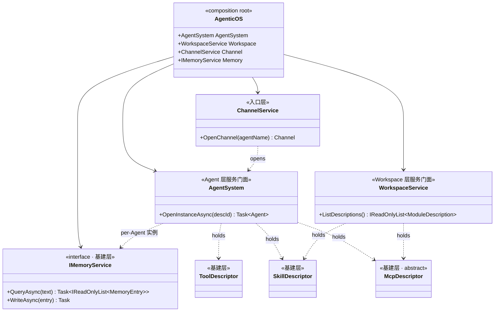

## Positioning

CBIM Agent OS 的 Unity 原生 C# 实现 · 三层模型组合根。本身**不承载任何业务逻辑**——只做装配。

- **基建层**：类型契约 / 抽象接口 / 标准协议（Tool / Skill / Mcp / IMemoryService / Storage）
- **Agent 层**：虚拟人代理（多脑区共享一份 Memory + Tool/Skill/MCP 集合）
- **Workspace 层**：工作区 / 项目（模块树 + 模块对象，模块自持 MCP/Skill 实例）

**顶层心智收敛**：三个名字、三句话、三个清晰职责。原六层退化为三层内部的子结构。

## CBIM 认知框架

> **CBIM 是一个「复合 Agent」——一个拥有全知全能的人。**

| 隐喻 | CBIM 对应物 | 三层归属 |
|------|-------------|----------|
| 全能的人 | CBIM 整体（`AgenticOS`） | — |
| 大脑皮层 | Agent/Brain 内 PrefrontalCortex（铁律 A：唯一通路） | Agent 层 |
| 各专项脑区 | ParietalLobe / Hippocampus / MotorCortex 家族（含 ExternalMotorCortex） | Agent 层 |
| 长期记忆 | IMemoryService 实例（per-Agent） | 基建 + Agent |
| 工具与武器 | Tool / Skill / Mcp 接口 | 基建类型 + Agent/Workspace 各派实例 |
| 办公位 | Module 对象 | Workspace 层 |
| 当下思考流 | AgentSession | Agent 层（msai host） |

### 三定理

1. **皮层定理** —— PrefrontalCortex 唯一调度跨脑区协作；其他脑区互不通讯。
2. **脑区定理** —— 每个内部脑区只做 Reason-Act 循环，副作用穿过 MotorCortex 家族。
3. **武器库定理** —— 接口标准跨场景共享（基建层），实例集合各方独立持有。

## 三层架构图

```mermaid
flowchart TD
    classDef infra fill:#d1c4e9,stroke:#311b92,color:#000;
    classDef agent fill:#c8e6c9,stroke:#1b5e20,color:#000;
    classDef workspace fill:#bbdefb,stroke:#0d47a1,color:#000;
    classDef msai fill:#f8bbd0,stroke:#880e4f,color:#000;
    classDef root fill:#fff9c4,stroke:#f57f17,stroke-width:2px,color:#000;

    subgraph L1["基建层（类型约定 / 抽象接口 / 标准协议）"]
        STG["Storage<br/>FileBackend"]
        T["Tools<br/>ToolDescriptor + Standard"]
        SK["Skills<br/>SkillDescriptor"]
        MC["Mcp<br/>McpDescriptor (abstract)"]
        MEM["Memory<br/>IMemoryService + FileMemoryBackend"]
        MEM --> STG
        T --> STG
    end

    subgraph L2["Agent 层（虚拟人代理）"]
        AS["Agent<br/>(AgentDescription + OpenInstance + Session 写)<br/>Brain 多脑区：Prefrontal / Parietal / Hippocampus /<br/>MotorCortex 家族（Native + ExternalMotorCortex）"]
        CH["Channel<br/>(AgentSession 薄封装)"]
        CH --> AS
        AS --> MEM
        AS --> T
        AS --> SK
        AS --> MC
    end

    subgraph L3["Workspace 层（工作区 / 项目）"]
        WS["Workspace<br/>ModuleDescription = Metadata + Workflows[Skill] + McpList[Mcp]"]
        WS --> MC
        WS --> SK
        WS --> STG
    end

    subgraph MSAI["Microsoft Agent Framework"]
        MSAgent["AIAgent / AgentSession"]
        MSChat["IChatClient"]
        MSFn["AIFunction"]
        MSMcp["Mcp Client"]
    end

    AS -.AsAIAgent.-> MSAgent
    AS -.consumes.-> MSChat
    T -.produces.-> MSFn
    MC -.via Microsoft.Agents.AI.Mcp.-> MSMcp

    AOS["AgenticOS<br/>(组合根)"]
    AOS --> CH
    AOS --> AS
    AOS --> WS

    class STG,T,SK,MC,MEM infra;
    class AS,CH agent;
    class WS workspace;
    class MSAgent,MSChat,MSFn,MSMcp msai;
    class AOS root;
```

**依赖单调（C3 铁律）**：

```
Workspace 层 → 基建层
Agent 层    → 基建层
Agent 层    ⊥ Workspace 层   (互不依赖；运行期由 Brain 内部装配机制组合)
基建层      → ⊥
组合根      → 三层 (仅装配)
```

## 类图（顶层装配关系）



**关键关系**：Agent 与 Workspace 各自持 SkillDescriptor / McpDescriptor 实例集合（类型共享，实例独立）；二者在 task 期由 Brain 内部装配机制按 Id 去重合并。

## 基建层（Infrastructure Primitives）

基建层只定义类型与接口，**不持业务状态**。变更基建抽象 = 全栈影响，需高度审慎。

| 子模块 | 类型契约 |
|--------|---------|
| `Tools/` | `ToolDescriptor` + `Standard/` 内置实现 |
| `Skills/` | `SkillDescriptor` |
| `Mcp/` | `McpDescriptor` (abstract) + Stdio/Http 子类 |
| `Memory/` | `IMemoryService` + `MemoryEntry` + `FileMemoryBackend` 默认实现 |
| `Storage/` | `FileBackend`——文件系统原语 |

## Agent 层（虚拟人代理）

```
Agent 实例 = {
   大脑：多脑区家族（PrefrontalCortex / ParietalLobe / Hippocampus / MotorCortex 家族）
         · BrainBase 已含 msai 装配 · MotorCortex 下分 Native / External
   Memory 实例：IMemoryService
   Tool / MCP / Skill 集合：per-Agent 独立实例
}
```

**脑区共享同一具身**——一份 Memory / Tool / MCP / Skill 资源池。

**外部 AI 引擎接入** —— Claude Code / Cursor / Codex 以 `ExternalMotorCortex` 子类形式嵌入 Agent 内部脑区，**不**是平级模块。

| 子模块 | 一句话职责 |
|--------|----------|
| `Agent/` | Agent 装配服务门面 + Brain 多脑区编织（含 ExternalMotorCortex · ClaudeCodeMotorCortex） |
| `Channel/` | Microsoft AgentSession 薄封装 |

## Workspace 层（工作区 / 项目）

```
Module 实例 = {
   Metadata + WorkspaceRoot                       // 是什么 + 在哪
   Workflows: SkillDescriptor[]                   // 业务流程声明
   McpList:   McpDescriptor[]                     // 业务操作接入点
}
```

**Workspace 不持 Memory** —— 记忆是 Agent 的；模块没有「模块的记忆」。
**Workspace 不持 Owners** —— CBIM = 单虚拟人 + 一个 Workspace；任何脑区都可在任何模块工作。

| 子模块 | 一句话职责 |
|--------|----------|
| `Workspace/` | ModuleDescription + ModuleMetadata + 三段式（Metadata + Workflows + McpList） |

## 跨层关系澄清

- **Agent 层 ⊥ Workspace 层**——互不依赖。Task 执行时由 Brain 内部装配机制把 Workspace 的 Skill/MCP/Metadata 注入 Agent 上下文（运行期组合，非编译期依赖）。
- **跨层共享 = 基建层**——Tool/Skill/MCP/IMemoryService 同时被 Agent 与 Workspace 引用；依赖严格单向（→ 基建层）。
- **类型共享 / 实例独立**——同一基建抽象的派生实例由各方独立持有，仅在 task 期装配点按 Id 去重合并。

## 组合根

| 子模块 | 状态 |
|--------|------|
| `AgenticOS.cs` | stub |

## 三层架构铁律

1. **基建层不依赖任何其他 CBIM 层**——依赖图最稳定底层。
2. **基建抽象稳定优于完整**——`IMemoryService` 优先暴露最小必要接口（C6 开放/封闭）。
3. **Agent 层与 Workspace 层互不依赖**——所有跨层协同走运行期组合。
4. **类型契约共享 / 实例集合独立**——同一基建抽象的派生实例由各方独立持有。
5. **Agent 持 IMemoryService 实例**——无全局 MemoryService 单例。
6. **基建 IMemoryService 默认 = FileMemoryBackend**——接 Pinecone 等通过新派生。
7. **Module 持自身 MCP / Skill 实例**——Agent 进入时按需借用，离开不带走。
8. **Tool 是唯一安全边界**——所有副作用穿过 `Tools/Standard` 或 `Mcp`。
9. **AgentSystem 是服务层名（产生 Agent 的家），Agent 是实例名（被产生的对象）**——分离概念与物理。
10. **复合 Agent 三定理正交于三层模型**——三层是源码组织，三定理是行为。

## Non-Goals

- 不重新引入 LlmEngine / Pipeline / INode / IFlowGraph / IKernelEngine / ITaskRunner / IFileTools / IShellTools 任何抽象。
- 不自写业务工作流引擎、工具调用闭环、会话压缩、IO 工具层。
- 不引入 MCP 服务端——Unity 进程内直调 Microsoft。
- 不实装外部消费方文档清理（下切片 programmer 任务）。
- 不为接入 Pinecone 写实现——本轮仅暴露 `IMemoryService` 接口。

## Emergent Insights

1. **「类型契约 vs 实例集合」比「跨维度共享」更精确**——同一抽象、独立实例，一句话讲清，无歧义。
2. **Memory per-Agent 实例化 = 「物理人 = 物理记忆」的认知落地**——同时打开了第三方后端接入的能口。
3. **「调度层是 Agent 内部的脑皮层」**——一句话讲完顶层调度归属。
4. **「Agent 层 ⊥ Workspace 层」**是 v2 顶层架构最重要约束之一——人和工位是两件相互独立的资产。
5. **基建抽象 = 整个系统的稳定底层**——四个接口的版本变更需双层审视，反过来鼓励「最小完整」。

