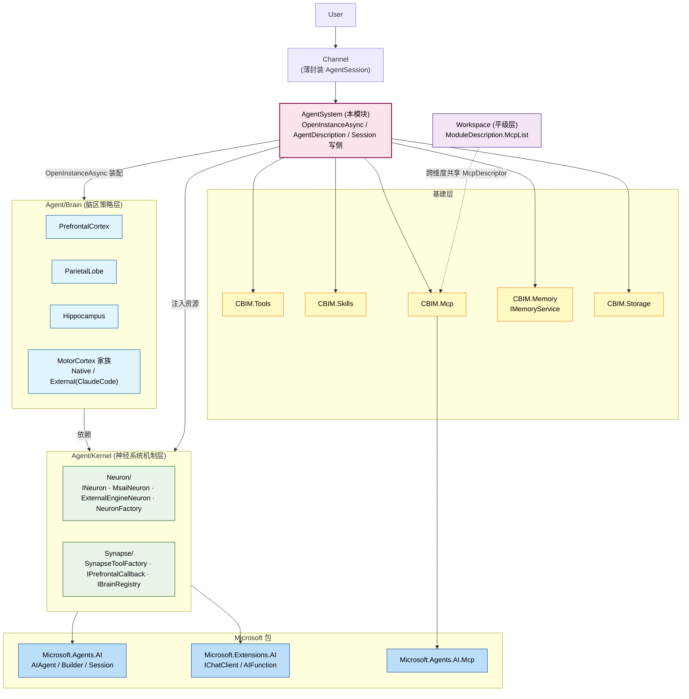
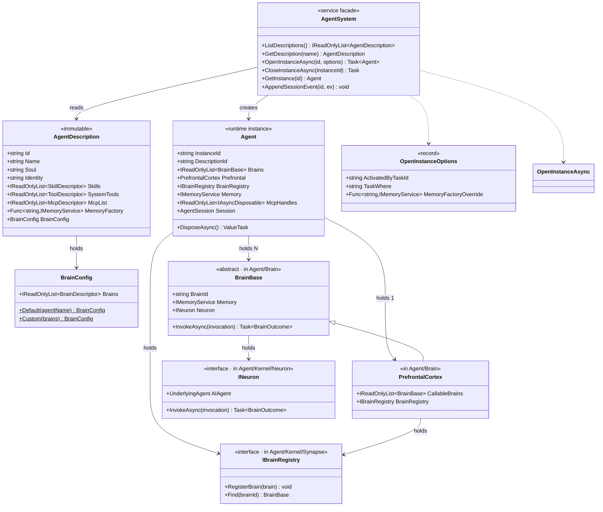
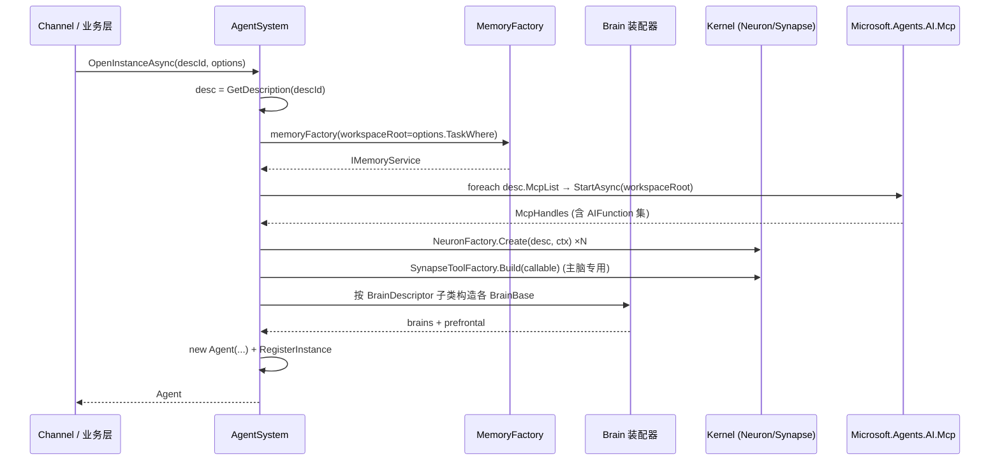

## Positioning

**Agent 层服务门面**——v2 三层模型中位于 Agent 层，负责装配「虚拟人代理」运行实例。类比 `PersonnelService 装配 Person`：本模块是产生 Agent 的家，Agent 是被产生的对象。

职责四件：
1. **AgentDescription** —— C# 类描述符（不是 yaml），声明 agent 的能力构成（Skills / SystemTools / McpList / MemoryFactory / BrainConfig）
2. **OpenInstanceAsync** —— 装配胶水：读 desc → 装 Memory → 装 Brain 集 + Kernel.Neuron / Synapse → 注册 AgentInstance
3. **Session 写侧** —— `AppendSessionEvent` 唯一写入点；调用方仅 Brain.MotorCortex
4. **多脑区编织** —— 一 Agent 持 N 个 BrainBase；共享一份 Memory / MCP / Tool 资源池

## 架构图（v2 三层模型中的位置）



**依赖方向**：Agent 层 → Kernel → 基建 → Microsoft，单向无反向。Agent ⊥ Workspace（平级互不依赖；唯一接触点是 `McpDescriptor` 类型共享）。

## 类图（核心类型关系）



**关键关系**：`AgentDescription` 是声明（不可变蓝图）；`Agent` 是运行态实例；`BrainBase` / `INeuron` / `IBrainRegistry` 来自子模块 `Brain/` 与 `Kernel/`，本模块仅持有引用、不实现它们。

## 装配序流（OpenInstanceAsync 五步）



**释放顺序**（`CloseInstanceAsync` / `Agent.DisposeAsync`）：MotorCortex 类 → 其他脑区 → Prefrontal → Memory → McpHandles → Session。

## Contract Surface

```csharp
namespace CBIM.AgentSystem;

using Microsoft.Agents.AI;
using CBIM.Skills;
using CBIM.Tools;
using CBIM.Mcp;
using CBIM.Memory;
using CBIM.AgentSystem.Brain;

public sealed class AgentSystem
{
    IReadOnlyList<AgentDescription> ListDescriptions();
    AgentDescription? GetDescription(string name);
    IReadOnlyList<AgentDescription> MatchDescriptions(string capability, int topK);

    Task<Agent> OpenInstanceAsync(string descriptionId, string? activatedByTaskId = null);
    Task<Agent> OpenInstanceAsync(string descriptionId, OpenInstanceOptions options);
    Task CloseInstanceAsync(string instanceId);
    Agent? GetInstance(string instanceId);
    IReadOnlyList<Agent> ListInstances();

    void AppendSessionEvent(string instanceId, SessionEvent ev);
    IReadOnlyList<SessionEvent> ReadSessionTail(string instanceId, int n);
}

public sealed class AgentDescription
{
    public string Id { get; }
    public string Name { get; }
    public string Soul { get; }
    public string Identity { get; }
    public IReadOnlyList<SkillDescriptor> Skills { get; }
    public IReadOnlyList<ToolDescriptor> SystemTools { get; }
    public IReadOnlyList<McpDescriptor> McpList { get; }
    public Func<string, IMemoryService>? MemoryFactory { get; }
    public BrainConfig? BrainConfig { get; }
}

public sealed class Agent : IAsyncDisposable
{
    public string InstanceId { get; }
    public string DescriptionId { get; }
    public IReadOnlyList<BrainBase> Brains { get; }
    public PrefrontalCortex Prefrontal { get; }
    public IBrainRegistry BrainRegistry { get; }
    public IMemoryService Memory { get; }
    public IReadOnlyList<IAsyncDisposable> McpHandles { get; }
    public AgentSession Session { get; }
    public ValueTask DisposeAsync();
}

public sealed record OpenInstanceOptions
{
    public string? ActivatedByTaskId { get; init; }
    public string? TaskWhere { get; init; }                                      // MCP server workspaceRoot
    public Func<string, IMemoryService>? MemoryFactoryOverride { get; init; }
}
```

**MemoryFactory 优先级**：`options.MemoryFactoryOverride` > `desc.MemoryFactory` > 默认 `FileMemoryBackend`。无 storage 注入时强制抛 `InvalidOperationException`（拒绝 silent fallback）。

**TaskWhere 校验**：若 `desc.McpList` 非空且未传 `TaskWhere` → throw `InvalidOperationException`。

## Children

| 子模块 | 一句话职责 |
|--------|------------|
| `Brain/` | 脑区策略层（PrefrontalCortex / ParietalLobe / Hippocampus / MotorCortex 家族）—— 一份 .dna 通览全局 |
| `Kernel/` | 神经系统机制层 —— `Neuron/`（INeuron + msai/external 装配）+ `Synapse/`（脑区间 AITool / Callback / Registry） |

**Brain 与 Kernel 关系**：Brain 依赖 Kernel（消费 `INeuron` / `SynapseToolFactory`）；Kernel 不感知具体脑区类型。本模块同时持有两者引用，在 `OpenInstanceAsync` 内编织。

## Dependencies

- `CBIM.Storage` —— AgentDescription / Agent / Session 元数据 IO
- `CBIM.Memory` —— `IMemoryService` / `FileMemoryBackend`
- `CBIM.Skills` / `CBIM.Tools` / `CBIM.Mcp` —— 三大能力抽象（基建层）
- `CBIM.AgentSystem.Brain` —— `BrainBase` / `PrefrontalCortex` / `BrainConfig` / `BrainDescriptor`
- `CBIM.AgentSystem.Kernel.Neuron` —— `INeuron` / `NeuronFactory`
- `CBIM.AgentSystem.Kernel.Synapse` —— `SynapseToolFactory` / `IBrainRegistry`
- `Microsoft.Agents.AI` / `Microsoft.Extensions.AI` / `Microsoft.Agents.AI.Mcp`
- **不依赖** `CBIM.Workspace`（平级层）；**不存在** `CBIM.Kernel` 顶层依赖（已物理删除）

## 铁律

- **C1 · OpenInstanceAsync 是装配唯一入口** —— 业务层不得 `new ChatClientAgent`，不得绕过本服务门面构造 Agent
- **C2 · Session 写入唯一调用者 = Brain.MotorCortex** —— Channel / 业务代码不准直调 `AppendSessionEvent`
- **C3 · MCP server workspaceRoot 强制 = `task.Where`** —— 由 `options.TaskWhere` 注入，不可被 agent / 调用方覆盖
- **C4 · MCP server 生命周期严格绑 Agent 实例** —— 异常路径也走 `DisposeAsync`，否则进程泄漏
- **C5 · 工具归能力、流程归业务** —— `Skills` / `SystemTools` / `McpList` 只能在 `AgentDescription` 出现，`ModuleDescription` 不持能力字段
- **C6 · `McpDescriptor` 是唯一跨维度共享抽象** —— 类型共享 ≠ 实例共享；Agent 与 Workspace 各自独立持有 McpList 实例
- **C7 · Agent 必须专精** —— SystemTools ≤ 4、Skills ≤ 8、McpList ≤ 3、单领域聚焦；任一超阈值 → HR 裂变
- **C8 · 外部 AI 引擎接入只在 MotorCortex 子类** —— 不存在与本模块平级的 `ExternalAdapter`；外部引擎以 `ExternalMotorCortex` 子类形式嵌入 Agent 内部

## Agent 裂变阈值（HR 触发）

| 维度 | 阈值 | 说明 |
|------|------|------|
| `SystemTools` 家族数 | > 4 | 工具栏过宽 |
| `McpList` server 数 | > 3 | 跨业务面太杂 + 启动成本高 |
| `Skills` 数 | > 8 | 心智超载 |
| 专精领域跨度 | > 1 主领域 | 例：Unity + Backend + Blender 三栈混挂 → 拒绝 |
| `Soul` 长度 | > 3000 token | 提示词膨胀 = 责任膨胀 |

通用 agent（coordinator / hr / architect / auditor）保持轻量上限（SystemTools ≤ 2、Skills ≤ 4、McpList ≤ 1）。

## Non-Goals

- 不写 Agent 装配框架 —— `AIAgentBuilder` 接管
- 不写短期会话 / thread 管理 —— Microsoft `AgentThread` 接管
- 不写工具调用闭环 —— `FunctionInvokingChatClient` 接管
- 不写会话压缩 —— Microsoft Compaction 接管
- 不实现 MCP 协议 —— `Microsoft.Agents.AI.Mcp` 接管
- 不实现脑区策略 / LLM 装配机制 —— 交 `Brain/` 与 `Kernel/` 子模块

## Emergent Insights

1. **服务门面 = 编织者，不是策略制定者** —— 本模块只负责把 Brain 子模块的脑区集 + Kernel 子模块的神经元/突触 + 基建层的资源池编织起来，不参与脑区策略与神经元机制的定义。这是「单一职责」在装配层的体现。
2. **跨维度共享抽象不是耦合** —— `McpDescriptor` 被 Agent 与 Workspace 同时引用，是同一抽象被两个维度独立调用；不构成依赖边。
3. **Memory + MCP 是装配必释放资源** —— 二者持外部连接 / 进程，是 `CloseInstanceAsync` 接口存在的最强动机；其余资源随 GC 释放即可。
