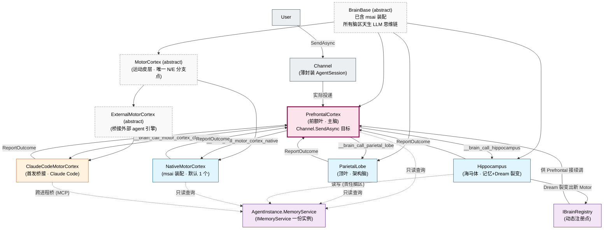

## Positioning

**Brain 是 Agent 内部脑区组装层**——本轮再次重大结构性重启动：从「7 个分散的子模块」收敛为「一份 .dna 通览全局」。脑区结构是一个紧耦合的有机体，不是 7 个独立子系统；分散反而破坏「大脑作为一个整体」的可读性、也增加维护成本。本份 .dna 一次说清：命名取舍、基类设计、各脑区契约、皮层分层、描述符分层、Dream 裂变机制、铁律、成长哲学。

## 命名取舍（解剖学名 ↔ 职责）

上一轮用的「主脑 / 架构脑 / 记忆脑 / 运动脑」属俗称——意图正确但不精准。本轮全面替换为**大脑解剖学专业名**，让读者在熟悉一次后能从名字上立刻读到脑区职责。

| 解剖学名 | 中文 | CBIM 职责 | 为什么贴合 |
|---------|------|----------|-----------|
| **PrefrontalCortex** | 前额叶皮层 | 主脑 · 调度入口 · Channel.SendAsync 实际投递目标 | 神经科学：前额叶是「执行功能（executive function）」中枢——决策、计划、调度子脑区。CBIM 主脑职责一一对应——它不执行具体业务，只判断「该调哪个脑区」并汇总结果。选 PrefrontalCortex 而非 Brainstem 的原因：脑干（Brainstem）是「原始反射 / 维生中枢」，CBIM 主脑明显走「高级决策」路径，前额叶更贴合 |
| **ParietalLobe** | 顶叶 | 架构脑 · 设计 / 模块结构推理 / 架构合规校验 | 神经科学：顶叶处理「空间结构、几何关系、整体–局部抽象」。CBIM 架构脑做的是「模块依赖图 + 三层模型 + 维度归属」——本质上是空间结构推理。选 ParietalLobe 而非 AssociationCortex（联合皮层）的原因：联合皮层太泛（凡是「整合多区信号」的都算联合皮层），顶叶是「空间结构推理」的精准定位 |
| **Hippocampus** | 海马体 | 记忆学习脑 · 日间读写 Memory · 夜间 Dream 裂变 | 神经科学：海马体在睡眠中将短期记忆巩固为长期记忆 + 抽象出模式（pattern separation / pattern completion）。CBIM Hippocampus 日间做 Memory IO，夜间在 Dream 中从累积记忆中提炼出「能力缺口 / 知识聚集」信号驱动裂变——与生物学完美对应。用户明确给的命名 |
| **MotorCortex** | 运动皮层 | 运动脑 · 一切对外副作用的唯一出口 · 抽象类（下分 Native / External 两子类） | 神经科学：运动皮层是大脑向身体下发动作指令的终点站；它不做决策（决策在前额叶），只把决策转为肌肉收缩。CBIM MotorCortex 同样不做决策，只把主脑下发的 intent 翻译为实际工具调用 / 文件写入 / MCP 调用。本来就是专业名，保留 |
| Cerebellum | 小脑（预留 · 本轮不实装） | 未来 HRBrain 候选 · 程序记忆 / 能力训练 | 神经科学：小脑负责「程序性记忆（procedural memory）」——熟练动作的自动化训练。CBIM HR 职责是「agent 招募 / 训练 / 能力评估」，与小脑「能力训练」语义贴合。本轮不实装，留位置说明 |
| AnteriorCingulateCortex (ACC) | 前扣带回（预留 · 本轮不实装） | 未来 AuditorBrain 候选 · 冲突监测 / 错误检测 | 神经科学：ACC 是「冲突监测（conflict monitoring）+ 错误检测（error detection）」中枢——专门发现「想做的与实际发生的不一致」。CBIM Auditor 职责是「独立审查 / 找出不一致 / 触发警报」，与 ACC 完美贴合。本轮不实装，留位置说明 |

**命名原则**：取专业解剖学名不是为了装专业；是为了让「名字 = 职责描述」成为可能。「Master / Memory / Architect / Motor」这种俗称在英语里有歧义（Master 容易让人想到「主从架构」、Memory 让人想到「内存」），解剖学名词反而消歧。读者第一次看时会查一下，看完后名字就成为职责简称。

**未被采用的候选与原因**：

- ~~Brainstem 脑干（候选 PrefrontalCortex）~~——脑干是「原始反射 + 维生中枢」，与 CBIM 主脑「高级决策」职责不符。
- ~~AssociationCortex 联合皮层（候选 ParietalLobe）~~——联合皮层是泛指，「整合多区信号」涵盖太广；顶叶是更精准定位。
- ~~BasalGanglia 基底神经节（候选 Cerebellum 作 HR）~~——基底神经节是「习惯形成 + 动作启动」，与 HR「招募 / 训练」语义稍有偏移；小脑「程序记忆」更贴。

## OO 继承层次（本轮关键变动）

**本轮 Kernel 析出后再修订**：BrainBase 不再承担 msai 装配 —— 装配下沉到 `Kernel/Neuron/`。BrainBase 仅持 `INeuron Neuron` 引用，调 `Neuron.InvokeAsync(...)` 拿结果。

```
BrainBase                       (abstract · 持 INeuron Neuron · 不感知 msai/external 分支)
   ├── PrefrontalCortex         (主脑 · 直接继承基类 · Channel.SendAsync 投递目标)
   ├── ParietalLobe             (架构脑 · 直接继承基类)
   ├── Hippocampus              (记忆学习脑 · 直接继承基类)
   └── MotorCortex              (运动皮层 · 抽象 · BrainId 前缀校验)
          ├── NativeMotorCortex      (Neuron = MsaiNeuron · 默认 1 个)
          └── ExternalMotorCortex    (Neuron = ExternalEngineNeuron · 抽象)
                 └── ClaudeCodeMotorCortex  (首发桥接 Claude Code · ExternalEngineKind.ClaudeCode)
```

**与上一轮的对比**：

| 上一轮（已废） | 本轮 |
|---------------|------|
| BrainBase + NativeBrain + ExternalBrain 三层抽象 | **BrainBase（仅持 INeuron）+ MotorCortex 一层（Native / External 仅在皮层下分）** |
| 每个脑区都有 Native / External 两种实现可能 | **只有 MotorCortex 有 Native / External 之分；其他脑区只能 Native** |
| 主脑也可能是 External（虽用铁律禁止） | **主脑（PrefrontalCortex）是具体类，不存在 External 主脑的语法可能** |
| BrainBase 内嵌 msai 装配（NativeBrain 中间层 / 后期下沉到基类） | **msai 装配下沉到 Kernel/Neuron/，BrainBase 仅持 INeuron 引用** |

### 为什么 Native/External 只下沉到皮层

外部 AI 工具（Claude Code / Cursor / Cline 等）本质就是「会干活的肌肉」—— 它们没有主脑的全局调度能力（不知道整个 Agent 的多脑区编织）、没有 Hippocampus 的记忆训练能力（它们只能用自己的 MEMORY.md）、也不做架构设计（它们就是被驱动去完成具体编码任务）。

所以**只在皮层这一层做适配**才符合本质：

- 「外部 AI 工具 = 外部肌肉」—— 它们的本质是「能动手的工具」，不是「能思考的大脑」。
- 「外部肌肉」在 OO 层面就是 ExternalMotorCortex 子类 —— 其他脑区不需要 External 变体。
- 让其他脑区也具备 Native/External 二态会产生「External 主脑」「External 架构脑」之类的不合理类型 —— 本轮在类型系统层面就杜绝。

### 为什么 msai 装配从基类下沉到 Kernel/Neuron/

上一轮 BrainBase 直接含 msai 装配（NativeBrain 中间层取消后下沉到基类）。本轮再次修正：**「持 LLM 思维链」是机制，不是脑区职能**。

BrainBase 应该只关心「我是一个脑区 + 我的职责」，不应该关心「我背后是 ChatClientAgent 还是 ExternalEngineAdapter」。把这部分抽到 Kernel/Neuron/ 后：

- BrainBase 构造器从 60+ 行装配代码缩到 10 行（只接受 `INeuron Neuron` 注入）。
- ExternalMotorCortex 不再是「重写 Agent 字段语义」的特例 —— 它走的是 `Neuron = ExternalEngineNeuron`，和 NativeMotorCortex 在基类层面完全对称。
- 未来加 LangGraph / AutoGen 等新「神经元类型」，只增 `INeuron` 实现，Brain 层不动。

本轮 BrainBase 改造：取消 `AIAgent Agent { get; }` 字段，新增 `INeuron Neuron { get; }` 字段。需要 AIAgent 的上层（如 Channel）走 `instance.Prefrontal.Neuron.UnderlyingAgent`（仅主脑路径用得到）。

## BrainBase 契约（已含 msai 装配）

**本轮 Kernel 析出后修订**：BrainBase 不再含 msai 装配，仅持 `INeuron Neuron` 引用。

```csharp
namespace CBIM.AgentSystem.Brain;

using Microsoft.Agents.AI;
using CBIM.Memory;
using CBIM.AgentSystem.Kernel.Neuron;        // INeuron / NeuronKind
using CBIM.AgentSystem.Kernel.Synapse;       // IPrefrontalCallback

/// 脑区契约公共基类。
///
/// 本轮重要变动：BrainBase 不再装配 msai/external —— 装配下沉到 Kernel/Neuron/。
/// 基类仅持 INeuron 引用 + Memory + PrefrontalCallback。脑区类型变更不影响 LLM 装配机制。
public abstract class BrainBase : IAsyncDisposable
{
    /// 脑区在 AgentInstance 内的唯一标识
    /// ("prefrontal-cortex" / "parietal-lobe" / "hippocampus" / "motor-cortex.native" / "motor-cortex.claude-code")
    public string BrainId { get; }

    /// 共享的 Memory 实例 —— 所有脑区在装配期由 AgentInstance 注入。
    /// 「同一具身一份记忆」铁律的物理落地。
    public IMemoryService Memory { get; }

    /// 神经元（LLM 思维链单元）—— 由 Kernel/Neuron/NeuronFactory 装配后注入。
    /// 本字段是基类的核心 —— 所有脑区都走 Neuron.InvokeAsync 调 LLM。
    /// NativeMotorCortex 持 MsaiNeuron；ExternalMotorCortex 子类持 ExternalEngineNeuron。
    public INeuron Neuron { get; }

    /// 主脑回调协议（定义在 Kernel/Synapse/）—— 子脑区通过该回调向 PrefrontalCortex 汇报结果。
    /// 极小化：只 ReportProgress / ReportOutcome，不允许反向调度。
    protected IPrefrontalCallback PrefrontalCallback { get; }

    /// 投递子任务到本脑区。
    /// 默认实现：透传给 Neuron.InvokeAsync。
    /// 任何脑区可重写（如 PrefrontalCortex 在 InvokeAsync 前后做汇总）。
    public virtual Task<BrainOutcome> InvokeAsync(BrainInvocation invocation, CancellationToken ct)
        => Neuron.InvokeAsync(invocation, ct);

    public abstract ValueTask DisposeAsync();
}

public sealed record BrainInvocation(
    string CorrelationId,                                // 关联主脑 AIFunction call id
    string Intent,                                       // 语义意图
    object? StructuredInput,                             // 可选结构化输入
    IReadOnlyDictionary<string, object> Context          // 主脑当前对话上下文切片
);

public sealed record BrainOutcome(
    string Summary,                                      // 自然语言摘要 (回填 LLM)
    object? StructuredOutput,                            // 可选结构化产出
    IReadOnlyList<SideEffect> SideEffects,               // 实际副作用清单 (Motor 强制填)
    bool IsError,
    string? ErrorMessage
);
```

**注解**：

- BrainBase 不再持 `AIAgent Agent`。需要 AIAgent 的上层（Channel 持引用打 SendAsync）走 `instance.Prefrontal.Neuron.UnderlyingAgent`。
- BrainBase.InvokeAsync 默认实现极简（透传 Neuron）；脑区职能特化由子类重写或由 Soul + AITool 集表达。
- IPrefrontalCallback / IBrainRegistry 定义在 `Kernel/Synapse/`，BrainBase 仅作为消费者（不再在 Brain 层定义）。
- BrainOutcome.SideEffects 是审计字段 —— MotorCortex 类脑区必填，其他脑区可以是空列表。

## 各脑区契约（按职责分段）

### PrefrontalCortex（前额叶皮层 · 主脑）

```csharp
/// PrefrontalCortex —— 调度中枢。每个 AgentInstance 有且仅有 1 个。
///
/// 本轮 Kernel 析出后修订：
///   - 原构造器内嵌的 BuildBrainCallFunction + BrainCallTrampoline 全部下沉到 Kernel/Synapse/SynapseToolFactory。
///   - PrefrontalCortex 构造器仅接受 "SynapseToolFactory.Build(callableBrains) 产出的 IReadOnlyList<AITool>"。
///   - 该 AITool 集在主脑装配 Neuron 时作为 synapseAITools 传入 NeuronAssemblyContext。
public sealed class PrefrontalCortex : BrainBase
{
    /// 可调度的其他脑区清单（装配期注入）。同名字段代替上轮的内嵌逻辑。
    /// 该列表仅供装配期注册表记账 / Synapse 装配源；PrefrontalCortex 运行期
    /// 调度走 Neuron 下挂的 __brain_call_* AITool。
    public IReadOnlyList<BrainBase> CallableBrains { get; }

    /// 产出合并策略：
    /// SummarizeBeforeReturn (默认) - 拿到子脑区结果后再走一轮 LLM 汇总后输出。
    /// Passthrough - 子脑区结果直接作为主脑输出（适合镜像型调度）。
    public PrefrontalAggregationStrategy Aggregation { get; init; } = PrefrontalAggregationStrategy.SummarizeBeforeReturn;

    /// Dream 裂变产出新 MotorCortex 后的注册表句柄（从 Kernel/Synapse/IBrainRegistry）。
    public IBrainRegistry BrainRegistry { get; }
}
```

**职责**：听懂用户意图 → 判断该调哪个脑区 → 通过 `__brain_call_*` 函数下发 → 汇总返回。

**__brain_call_\* 装配路径**（本轮从 PrefrontalCortex 构造器迁为 AgentSystem.OpenInstance 主脑装配阶段调 SynapseToolFactory）：

```
// AgentSystem.OpenInstance 主脑装配阶段
var callable = brains.Where(b => !(b is PrefrontalCortex)).ToList();
var synapseTools = SynapseToolFactory.Build(callable);   // 产出 __brain_call_* AITool 集

var prefrontalCtx = new NeuronAssemblyContext(
    chatClient: chatClient,
    memory: memory,
    standardAITools: BuildStandardAITools(prefrontalDesc),  // SystemTools/Skills/Mcp 派生（主脑默认空）
    synapseAITools: synapseTools,                            // 仅主脑非空
    externalAdapter: null);
var prefrontalNeuron = NeuronFactory.Create(prefrontalDesc, prefrontalCtx);   // 产出 MsaiNeuron · 全部 AITool 装进 ChatClientAgent
var prefrontal = new PrefrontalCortex(prefrontalNeuron, memory, callbackAdapter, brainRegistry, callable);
```

**默认 CallableBrains 清单**：`__brain_call_parietal_lobe` / `__brain_call_hippocampus` / `__brain_call_motor_cortex_native` (装了 ClaudeCode 后再多一个 `__brain_call_motor_cortex_claude_code`)。函数生成规则、参数 schema、处理器路由 —— 全部下沉到 Kernel/Synapse/SynapseToolFactory 内部，此处不重复。

**默认 Soul 模板**：

```
## 角色
你是 {agentName} 的前额叶皮层（PrefrontalCortex）—— 执行调度中枢。
你本身不执行具体业务，也不直接调外部工具。你的职责只有三件：
  1. 听懂用户（或上游子任务）意图。
  2. 判断该调哪个脑区，通过 __brain_call_* 函数下发。
  3. 汇总子脑区返回的结果，以主脑口吻返回。

## 调度原则
- 设计 / 架构 / 模块裂变 → __brain_call_parietal_lobe（顶叶）
- 记忆读写 / 学习 / Dream 裂变决策 → __brain_call_hippocampus（海马体）
- 代码 / 文件 / MCP / 任何副作用 → __brain_call_motor_cortex_*
  优先选 native；需要「仓库里多文件精修」时选 claude_code（如装了）。
- 不确定时优先问用户，不要乱分发。

## 不允许的事
- 不直接调外部工具。所有动作走 motor 脑区。
- 不透露子脑区的存在给用户。
- 不重复下发同一动作。
```

**Memory 访问**：只读查询（`Memory.QueryAsync`）；写入通过 `__brain_call_hippocampus` 转。

**Channel 入口路径**本轮保持不变：`Channel.SendAsync` 打到 `instance.Prefrontal.Neuron.UnderlyingAgent`（主脑 MsaiNeuron 暴露的 ChatClientAgent）。

### ParietalLobe（顶叶 · 架构脑）

```csharp
/// ParietalLobe —— 架构设计 / 知识蓝图 / 架构合规校验。
public sealed class ParietalLobe : BrainBase
{
    // 继承 BrainBase 全部，无新增字段——架构脑特化由 Soul + SystemTools 表达。
}
```

**职责**：

1. 模块设计（产出 `.dna/module.md` 骨架）
2. 知识蓝图（依赖图 + 维度归属）
3. 架构合规校验（三层模型 / 依赖方向 / 能力 vs 业务维度铁律）
4. 与 Hippocampus 协作执行项目知识裂变（Hippocampus 判定该裂 → ParietalLobe 设计落地）

**默认 Soul 模板**：

```
## 角色
你是 {agentName} 的顶叶（ParietalLobe）—— 架构设计与结构推理脑区。

## 职责
  1. 为新模块产出 .dna 骨架（路径 + kind + name + owner + description + positioning + dependencies + 铁律）。
  2. 评价架构改动是否违反三层模型、依赖方向、能力 vs 业务维度铁律。
  3. 与 Hippocampus 协作裂变新模块（它判定什么该裂，你实际落下 .dna 设计）。

## 不允许的事
  - 不直接编辑代码或写 .dna 文件——你产出设计意图，MotorCortex 调 dna_* MCP 实际写入。
  - 不跳过依赖图检查。产出新 .dna 前必读现有模块列表。
  - 不裁决该裂还是不该裂——裂变决策是 Hippocampus 职责。
```

**默认 SystemTools / Skills**：`DnaReader` + `ModuleListReader`（读侧）+ Skill `arch_modules`。**不挂** `DnaWriter` / `Bash` / `FileWriter`——写入是 MotorCortex 职责（思想与行动物理分离铁律）。

**Memory 访问**：只读查询；写入通过 PrefrontalCortex 转给 Hippocampus。

### Hippocampus（海马体 · 记忆学习脑）

```csharp
/// Hippocampus —— 记忆学习 + Dream 裂变自演化引擎。
/// 日间：Memory IO。
/// 夜间（Dream tick）：从记忆中提炼裂变信号，产出 FissionProposal。
public sealed class Hippocampus : BrainBase
{
    // 继承 BrainBase 全部，无新增字段。
}
```

**职责二分**：

| 时期 | 职责 | 触发者 |
|------|------|--------|
| 日间 | Memory 读写（IMemoryService 唯一写入责任脑区） | PrefrontalCortex.__brain_call_hippocampus |
| 夜间 | Dream tick：从记忆中提炼能力 / 知识增长信号 → 产出裂变提议 | Dream tick → main agent yield → PrefrontalCortex 调起 |

**Dream 裂变机制 · 核心闭环**：

```
Dream tick 触发 (SessionStart hook 检测「上次成功 > 20 小时」 → banner)
   → dream_tick(reason="catchup") 进入治理循环

1. dispatch yield 给 main agent
   → PrefrontalCortex 醒 → 推理 → __brain_call_hippocampus(intent="裂变评估")

2. Hippocampus.InvokeAsync 三步推理：

   a) 读 Memory 最近 N 轮 (默认 N=200) + Workspace.ListModules 现状

   b) 运行三条信号评估器：
      - capability_gap → CapabilityFissionProposal
        · 检测：Master 反复调 motor_cortex_* 出现同类失败 / IsError > 30%
        · 提议：裂出新 MotorCortex 子类
        · 启发式：「跨文件重构」域 → ClaudeCodeMotorCortex (External)；
                  CBIM 独有能力域 → 新 NativeMotorCortex 定制
      - knowledge_cluster → KnowledgeFissionProposal
        · 检测：某域关键词 > 阈值且 Workspace 无对应模块
        · 提议：dna_init 新模块 / 或 dna_split 现有模块
      - memory_bloat → 接入现有 memory_distill 路径 (非裂变)

   c) BrainOutcome.StructuredOutput = FissionProposal[]
      Summary = "发现 1 项能力裂变 + 1 项知识裂变" 之类

3. Hippocampus → ReportOutcome → PrefrontalCortex 拿到提议后并路执行：
   - capability_fission → __brain_call_motor_cortex_native("在 BrainRegistry 注册新 Motor")
   - knowledge_fission → __brain_call_parietal_lobe("为裂变产出 .dna 设计")
                       → __brain_call_motor_cortex_native("调 dna_* 落地设计")

4. PrefrontalCortex 汇总 → dream_tick_resume → 治理循环完结 → last_success.json
```

**FissionProposal 契约**：

```csharp
public abstract record FissionProposal
{
    public string ProposalId { get; init; }
    public string TriggerSignal { get; init; }
    public string Rationale { get; init; }
    public IReadOnlyList<string> Evidence { get; init; }   // memory entry ids / 模块路径
}

public sealed record CapabilityFissionProposal : FissionProposal
{
    public MotorCortexTier ProposedTier { get; init; }                          // Native | External
    public string ProposedBrainId { get; init; }                                 // "motor-cortex.refactor" / "motor-cortex.claude-code"
    public NativeMotorCortexDescriptor? ProposedNativeDescriptor { get; init; }  // Native 时填
    public ExternalMotorCortexDescriptor? ProposedExternalDescriptor { get; init; } // External 时填
}

public sealed record KnowledgeFissionProposal : FissionProposal
{
    public KnowledgeFissionKind Kind { get; init; }       // CreateNewModule | SplitExistingModule
    public string ProposedModulePath { get; init; }
    public string ProposedModuleKind { get; init; }       // root | parent | leaf
    public string? SourceModulePath { get; init; }        // SplitExistingModule 时填
    public IReadOnlyList<string> SuggestedHeadings { get; init; }
}
```

**默认 Soul / 能力**：Skills `memory_query` + `memory_write` + `memory_distill`；SystemTools `MemoryQuerier` + `MemoryWriter` + `WorkspaceLister` + `FissionAnalyzer`。

**Memory 访问**：**唯一被推荐直接写 `Memory.WriteAsync` 的脑区**（其他脑区写入需经 PrefrontalCortex 转给本脑区）。

### MotorCortex（运动皮层 · 抽象）+ 子分层

MotorCortex 是抽象类——本轮 Native / External 二分仅在此处发生（铁律：其他脑区无 External 变体）。

```csharp
/// MotorCortex —— 运动皮层抽象基类。
/// 所有「改变世界状态」动作（文件写 / MCP / HTTP / dna_* 写入）走 MotorCortex 任一子类。
public abstract class MotorCortex : BrainBase
{
    /// BrainId 强制以 "motor-cortex." 开头（构造期校验）。
    /// BrainConfig 验证「至少一个 MotorCortex」走该前缀。
    protected MotorCortex(string brainId, ...) : base(brainId, ...)
    {
        if (!brainId.StartsWith("motor-cortex."))
            throw new InvalidOperationException("MotorCortex BrainId must start with 'motor-cortex.'");
    }
}

/// NativeMotorCortex —— msai 装配的运动皮层。默认装 1 个。
public sealed class NativeMotorCortex : MotorCortex
{
    // BrainId = "motor-cortex.native"
    // 继承 BrainBase.Agent (msai ChatClientAgent)；
    // 默认挂载 AgentDescription 上声明的 SystemTools / McpList 全部。
}

/// ExternalMotorCortex —— 桥接外部 agent 引擎的运动皮层（抽象）。
/// 本轮唯一的 External 抽象类——其他脑区不存在 External 变体。
public abstract class ExternalMotorCortex : MotorCortex
{
    /// Adapter——把对外部引擎的调用收敛到一处。子类实现具体引擎适配。
    protected IExternalEngineAdapter Adapter { get; }

    /// Memory 共享桥模式——决定 CBIM 如何把 IMemoryService 暴露给外部引擎。
    public MemoryShareMode ShareMode { get; }

    /// 重写 InvokeAsync：Adapter.SubmitAsync → AwaitResultAsync → BrainOutcome。
    /// 不走 base.Agent.RunAsync（外部引擎自带 LLM）。
    /// base.Agent 在 ExternalMotorCortex 中语义重定义为 null 或桥接 stub（子类自决）。
    public override Task<BrainOutcome> InvokeAsync(BrainInvocation invocation, CancellationToken ct);
}

/// ClaudeCodeMotorCortex —— ExternalMotorCortex 首发桥接落地。
public sealed class ClaudeCodeMotorCortex : ExternalMotorCortex
{
    // BrainId = "motor-cortex.claude-code"
    // Adapter = ClaudeCodeEngineAdapter
    // ShareMode = MemoryShareMode.McpServer (默认)
}
```

**Motor 家族公共职责约定**（不强制接口，由 Soul + SystemTools 体现）：

1. BrainId 以 `"motor-cortex."` 开头
2. BrainOutcome.SideEffects 必填（实际副作用结构化记账）
3. 不发起跨脑区调用（IPrefrontalCallback 仅允许 ReportOutcome）

**NativeMotorCortex 默认能力装配规则**：AgentDescription 上声明的 SystemTools / McpList **默认全部下发到本脑区**，不下发给其他脑区。

**为什么只在 MotorCortex 下做 Native/External 分支**（再次强调）：

外部 AI 工具（Claude Code / Cursor / Cline）本质是「会干活的肌肉」——没有主脑全局调度能力、没有 Hippocampus 记忆训练能力、不做架构设计。它们是被驱动执行具体任务的——**只在皮层这一层做适配**符合本质。让 PrefrontalCortex / ParietalLobe / Hippocampus 也具备 External 变体会产生「External 主脑」「External 架构脑」之类不合理类型——本轮在类型系统层面就杜绝。

### ExternalMotorCortex 之 ClaudeCodeMotorCortex 详解

**接入语义**：CBIM 不装配 Claude Code 的工具栈（它自带 grep / file edit / git 等）；CBIM 只负责：

1. 任务投递（CLI subprocess + 工作目录 = AgentInstance.TaskWhere）
2. 产出转译（读 transcript / git diff → BrainOutcome.SideEffects）
3. Memory 共享桥（默认 MemoryShareMode.McpServer，CBIM 起 `cbim-memory-bridge-mcp` 暴露 5 个 memory_* 工具给 Claude Code 走 MCP 连入）

**MemoryShareMode 枚举**：

```csharp
public enum MemoryShareMode
{
    McpServer,    // 默认：CBIM 起 MCP server 暴露 IMemoryService，外部以 MCP client 接入
    FileBridge,   // 文件桥：CBIM 写记忆快照到约定目录，外部读
    HttpEndpoint, // CBIM 起 HTTP 服务，外部主动调
    None          // 不共享（破坏「同一具身」铁律，不推荐）
}
```

**Adapter 装配**：

```csharp
public sealed class ClaudeCodeEngineAdapter : IExternalEngineAdapter
{
    private readonly ClaudeCodeAdapterConfig _config;
    private readonly Dictionary<string, ClaudeCodeJob> _jobs = new();

    public async Task<string> SubmitAsync(BrainInvocation invocation, CancellationToken ct) {
        // 1. 生成 Claude Code 启动参数（CLI 路径 / ExtraArgs / 工作目录 / MCP 配置文件）
        // 2. 启动 subprocess
        // 3. 返回 jobId
    }

    public async Task<BrainOutcome> AwaitResultAsync(string jobId, CancellationToken ct) {
        // 1. 等 subprocess 退出
        // 2. 读 transcript + git diff + 变动文件清单
        // 3. 转译为 BrainOutcome (Summary + SideEffects)
    }

    public ValueTask DisposeAsync() {
        // Kill 所有未退出的 subprocess + 关 MCP bridge server
    }
}

public sealed record ClaudeCodeAdapterConfig
{
    public string CliPath { get; init; } = "claude-code";
    public IReadOnlyList<string> ExtraArgs { get; init; } = Array.Empty<string>();
    public TimeSpan Timeout { get; init; } = TimeSpan.FromMinutes(30);
    public string TranscriptDir { get; init; } = ".cbim/external/claude-code";
    public string? MemoryMcpEndpoint { get; init; }
}
```

**装配期校验**：CLI 在 PATH 中可找到；MemoryShareMode.McpServer 选中时 `cbim-memory-bridge-mcp` 可找到；TaskWhere 非 null。


## PrefrontalCortex · FlowGraph 重定义（本轮增补）

> 本节被 `Kernel/Synapse/` FlowGraph 重定义轮增补。上面 `### PrefrontalCortex（前额叶皮层 · 主脑）` 节仅反映上轮「主脑亲自迮d代」形态；本节以「双身份（编译器 + 监督者）」表述为准。

### 双身份职责二分

| 阶段 | 主脑产出 | 主脑使用机制 |
|------|---------|-----------|
| 编译期 | `NeuralCircuit`（神经回路 IR） | LLM（装配期挂上 CompilerToolFactory 产 AITool）逐步搭建 |
| 交接 | 交给 `CBIMOrchestrator` | `CBIMOrchestrator.RunAsync(circuit, CallableBrains, PrefrontalCallback?? , ct)` |
| 运行期 | 仅当 Orchestrator 迮d代需「等 user 决策」或「节点失败后干预」时重新激活 | Orchestrator 调 `IPrefrontalCallback.ReportProgress / ReportOutcome` 反馈 |

**职责不脱圈**：主脑仍是唯一调度者（K3 铁律未变）。从「即时调度」变「先编后执」，但「谁决定怎么调」仍是主脑 LLM。

### 新增字段 / 新 InvokeAsync 重写路径

```csharp
public sealed class PrefrontalCortex : BrainBase
{
    // 原有 CallableBrains / Aggregation / BrainRegistry 字段不变。

    /// **本轮新增** · FlowGraph 编译器 builder——per-invocation 产生，
    /// CompilerToolFactory 装配期挂到 AITool 上，主脑 InvokeAsync 末尾检查 builder.Compiled 是否被写入。
    public NeuralCircuitBuilder CircuitBuilder { get; }

    public override async Task<BrainOutcome> InvokeAsync(BrainInvocation invocation, CancellationToken ct)
    {
        // 1) 走 LLM：默认 prompt 引导优先调 __circuit_*，仅闲聊 / 1-node 场景才调 __brain_call_*
        var llmOutcome = await Neuron.InvokeAsync(invocation, ct).ConfigureAwait(false);

        // 2) 检查是否产出 NeuralCircuit
        if (CircuitBuilder.Compiled != null)
        {
            // FlowGraph 路径：交给 Orchestrator 硬性执行
            var orchestrator = new CBIMOrchestrator();
            return await orchestrator.RunAsync(
                CircuitBuilder.Compiled,
                brainPalette: CallableBrains,
                callback: PrefrontalCallback ?? …,
                ct).ConfigureAwait(false);
        }

        // 3) 退化路径：LLM 只调了 SynapseToolFactory 顶层原语中的一些 __brain_call_*——拿 llmOutcome 原机返
        return llmOutcome;
    }
}
```

### 默认 Soul 模板（本轮新叙述）

```
## 角色
你是 {agentName} 的前额叶皮层（PrefrontalCortex）——执行调度中枢。
你本身不执行具体业务，不直接调外部工具。你的职责只有三件：
  1. 听懂用户（或上游子任务）意图。
  2. **优先**把流程编译为 NeuralCircuit，通过 __circuit_add_call_brain / __circuit_add_branch / __circuit_add_return / __circuit_add_edge / __circuit_commit 逐步搭建。
  3. 仅闲聊 / 查询 / 调 1 脑区 且 无后续动作 时，才可直调 __brain_call_*（1-node 退化路径）。

## 编译原则
- 任何「需要多步 / 需要判断分支 / 需要 user 决策」的请求都走『先编译图』路径。
- 节点选型：设计调 parietal-lobe；记忆调 hippocampus；副作用调 motor-cortex.*；条件逻辑走 BranchNode。
- 产出返回 user 务必以 ReturnNode 封闭路径。
- 不确定时优先问用户（有中仓 commit，问完再重启编译），不乱分发。

## 不允许的事
- 不直接调外部工具。所有动作走 motor 脑区。
- 不透露子脑区的存在给用户。
- 不重复下发同一动作。
- 不允许走 1-node 退化代替多节点图——该编译就编译。
```

### 装配期 以 运行期双轨路径

```
// AgentSystem.OpenInstance 主脑装配阶段
var callable      = brains.Where(b => !(b is PrefrontalCortex)).ToList();
var synapseTools  = SynapseToolFactory.Build(callable);              // 退化原语集
var builder       = new NeuralCircuitBuilder(circuitId: Guid.NewGuid());
var compilerTools = CompilerToolFactory.Build(builder, callable);     // IR 构建工具集

var prefrontalCtx = new NeuronAssemblyContext(
    chatClient: chatClient,
    memory: memory,
    standardAITools: synapseTools.Concat(compilerTools).ToList(),     // 三者并列装入
    synapseAITools: Array.Empty<AITool>(),                            // 本轮字段退使位
    externalAdapter: null);
var prefrontalNeuron = NeuronFactory.Create(prefrontalDesc, prefrontalCtx);
var prefrontal = new PrefrontalCortex(prefrontalNeuron, memory, callbackAdapter, brainRegistry, callable, builder);
```

### 同步更新 Dependencies

Brain 层本文件底部 `## Dependencies` 本轮增一条（该节本顶层事实推进）：

- **`CBIM.AgentSystem.Kernel.Synapse.Compiler`**（本轮新增）——`NeuralCircuitBuilder` / `CompilerToolFactory`。PrefrontalCortex 新增字段与装配路径依赖。
- **`CBIM.AgentSystem.Kernel.Synapse.Orchestrator`**（本轮新增）——`CBIMOrchestrator`。PrefrontalCortex.InvokeAsync 路径依赖。

## BrainDescriptor 分层（本轮重做）

本轮分层规则：

- **主脑 / 海马体 / 架构脑 / NativeMotorCortex 共用一种描述**：`StandardBrainDescriptor`（内嵌 AgentDescription 全字段——Native 装配走 msai 全套）。
- **ExternalMotorCortex 用另一种描述**：`ExternalMotorCortexDescriptor`（仅持桥接字段——不复用 AgentDescription，避免字段污染）。

```csharp
public abstract class BrainDescriptor
{
    public string BrainId { get; }
    public string Role { get; }                                  // "prefrontal" / "parietal" / "hippocampus" / "motor"
    public string Soul { get; }
    public bool IsRequired { get; init; }
}

/// 标准脑区描述符——用于主脑 / 海马体 / 架构脑 / NativeMotorCortex 四种。
/// 内嵌 AgentDescription 全字段——这些脑区都走 msai 装配 + CBIM 完整能力链。
public sealed class StandardBrainDescriptor : BrainDescriptor
{
    public AgentDescription Capability { get; }                  // 复用 AgentDescription 全字段

    /// 仅主脑 (PrefrontalCortex) 描述符可为 true。
    /// BrainConfig 构造期验证「有且仅有一个 IsPrefrontal=true」。
    public bool IsPrefrontal { get; init; }

    /// 标识本描述符对应的具体脑区子类。
    /// 用于 OpenInstance 装配期分派构造哪个具体 BrainBase 子类。
    public StandardBrainKind Kind { get; }
}

public enum StandardBrainKind
{
    PrefrontalCortex,
    ParietalLobe,
    Hippocampus,
    NativeMotorCortex
}

/// External 运动皮层描述符——仅持桥接字段。
/// 不继承 AgentDescription——外部引擎自带工具栈，硬拗继承会产生字段污染
/// (SystemTools / Skills / McpList 在 External 上无意义)。
public sealed class ExternalMotorCortexDescriptor : BrainDescriptor
{
    public ExternalEngineKind EngineKind { get; }
    public string EngineEndpoint { get; }
    public IReadOnlyDictionary<string, object> AdapterConfig { get; }
    public MemoryShareMode MemoryShareMode { get; init; } = MemoryShareMode.McpServer;
}

public enum ExternalEngineKind
{
    ClaudeCode,
    Cursor,
    Cline,
    Aider,
    Codex,
    Custom
}
```

## BrainConfig 装配蓝图

```csharp
public sealed class BrainConfig
{
    public IReadOnlyList<BrainDescriptor> Brains { get; }

    /// 默认 4 脑装配：
    ///   - StandardBrainDescriptor(Kind=PrefrontalCortex, IsPrefrontal=true)
    ///   - StandardBrainDescriptor(Kind=ParietalLobe)
    ///   - StandardBrainDescriptor(Kind=Hippocampus)
    ///   - StandardBrainDescriptor(Kind=NativeMotorCortex)
    public static BrainConfig Default(string agentName);

    /// 自定义编织。常见用法：
    ///   .WithClaudeCode(...)  → 追加 ClaudeCodeMotorCortex
    public static BrainConfig Custom(params BrainDescriptor[] brains);
}
```

**构造期校验铁律**：

1. 有且仅有一个 `StandardBrainDescriptor.IsPrefrontal == true`（违反 → InvalidOperationException）
2. 至少一个 MotorCortex（BrainId 以 `motor-cortex.` 开头）（违反 → InvalidOperationException）
3. BrainId 唯一

**默认能力下发规则**：

- AgentDescription 上声明的 SystemTools / McpList 默认全部下发到 `NativeMotorCortex`
- PrefrontalCortex / ParietalLobe / Hippocampus 各自默认只挂本身领域专用工具（查询类 SystemTools 装在 Hippocampus / ParietalLobe；PrefrontalCortex 默认空）

## AgentInstance 字段重定义

```csharp
public sealed class AgentInstance : IAsyncDisposable
{
    public IReadOnlyList<BrainBase> Brains { get; }
    public PrefrontalCortex Prefrontal { get; }                  // 类型固定为 PrefrontalCortex
    public IMemoryService MemoryService { get; }
    public IReadOnlyList<IAsyncDisposable> McpHandles { get; }
    public AgentSession Session { get; }
    public IBrainRegistry BrainRegistry { get; }                 // Dream 裂变产出新脑区的动态注册点

    public BrainBase? Brain(string brainId);
    public IEnumerable<MotorCortex> MotorCortices => Brains.OfType<MotorCortex>();
    public IEnumerable<ExternalMotorCortex> ExternalMotorCortices => Brains.OfType<ExternalMotorCortex>();
}
```

**释放顺序**：MotorCortex 类（外部副作用） → 其他脑区 → Prefrontal → Memory → McpHandles → Session。

## IBrainRegistry（Dream 裂变动态注册点）

```csharp
public interface IBrainRegistry
{
    void RegisterBrain(BrainBase brain);          // 裂变产出调
    bool UnregisterBrain(string brainId);          // HR 责任（本轮不实装但保留接口）
    BrainBase? Find(string brainId);
    IReadOnlyList<BrainBase> All();
}
```

裂变出新 MotorCortex 后，PrefrontalCortex 需重新生成 `__brain_call_*` 函数集——初期实装可走「AgentInstance 重装」路径（CloseInstance + OpenInstance），避免动态注入 AIFunction 的边界问题。

## 共享 / 不共享语义表

| 资源 | 标准脑区（Native）共享 | ExternalMotorCortex 共享 | 备注 |
|------|----------------------|--------------------------|------|
| Memory | AgentInstance.MemoryService 同一实例 | 经 MemoryShareMode 桥接 | 「同一具身一份记忆」铁律 |
| task.Where | 同一 workspaceRoot | 同一（subprocess 工作目录） | 不允许各自指向不同工作区 |
| SystemTools / Skills / McpList | 各自 StandardBrainDescriptor.Capability 独立声明 | 外部引擎自带，CBIM 不感知 | 能力分化体现 |
| Soul / Identity | 各脑区独立 | 通过 AdapterConfig 传递（如有） | 提示词分化体现 |
| AgentSession (transcript) | 共享（结果经 Prefrontal 回流到 Session） | 共享（经 Prefrontal 回流） | 用户视角永远只有一个对话 |

## Dream 裂变机制 vs 现有 dream_tick

| 维度 | 现有 dream_tick（项目级） | 本轮 Hippocampus Dream 机制（Agent 内部） |
|------|--------------------------|------------------------------------------|
| 作业单位 | 项目根 | 某个 Agent |
| 产出 | 治理报告 | 裂变产出（新 MotorCortex / 新 Workspace Module） |
| 触发 | SessionStart hook | dream_tick → main agent yield → Prefrontal 调 Hippocampus |
| 状态 | last_success.json | 本 Agent 的 IMemoryService + BrainRegistry |
| 动作 | memory_distill / arch / capability | 上面三项 + 裂变评估 |

**关系**：本轮 Dream 裂变机制**被 dream_tick 项目级治理循环驱动**——dream_tick yield 给 main agent 后由 Prefrontal 调 Hippocampus 走裂变评估。**是延展不是替代**——现有 dream loop 仍在，本轮新增是其中一个阶段。

## 三铁律（本轮新表述 · 核心三条）

### 铁律 1：主脑唯一通路

**只有 PrefrontalCortex 可以调其他脑区**。其他脑区互不通讯、互不直调。跨脑区数据流必须经主脑中转。

物理护栏：

- `IPrefrontalCallback` 接口极小化（只 ReportProgress / ReportOutcome）——脑区不能反向调度主脑。
- `PrefrontalCortex` 是具体类（不是抽象继承点）——不存在「External 主脑」的语法可能。

### 铁律 2：基类已是 AIAgent

**所有脑区天生具备 LLM 思维链能力**——BrainBase 内部已装配 msai 的 ChatClientAgent + IChatClient。子类不重新装配。

物理护栏：

- 取消 NativeBrain 中间层（它的职责现在归基类）。
- ExternalMotorCortex 是唯一例外（外部引擎自带 LLM，Agent 字段语义重定义）。

### 铁律 3：裂变受控

**Dream 裂变出的新东西仅限两类**：

- MotorCortex（能力侧 · Agent 本身能力增长）
- Workspace Module（知识侧 · 项目知识增长）

**不裂主脑 / 架构脑 / Hippocampus 本身**（避免递归裂变；Agent 间裂变是未来 HRBrain 职责）。

物理护栏：

- FissionProposal 类型系统仅含 CapabilityFissionProposal + KnowledgeFissionProposal 两子类。
- 一轮 Dream 最多 2 份提议（防裂变狂热）。
- 裂变提议必须含 Rationale + Evidence（不准凭感觉裂）。

### 补充铁律（次级 · 仍是硬性约束）

- **副作用唯一出口 = MotorCortex 家族**——所有「改变世界状态」动作走 MotorCortex 任一子类。例外：Hippocampus 可直接写 Memory（记忆责任脑区本职）；所有脑区可调 Memory.QueryAsync（只读不是动作）。
- **共享一份 Memory + 一份 task.Where**——Native 直接注入 BrainBase.Memory；External 通过 MemoryShareMode 桥共享同一实例。
- **至少一个 MotorCortex**——BrainConfig 验证 BrainId 以 `motor-cortex.` 开头的脑区至少一个。
- **BrainId 唯一 + Prefrontal 唯一**——构造期校验。

## 成长哲学（CBIM 区别于静态架构框架的根本差异）

```
Agent 成长      = 裂变新皮层 (新 MotorCortex)
项目知识成长    = 裂变新模块 (新 Workspace Module)
裂变的引擎      = Hippocampus × Dream 机制
```

这是 CBIM 区别于「静态 agent 装配」框架的根本差异——**自演化能力写在血脉里**。

其他框架需要人在设计期列出「这个 agent 有哪几个工具」，过了设计期能力集就冻结。CBIM 能力集在运行期都在增长——越用越肥、越用越专、越用越详。这个「越用越×」的机制就是 Dream 裂变。

同样项目知识：人习惯上是设计期画好模块图，之后被动维护。CBIM 是动态裂变：「只要记忆里反复出现某个领域、但项目里没有模块承载」→ 自动生一个模块。项目架构从「静态、由架构师设计期雕琢」变为「动态、随使用演化」。

三句话总结：

- **能力在使用中裂变。**
- **知识在使用中沉淀。**
- **CBIM 是个活着的粘菌，不是个静态装配。**

## Children

本 parent 本轮**不再含 leaf 子模块**——所有脑区契约合并到本份 .dna 通览全局。

上一轮的 7 个子模块（Base / Master / Architect / MemoryLearning / Motor / Motor/Default / Motor/ClaudeCode）本轮全部被删除。原因：脑区结构是紧耦合的有机体，不是 7 个独立子系统；分散到 7 份 .dna 破坏「大脑作为整体」的可读性、增加维护成本。一份 .dna 通览全局更符合脑区本质。

实装期如发现某子分支（如 ClaudeCodeMotorCortex Adapter 实现）代码量极大需独立切片，可在代码层独立文件——但 .dna 一份保持整体性。

## Dependencies

- `CBIM.AgentSystem`——`AgentDescription`（被 `StandardBrainDescriptor.Capability` 复用）/ `AgentInstance`（本轮字段重定义：持 `IReadOnlyList<BrainBase>` + `Prefrontal: PrefrontalCortex` + `IBrainRegistry`）
- **`CBIM.AgentSystem.Kernel.Neuron`**（本轮新增）——`INeuron` / `NeuronKind` / `NeuronFactory` / `NeuronAssemblyContext` / `MsaiNeuron` / `ExternalEngineNeuron`。BrainBase.Neuron 字段类型。
- **`CBIM.AgentSystem.Kernel.Synapse`**（本轮新增）——`SynapseToolFactory` / `IPrefrontalCallback` / `IBrainRegistry` / `PrefrontalCallbackAdapter`。BrainBase.PrefrontalCallback 字段接口类型、PrefrontalCortex.BrainRegistry 字段接口类型。
- `Microsoft.Agents.AI`——`AIAgent`（本轮迁到 INeuron.UnderlyingAgent；BrainBase 不再直持）
- `Microsoft.Extensions.AI`——`AIFunction`（`__brain_call_*` 表达调度；本轮产生下沉到 Kernel/Synapse/SynapseToolFactory，Brain 仅消费）
- `CBIM.Memory`——`IMemoryService` 注入字段类型
- **不依赖** `CBIM.Workspace` / `CBIM.Channel`——脑区编织是 Agent 内部事务
- **不存在 `CBIM.Kernel` 顶层依赖**（原顶层模块本轮已随代码 / .meta / .dna 一同 git rm 物理删除）—— 原 Kernel 职责被本模块与新 `Agent/Kernel/` 中间层共同覆盖：调度 → PrefrontalCortex（铁律 A）；msai 装配 → Agent/Kernel/Neuron/MsaiNeuron；跨脑区信号 → Agent/Kernel/Synapse/SynapseToolFactory + IPrefrontalCallback。

## 与既有模块的交互修订

| 模块 | 本轮影响 |
|------|---------|
| `Agent/`（AgentSystem） | BrainConfig 字段保留（`AgentDescription.BrainConfig?`）；AgentInstance 重定义为持 `IReadOnlyList<BrainBase>` + `Prefrontal: PrefrontalCortex` + `IBrainRegistry`；OpenInstance 装配按描述符子类分派（StandardBrainDescriptor 走 msai 装配 + StandardBrainKind 选具体子类；ExternalMotorCortexDescriptor 走 Adapter）；释放顺序为 MotorCortex → 其他脑区 → Prefrontal → Memory → McpHandles → Session |
| `Channel/` | **无破坏性变动**——Channel 仍持 1 个 AIAgent 句柄（= `instance.Prefrontal.Agent`）；SendAsync 仍打到该引用。Channel.Agent 引用从 `instance.Master.Agent` 改为 `instance.Prefrontal.Agent` |
| `Memory/` | 未变。ExternalMotorCortex 选 McpServer 时，Memory 需额外产 `cbim-memory-bridge-mcp` server |
| ~~`Kernel/`~~ | **本轮废除**。原 `CBIM.Kernel` 顶层模块（FlowGraph + TaskScheduler + ContextProviders）随代码 / .meta / .dna 一同 git rm 物理删除。原职责被本模块完全吸收：调度 → PrefrontalCortex（铁律 A：唯一通路）；msai 装配 → BrainBase；上下文装配（原 ContextProviders）→ Brain 内部装配机制；Session 写侧（原 CbimTaskExecutor）→ MotorCortex 家族 |
| `Workspace/` | 未变。Dream 裂变新模块时由 Hippocampus 产提议 → ParietalLobe 产设计 → MotorCortex 调 dna_init/dna_edit MCP 落地 |

## Mermaid（本轮类继承编织图）



**图读法**：

- 灰虚框 = OO 抽象基类。
- 蓝框 = 标准 Native 脑区。橙框 = External 脑区（仅在 MotorCortex 下）。粉框 = Prefrontal（调度中枢，类型固定）。
- 实线 = 调度 / 回流路径（主脑 ↔ 子脑区）。
- 虚线 = Memory 共享访问。
- HC → REG → PFC 位于右下：Dream 裂变闭环产出新 Motor 后，通过 BrainRegistry 报变给主脑看见。

## Origin Context

上一轮（已废）方案：BrainBase / NativeBrain / ExternalBrain 三层抽象 + 7 个 leaf 子模块分散承载。本轮用户给出 4 条结构性修正：

1. **撤销 7 个 leaf，合并为一份 .dna**——脑区是紧耦合有机体，不是独立子系统；分散破坏整体可读性。
2. **改用大脑解剖学专业名**——PrefrontalCortex / ParietalLobe / Hippocampus / MotorCortex；俗称（主脑 / 架构脑 / 记忆脑）有歧义，专业名词反而消歧。
3. **msai 装配下沉到 BrainBase**——所有脑区都需 LLM 思维链，NativeBrain 中间层冗余取消。
4. **Native/External 只在 MotorCortex 下分**——外部 AI 工具本质是「会干活的肌肉」，没有主脑全局调度 / 海马记忆 / 架构设计能力；只在皮层适配符合本质。

本轮采纳全部 4 条修正，删除 7 个 leaf 物理目录，重写本份 .dna 通览全局。

## Emergent Insights

1. **「脑区是有机体」的设计直觉胜过「OO 模块化拆分」教条**——上一轮按 OO 严格拆为 7 个 leaf，技术上正确但破坏可读性。本轮回到「一份 .dna 通览全局」，承认脑区结构紧耦合的本质——这是从「软件工程教条」到「领域本质」的回归。
2. **解剖学命名让职责自描述**——一旦读者熟悉「前额叶 = 执行调度 / 海马体 = 记忆学习」这套术语，类名就成为职责简称，不需要额外的英文俗称（Master / Memory）来「翻译」职责。专业术语是高带宽通信的基础设施。
3. **「外部 AI 工具 = 肌肉」哲学在类型系统层面物理落地**——Native/External 只在 MotorCortex 下分，杜绝了「External 主脑」「External 架构脑」之类不合理类型。这是 CBIM「大脑 vs 肌肉」哲学的最强表达——不是文档约束，是类型系统约束。
4. **基类已含 msai 是「所有脑区都需 LLM」的自然后果**——上一轮把 msai 装配放在 NativeBrain 中间层是「过早抽象」的体现；本轮收敛到基类后，类继承层次反而扁平了，类型关系最简。这是「YAGNI（你不会需要它）原则」在类继承层次设计上的应用。
5. **「合并 vs 拆分」决策是 .dna 设计的核心张力**——CBIM 的 .dna 系统鼓励「按模块拆分」，但本案告诉我们：当被拆的内容是「紧耦合的有机整体」时，强行拆分会损失整体可读性。判断标准是「读者会一次性把这堆内容当作一个心智模型看吗？」——若是，合并；若不是，拆分。脑区是「一次性看的整体」，所以合并。
6. **裂变仅限 Motor + Module 是防递归的硬护栏**——如果允许裂变 Hippocampus 本身，下一轮 Dream 在哪个 Hippocampus 上跑？本轮在类型系统层面（FissionProposal 仅两子类）就杜绝。

## Non-Goals

- 不实装代码。本份 .dna 仅出设计；后续切片由 programmer 完成。
- 不实装 HRBrain（候选 Cerebellum）/ AuditorBrain（候选 AnteriorCingulateCortex）——本轮初始 4 脑足够跑通；后续按需补。
- 不提供「跨 Agent 脑区调用」机制——脑区是 Agent 内部，跨 Agent 协作由 PrefrontalCortex 主脑对外暴露的装配家接口走（本轮 Kernel.FlowGraph 路径随 Kernel 顶层模块物理删除一同废除——跨 Agent 协作路径交付下一轮处理，本轮不发）。
- 不在 Brain 层求「多主脑 / Prefrontal 集群」——一 Agent = 1 Prefrontal。多主脑意味多 Agent。
- 不发明「主脑反向调度」API——脑区 → 主脑只能走 IPrefrontalCallback 上报。
- 不带 Pool / 资源调度抽象——裂变 + BrainRegistry 取代。
- 不代替 dream_tick——Dream 裂变是 dream_tick 中的一个阶段、不是独立引擎。

