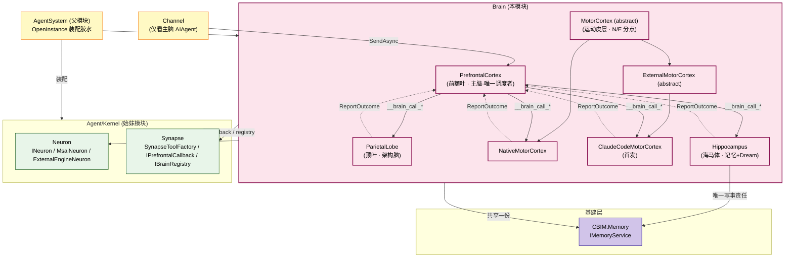
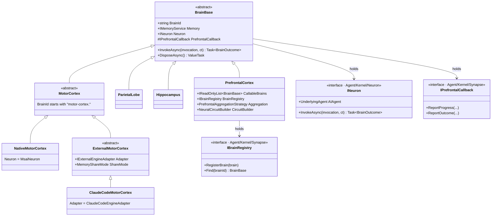
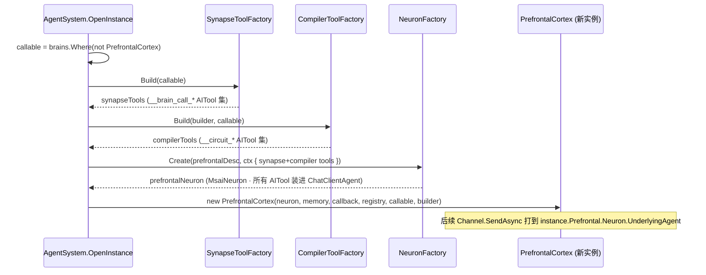
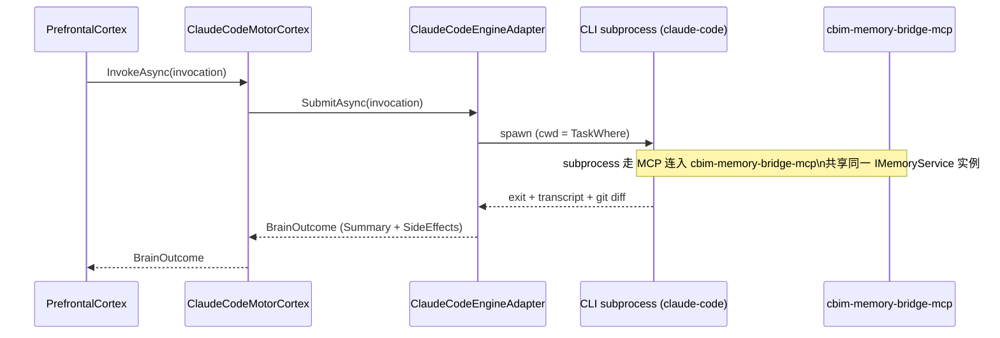

## Positioning

**Brain 是 Agent 内部脑区组装层**——一份 .dna 通览全局。脑区是紧耦合有机体，不拆分为多个子模块。

- **解剖学命名** —— PrefrontalCortex / ParietalLobe / Hippocampus / MotorCortex；让名字 = 职责描述。
- **主脑唯一通路** —— 只有 PrefrontalCortex 可调其他脑区（铁律 A）。
- **Native / External 仅下沉到 MotorCortex** —— 外部 AI 引擎是「会干活的肌肉」，只在皮层适配。
- **BrainBase 仅持 INeuron** —— msai / external 装配下沉到 `Agent/Kernel/Neuron/`；脑区不感知 LLM 装配机制。
- **Dream 裂变** —— Hippocampus 在夜间从记忆提炼信号 → 裂出新 MotorCortex / 新 Workspace Module。

## 架构图（脑区编织 + 依赖关系）



**依赖方向**：Brain → Agent/Kernel（Neuron / Synapse） → msai。Brain 消费者位置——不定义 INeuron / IBrainRegistry / IPrefrontalCallback（都在 Kernel）。

## 类图（OO 继承层次）



**关键点**：PrefrontalCortex 是具体类不是抽象（从类型系统上杬绝「External 主脑」）；只有 MotorCortex 有 Native / External 二分。

## 解剖学命名及职责

| 解剖学名 | 中文 | CBIM 职责 |
|---------|------|----------|
| **PrefrontalCortex** | 前额叶皮层 | 主脑 · 执行功能中枢（决策 / 调度子脑区 / 汇总） |
| **ParietalLobe** | 顶叶 | 架构脑 · 空间结构推理 / 架构合规校验 |
| **Hippocampus** | 海马体 | 记忆学习 · 日间 Memory IO · 夜间 Dream 裂变 |
| **MotorCortex** | 运动皮层 | 副作用唯一出口 · N/E 二分 |
| *Cerebellum*（预留） | 小脑 | 未来 HRBrain 候选 · 程序记忆 / 能力训练 |
| *AnteriorCingulateCortex*（预留） | 前扭带回 | 未来 AuditorBrain 候选 · 冲突监测 / 错误检测 |

## BrainBase 契约

```csharp
namespace CBIM.AgentSystem.Brain;

using Microsoft.Agents.AI;
using CBIM.Memory;
using CBIM.AgentSystem.Kernel.Neuron;
using CBIM.AgentSystem.Kernel.Synapse;

public abstract class BrainBase : IAsyncDisposable
{
    public string BrainId { get; }                       // "prefrontal-cortex" / "parietal-lobe" / "hippocampus" / "motor-cortex.*"
    public IMemoryService Memory { get; }                // 共享一份 · AgentInstance 注入
    public INeuron Neuron { get; }                       // LLM 思维链单元 · NeuronFactory 装配后注入
    protected IPrefrontalCallback PrefrontalCallback { get; }   // 极小化 · 不允许反向调度

    public virtual Task<BrainOutcome> InvokeAsync(BrainInvocation invocation, CancellationToken ct)
        => Neuron.InvokeAsync(invocation, ct);

    public abstract ValueTask DisposeAsync();
}

public sealed record BrainInvocation(
    string CorrelationId,
    string Intent,
    object? StructuredInput,
    IReadOnlyDictionary<string, object> Context);

public sealed record BrainOutcome(
    string Summary,                                      // 自然语言摘要 · 回填 LLM
    object? StructuredOutput,
    IReadOnlyList<SideEffect> SideEffects,               // MotorCortex 必填
    bool IsError,
    string? ErrorMessage);
```

## 装配序流（OpenInstance 中主脑装配）



## 各脑区理职

### PrefrontalCortex（前额叶 · 主脑）

```csharp
public sealed class PrefrontalCortex : BrainBase
{
    public IReadOnlyList<BrainBase> CallableBrains { get; }
    public IBrainRegistry BrainRegistry { get; }
    public PrefrontalAggregationStrategy Aggregation { get; init; } = PrefrontalAggregationStrategy.SummarizeBeforeReturn;
    public NeuralCircuitBuilder CircuitBuilder { get; }   // FlowGraph 编译器 · per-invocation

    public override async Task<BrainOutcome> InvokeAsync(BrainInvocation invocation, CancellationToken ct)
    {
        var llmOutcome = await Neuron.InvokeAsync(invocation, ct);
        if (CircuitBuilder.Compiled != null)
            return await new CBIMOrchestrator().RunAsync(CircuitBuilder.Compiled, CallableBrains, PrefrontalCallback, ct);
        return llmOutcome;   // 1-node 退化路径（闲聊 / 查询）
    }
}
```

**双身份**：编译期产 `NeuralCircuit` IR 交给 `CBIMOrchestrator` 执行；运行期仅「需 user 决策 / 节点失败」时重新激活。

**默认 Soul**：优先编译为多节点图（`__circuit_*`），仅 1-node 场景走 `__brain_call_*`。不透露子脑区给用户。

### ParietalLobe（顶叶 · 架构脑）

职责：模块设计（产 `.dna/module.md` 骨架）、依赖图 + 三层模型合规校验、与 Hippocampus 协作裂变新模块。

**特化**：Soul + SystemTools；只挂读侧工具（DnaReader / ModuleListReader），**不挂写侧**（思想与行动物理分离）。写入走 MotorCortex。

### Hippocampus（海马体 · 记忆学习脑）

| 时期 | 职责 | 触发者 |
|------|------|--------|
| 日间 | Memory IO（唯一写入责任脑区） | PrefrontalCortex |
| 夜间 | Dream tick：从记忆提炼裂变信号 → FissionProposal | dream_tick → main agent yield → PrefrontalCortex |

**三路信号评估器**：

- `capability_gap` → `CapabilityFissionProposal`（Motor 反复同类失败 → 裂出新 MotorCortex）
- `knowledge_cluster` → `KnowledgeFissionProposal`（某域关键词 > 阈值但无模块 → dna_init / dna_split）
- `memory_bloat` → 接现有 memory_distill 路径（非裂变）

```csharp
public abstract record FissionProposal
{
    public string ProposalId { get; init; }
    public string TriggerSignal { get; init; }
    public string Rationale { get; init; }
    public IReadOnlyList<string> Evidence { get; init; }
}

public sealed record CapabilityFissionProposal : FissionProposal { ... }
public sealed record KnowledgeFissionProposal  : FissionProposal { ... }
```

### MotorCortex（运动皮层）

```csharp
public abstract class MotorCortex : BrainBase
{
    protected MotorCortex(string brainId, ...) : base(brainId, ...)
    {
        if (!brainId.StartsWith("motor-cortex."))
            throw new InvalidOperationException("MotorCortex BrainId must start with 'motor-cortex.'");
    }
}

public sealed class NativeMotorCortex : MotorCortex      // BrainId = "motor-cortex.native"
{
    // 默认装 AgentDescription 上声明的 SystemTools / McpList 全部
}

public abstract class ExternalMotorCortex : MotorCortex  // 唯一 External 抽象
{
    protected IExternalEngineAdapter Adapter { get; }
    public MemoryShareMode ShareMode { get; }
    public override Task<BrainOutcome> InvokeAsync(BrainInvocation invocation, CancellationToken ct);
}

public sealed class ClaudeCodeMotorCortex : ExternalMotorCortex
{
    // BrainId = "motor-cortex.claude-code" · Adapter = ClaudeCodeEngineAdapter
    // ShareMode = MemoryShareMode.McpServer（默认）
}

public enum MemoryShareMode { McpServer, FileBridge, HttpEndpoint, None }
```

**为何只在 MotorCortex 下做 N/E 分支**：外部 AI 工具（Claude Code / Cursor / Cline）本质是「会干活的肌肉」——没有主脑全局调度 / 海马记忆训练 / 架构设计能力。在类型系统层面杬绝「External 主脑」「External 架构脑」之类不合理类型。

## ClaudeCodeMotorCortex 接入路径



**CBIM 不装配 Claude Code 工具栈**（它自带 grep / file edit / git）；仅负责：任务投递（CLI subprocess）、产出转译（transcript / git diff → SideEffects）、Memory 共享桥。

## BrainDescriptor 分层

```csharp
public abstract class BrainDescriptor
{
    public string BrainId { get; }
    public string Role { get; }                          // "prefrontal" / "parietal" / "hippocampus" / "motor"
    public string Soul { get; }
    public bool IsRequired { get; init; }
}

public sealed class StandardBrainDescriptor : BrainDescriptor
{
    public AgentDescription Capability { get; }          // 复用 AgentDescription 全字段
    public bool IsPrefrontal { get; init; }              // 有且仅一个
    public StandardBrainKind Kind { get; }
}

public enum StandardBrainKind { PrefrontalCortex, ParietalLobe, Hippocampus, NativeMotorCortex }

public sealed class ExternalMotorCortexDescriptor : BrainDescriptor   // 不继承 AgentDescription
{
    public ExternalEngineKind EngineKind { get; }
    public string EngineEndpoint { get; }
    public IReadOnlyDictionary<string, object> AdapterConfig { get; }
    public MemoryShareMode MemoryShareMode { get; init; } = MemoryShareMode.McpServer;
}

public enum ExternalEngineKind { ClaudeCode, Cursor, Cline, Aider, Codex, Custom }
```

## BrainConfig

```csharp
public sealed class BrainConfig
{
    public IReadOnlyList<BrainDescriptor> Brains { get; }

    // 默认 4 脑：Prefrontal + Parietal + Hippocampus + NativeMotorCortex
    public static BrainConfig Default(string agentName);
    public static BrainConfig Custom(params BrainDescriptor[] brains);   // 可 .WithClaudeCode(...)
}
```

**构造期校验**：
1. 有且仅有一个 `IsPrefrontal == true`
2. 至少一个 MotorCortex（BrainId 以 `motor-cortex.` 开头）
3. BrainId 唯一

**默认能力下发**：AgentDescription 上 SystemTools / McpList 默认全部下发到 `NativeMotorCortex`；其他脑区只挂本领域查询类工具。

## Dream 裂变闭环

```
dream_tick (catchup) → yield main agent → PrefrontalCortex.__brain_call_hippocampus("裂变评估")
   ↓
Hippocampus：
   1. 读 Memory 最近 N 轮 + Workspace.ListModules
   2. 运行三路信号评估器
   3. BrainOutcome.StructuredOutput = FissionProposal[]
   ↓
PrefrontalCortex 拿提议并路执行：
   - capability_fission → motor_cortex_native("在 BrainRegistry 注册新 Motor")
   - knowledge_fission  → parietal_lobe("产设计") → motor_cortex_native("dna_* 落地")
   ↓
dream_tick_resume → last_success.json
```

**裂变仅限两类**：MotorCortex（能力侧 · Agent 能力增长）、Workspace Module（知识侧 · 项目知识增长）。**不裂主脑 / 架构脑 / Hippocampus 本身**（防递归裂变）。

## 三铁律

- **K1 · 主脑唯一通路** —— 只有 PrefrontalCortex 可调其他脑区；子脑区互不通讯。护栏：`IPrefrontalCallback` 极小化（仅 ReportProgress / ReportOutcome）。
- **K2 · 脑区天生含 LLM 思维链** —— BrainBase 持 `INeuron`，子类不重新装配。ExternalMotorCortex 是唯一例外（外部引擎自带 LLM）。
- **K3 · 裂变受控** —— 仅 MotorCortex + Workspace Module 两类；一轮 Dream 最多 2 份提议；提议必含 Rationale + Evidence。

**补充铁律**：

- 副作用唯一出口 = MotorCortex 家族（例外：Hippocampus 可直写 Memory；所有脑区可调 Memory.QueryAsync）。
- 共享一份 Memory + 一份 task.Where；Native 直接注入，External 通过 MemoryShareMode 桥。
- 至少一个 MotorCortex；BrainId 唯一 + Prefrontal 唯一。

## 成长哲学

```
Agent 成长      = 裂变新皮层 (新 MotorCortex)
项目知识成长   = 裂变新模块 (新 Workspace Module)
裂变的引擎      = Hippocampus × Dream 机制
```

- **能力在使用中裂变。**
- **知识在使用中沉淀。**
- **CBIM 是个活着的粘菌，不是个静态装配。**

## Children

本 parent **不含 leaf 子模块** —— 所有脑区契约合并到本份 .dna 通览全局。脚区结构是紧耦合有机体，不是 7 个独立子系统。

## Dependencies

- `CBIM.AgentSystem` —— `AgentDescription`（被 `StandardBrainDescriptor.Capability` 复用）/ `Agent`（持 `IReadOnlyList<BrainBase>` + `Prefrontal` + `IBrainRegistry`）。
- `CBIM.AgentSystem.Kernel.Neuron` —— `INeuron` / `NeuronFactory` / `NeuronAssemblyContext` / `MsaiNeuron` / `ExternalEngineNeuron`。BrainBase.Neuron 字段类型。
- `CBIM.AgentSystem.Kernel.Synapse` —— `SynapseToolFactory` / `IPrefrontalCallback` / `IBrainRegistry`。PrefrontalCortex.BrainRegistry 接口类型。
- `CBIM.AgentSystem.Kernel.Synapse.Compiler` —— `NeuralCircuitBuilder` / `CompilerToolFactory`。PrefrontalCortex.CircuitBuilder 装配。
- `CBIM.AgentSystem.Kernel.Synapse.Orchestrator` —— `CBIMOrchestrator`。PrefrontalCortex.InvokeAsync 路径。
- `Microsoft.Agents.AI` / `Microsoft.Extensions.AI` —— 下沉到 INeuron.UnderlyingAgent / AIFunction，Brain 仅消费。
- `CBIM.Memory` —— `IMemoryService` 注入字段类型。
- **不依赖** `CBIM.Workspace` / `CBIM.Channel` —— 脑区编织是 Agent 内部事务。

## 与既有模块的交互

| 模块 | 状态 |
|------|------|
| `Agent/`（AgentSystem） | BrainConfig 字段保留；Agent 持 `IReadOnlyList<BrainBase>` + `Prefrontal` + `IBrainRegistry`；OpenInstance 按描述符子类分派；释放顺序：MotorCortex → 其他 → Prefrontal → Memory → McpHandles → Session |
| `Channel/` | 无破坏性变动 —— Channel.Agent = `instance.Prefrontal.Neuron.UnderlyingAgent` |
| `Memory/` | 未变 · ExternalMotorCortex 选 McpServer 时额外产 `cbim-memory-bridge-mcp` |
| `Workspace/` | 未变 · Dream 裂变新模块 → Hippocampus 提议 → ParietalLobe 设计 → MotorCortex 调 dna_init/dna_edit |

## Non-Goals

- 不实装代码。本份 .dna 仅出设计；下切片由 programmer 完成。
- 不实装 HRBrain（候选 Cerebellum）/ AuditorBrain（候选 AnteriorCingulateCortex）。
- 不提供「跨 Agent 脑区调用」机制 —— 脑区是 Agent 内部，跨 Agent 协作走主脑对外接口。
- 不求「多主脑 / Prefrontal 集群」 —— 一 Agent = 1 Prefrontal。
- 不发明「主脑反向调度」API —— 脑区 → 主脑只能走 IPrefrontalCallback 上报。
- 不带 Pool / 资源调度抽象 —— 裂变 + BrainRegistry 取代。
- 不代替 dream_tick —— Dream 裂变是 dream_tick 中的一个阶段。

## Emergent Insights

1. **「脑区是有机体」胜过「OO 拆分」教条** —— 一份 .dna 通览全局是领域本质。
2. **解剖学命名让职责自描述** —— 专业术语是高带宽通信的基础设施。
3. **「外部 AI = 肌肉」哲学在类型系统层面物理落地** —— N/E 仅下沉 MotorCortex，从语法上杬绝「External 主脑」。
4. **基类含 INeuron 是 YAGNI 在类继承层次上的应用** —— 退去 NativeBrain 中间层后类型关系最简。
5. **「合并 vs 拆分」决策标准：读者会一次性看吗？** —— 脑区是一次性看的整体→合并。
6. **裂变仅限 Motor + Module 是防递归的硬护栏** —— FissionProposal 仅两子类，类型系统层面杬绝递归裂变。

