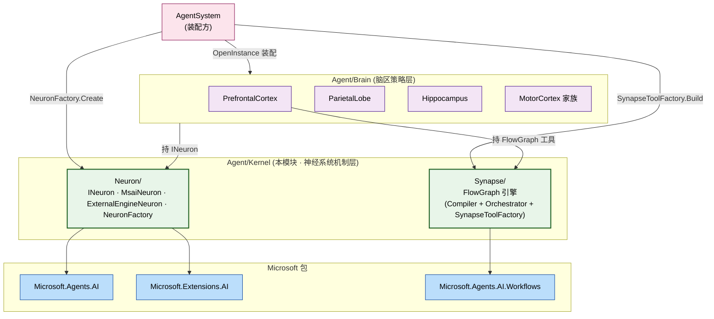
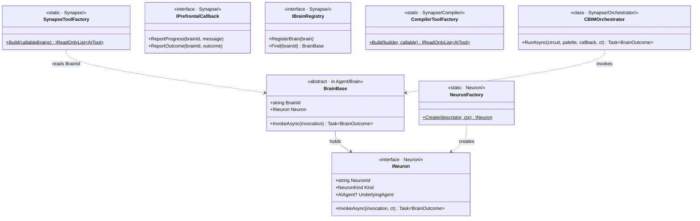

## Positioning

- **神经系统层**——位于 `Agent/` 与 `Agent/Brain/` 之间的中间机制层。
- 承接两件之前内嵌于 Brain 的机制：**神经元装配**（LLM 思维链单元）+ **突触派发**（脑区间信号传递 / FlowGraph 引擎）。
- 让 Brain 层只关注脑区策略（调度 / 推理 / 记忆 / 动作），不再混入「如何挂 LLM」「脑区如何互调」。
- **机制层 vs 策略层**：Kernel 是机制层，保持稳定；Brain 是策略层，可演化。

## 架构图（三层模型中的位置）

**依赖方向**：Brain → Kernel 单向不反向。Kernel 不感知任何具体脑区类型。

## 类图（Kernel 内核心类型 + 与 Brain 的边界）

## Children

| 子模块 | 一句话职责 |
|--------|------------|
| `Neuron/` | 神经元——`INeuron` 抽象 + `MsaiNeuron` / `ExternalEngineNeuron` + `NeuronFactory` |
| `Synapse/` | 突触（FlowGraph 引擎）——`Compiler` / `Orchestrator` + 顶层 `SynapseToolFactory` / `IPrefrontalCallback` / `IBrainRegistry` |

**Neuron ⊥ Synapse**：两子模块互不引用；各自被 Brain 层装配点独立调用。

## Dependencies

- `Microsoft.Agents.AI` —— Neuron 装配 `AIAgent`
- `Microsoft.Extensions.AI` —— `IChatClient` / `AIFunction` / `AITool`
- `Microsoft.Agents.AI.Workflows` —— Synapse/Orchestrator 包装
- `CBIM.Memory` —— `IMemoryService`
- `CBIM.AgentSystem.Brain`（**仅描述符家族 + BrainBase**）—— K5
- **不依赖** `CBIM.Tools` / `Skills` / `Mcp` / `Workspace` / `Channel`

## 铁律

- **K1 · 机制不感知策略** —— Kernel 不引用任何具体脑区类型；脑区类型变更不触发 Kernel 修改
- **K2 · Neuron 是唯一 LLM 出口** —— Brain 不准 `new ChatClientAgent` / 直调 `IChatClient`
- **K3 · Synapse 是唯一跨脑区机制出口** —— `__brain_call_*` / FlowGraph / Registry 都在 Synapse
- **K4 · Neuron ⊥ Synapse** —— 互不引用；双方互引 = 设计错误
- **K5 · 描述符语义保留在 Brain** —— Kernel 仅按描述符子类分派，不解读语义字段

## Non-Goals

- 不发明新的 Brain 抽象——Brain 契约不变
- 不接管 BrainConfig 校验——主脑唯一 / 至少一 MotorCortex 仍在 BrainConfig
- 不实现具体外部引擎——`ExternalEngineNeuron` 仅持 `IExternalEngineAdapter`
- 不引入新并发模型——Registry 用粗锁 InMemory

