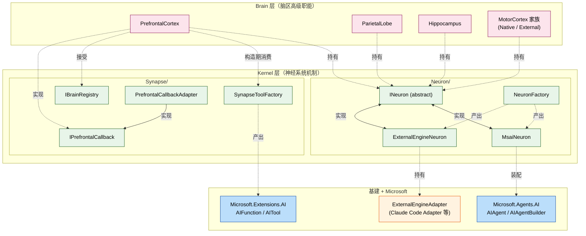

## Positioning

**Kernel 是 Agent 的内部运行内核（神经系统层）**——本轮新增的中间层。位于 `Agent/` 与 `Agent/Brain/` 之间，**承接两件之前内嵌在 Brain 的机制**：

1. **神经元装配**（`Kernel/Neuron/`）——AIAgent 封装与引擎扩展点。msai 装配从 `BrainBase` 构造器中析出为 `INeuron` 抽象 + `MsaiNeuron` / `ExternalEngineNeuron` 两实现。BrainBase 仅持一个 `INeuron Neuron` 引用，不再感知 msai / external 分支。
2. **突触派发协议**（`Kernel/Synapse/`）——脑区间信号传递机制。原 `PrefrontalCortex` 构造器中内嵌的 `__brain_call_*` AITool 生成逻辑、`IPrefrontalCallback`、`IBrainRegistry`、`PrefrontalCallbackAdapter` 全部下沉。Brain/PrefrontalCortex 仅持 `SynapseToolFactory.Build(callableBrains)` 产出的工具集，不感知函数命名规则。

**取名「神经系统层」的语义**：大脑（Brain）由神经元（Neuron）通过突触（Synapse）连接而成的有机体——本子模块承载神经元 + 突触两类机制，让 Brain 层只关注脑区的高级职能（调度策略 / 架构推理 / 记忆学习 / 动作执行），不再混入「这个脑区如何挂 LLM」「脑区之间如何派发」这种底层机制。

## 与 Brain 层的边界

```
Agent 层服务门面（AgentSystem）
   ↓ OpenInstance 装配期实例化
Brain 层（脑区高级职能）
   ├── PrefrontalCortex（持 INeuron Neuron + 持 SynapseToolFactory.Build 产物）
   ├── ParietalLobe（持 INeuron Neuron）
   ├── Hippocampus（持 INeuron Neuron）
   └── MotorCortex 家族（持 INeuron Neuron · External 子类持 ExternalEngineNeuron 实例）
   ↓ 依赖
Kernel 层（神经系统机制）
   ├── Neuron/（神经元 · INeuron 抽象 + MsaiNeuron / ExternalEngineNeuron + NeuronFactory）
   └── Synapse/（突触 · SynapseToolFactory + IPrefrontalCallback + IBrainRegistry + PrefrontalCallbackAdapter）
   ↓ 依赖
基建层（Tool / Skill / Mcp / IMemoryService / Storage）+ Microsoft.Agents.AI / Microsoft.Extensions.AI
```

**Brain → Kernel 依赖单向不反向**——Kernel 不感知任何具体脑区类型（PrefrontalCortex / ParietalLobe / Hippocampus / MotorCortex），只暴露通用的 `INeuron` / `SynapseToolFactory` 给 Brain 消费。Brain 是「策略层」，Kernel 是「机制层」——策略可以变（脑区分类可演化），机制保持稳定。

## Children

| 子模块 | 一句话职责 | 状态 |
|--------|------------|------|
| `Neuron/` | 神经元——AIAgent 封装抽象（INeuron）+ MsaiNeuron / ExternalEngineNeuron 两实现 + NeuronFactory 装配器 | spec |
| `Synapse/` | 突触——脑区间派发协议（SynapseToolFactory · IPrefrontalCallback · IBrainRegistry · PrefrontalCallbackAdapter） | spec |

**两个 leaf 是平级子模块，互不引用**——Neuron 不知道有 Synapse，Synapse 不知道有 Neuron。它们各自被 Brain 层装配点（PrefrontalCortex / 其他脑区构造器）独立调用。

## Mermaid（神经系统层结构 + Brain 消费视角）



## 设计动机（为什么从 Brain 析出）

**之前**：`BrainBase` 构造器内嵌「if (descriptor is StandardBrainDescriptor) ... else if (descriptor is ExternalMotorCortexDescriptor) ... 」装配分支；`PrefrontalCortex` 构造器内嵌 `BuildBrainCallFunction` + `BrainCallTrampoline`。这两块代码是「机制」而不是「脑区职能」——它们解决的是「AIAgent 怎么装」「脑区怎么互调」，不是「主脑怎么决策」「海马怎么记忆」。混在 Brain 层让 Brain 类承担了双重责任，违反「单一职责」+ 让脑区脑核难以独立演化（如未来加 LangGraph 神经元，BrainBase 需改）。

**本轮**：把机制层提为独立内核子模块。

| 之前在 Brain | 现在在 Kernel |
|--------------|---------------|
| `BrainBase` 构造期 if-else 装配 msai / external | `INeuron` 抽象 + `NeuronFactory.Create(descriptor, ctx)` 工厂 |
| `PrefrontalCortex.BuildBrainCallFunction` + `BrainCallTrampoline` | `SynapseToolFactory.Build(callableBrains)` |
| `IPrefrontalCallback` 定义在 Brain | 定义在 `Kernel/Synapse/`，Brain 仅消费 |
| `IBrainRegistry` / `InMemoryBrainRegistry` 定义在 Brain | 定义在 `Kernel/Synapse/`，Brain 仅消费 |
| `PrefrontalCallbackAdapter`（未来产出） | 定义在 `Kernel/Synapse/` |

**收益**：

- Brain 层代码量大幅缩减——`BrainBase` 构造器 60+ 行变 10 行；`PrefrontalCortex` 减约 50 行。
- 测试更聚焦——Brain 测试只需 mock `INeuron`，不需要 mock `IChatClient` + `AIAgent`。
- 神经元演化无碍 Brain——未来支持 LangGraph / AutoGen 等其他「神经元类型」，只增 `INeuron` 实现，Brain 不动。
- 突触机制独立演化——`__brain_call_*` 命名规则、参数 schema、超时策略等可独立改，Brain 不动。

## 迁移映射（从上轮 Executor/Scheduler 方案 → 本轮 Neuron/Synapse）

| 上轮名 | 本轮名 | 说明 |
|--------|--------|------|
| `Kernel/Executor/` 目录（加拼写修正后） | **`Kernel/Neuron/`** | 目录名 |
| `Kernel/Scheduler/` 目录 | **`Kernel/Synapse/`** | 目录名 |
| namespace `CBIM.AgentSystem.Kernel.Executor` | **`CBIM.AgentSystem.Kernel.Neuron`** | 命名空间 |
| namespace `CBIM.AgentSystem.Kernel.Scheduler` | **`CBIM.AgentSystem.Kernel.Synapse`** | 命名空间 |
| `IBrainExecutor` | **`INeuron`** | 抽象 |
| `MsaiAgentExecutor` | **`MsaiNeuron`** | 实现 |
| `ExternalEngineExecutor` | **`ExternalEngineNeuron`** | 实现 |
| `BrainExecutorFactory` | **`NeuronFactory`** | 工厂 |
| `BrainCallToolFactory` | **`SynapseToolFactory`** | 工厂——生成主脑可调用的 __brain_call_* AITool 集 |
| `IPrefrontalCallback` | 保留同名 | 名称语义清晰，迁中 Synapse 命名空间 |
| `IBrainRegistry` / `InMemoryBrainRegistry` | 保留同名 | 迁中 Synapse 命名空间 |
| `PrefrontalCallbackAdapter` | 保留同名 | 迁中 Synapse 命名空间 |

**拼写修正一步到位**：原拼写错误 `Excutor` 目录本轮直接重命名为 `Neuron`，不经过中间的 `Executor` 修正阶段（命名变更 + 拼写修正同轮完成）。

## Dependencies

- `Microsoft.Agents.AI`——`AIAgent` / `AIAgentBuilder`（Neuron 子模块装配）
- `Microsoft.Extensions.AI`——`IChatClient` / `AIFunction` / `AITool`（Neuron + Synapse 都用）
- `CBIM.Memory`——`IMemoryService`（注入 Neuron 时携带）
- `CBIM.AgentSystem.Brain`（**仅 BrainDescriptor 家族**）——Neuron 工厂需读 `BrainDescriptor` 的子类区分装配分支；本依赖**单向且只限描述符家族**，Kernel 不感知任何具体脑区类型
- **不依赖** `CBIM.Tools` / `CBIM.Skills` / `CBIM.Mcp`——这些抽象由 AgentSystem 装配期注入到 `chatClient.ChatOptions.Tools`，Kernel 只收消费方传入的 `IChatClient`
- **不依赖** `CBIM.Workspace` / `CBIM.Channel`——内核层是神经系统机制，不感知工作区与入口

## 铁律（Kernel 层）

- **K1 · 机制不感知策略**——Kernel 子模块（Neuron / Synapse）不引用任何具体脑区类型（PrefrontalCortex / ParietalLobe / Hippocampus / MotorCortex）。脑区类型变更不应触发 Kernel 修改。
- **K2 · Neuron 是唯一 LLM 出口**——Brain 层任何脑区想调 LLM，必须经 `INeuron.InvokeAsync(...)`；不允许 Brain 直接 `new ChatClientAgent` 或直接调 `IChatClient`。
- **K3 · Synapse 是唯一跨脑区机制出口**——`__brain_call_*` AITool 生成、IPrefrontalCallback 接口、BrainRegistry 接口都在 Synapse；Brain 不允许定义新的跨脑区通讯机制。
- **K4 · Neuron ⊥ Synapse**——两子模块互不引用；各自被 Brain 层装配点独立调用。如果发现需要双方互引用，必是设计错误（说明把脑区策略漏到 Kernel 了）。
- **K5 · 描述符语义保留在 Brain**——Neuron 工厂虽读 `BrainDescriptor`，但仅区分「该走哪条装配分支」（StandardBrainDescriptor → MsaiNeuron / ExternalMotorCortexDescriptor → ExternalEngineNeuron），不解读描述符语义（如 `StandardBrainKind` / `IsPrefrontal` 等字段仍由 Brain 层验证）。

## Non-Goals

- 不发明新的「Brain 抽象」——Brain 层契约保持不变（BrainBase + 4 个具体脑区类）。
- 不接管 BrainConfig 校验——「主脑唯一 / 至少一个 MotorCortex / BrainId 唯一」仍在 BrainConfig。
- 不实现具体外部引擎适配——`ExternalEngineNeuron` 只持 `IExternalEngineAdapter`；具体如 `ClaudeCodeEngineAdapter` 仍在 `Brain/ClaudeCode/`。
- 不引入新的并发模型——Synapse 注册表沿用 InMemory 粗锁实现。

## Emergent Insights

1. **「机制层 vs 策略层」分离是脑区架构成熟的标志**——之前所有机制都混在 Brain，是「凡是 brain 的事都丢给 brain」的偋懒；析出 Kernel 后，Brain 类纯化为「脑区职能定义」，机制独立演化。
2. **解剖学命名延展到子模块**——Brain（大脑）→ Neuron（神经元）→ Synapse（突触）形成完整的神经科学命名链。读者第一次看「神经元 / 突触」会愧一下，但下一次就懂——比 Executor / Scheduler 高带宽得多（Executor 没说清楚执行什么，Scheduler 没说清楚调度谁；神经元就是「持 LLM 思维链的最小单元」，突触就是「神经元之间的信号通路」）。
3. **`Excutor` 拼写错误是上轮目录占位时手抖留下的**——本轮直接用 `Neuron` 命名，跳过修正环节（命名变更 + 拼写修正一次到位）。

