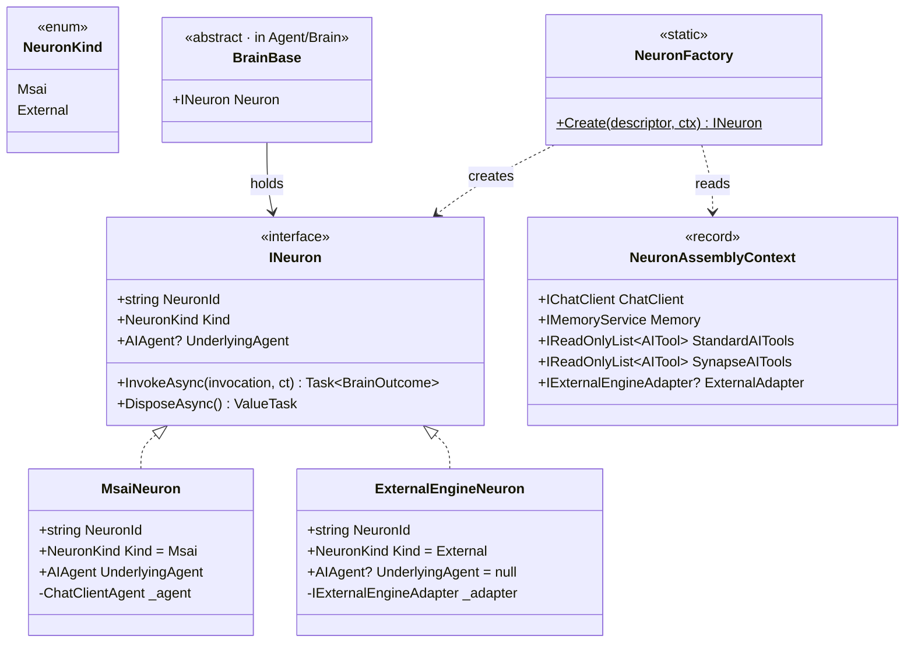
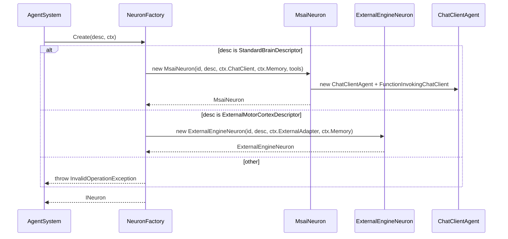

## Positioning

- **神经元 = 持 LLM 思维链能力的最小封装单元**。
- Kernel 层两子模块之一（与 Synapse 平级），承担「AIAgent 装配 + 外部引擎扩展点」机制。
- `BrainBase` 仅持一个 `INeuron Neuron` 字段，调 `Neuron.InvokeAsync(...)` 拿结果，**不感知 msai / external 分支**。
- 两实现：`MsaiNeuron`（走 `ChatClientAgent` 装配）+ `ExternalEngineNeuron`（桥接 `IExternalEngineAdapter`）。

## 架构图

```mermaid
flowchart TD
    classDef brain  fill:#f3e5f5,stroke:#4a148c,color:#000;
    classDef neuron fill:#e8f5e9,stroke:#1b5e20,stroke-width:2px,color:#000;
    classDef msai   fill:#bbdefb,stroke:#0d47a1,color:#000;
    classDef ext    fill:#fff3e0,stroke:#e65100,color:#000;

    AS["AgentSystem\n(装配方)"]
    DESC["BrainDescriptor\n(StandardBrainDescriptor / ExternalMotorCortexDescriptor)"]

    subgraph N ["Neuron/ (本模块)"]
        IN["INeuron"]
        MN["MsaiNeuron"]
        EEN["ExternalEngineNeuron"]
        NF["NeuronFactory"]
        CTX["NeuronAssemblyContext"]
    end

    BB["BrainBase\n(Brain 层)"]
    MSAI["Microsoft.Agents.AI\nChatClientAgent"]
    MSEXT["Microsoft.Extensions.AI\nIChatClient · AITool"]
    ADP["IExternalEngineAdapter\n(ClaudeCodeEngineAdapter 等)"]

    AS --> DESC
    AS -- new ctx --> CTX
    AS -- Create(desc, ctx) --> NF
    NF -. 产 .-> MN
    NF -. 产 .-> EEN
    MN ..|> IN
    EEN ..|> IN
    BB -- 持 --> IN
    MN --> MSAI
    MN --> MSEXT
    EEN --> ADP

    class AS,DESC,BB brain;
    class IN,MN,EEN,NF,CTX neuron;
    class MSAI,MSEXT msai;
    class ADP ext;
```

## 类图



## NeuronFactory.Create 序流



## Contract Surface

```csharp
namespace CBIM.AgentSystem.Kernel.Neuron;

using Microsoft.Agents.AI;
using Microsoft.Extensions.AI;
using CBIM.Memory;
using CBIM.AgentSystem.Brain;        // 仅描述符家族（K5）

public interface INeuron : IAsyncDisposable
{
    string NeuronId { get; }
    NeuronKind Kind { get; }
    AIAgent? UnderlyingAgent { get; }
    Task<BrainOutcome> InvokeAsync(BrainInvocation invocation, CancellationToken ct);
}

public enum NeuronKind { Msai, External }

public sealed class MsaiNeuron : INeuron
{
    public MsaiNeuron(
        string neuronId,
        StandardBrainDescriptor descriptor,
        IChatClient chatClient,
        IMemoryService memory,
        IReadOnlyList<AITool> aiTools);
}

public sealed class ExternalEngineNeuron : INeuron
{
    public ExternalEngineNeuron(
        string neuronId,
        ExternalMotorCortexDescriptor descriptor,
        IExternalEngineAdapter adapter,
        IMemoryService memory);
}

public static class NeuronFactory
{
    public static INeuron Create(BrainDescriptor descriptor, NeuronAssemblyContext ctx);
}

public sealed record NeuronAssemblyContext(
    IChatClient ChatClient,
    IMemoryService Memory,
    IReadOnlyList<AITool> StandardAITools,        // SystemTools/Skills/Mcp 派生
    IReadOnlyList<AITool> SynapseAITools,         // 仅主脑非空
    IExternalEngineAdapter? ExternalAdapter);     // External 必填
```

## 与 BrainBase 的协作

`BrainBase` 仅持 `INeuron Neuron`，默认 `InvokeAsync` 透传给 `Neuron.InvokeAsync`。脑区可重写（如 PrefrontalCortex 在前后加 FlowGraph 逻辑）。上层拿 `AIAgent` 走 `prefrontal.Neuron.UnderlyingAgent`。

## Dependencies

- `Microsoft.Agents.AI` —— `AIAgent` / `ChatClientAgent`
- `Microsoft.Extensions.AI` —— `IChatClient` / `AITool` / `FunctionInvokingChatClient`
- `CBIM.Memory` —— `IMemoryService`
- `CBIM.AgentSystem.Brain`（**仅描述符家族 + IExternalEngineAdapter**）
- **不依赖** `CBIM.AgentSystem.Kernel.Synapse`（K4）

## 铁律（继承 K1-K5）

- 不感知具体脑区类型（K1）
- 是 Brain 调 LLM 的唯一出口（K2）
- 不实现具体外部引擎适配——`ExternalEngineNeuron` 仅持抽象，具体适配在 `Brain/ClaudeCode/`

## Non-Goals

- 不实现具体外部引擎适配器
- 不引入并发模型——`InvokeAsync` 由调用方控制并发
- 不接管 BrainConfig 校验

