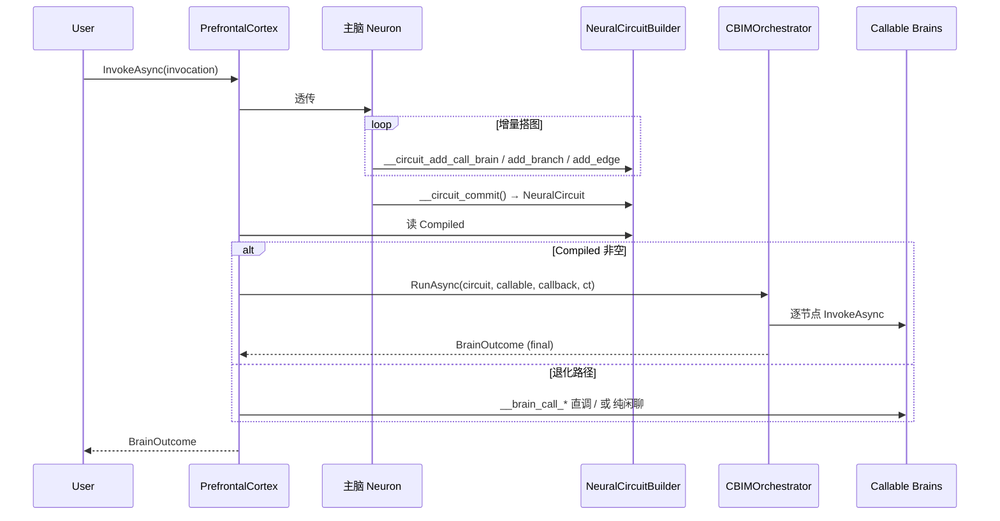
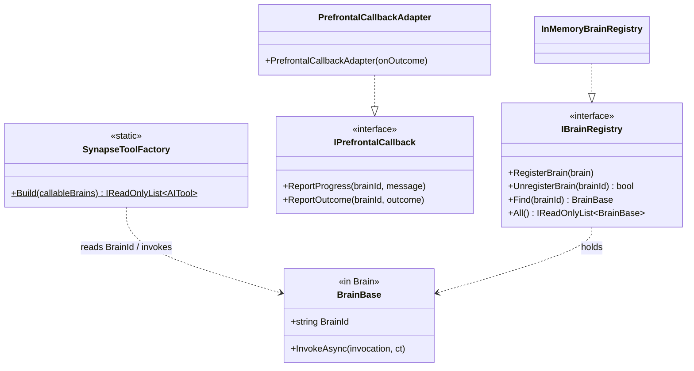

## Positioning

- **Synapse = FlowGraph 引擎——CBIM 真正的核心**。
- 职责：把用户自然语言流程编译为确定性 NeuralCircuit IR + 由 `CBIMOrchestrator` 硬性按图执行。
- **主脑双身份**：`PrefrontalCortex` = FlowGraph 编译器 + 监督者。编译期由 LLM 增量搭图；运行期交 Orchestrator 后退场，仅监督节点失败 / user 决策等待。
- 本 parent 自身保留：`SynapseToolFactory`（v1 退为 `CallBrainNode` 底层原语 + 1-node 退化路径）+ `IPrefrontalCallback` + `IBrainRegistry` + `PrefrontalCallbackAdapter`。

## 架构图

```mermaid
flowchart TD
    classDef brain fill:#f3e5f5,stroke:#4a148c,color:#000;
    classDef syn   fill:#e8f5e9,stroke:#1b5e20,stroke-width:2px,color:#000;
    classDef leaf  fill:#c8e6c9,stroke:#1b5e20,color:#000;
    classDef msai  fill:#bbdefb,stroke:#0d47a1,color:#000;

    USR["User NL"]
    PFC["PrefrontalCortex\n(编译器 + 监督者)"]

    subgraph SYN ["Synapse/ (本模块 · FlowGraph 引擎)"]
        STF["SynapseToolFactory\n(退化原语 __brain_call_*)"]
        IPC["IPrefrontalCallback"]
        IBR["IBrainRegistry"]
        PCA["PrefrontalCallbackAdapter"]
        subgraph LEAF ["Children (leaf)"]
            CMP["Compiler/\nNL→NeuralCircuit IR"]
            ORC["Orchestrator/\nIR→MAF Workflow"]
        end
    end

    BB["BrainBase\n(调用目标)"]
    MSWF["Microsoft.Agents.AI.Workflows"]

    USR --> PFC
    PFC -- 装配期挂 --> STF
    PFC -- 装配期挂 --> CMP
    PFC -- 运行期交 --> ORC
    STF -. 调 .-> BB
    ORC -. 调 .-> BB
    ORC --> MSWF
    BB -. 上报 .-> IPC
    PCA ..|> IPC

    class USR,PFC,BB brain;
    class STF,IPC,IBR,PCA syn;
    class CMP,ORC leaf;
    class MSWF msai;
```

## 主脑三套工具同装 · 双path

主脑 Neuron 装配期同时挂三类 AITool（不名冲突 · 名字前缀区分）：

| 工具集 | 出处 | 函数名前缀 | 用法 |
|--------|------|------------|------|
| `__brain_call_*` | `SynapseToolFactory.Build(callable)` | `__brain_call_` | 1-node 退化 · 闲聊 / 查询 / 无后续动作 |
| `__circuit_*` | `CompilerToolFactory.Build(builder, callable)` | `__circuit_` | 增量搭图 · 需多步动作 / 分支 / 条件 |
| （占位）`__orch_*` | 未来 OrchestratorToolFactory | `__orch_` | v1 不加，Orchestrator 由主脑代码路径调用 |

运行期路由：主脑 LLM 调了 `__circuit_commit` → `PrefrontalCortex.InvokeAsync` 读 `builder.Compiled` 非空 → 交 `CBIMOrchestrator.RunAsync`；否则走 1-node 退化。主脑 Soul 默认 prompt 引导「任何需调脑区都先编图，仅闲聊 / 1 脑区无后续可直调」。

## RunAsync 运行期序流



## 为什么重定义为 FlowGraph

- **Skill 「第一步 / 第二步」不可靠**——写在 .md 里的顺序是建议不是铁律，模型会跳。
- **上轮 SynapseToolFactory 只告诉 LLM「能调谁」**，何时调仍靠「模型自觉」——反模式。
- **复杂分支（如「退款>1000 需审批」）写在 prompt 里 = 请你判断；写在图上 = 必选 A 或 B**。

FlowGraph 路径：NL → 编译为 NeuralCircuit（建议变铁律）→ Orchestrator 硬性按图执行（LLM 仅在节点内部发挥智能）。

## 与 MAF 的关系

**包 `Microsoft.Agents.AI.Workflows`，不重造引擎**。Orchestrator 负责 IR → MAF `Workflow` 翻译，业务节点装为 `Executor` 子类。MAF 提供 SuperStep 调度 / Checkpoint / FanOut / RequestPort 全部现成能力。重造 ≈ 三倍工作量；装配 MAF 以 0 成本获取检查点 / 可视化 / RequestPort（人机交互）/ 并行调度。

## Children

| 子模块 | 一句话职责 |
|--------|------------|
| `Compiler/` | NL → NeuralCircuit IR 编译器 · LLM Function-calling 增量构建 |
| `Orchestrator/` | NeuralCircuit → MAF Workflow + 硬性执行 · 包 `Microsoft.Agents.AI.Workflows` |

**三者互不引用**（K6）：`Compiler/` / `Orchestrator/` / parent `SynapseToolFactory` 同层，主脑装配期拼接。

## 类图



## Contract Surface

```csharp
namespace CBIM.AgentSystem.Kernel.Synapse;

using Microsoft.Extensions.AI;
using CBIM.AgentSystem.Brain;        // 仅 BrainBase / BrainInvocation / BrainOutcome（K5）

public static class SynapseToolFactory
{
    // 函数名："__brain_call_" + BrainId.Replace('.','_').Replace('-','_')
    // 参数 schema：{ intent: string (required), structured?: object, context?: object }
    // 处理器：调 callable.InvokeAsync(BrainInvocation) → outcome.Summary 回填 ToolMessage
    public static IReadOnlyList<AITool> Build(IReadOnlyList<BrainBase> callableBrains);
}

public interface IPrefrontalCallback
{
    void ReportProgress(string brainId, string message);
    void ReportOutcome(string brainId, BrainOutcome outcome);
}

public sealed class PrefrontalCallbackAdapter : IPrefrontalCallback
{
    public PrefrontalCallbackAdapter(Func<string, BrainOutcome, Task> onOutcome);
}

public interface IBrainRegistry
{
    void RegisterBrain(BrainBase brain);
    bool UnregisterBrain(string brainId);
    BrainBase? Find(string brainId);
    IReadOnlyList<BrainBase> All();
}

public sealed class InMemoryBrainRegistry : IBrainRegistry { }
```

## Dependencies

**本 parent 仅依赖**（SynapseToolFactory / IPrefrontalCallback / IBrainRegistry 代码体）：

- `Microsoft.Extensions.AI` —— `AIFunction` / `AIFunctionFactory` / `AITool`
- `CBIM.AgentSystem.Brain`（**仅 BrainBase + BrainInvocation + BrainOutcome**）
- **不依赖** `CBIM.AgentSystem.Kernel.Neuron`（K4）
- **不依赖** `Microsoft.Agents.AI`（仅产 AITool）

**Leaf 依赖**：`Compiler/` 仅 `Microsoft.Extensions.AI` + `BrainBase`；`Orchestrator/` 依 `Microsoft.Agents.AI.Workflows` + `BrainBase` + `Compiler.NeuralCircuit` + parent `IPrefrontalCallback`。

## 铁律（继承 Kernel K1-K5）

- **K1** 不感知具体脑区类型——只读 `BrainBase.BrainId` / 调 `InvokeAsync`
- **K3** 跨脑区机制唯一出口——Brain 不准自定义 `__brain_call_*` / 另一套 NeuralCircuit 执行引擎
- **IPrefrontalCallback 接口极小化**——仅 ReportProgress / ReportOutcome，防反向调度
- **K6 · 三 leaf 互不引用**——`Compiler/` / `Orchestrator/` / parent `SynapseToolFactory` 同层 · 互不 using；拼接由上级（PrefrontalCortex）装配期完成
- **K7 · NeuralCircuit 是不可变 IR**——commit 后冻结；Orchestrator 只读不改；重规划 = 主脑发起新一轮编译

## IBrainRegistry 与 Dream 裂变

Hippocampus 产 `CapabilityFissionProposal` → 主脑决策 → MotorCortex 装配新脑区 + `RegisterBrain` → AgentInstance 重装（CloseInstance + OpenInstance）拿到新的 `__brain_call_*` / 可调集。v1 不动态注入 AIFunction。

## Non-Goals

- 不接管「谁可被主脑调」过滤策略——调用方（AgentSystem.OpenInstance）责任
- 不接管主脑超时 / 重试——PrefrontalCortex 重写责任
- 不发明新并发模型——InMemoryBrainRegistry 粗锁足够
- 不产出跨 Agent 脑区调度抽象——未来 HR 责任

