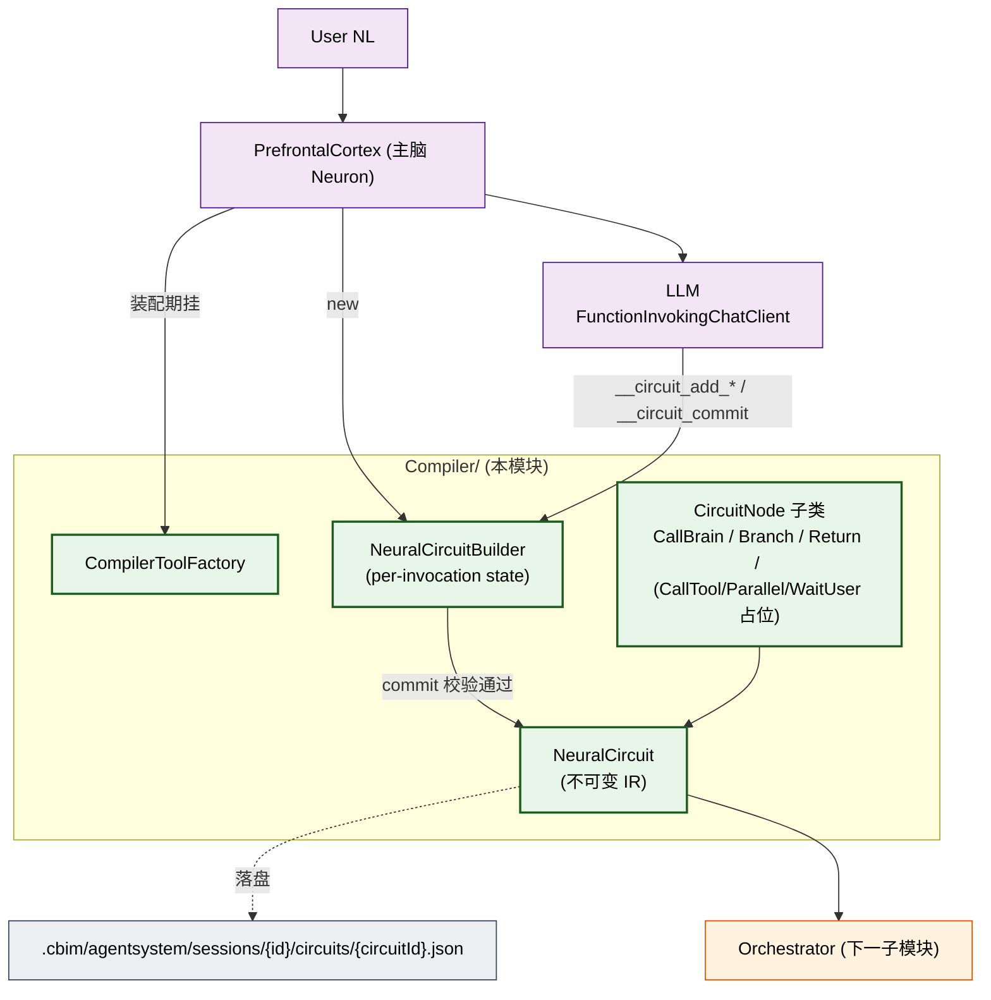
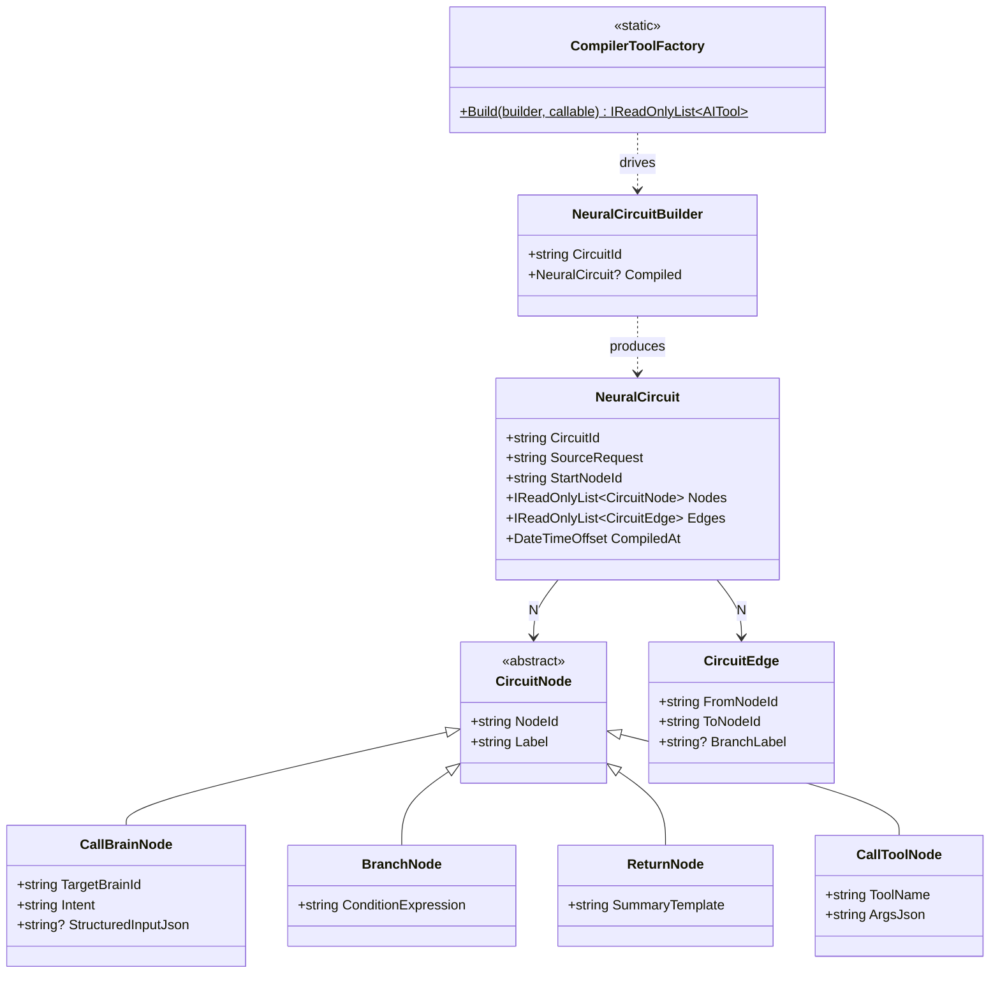
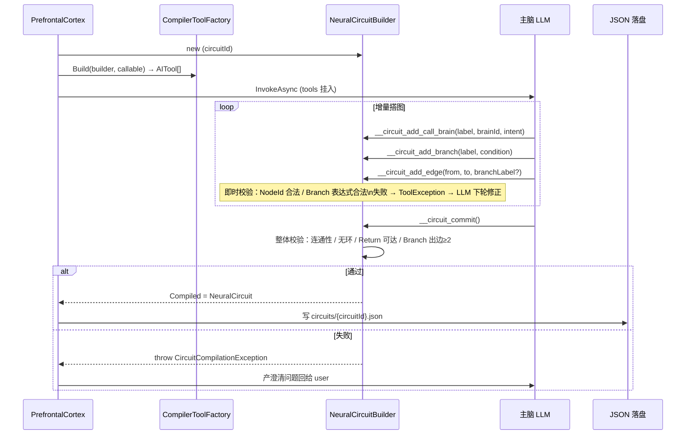

## Positioning

- **FlowGraph 编译器——把 NL 编译为 NeuralCircuit IR**。Synapse 三 leaf 之一（与 Orchestrator / parent SynapseToolFactory 平级）。
- 路径：主脑 Neuron 装 IR 构建工具集（本模块产）→ LLM 通过 Function-calling 逐步搭图（add_node / add_edge / add_branch / commit）→ 产 `NeuralCircuit` 对象。
- **「编译」不是翻译为代码**——产物是内存 IR 对象，可序列化为 JSON 落盘审计。
- **先编后执**——上轮主脑靠「即时决策」，本轮主脑「先编译·后执行」；从 prompt 工程 → 软件工程的最强一步。

## 架构图



## 类图



## 编译序流



## v1 节点矩阵

| 节点 | v1 实装 | 原因 |
|------|---------|------|
| `CallBrainNode` | 是 · 首发 | 最常见 |
| `BranchNode` | 是 · 首发 | 解决「条件分支不可靠」核心痛点 |
| `ReturnNode` | 是 · 首发 | 必备终止 |
| `CallToolNode` | 留位 | SystemTool 落地后发；v1 所有动作走 CallBrain→MotorCortex |
| `ParallelNode` | 留位 | MAF FanOut/FanIn 已有原语，未来映射 |
| `WaitUserNode` | 留位 | 映射 MAF `RequestPort`；等 Channel 反向推送 |
| `SequenceNode` | 不实装 | Sequence = 单出边边链 |

## NL → IR 编译方案选择

| 方案 | 描述 | 裁决 |
|------|------|------|
| A · LLM 直接出整图 JSON | 一轮输出整图，主脑 parse | 不选·原子提交 · 部分错全错 |
| B · Function-calling 增量构建 | LLM 一句一句 add | **选** · 每步可校验可回退 |
| C · 单独 CompilerBrain | 新增专编脑区 | 不选·破坏 K3「主脑唯一调度」 |

选 B：LLM 调 `add_node(condition="...")` 时 builder 立即校验表达式合法、不出现重复 NodeId；非法 → ToolException → LLM 下轮自我修正。天然对齐 msai Function-calling 闭环。

## Contract Surface

```csharp
namespace CBIM.AgentSystem.Kernel.Synapse.Compiler;

public sealed class NeuralCircuit
{
    public string CircuitId { get; }
    public string SourceRequest { get; }
    public string StartNodeId { get; }
    public IReadOnlyList<CircuitNode> Nodes { get; }
    public IReadOnlyList<CircuitEdge> Edges { get; }
    public DateTimeOffset CompiledAt { get; }
}

public abstract class CircuitNode { public string NodeId { get; } public string Label { get; } }
public sealed class CallBrainNode : CircuitNode { /* TargetBrainId / Intent / StructuredInputJson */ }
public sealed class BranchNode    : CircuitNode { /* ConditionExpression */ }
public sealed class ReturnNode    : CircuitNode { /* SummaryTemplate */ }
public sealed class CallToolNode  : CircuitNode { /* ToolName / ArgsJson */ }
public sealed class CircuitEdge   { /* FromNodeId / ToNodeId / BranchLabel? */ }

public static class CompilerToolFactory
{
    /// __circuit_start(sourceRequest)
    /// __circuit_add_call_brain(label, brainId, intent, structuredJson?)
    /// __circuit_add_branch(label, conditionExpression)
    /// __circuit_add_return(label, summaryTemplate)
    /// __circuit_add_edge(fromNodeId, toNodeId, branchLabel?)
    /// __circuit_commit() → NeuralCircuit
    public static IReadOnlyList<AITool> Build(
        NeuralCircuitBuilder builder,
        IReadOnlyList<BrainBase> callableBrains);
}

public sealed class NeuralCircuitBuilder
{
    public string CircuitId { get; }
    public NeuralCircuit? Compiled { get; private set; }
}
```

## 编译失败回退

- **即时校验**（add_*）——拼写 / 漏边 → ToolException → LLM 下轮自改
- **commit 整体校验**：至少 1 ReturnNode · Start→Return 连通 · 无环 · BranchNode 出边≥22 且 BranchLabel 非空
- **commit 失败 → 主脑捕获 → 回用户澄清**；严禁「忽略错误硬跳」——这是 FlowGraph 与「让模型自觉跑」的核心差别

## 落盘审计

```
.cbim/agentsystem/sessions/{instanceId}/circuits/{circuitId}.json
```

Session jsonl 写一行 `CircuitCompiledEvent { CircuitId, NodeCount, EdgeCount }` 作为索引。单独文件 + Session 中索引是合理解耦（circuit JSON 上百行，塞进 jsonl 单行让 tail 阅读崩溃）。

## Dependencies

- `Microsoft.Extensions.AI` —— `AIFunction` / `AIFunctionFactory` / `AITool`
- `CBIM.AgentSystem.Brain` —— **仅 `BrainBase`**（校验 targetBrainId）
- **不依赖** `Microsoft.Agents.AI`（本模块产 AITool，不装 AIAgent）
- **不依赖** `Synapse.Orchestrator`（K6 互不引用）
- **不依赖** `Synapse.SynapseToolFactory` / `Kernel.Neuron` / `CBIM.Storage`

## 铁律

- **C1 · 编译产物不可变** —— `NeuralCircuit` commit 后冻结；重规划 = 新一轮编译产新 CircuitId
- **C2 · IR 构建工具只发给主脑** —— 其他脑区不能调 `__circuit_*`；AgentSystem.OpenInstance 只对 prefrontalCtx 注入
- **C3 · 校验失败必回退用户，不允许硬跑** —— commit 招异常 → 主脑产澄清问题回用户
- **C4 · Compiler ⊥ Orchestrator** —— Compiler 产 IR 后退场，不感知执行细节
- **C5 · 节点类型扩展走开闭原则** —— 增 `CircuitNode` 子类 + 增 `__circuit_add_xxx`；主路径不改

## Non-Goals

- 不实装 CallTool / Parallel / WaitUser——v1 仅 CallBrain + Branch + Return
- 不接管编译策略（什么 NL 该编出几分支）——LLM 在 prompt 引导下自决
- 不感知图的执行结果
- 不做表达式语言——v1 仅 contains / equals；复杂表达式走未来 ExpressionEngine
- 不做可视化——交 MAF `WorkflowVisualizer`

