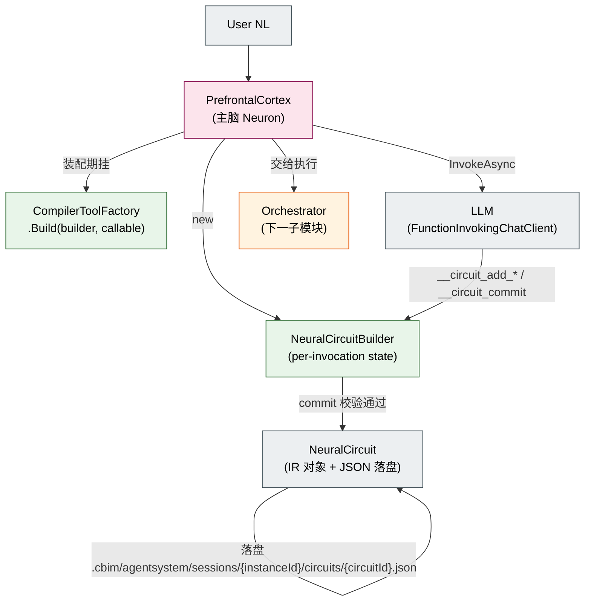

## Positioning

**Compiler 把用户自然语言流程编译为 NeuralCircuit（神经回路 IR）**——是 FlowGraph 引擎的「前端」。

上一轮（T7 及之前）：主脑 PrefrontalCortex 接到用户请求后，仅靠 LLM 实时决策「下一步该调谁」，每步靠 prompt + AIFunction 触发。问题：流程不可重放、分支策略全靠模型自觉、复杂业务（「退款 > 1000 要审批」）容易漏。

本轮：主脑接到 NL 后**先编译，后执行**——

1. PrefrontalCortex.InvokeAsync 收到用户 NL。
2. 主脑 Neuron 内部装的 IR 构建工具集（由本子模块产出）让 LLM 通过 Function-calling 一步步搭出图（add_node / add_edge / set_condition / commit_circuit）。
3. 主脑拿到 `NeuralCircuit` IR 对象后，交给 Orchestrator 执行。

**「编译」不是「翻译为代码」**——编译产物是一个内存中的 `NeuralCircuit` 对象（含节点列表 + 边列表 + 起止点），可序列化为 JSON 落盘审计。

## 类型契约（NeuralCircuit IR · 编译产物）

本子模块定义并产出 `NeuralCircuit` 数据结构。Orchestrator 是它的唯一消费者。

```csharp
namespace CBIM.AgentSystem.Kernel.Synapse.Compiler;

/// 神经回路 —— FlowGraph 中间表示。
/// 一次 user request 编译产出 1 个 NeuralCircuit；执行完归档（落盘到
/// .cbim/agentsystem/sessions/{instanceId}/circuits/{circuitId}.json）。
public sealed class NeuralCircuit
{
    public string CircuitId { get; }                   // Guid 字符串，编译期生成
    public string SourceRequest { get; }               // 原始 user NL
    public string StartNodeId { get; }                 // 入口节点 Id
    public IReadOnlyList<CircuitNode> Nodes { get; }   // 全部节点
    public IReadOnlyList<CircuitEdge> Edges { get; }   // 全部边
    public DateTimeOffset CompiledAt { get; }
}

/// 节点抽象基类——本轮初装 4 类节点（Parallel / WaitUser / CallTool 后续切片再加）。
public abstract class CircuitNode
{
    public string NodeId { get; }                      // 'n01' / 'n02' ……，编译期由 add_node 顺序分配
    public string Label { get; }                       // 人类可读简述（出现在审计 / 可视化）
}

/// CallBrain —— 投递 Intent 到某个脑区（最常见节点，等同于上轮的 __brain_call_*）。
public sealed class CallBrainNode : CircuitNode
{
    public string TargetBrainId { get; }               // 如 'motor-cortex.native' / 'parietal-lobe'
    public string Intent { get; }                      // 自然语言意图
    public string? StructuredInputJson { get; }        // 可选 JSON 载荷
}

/// CallTool —— 直接调一个 SystemTool / Mcp / Skill 工具（不走 LLM）。v1 留位，本轮初始不实装。
public sealed class CallToolNode : CircuitNode
{
    public string ToolName { get; }
    public string ArgsJson { get; }
}

/// Branch —— 条件分支（出边带 Condition 字符串，由 Orchestrator 解析）。
public sealed class BranchNode : CircuitNode
{
    public string ConditionExpression { get; }         // 形如 'previous.outcome.summary contains "approved"'
}

/// Return —— 终止节点（产出最终汇总文本回 PrefrontalCortex）。
public sealed class ReturnNode : CircuitNode
{
    public string SummaryTemplate { get; }             // 形如 '{previous.summary}'；占位符由 Orchestrator 解析
}

/// 边——只持 Source/Target，分支由 BranchNode 出多条边、每条带 BranchLabel（与 ConditionExpression 对齐）实现。
public sealed class CircuitEdge
{
    public string FromNodeId { get; }
    public string ToNodeId { get; }
    public string? BranchLabel { get; }                // BranchNode 出边时填，其他情况 null
}
```

**v1 节点矩阵**（首发实装哪些 / 哪些占接口位）：

| 节点类型 | v1 实装？ | 原因 |
|----------|----------|------|
| `CallBrainNode` | 是 首发 | 最常见，相当于「Synapse 突触」原职责 |
| `BranchNode` | 是 首发 | 解决「条件分支不可靠」核心痛点 |
| `ReturnNode` | 是 首发 | 必备终止 |
| `CallToolNode` | 留位 | 等 SystemTool 落地后再发；现阶段所有动作走 CallBrain → MotorCortex |
| `ParallelNode` | 留位 | 等并行用例真实出现再发；MAF FanOut/FanIn 已有原语，落地难度低 |
| `WaitUserNode` | 留位 | 等 Channel 反向推送实装后再发；映射 MAF `RequestPort` |
| `SequenceNode` | 不实装 | Sequence 本质是「单出边的边链」——不需要专门节点类型 |

## NL 到 NeuralCircuit 编译方案选择

用户列出三种候选：

| 方案 | 一句话 | 本子模块裁决 |
|------|--------|------------|
| A · LLM 直接出 JSON IR | 主脑 LLM 一轮输出整张图 JSON，主脑 parse | 不选 |
| B · LLM Function-calling 增量构建 | 主脑 Neuron 装上 `add_node` / `add_edge` / `set_branch` / `commit_circuit` 一组 AIFunction，LLM 一句一句往里加 | 选 |
| C · 单独 CompilerBrain | 新增一个脑区专做编译 | 不选（破坏「主脑唯一调度」铁律 K3） |

**为什么选 B**：

1. **每一步可验证**——LLM 调 `add_node(label, kind=BranchNode, condition="...")` 时，IR 构建器立即校验 condition 表达式合法、不出现重复 nodeId；非法则当场抛 ToolException，LLM 在下一轮自我修正。方案 A 是「一次性产出 JSON」，任何字段错都要整图重写。
2. **天然对齐 msai Function-calling 闭环**——主脑 Neuron 已是 `FunctionInvokingChatClient`，本子模块产出的 IR 构建工具自然接进去。
3. **「编译」与「调度」语义统一**——上一轮的 `__brain_call_*` 是「LLM 直接调脑区」；本轮的 `add_node(CallBrainNode)` 是「LLM 写下『等会儿要调这个脑区』」。从「即时执行」变「先编后执」，但 LLM 写出的 API 形态一致。

**不选 A 的原因**：JSON 一轮出 = 整图原子提交，部分错就全错；且让 LLM 维护「结构完整性」（NodeId 唯一 / 边目标存在 / 必经 Return）超出可靠范围。

**不选 C 的原因**：「编译」是主脑的本职——主脑 LLM 看到 user NL 后，决定「该调哪些脑区、按什么次序」这本身就是规划职能（前额叶执行功能）。另设 CompilerBrain 会破坏铁律 K3「主脑唯一调度」，且让「谁负责听用户」变成模糊地带。

## CompilerToolFactory（产 AITool 集供主脑装入 Neuron）

类似 `SynapseToolFactory` 的对偶——本子模块的「公开门面」也是一个静态工厂方法：

```csharp
namespace CBIM.AgentSystem.Kernel.Synapse.Compiler;

/// 编译器工具工厂——产出 IR 构建 AITool 集，主脑装配期挂到 Neuron 上。
/// 与 SynapseToolFactory 并列——共同构成「主脑能做的事」工具表面。
public static class CompilerToolFactory
{
    /// 产出本子模块定义的 IR 构建工具集：
    ///   __circuit_start(sourceRequest)            → 初始化一个空 NeuralCircuit（在 builder state 上）
    ///   __circuit_add_call_brain(label, brainId, intent, structuredJson?)
    ///   __circuit_add_branch(label, conditionExpression)
    ///   __circuit_add_return(label, summaryTemplate)
    ///   __circuit_add_edge(fromNodeId, toNodeId, branchLabel?)
    ///   __circuit_commit()                        → 校验完整性 + 产出 NeuralCircuit 实例（写入 builder.Compiled）
    /// 工具的处理器全部走 NeuralCircuitBuilder（per-invocation 实例，编译完即丢）。
    public static IReadOnlyList<AITool> Build(
        NeuralCircuitBuilder builder,
        IReadOnlyList<BrainBase> callableBrains);
}

/// 编译期持有「在建图」状态——本类是编译 session 局部的。
/// 用法：主脑 Neuron.InvokeAsync 每轮新建一个 builder，挂到本轮 AITool 上下文上；
///       LLM 调完 __circuit_commit 后，主脑读 builder.Compiled 拿 NeuralCircuit 实例。
public sealed class NeuralCircuitBuilder
{
    public string CircuitId { get; }                  // ctor 时生成
    public NeuralCircuit? Compiled { get; private set; }   // commit 后写入
    // ... 内部维护 nodes / edges / lastNodeId 等 mutable state
}
```

## 编译失败回退

IR 构建过程出错（图不完整 / 出现环 / Return 不可达 / Branch 出边只 1 条）——分两层处理：

1. **AITool 处理器即时校验**——`__circuit_add_edge(from, to)` 调用时 to 不存在 → 当场抛 `ToolException("node 'n07' not declared")`，FunctionInvokingChatClient 把错信塞回 LLM，LLM 自我修正后重调。绝大多数错（拼写、漏边）走这条路径恢复。
2. **`__circuit_commit()` 时整体校验**——commit 是最后一步，本校验包括：
   - 至少有 1 个 ReturnNode
   - StartNode 到任意 ReturnNode 有路径（连通性 BFS）
   - 无环（DFS visited set）
   - BranchNode 至少 2 条出边、且每条出边 BranchLabel 非空
   失败时抛 `CircuitCompilationException`，主脑捕获后**回退给用户澄清**：「我没把您的需求拆清楚，能说说『退款超过 1000 后您想要谁来批』吗？」

**严禁的处理路径**：主脑捕获 commit 失败后**不允许「忽略错误硬执行」**——这是 FlowGraph 与「让模型自觉跑」的核心差别。

## 落盘审计

编译产物 `NeuralCircuit` 在 commit 后立即落盘：

```
.cbim/agentsystem/sessions/{instanceId}/circuits/{circuitId}.json
```

> **落盘路径决定备注**：JSON 嵌入 session 子目录是用户决定——语义上 Session 拥有 Circuit（同一 instance 内一段对话产生的所有 circuit 应物理聚拢在该 session 目录下，便于审计与归档）。

与 Session jsonl（`.cbim/agentsystem/sessions/{instanceId}.jsonl`）同根目录共存（jsonl 是 session 顶层流，`circuits/` 是该 session 派生产物子目录）。Session 中相应位置增 `CircuitCompiledEvent { CircuitId, NodeCount, EdgeCount }` 一行，把对话流与编译产物索引化。

**为什么单独落盘而不写进 Session**：Session 是按行 append 的 jsonl，circuit JSON 通常上百行，塞进 jsonl 单行会让 tail 阅读崩溃。单独文件 + Session 中索引是合理的解耦。

## Mermaid



## Dependencies

- `Microsoft.Extensions.AI` —— `AIFunction` / `AIFunctionFactory` / `AITool`（IR 构建工具集产出）
- `CBIM.AgentSystem.Brain` —— **仅 `BrainBase`**（取 BrainId 校验 LLM 传入的 targetBrainId 合法）
- **不依赖** `Microsoft.Agents.AI` —— Compiler 产 AITool，不装配 AIAgent
- **不依赖** `CBIM.AgentSystem.Kernel.Synapse.Orchestrator` —— Compiler 与 Orchestrator 互不引用（K6 铁律见父 .dna；本子模块不知道执行引擎细节，只产 IR）
- **不依赖** `CBIM.AgentSystem.Kernel.Neuron` —— 沿用 K4（Neuron 与 Synapse 互不引用）
- **不依赖** `CBIM.Storage` —— 落盘走「主脑拿到 IR 后用现有 AgentSystem.AppendSessionEvent + 业务方写 circuit json」（主脑负责，不是本子模块负责）

## 铁律

- **C1 · 编译产物不可变**——`NeuralCircuit` commit 后所有字段冻结；Orchestrator 执行时只读，不修改图本身。需「重规划」时主脑发起新一轮编译产出新 CircuitId。
- **C2 · IR 构建工具只发给主脑**——`CompilerToolFactory.Build` 产物只挂到 `PrefrontalCortex.Neuron`；其他脑区不能调 `__circuit_*` 工具。物理护栏：AgentSystem.OpenInstance 装配期只对 prefrontalCtx.StandardAITools 注入。
- **C3 · 校验失败必回退用户，不允许硬跑**——commit 抛异常 → 主脑产「澄清问题」回给 user；不允许「半图执行」试探。
- **C4 · Compiler 与 Orchestrator 互不引用**——Compiler 产 IR 后退场，不感知执行细节；Orchestrator 拿 IR 后执行，不回头修改 IR。两子模块互不引用。
- **C5 · 节点类型扩展走开闭原则**——新增节点类型（如 WaitUser / Parallel 实装）只增 `CircuitNode` 子类 + 增 `__circuit_add_xxx` AITool；NeuralCircuit / NeuralCircuitBuilder / Orchestrator 主路径不改。

## Non-Goals

- 不实装 `CallToolNode` / `ParallelNode` / `WaitUserNode`——v1 仅 CallBrain + Branch + Return 三节点（覆盖 80% 用例）
- 不接管编译策略（什么样的 NL 该编出几个分支）——LLM 在 prompt 引导下自决；本子模块只提供工具表面与校验规则
- 不感知图的执行结果——编译产物 commit 后即与编译期脱钩
- 不做表达式语言——`BranchNode.ConditionExpression` 在 v1 仅支持极简 contains / equals；复杂表达式（>, <, AND, OR）走 ExpressionEngine 子模块（未来）
- 不做图可视化——交给 MAF `WorkflowVisualizer`（Orchestrator 翻译为 MAF Workflow 后免费获得）

## Emergent Insights

1. **「编译为图」是把 prompt 工程变软件工程的最强一步**——上轮主脑靠 prompt 引导「先调架构脑、再调运动脑」全靠模型自觉，本轮显式把流程写出来，从「建议」变「程序」。
2. **「LLM 增量构建 IR」是 Function-calling 的最佳用法**——比让 LLM 一次出整 JSON 可靠数量级。每步 IR 操作都是一次 AIFunction 调用，每步可校验、可回退。这是 Function-calling 真正发挥威力的场景。
3. **「主脑兼任编译器」不破坏单一职责**——主脑的职责本就是「规划 → 调度」；上轮的「即时调度」与本轮的「先编再执」是同一职责的两种执行模式。把规划阶段显化为编译过程，反而让主脑职责更清晰。

