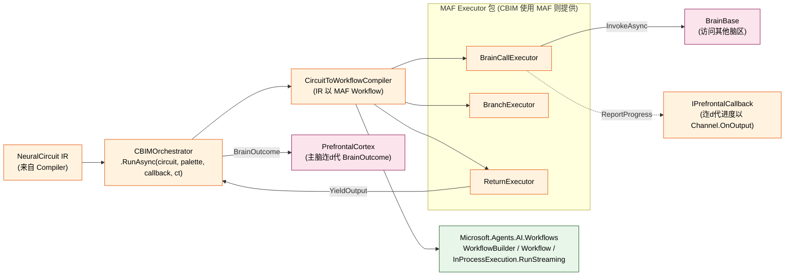

## Positioning

**CBIMOrchestrator 是 FlowGraph 的「后端」**——拿 Compiler 产出的 `NeuralCircuit` IR，硬性按图执行。本子模块的核心设计决策：**包一层 MAF `WorkflowBuilder` / `Workflow`，不另起炉灶**。

## 包 MAF 还是另起炉灶

用户明确「必须可在 `Microsoft.Agents.AI.Workflows` 上建」——本子模块走「包一层」路径：

| 反面：另起炉灶 | 正面：包 MAF |
|------|----------|
| 重造 SuperStep / EdgeData / CheckpointManager | 全部免费获得（MAF 已有） |
| 重造 RequestPort（人机交互） | 未来 WaitUserNode 直接映射 |
| 重造 FanOut/FanIn | 未来 ParallelNode 直接映射 |
| 重造 可视化 | MAF `WorkflowVisualizer` 直接可用 |

**CBIM 负责的仅仅是**：

1. 「NeuralCircuit IR → MAF `Workflow`」的翻译器（`CircuitToWorkflowCompiler`）。
2. CBIM 业务节点包 MAF Executor（`BrainCallExecutor` / `BranchExecutor` / `ReturnExecutor`）——负责「在节点里调 `BrainBase.InvokeAsync`」、「评估 ConditionExpression」、「集成 PrefrontalCallback 上报」。
3. 执行驱动 + 进度事件转译器（MAF `WorkflowEvent` → `Channel.OnOutput` / `IPrefrontalCallback.ReportProgress`）。

## 类型契约

```csharp
namespace CBIM.AgentSystem.Kernel.Synapse.Orchestrator;

using Microsoft.Agents.AI.Workflows;
using CBIM.AgentSystem.Brain;
using CBIM.AgentSystem.Kernel.Synapse;             // IPrefrontalCallback
using CBIM.AgentSystem.Kernel.Synapse.Compiler;    // NeuralCircuit

/// FlowGraph 执行引擎门面——主脑拿到 NeuralCircuit 后调本类。
/// v1 实装是「单进程、单图串行」；未来可加多图并发（均为可选项）。
public sealed class CBIMOrchestrator
{
    /// 执行一个 NeuralCircuit。
    /// 执行期内：
    ///   - 调 CircuitToWorkflowCompiler 产 MAF Workflow
    ///   - 调 InProcessExecution.RunStreamingAsync 拿 StreamingRun
    ///   - 迮d代 WorkflowEvent：
    ///       SuperStepEvent / ExecutorInvokedEvent / ExecutorCompletedEvent → ReportProgress
    ///       WorkflowOutputEvent (来自 ReturnExecutor) → 收集为 finalSummary
    ///       WorkflowErrorEvent → 迮d代中断 + 返回 IsError=true 的 BrainOutcome
    ///   - 最终产 BrainOutcome 返主脑
    public Task<BrainOutcome> RunAsync(
        NeuralCircuit circuit,
        IReadOnlyList<BrainBase> brainPalette,    // 全部可调脑区（包括主脑）
        IPrefrontalCallback callback,             // 上报路由
        CancellationToken ct);

    /// 仅供测试 / debug：返回 MAF Workflow 实例（不走 Run）。
    public Workflow CompileToMafWorkflow(
        NeuralCircuit circuit,
        IReadOnlyList<BrainBase> brainPalette);
}
```

## CircuitToWorkflowCompiler（IR 以 MAF Workflow）

内部静态类——以一个 `NeuralCircuit` 为输入，逐节点装成 MAF Executor + AddEdge：

| CBIM IR 节点 | MAF Executor | 备注 |
|--------------|--------------|------|
| `CallBrainNode` | `BrainCallExecutor : Executor<CircuitMessage>` | 构造器扣住 BrainBase 引用 + IPrefrontalCallback |
| `BranchNode` | `BranchExecutor : Executor<CircuitMessage>` | Handler 评估 ConditionExpression 后 SendMessageAsync 到匹配的出边使用 targetId 选择 |
| `ReturnNode` | `ReturnExecutor : Executor<CircuitMessage, string>` | Handler 渲染 SummaryTemplate、调 YieldOutputAsync、调 RequestHaltAsync |
| `CircuitEdge` | `WorkflowBuilder.AddEdge(from, to, condition: msg => msg.BranchLabel == edge.BranchLabel)` | BranchLabel 为 null 时走无条件 AddEdge |

**CircuitMessage**——节点间传递的 envelope：

```csharp
public sealed class CircuitMessage
{
    public string CircuitId { get; }
    public string FromNodeId { get; }                  // 上一个执行节点
    public string? BranchLabel { get; }                // BranchNode 出后设置
    public string LastSummary { get; }                 // 上一节点 outcome.Summary
    public IReadOnlyDictionary<string, BrainOutcome> History { get; }  // nodeId → outcome
}
```

`History` 是「路经现场」记账——`BranchNode.ConditionExpression` 中可引用 `previous.outcome.summary contains "x"` / `node_n03.outcome.summary contains "x"`。Orchestrator 提供一个极简 evaluator（v1 仅 contains / equals，复杂留未来 ExpressionEngine）。

## BrainPalette 与 BrainCallExecutor 装配

```
CircuitToWorkflowCompiler.Compile(circuit, brainPalette):
    builder = new WorkflowBuilder(<start executor>)
    foreach node in circuit.Nodes:
        switch node:
            case CallBrainNode cb:
                brain = brainPalette.First(b => b.BrainId == cb.TargetBrainId)
                    ∥→ if 未找到 throw CircuitExecutionException("brain not in palette")
                executor = new BrainCallExecutor(node.NodeId, cb, brain, callback)
            case BranchNode br:
                executor = new BranchExecutor(node.NodeId, br)
            case ReturnNode rn:
                executor = new ReturnExecutor(node.NodeId, rn)
        builder.BindExecutor(executor)
    foreach edge in circuit.Edges:
        if edge.BranchLabel == null:
            builder.AddEdge<CircuitMessage>(from, to)
        else:
            builder.AddEdge<CircuitMessage>(from, to,
                condition: msg => msg.BranchLabel == edge.BranchLabel)
    builder.WithOutputFrom(<all ReturnExecutor>)
    return builder.Build(validateOrphans: true)
```

**BrainPalette 从哪里来**：Orchestrator.RunAsync 使用方传入一个 `IReadOnlyList<BrainBase>`——实际走「主脑接到编译产物后，取 `AgentInstance.Brains` 填」。未来可考虑从 BrainRegistry 实时取，以支持 Dream 裂变后新脑区被当轮调用。

## 节点失败 / 重试 / 图回滚

**v1 走最简路径**：

- 任何单节点失败（`BrainBase.InvokeAsync` 抛异常 / 返回 IsError=true）→ BrainCallExecutor 不再 SendMessageAsync，而是调 `context.AddEventAsync(new ExecutorFailedEvent(...))` + `context.RequestHaltAsync()`。
- Orchestrator.RunAsync 看到 WorkflowErrorEvent / ExecutorFailedEvent 后返回 `BrainOutcome(IsError=true, ErrorMessage=...)`。
- **不做自动图重试 / 不做节点级重试 / 不做 fallback 路由**——这些由主脑下一轮重新编译新 NeuralCircuit 解决（fail-fast 上翻 → 主脑 LLM 重规划，比透过 Orchestrator 重试表达性更强）。
- **图状态不落盘重启**——v1 单进程、如需恢复走 MAF `CheckpointManager`（MAF 已有），本子模块 RunAsync 默认不启；v2 可加 `OrchestratorOptions.CheckpointManager`。

## 进度回报 与 Channel.OnOutput

```
Orchestrator.RunAsync 迮d代 StreamingRun.WatchStreamAsync 中的 WorkflowEvent：
  ExecutorInvokedEvent  → callback.ReportProgress(brainId="@orchestrator", $"running node {ev.ExecutorId}")
  ExecutorCompletedEvent → callback.ReportProgress(brainId="@orchestrator", $"node {ev.ExecutorId} done")
  WorkflowOutputEvent    → finalSummary = ev.Data as string
  WorkflowErrorEvent     → 记 error
```

`ReportProgress` 在主脑侧走 `PrefrontalCallbackAdapter.onProgress`——`AgentSystem.OpenInstance` 在 onProgress 中接上 `Channel.OnOutput`（T5 已预留）。**本子模块不直接调 Channel**——保持对 Channel 未依赖（遵守上依赖方向）。

## 并发与并行

**v1**：

- **一个 Agent 同时只跑 1 个 NeuralCircuit**——主脑装配在 sequential ChatClientAgent 上，user 一次发 1 个 SendAsync，路径上然串行。
- **图内并行走 MAF FanOut/FanIn**（`ParallelNode` v1 不实装，留位使用 MAF 原语后补上）。
- 其它多图 / 多 Agent 并发交给 `AgentSystem.ListActiveInstances` + 多个 Channel，与 Orchestrator 无关。

**単机版不考虑多图跨进程调度**——与用户约束一致。

## Mermaid



## Dependencies

- `Microsoft.Agents.AI.Workflows` —— 核心，**不重造引擎**（用户明文要求）
- `CBIM.AgentSystem.Brain` —— `BrainBase` / `BrainInvocation` / `BrainOutcome`（BrainCallExecutor 调 InvokeAsync）
- `CBIM.AgentSystem.Kernel.Synapse` —— `IPrefrontalCallback`（上报进度 / 结果）
- `CBIM.AgentSystem.Kernel.Synapse.Compiler` —— `NeuralCircuit` / `CircuitNode` 各子类（输入）
- **不依赖** `CBIM.Channel` —— 进度回报绕 `IPrefrontalCallback` 走，本子模块不感知 Channel 存在
- **不依赖** `CBIM.AgentSystem.Kernel.Neuron` —— K4（Orchestrator 调 `BrainBase.InvokeAsync` 默认透传 Neuron，不需直接拿 Neuron）
- **不依赖** `Microsoft.Agents.AI` · AIAgent——调脑区走 BrainBase 抽象，不拿 AIAgent

## 铁律

- **O1 · 不重造 MAF**——任何「IR 节点路由 / 图验证 / 检查点 / 并行」能给 MAF 做的都给 MAF；CBIM Executor 只包「调 BrainBase + 评估 ConditionExpression」业务表面。
- **O2 · 图不在执行期修改**——`NeuralCircuit` 是 immutable IR；Orchestrator 路中不动态插节点 / 改边。需重规划走主脑重编译。
- **O3 · Fail-fast 不 fail-creative**——节点失败 → 中断 + 返主脑，不做「跳到偶尔 fallback 节点」这种薄怎不勒的启发。主脑拿到 IsError=true 后决定重编 / 问 user / 结束。
- **O4 · 上报绕 IPrefrontalCallback 走**——Orchestrator 不直接接 Channel。这保持了 Channel 在依赖图上的完整外层位置。
- **O5 · Compiler 与 Orchestrator 互不引用**——代码层面上令 namespace 互不 using；两者中间用共享抽象 `NeuralCircuit`（定义在 Compiler 下），但 Compiler 还是不依赖 Orchestrator。

## Non-Goals

- 不实装 ParallelNode / WaitUserNode / CallToolNode——与 Compiler v1 范围一致
- 不实装「复杂表达式语言」——v1 ConditionExpression 只识 `contains` / `equals`（例：`previous.summary contains "approved"`）
- 不起独立进程 / 跨机调度——单机约束
- 不重造 MAF 检查点——需要时包 MAF `CheckpointManager` 并「仅加一个选项」
- 不接管 SystemTool / MCP 装配——调 BrainBase 后都由 BrainBase.Neuron 负责

## Emergent Insights

1. **「IR 调集」与「节点调集」是两件事**——IR 在 Compiler 定义（节点类型、字段语义）；节点怎么装成 MAF Executor 在 Orchestrator 定义（总体业务逻辑）。分开后两边可各自演化。
2. **MAF Executor 是 Workflow 世界的「谐动器」**——上一轮主脑装为 `ChatClientAgent`，靠 LLM 接「讲谁调谁」；本轮节点装为 MAF Executor，靠 MAF Workflow 接「谁被调、谁可接他」。同一个 `Executor` 抽象，两种驱动模式。
3. **「不重造」是架构裁集中最难坚持的一条**——装配 MAF 节点与自己写一套节点在工作量上相近（CBIM Executor 不少）；但未来加 WaitUser / Parallel / Checkpoint 时，装配 MAF 是 0 成本，重造 = 三倍工作量。「现在不看出重造优势」是「不重造」的最强证据。

